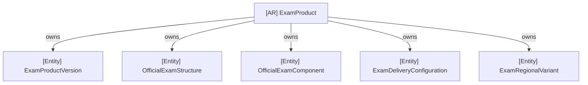

# ADR-006: Exam Product Domain Boundary & Aggregate Design

## Status

Accepted

## Context

As the Clasptek Prep Portal V2 transitions from foundational infrastructure into core academic delivery, we require a robust, versioned structure for defining official exams (such as IELTS, Digital SAT, and TOEFL).

Previously, Sprint 2.1 proposed implementing all frameworks (Difficulty, Diagnostic, Readiness, Skills, and Learning Paths) in a single phase. This was split into Sprint 2.1A (Canonical Exam Product Domain) and Sprint 2.1B/2.2 (Academic Frameworks) to limit complexity, minimize database migration churn, and ensure high design fidelity.

Additionally, standard exam definitions require strict configuration control (regional variants, multiple delivery settings, dynamic metadata mappings) while keeping published exams immutable to guarantee testing consistency.

## Decision

We establish the `ExamProduct` bounded context as a self-contained domain model and define its aggregate boundaries, repository contracts, and database mapping strategies.

### 1. Aggregate Boundaries

The `ExamProduct` Aggregate Root encapsulates the transactional boundary for all exam structures, variants, and component hierarchies. It acts as the single entry point for command mutations:

- **Invariant Rules:**
  - Every Version belongs to exactly one `ExamProduct`.
  - Only one `PUBLISHED` Version may exist per `ExamProduct`. Publishing a new version automatically transitions the previous one to `DEPRECATED`.
  - Structures cannot exist without a Version.
  - Components cannot exist without a Structure.
  - Component trees must be acyclic (a component cannot reference itself or form loops as parent).
  - Once a version status is changed to `PUBLISHED`, its version configuration, components, delivery configuration, and regional variants become immutable.

### 2. State Machine Lifecycle

Exams follow a strict 6-stage state machine:

`DRAFT` → `UNDER_REVIEW` → `APPROVED` → `PUBLISHED` → `DEPRECATED` → `ARCHIVED`

### 3. Concurrency Strategy

We enforce optimistic concurrency. The `ExamProduct` aggregate maintains a `lock_version` and `updated_at` timestamp. All updates in the persistence layer check the expected lock version before writing, throwing a `ConflictError` if a collision is detected.

### 4. Separation of Metadata

To avoid polluting the relational schema with exam-board-specific parameters (e.g., IELTS band descriptors vs. SAT section scoring formulas), we extract metadata into separate tables (`exam_board_metadata` and `clasptek_product_metadata`) mapping version IDs to key-value structures.

## Consequences

- **Unidirectional Mappings:** The design enforces strict dependency flow (Domain ← Application ← Persistence ← Presentation).
- **Auditability:** Every state mutation produces a domain event (e.g. `ExamProductCreated`, `VersionReleased`, `ExamProductPublished`) recorded with causation and correlation identifiers.
- **De-risked Integrations:** Future learning paths, adaptive test runners, and diagnostic engines will reference stable, read-only exam IDs defined under this boundary.
