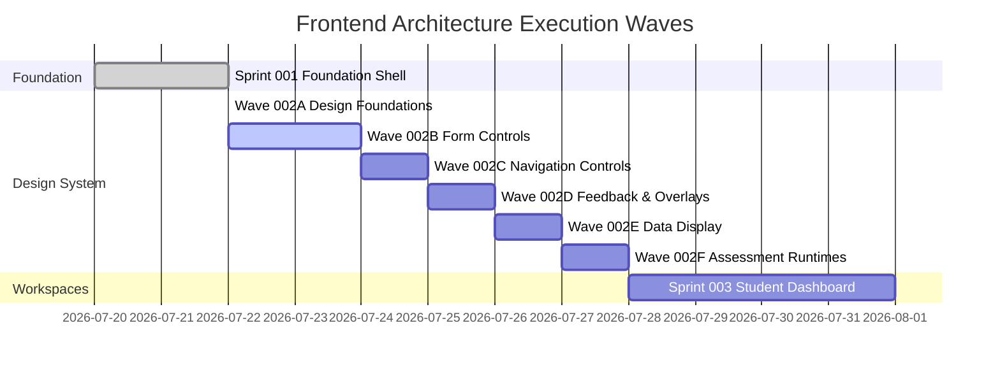

# Clasptek Prep Portal V2 — Master Frontend Architecture Roadmap

**Status**: Active Master Roadmap  
**Current Milestone**: `v2.1.0-design-system`

---

## Sprint & Wave Execution Progress

---

## Detailed Wave Breakdown Matrix

| Sprint / Wave  | Name                    | Target Scope                      | Category Budget        | Status             | Semantic Release Tag       |
| :------------- | :---------------------- | :-------------------------------- | :--------------------- | :----------------- | :------------------------- |
| **Sprint 001** | Foundation & Auth Shell | Layouts, Providers, Auth Service  | 250 KB total           | ✅ **Complete**    | `v2.0.0-foundation`        |
| **Wave 002A**  | Design Foundations      | Tokens, Layout, Typography        | 20 KB (Actual: 8.5 KB) | ✅ **Released**    | `v2.1.0-foundation-tokens` |
| **Wave 002B**  | Form Controls           | Button, Card, Inputs, Switches    | 35 KB                  | ⏳ **In Progress** | `v2.1.0-forms`             |
| **Wave 002C**  | Navigation              | Tabs, Breadcrumb, Pagination      | 20 KB                  | ⏳ Planned         | `v2.1.0-navigation`        |
| **Wave 002D**  | Feedback & Overlays     | Alert, Toast, Modal, Drawer       | 20 KB                  | ⏳ Planned         | `v2.1.0-feedback`          |
| **Wave 002E**  | Data Display            | Avatar, Badge, Table, DataTable   | 40 KB                  | ⏳ Planned         | `v2.1.0-data-display`      |
| **Wave 002F**  | Assessment Runtimes     | Timer, QuestionNav, AudioControls | 40 KB                  | ⏳ Planned         | `v2.1.0-assessment-ui`     |
| **Sprint 003** | Student Dashboard       | Dashboard Workspace Assembly      | N/A                    | ⏳ Planned         | `v2.2.0-student-dashboard` |
