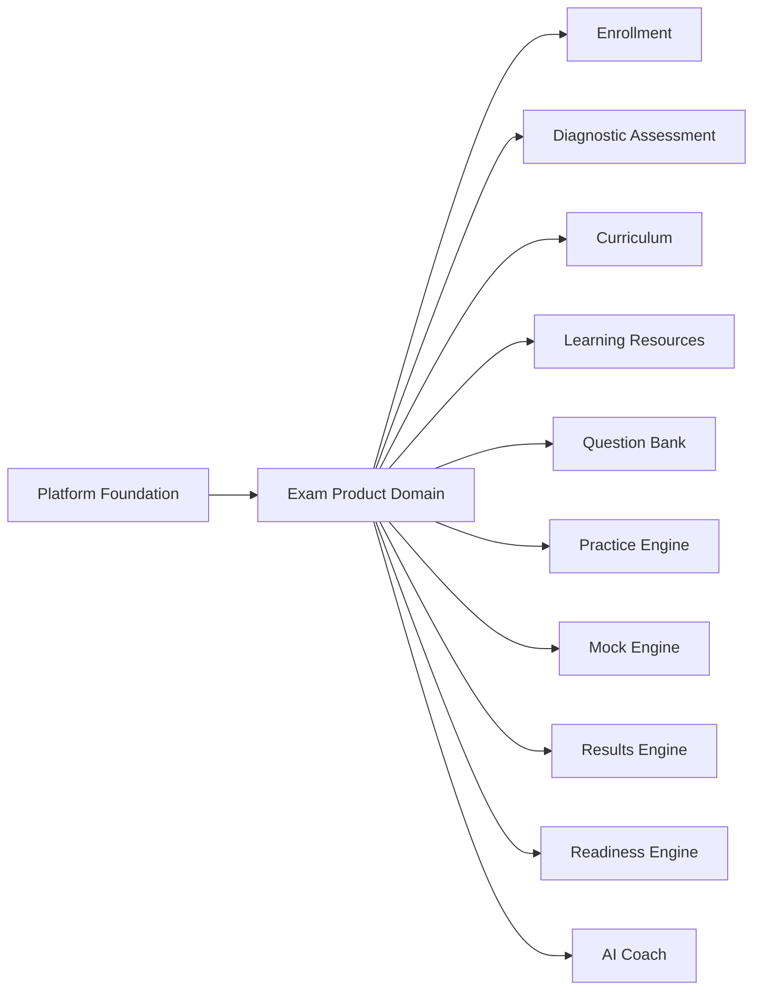
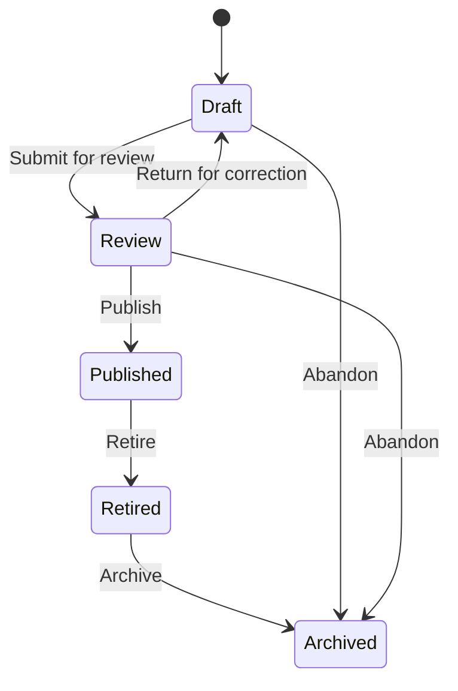

# Phase 2 Sprint 2.1 — Exam Product Domain Implementation Plan

**Platform:** Clasptek Prep Portal V2  
**Release:** `v1.1.0-exam-product-domain`  
**Bounded Context:** Exam Product  
**Primary Aggregate Root:** Exam Product  
**Supporting Aggregate:** Global Skill Framework (future bounded-context candidate)  
**Domain Classification:** Core Domain  
**Migration:** `00100_exam_products.sql`  
**Document Revision:** 3.0 — Architecture Freeze Candidate

---

# 1. Executive Objective

The Exam Product Domain shall become the canonical source of truth for every examination supported by Clasptek.

It answers eight foundational questions:

1. What examinations does Clasptek prepare students for?
2. What is the official structure defined by each examination board?
3. What assessment blueprint governs each official component?
4. What global and composite skills are assessed?
5. What difficulty, cognitive, and evidence classifications apply?
6. What diagnostic and learning-path definitions should downstream systems use?
7. What readiness criteria may future engines evaluate?
8. Which definitions are official board metadata and which are Clasptek business metadata?

This sprint establishes examination catalogue and framework metadata only.

It must not store student activity, educational content, practice questions, mock attempts, grading results, or AI-generated recommendations.

---

# 2. Architectural Revision

The original hierarchy:

```text
Exam Product
↓
Exam Sections
↓
Skill Framework
↓
Learning Tracks
```

is replaced by the following canonical model:

```text
Exam Product
      │
      ▼
Official Exam Structure
      │
      ▼
Assessment Blueprint
      │
      ▼
Global Skill Framework
      │
      ▼
Diagnostic Framework
      │
      ▼
Clasptek Learning Framework
      │
      ▼
Learning Paths
      │
      ▼
Readiness Framework
```

The complete platform journey becomes:

```text
Exam Product
      │
      ▼
Official Exam Structure
      │
      ▼
Assessment Blueprint
      │
      ▼
Global Skill Framework
      │
      ▼
Diagnostic Framework
      │
      ▼
Learning Paths
      │
      ▼
Curriculum Domain
      │
      ▼
Learning Resources
      │
      ▼
Practice Engine
      │
      ▼
Mock Engine
      │
      ▼
Results Engine
      │
      ▼
Readiness Engine
      │
      ▼
AI Coach
```

This separation ensures that an examination board may change its official structure independently from Clasptek’s curriculum, learning sequence, diagnostic policies, and AI recommendations.

---

# 3. Sprint Scope

## 3.1 Included

- Exam products
- Exam product versions
- Official exam structures
- Official sections, modules, parts, papers, and tasks
- Assessment blueprints
- Reusable assessment item-type taxonomy
- Blueprint-to-skill mappings
- Global reusable skill taxonomy
- Skill hierarchy
- Skill proficiency levels
- Skill dependencies
- Difficulty taxonomies and levels
- Cognitive taxonomies and levels
- Skill evidence types
- Composite skill groups
- Skill-to-exam-component mappings
- Clasptek learning frameworks
- Learning paths
- Diagnostic framework definitions
- Diagnostic mapping rules
- Readiness framework definitions
- Readiness criteria definitions
- Score schemes and score scales
- Adaptive-exam metadata
- Delivery configurations
- Regional variants
- Separated official board metadata and Clasptek business metadata
- Publication lifecycle
- Version history
- Audit records
- Domain events

## 3.2 Excluded

- Students
- Student registrations
- Enrolments
- Diagnostic attempts
- Student diagnostic scores
- Assigned student paths
- Lessons
- Courses
- Videos
- PDFs
- Learning materials
- Question banks
- Practice tests
- Mock examinations
- Student attempts
- Student responses
- Results
- AI grading
- AI recommendations
- Student readiness status
- Payments
- Certificates

The domain defines frameworks and relationships only. Downstream domains execute those frameworks.

---

# 4. Supported Exam Products

The first release shall support:

| Code          | Exam Product           |
| ------------- | ---------------------- |
| `ENG-PROF`    | English Proficiency    |
| `IELTS-AC`    | IELTS Academic         |
| `IELTS-GT`    | IELTS General Training |
| `TOEFL-IBT`   | TOEFL iBT              |
| `CELPIP-GEN`  | CELPIP General         |
| `SAT-DIGITAL` | Digital SAT            |

The architecture must support future products without schema redesign:

- GRE
- GMAT
- PTE Academic
- Duolingo English Test
- ACT
- Cambridge English
- OET
- LanguageCert
- CAT-style adaptive examinations
- WAEC
- NECO
- JAMB
- NABTEB
- Professional certification examinations
- Institutional entrance examinations

Adding a future examination should require data configuration, not structural database changes.

---

# 5. Core Design Principles

1. **Exam Product is the primary aggregate root.**
2. **The Global Skill Framework is a supporting aggregate and a future bounded-context candidate.**
3. **Official exam structure, Assessment Blueprint, and Clasptek learning structure are separate concepts.**
4. **Assessment Blueprints define assessable item formats and coverage without storing questions.**
5. **Published product versions are immutable.**
6. **Changes to a published product require a new version.**
7. **Skills are global and may be reused beyond exam preparation.**
8. **Skill hierarchy may be deeper than one level.**
9. **Skill dependencies are directional and graph-based.**
10. **Difficulty taxonomy is separate from skill proficiency level.**
11. **Cognitive taxonomy identifies the thinking process required by an assessment task.**
12. **Evidence types describe how mastery may be demonstrated without storing evidence records.**
13. **Composite skill groups provide reporting and blueprint convenience without duplicating atomic skills.**
14. **Learning Path is the canonical term; a Learning Path is not a course.**
15. **Learning Paths define teaching sequence but contain no lessons or educational content.**
16. **Diagnostic frameworks define mappings but contain no student diagnostic results.**
17. **Readiness frameworks define criteria but contain no student readiness state.**
18. **Adaptive-exam metadata is defined before question-bank implementation.**
19. **Score systems support numeric, banded, graded, scaled, percentile, composite, rubric, and pass/fail models.**
20. **Official board metadata and Clasptek business metadata are stored separately.**
21. **Business-critical rules remain relational; JSON is reserved for controlled extension points.**
22. **Every write is authorised, audited, transaction-safe, and protected by optimistic concurrency.**
23. **Downstream systems consume published version identifiers and must not duplicate canonical definitions.**

---

# 6. Bounded Context Position

## 6.1 Upstream Dependencies

The Exam Product Domain may depend on the frozen Platform Foundation for:

- Authentication
- Authorisation and RBAC
- Audit identity
- Logging
- Error handling
- Configuration
- Database connectivity
- Domain-event transport
- Observability
- API conventions
- Transaction infrastructure

## 6.2 Downstream Consumers

- Enrollment Domain
- Diagnostic Assessment Domain
- Curriculum Domain
- Learning Workspace
- Learning Resource Domain
- Question Bank Domain
- Practice Engine
- Mock Engine
- Results Engine
- Readiness Engine
- AI Coach
- Certification Domain



---

# 7. Canonical Domain Model

```text
Exam Product
├── Exam Product Versions
│   ├── Official Exam Structure
│   │   └── Official Exam Components
│   ├── Assessment Blueprints
│   │   ├── Blueprint Items
│   │   └── Blueprint Skill Mappings
│   ├── Exam-to-Skill Mappings
│   ├── Diagnostic Frameworks
│   │   └── Diagnostic Rules
│   ├── Clasptek Learning Frameworks
│   │   └── Learning Paths
│   │       └── Learning Path Skill Nodes
│   ├── Readiness Frameworks
│   │   └── Readiness Criteria
│   ├── Score Schemes
│   │   └── Score Scales
│   ├── Adaptive Exam Profiles
│   ├── Delivery Configurations
│   ├── Regional Variants
│   ├── Official Board Metadata
│   └── Clasptek Business Metadata
└── Version History

Assessment Classification Catalogues
├── Assessment Item Types
├── Difficulty Taxonomies
│   └── Difficulty Levels
├── Cognitive Taxonomies
│   └── Cognitive Levels
└── Evidence Types

Global Skill Framework
├── Skills
│   └── Skill Revisions
├── Skill Levels
├── Skill Relations
├── Skill AI Metadata
├── Composite Skill Groups
│   └── Composite Skill Members
└── Skill Evidence Mappings
```

---

# 8. Aggregate Boundaries

## 8.1 ExamProduct Aggregate

Controls:

- Product identity
- Product code
- Product slug
- Product lifecycle
- Current published version
- Version creation
- Publication
- Retirement
- Archiving
- Product-level invariants
- Published-version immutability

## 8.2 GlobalSkillFramework Aggregate

Controls:

- Stable skill identities
- Skill taxonomy
- Skill revisions
- Skill hierarchy
- Skill proficiency levels
- Skill prerequisites
- Recommended next skills
- AI-oriented skill metadata

## 8.3 Assessment Classification Catalogues

Assessment Item Types, Difficulty Taxonomies, Cognitive Taxonomies, and Evidence Types are reusable catalogues. Published Exam Product Versions reference immutable catalogue records or published taxonomy versions.

These catalogues define classification metadata only and never contain questions, responses, student evidence, or scores.

## 8.4 Version-Owned Definitions

The following belong to an Exam Product Version:

- Official Exam Structure
- Official Exam Components
- Assessment Blueprints
- Assessment Blueprint Items
- Blueprint Skill Mappings
- Exam Skill Mappings
- Diagnostic Frameworks
- Diagnostic Rules
- Clasptek Learning Frameworks
- Learning Paths
- Learning Path Skill Nodes
- Readiness Frameworks
- Readiness Criteria
- Score Schemes
- Score Scales
- Adaptive Exam Profiles
- Delivery Configurations
- Regional Variants
- Official Board Metadata
- Clasptek Business Metadata

## 8.5 Future Skill Framework Bounded Context

For Sprint 2.1, the Global Skill Framework remains physically packaged with the Exam Product implementation to control scope and delivery risk.

Architecturally, it must be isolated behind ports and repository interfaces so it can later become an independent **Skill Framework bounded context** without changing Exam Product identities or downstream contracts.

Future consumers may include:

- English Proficiency programmes
- Corporate communication training
- Business writing programmes
- Technology certification preparation
- Internal competency assessments
- Workforce capability frameworks

The Exam Product Domain shall reference published Skill Framework version identifiers rather than directly owning skill semantics.

---

# 9. Official Exam Structure vs Clasptek Learning Framework

## 9.1 Official Exam Structure

The Official Exam Structure represents the board-defined examination.

Example:

```text
IELTS Academic
├── Listening
├── Reading
├── Writing
│   ├── Writing Task 1
│   └── Writing Task 2
└── Speaking
    ├── Speaking Part 1
    ├── Speaking Part 2
    └── Speaking Part 3
```

It stores:

- Official sections
- Official modules
- Official papers
- Official parts
- Official tasks
- Official durations
- Official weighting
- Official scoring references
- Official order
- Board version and effective dates

It must not contain Clasptek lessons, curriculum stages, or teaching sequence.

## 9.2 Clasptek Learning Framework

The Clasptek Learning Framework represents Clasptek’s educational organisation for a specific exam product version.

Example:

```text
IELTS Academic Learning Framework
├── Grammar Foundation
├── Vocabulary Development
├── Listening
├── Academic Reading
├── Writing Task 1
├── Writing Task 2
├── Speaking Part 1
├── Speaking Part 2
├── Speaking Part 3
└── Exam Strategy
```

It may change without claiming that the official examination changed.

It defines:

- Learning paths
- Path levels
- Recommended skill sequence
- Skill prerequisites
- Entry and exit expectations
- Estimated learning effort
- Diagnostic routing targets

It must not contain lessons, materials, videos, practice questions, or mock exams.

---

# 10. Assessment Blueprint

The Assessment Blueprint sits between the Official Exam Structure and the Global Skill Framework.

```text
Official Exam Component
        │
        ▼
Assessment Blueprint
        │
        ├── Assessment Item Type
        ├── Target Coverage
        ├── Difficulty Distribution
        ├── Cognitive Distribution
        ├── Evidence Type
        └── Skill Mappings
```

## 10.1 Purpose

An Assessment Blueprint defines what may be assessed inside an official exam component without storing actual questions.

Example:

```text
IELTS Academic Reading
├── Multiple Choice
├── Matching Headings
├── Matching Information
├── True / False / Not Given
├── Yes / No / Not Given
├── Sentence Completion
├── Summary Completion
├── Note Completion
├── Table Completion
├── Flow-chart Completion
├── Diagram Label Completion
└── Short-answer Questions
```

Each Blueprint Item may map to one or more skills, difficulty levels, cognitive levels, and evidence types.

## 10.2 Responsibilities

An Assessment Blueprint may define:

- Official exam component
- Assessment item type
- Minimum and maximum item counts
- Target item count
- Item weighting
- Time budget
- Difficulty distribution
- Cognitive-process distribution
- Evidence type
- Skill mappings
- Composite skill group
- Score scheme
- Adaptive-stage applicability
- Optional and mandatory coverage
- Board-effective dates

## 10.3 Scope Boundary

The Blueprint does not contain:

- Question stems
- Answer options
- Correct answers
- Marking keys
- Audio files
- Images
- Passages
- Student responses
- Generated test forms

The future Question Bank Domain will reference:

- `assessment_blueprint_item_id`
- `assessment_item_type_id`
- `skill_revision_id`
- `difficulty_level_id`
- `cognitive_level_id`
- `evidence_type_id`

This allows the Question Bank to validate coverage without duplicating official exam knowledge.

## 10.4 Blueprint Validation

A publishable Blueprint must satisfy:

- Every active Official Exam Component requiring assessment has an active Blueprint.
- Every Blueprint contains at least one Blueprint Item.
- Every scored Blueprint Item maps to at least one skill or composite skill group.
- Target counts fit inside minimum and maximum counts.
- Percentage distributions total 100 percent when expressed as complete distributions.
- Referenced item types, difficulty levels, cognitive levels, and evidence types are active and version-compatible.
- No Blueprint Item references a component from another Exam Product Version.

---

# 11. Global Skill Framework

## 11.1 Hierarchical Skills

Skills must support parent-child hierarchy.

Example:

```text
Grammar
├── Sentence Structure
├── Tenses
├── Modifiers
├── Articles
├── Subject-Verb Agreement
├── Punctuation
├── Transitions
└── Verb Forms
```

Example:

```text
Reading
├── Main Idea
├── Inference
├── Author's Purpose
├── Vocabulary in Context
├── Evidence
├── Reference Questions
├── Detail Recognition
└── Text Structure
```

Example:

```text
Writing
├── Task Achievement
├── Coherence and Cohesion
├── Lexical Resource
├── Grammatical Range
├── Argument Development
├── Organisation
└── Editing and Proofreading
```

## 11.2 Skill Levels

Each skill may be taught or assessed at:

- Foundation
- Intermediate
- Advanced
- Mastery

The architecture must also support custom proficiency frameworks such as:

- CEFR A1–C2
- Beginner–Expert
- Board-defined proficiency levels
- Numeric mastery scales
- Institution-specific levels

## 11.3 Skill Dependencies

Skill dependencies are directional relationships.

Examples:

```text
Sentence Structure
    ↓ prerequisite for
Paragraph Organisation
    ↓ prerequisite for
Essay Coherence
```

```text
Vocabulary
    ↓ supports
Reading Comprehension
    ↓ supports
Academic Writing
```

Supported relation types:

- prerequisite
- recommended_before
- recommended_after
- supports
- related
- parent_of
- equivalent_to
- supersedes

Circular prerequisite chains must be prohibited.

Additional validation rules:

- A dependency must reference compatible published Skill Framework versions.
- A mandatory progression should move from a lower or equivalent prerequisite level to a higher target level.
- Same-level and reverse-level prerequisites require an explicit documented exception.
- A Mastery-level target must have a reachable lower-level prerequisite path unless explicitly classified as prior-learning recognition.
- Orphaned required skills and unreachable mastery nodes must be reported before publication.

## 11.4 AI Metadata

AI metadata may include:

- AI difficulty rating
- Estimated learning time
- Common mistakes
- Misconception patterns
- Prerequisites
- Recommended next skills
- Diagnostic sensitivity
- Expected evidence of mastery
- Suitable intervention types
- Confidence thresholds

These fields are definitions only. No AI-generated student profile belongs in this domain.

## 11.5 Difficulty Taxonomy

Difficulty describes challenge presented by an assessment or learning activity. It is not the same as a learner’s proficiency level.

Default seed taxonomy:

1. Beginner
2. Easy
3. Medium
4. Hard
5. Expert

A numeric normalized scale may also be stored, for example `1–5` or `0–100`.

Difficulty may be attached to:

- Blueprint Items
- Skill evidence expectations
- Learning Path nodes
- Adaptive Exam Profiles
- Future question-bank items

## 11.6 Cognitive Taxonomy

The default cognitive taxonomy shall seed the revised Bloom classification:

1. Remember
2. Understand
3. Apply
4. Analyze
5. Evaluate
6. Create

Cognitive level identifies the thinking process required, not merely the topic being tested.

Examples:

- Grammar rule recognition may require Remember or Understand.
- Sentence correction may require Apply or Analyze.
- Reading inference may require Analyze.
- Essay evaluation may require Evaluate.
- Extended writing may require Create.

The architecture must support alternative taxonomies without schema redesign.

## 11.7 Skill Evidence Types

Evidence Types describe how mastery may be demonstrated.

Initial evidence catalogue:

- objective_response
- short_text_response
- extended_text_response
- audio_response
- video_response
- audio_comprehension
- worked_solution
- numeric_response
- file_submission
- observed_performance
- rubric_evaluation
- portfolio_evidence
- composite_evidence

Examples:

- Grammar → objective response or short text response
- Speaking → audio or video response
- Writing → extended text response and rubric evaluation
- Listening → audio comprehension response
- Mathematics → numeric response or worked solution

Evidence definitions do not store student evidence.

## 11.8 Composite Skills

A Composite Skill Group represents a reporting or assessment combination of atomic global skills.

Example:

```text
SAT Reading and Writing Composite
├── Reading Comprehension
├── Grammar
├── Vocabulary in Context
├── Command of Evidence
└── Rhetorical Synthesis
```

Composite groups may be used by:

- Assessment Blueprints
- Score reporting
- Diagnostic frameworks
- Readiness frameworks
- Analytics

Composite groups must not duplicate the atomic skill definitions. Membership records reference existing Skill Revisions and may include weights.

---

# 12. Diagnostic Framework

The Diagnostic Framework defines how diagnostic outcomes map to skills, levels, and learning paths.

It does not store student diagnostic attempts or scores.

Example:

```text
Diagnostic Result
Grammar = 35%
Reading Inference = 42%
Vocabulary = 68%

Routing Definition
Grammar < 50% → Grammar Foundation
Inference < 55% → Reading Foundation: Inference
Vocabulary 60–79% → Vocabulary Intermediate
```

## 12.1 Diagnostic Framework Responsibilities

- Define diagnostic dimensions
- Map assessment dimensions to global skills
- Define score bands
- Define threshold rules
- Recommend target skill levels
- Recommend learning paths
- Define confidence and minimum-evidence requirements
- Define fallback routing rules

## 12.2 Diagnostic Rule Types

- percentage_threshold
- raw_score_threshold
- scaled_score_threshold
- proficiency_level
- rubric_level
- weighted_composite
- competency_gap
- prerequisite_failure
- board_defined
- custom

## 12.3 Scope Boundary

The Diagnostic Assessment Domain will later store:

- Student attempts
- Responses
- Scores
- Confidence
- Diagnostic evidence
- Assigned paths

The Exam Product Domain stores only diagnostic definitions and mappings.

---

# 13. Learning Path Model

“Learning Track” is replaced by “Learning Path”.

A Learning Path is a versioned teaching sequence made up of skill-level nodes.

Example:

```text
Grammar Path
├── Foundation
├── Intermediate
├── Advanced
└── Mastery
```

Example:

```text
IELTS Writing Path
├── Grammar Foundation
├── Sentence Construction
├── Paragraph Organisation
├── Writing Task 1 Foundation
├── Writing Task 1 Advanced
├── Writing Task 2 Foundation
├── Writing Task 2 Advanced
└── Exam Strategy
```

## 13.1 Learning Path Responsibilities

- Define path identity
- Define path type
- Define level
- Define entry requirements
- Define exit requirements
- Define ordered skill nodes
- Define estimated effort
- Define prerequisite paths
- Define recommended next paths
- Provide routing targets for diagnostics

## 13.2 Learning Path Progression Validation

- Entry level must not exceed exit level.
- Foundation, Intermediate, Advanced, and Mastery paths must have logically increasing ordinal levels.
- A Mastery path cannot rely only on another Mastery path; it must have a reachable lower-level prerequisite unless an approved exception exists.
- Required path dependencies must be acyclic and terminate in a valid entry path.
- A path may skip a level only when an explicit bypass policy and evidence requirement are configured.
- Required Learning Path nodes must use compatible Skill Framework versions.
- Exit mastery thresholds must not be lower than entry thresholds.

## 13.3 Learning Path Is Not a Course

A Learning Path must not store:

- Lessons
- Courses
- Modules of educational content
- Videos
- PDFs
- Worksheets
- Practice questions
- Mock exams

Those belong to downstream domains.

---

# 14. Readiness Framework

The Readiness Framework defines future readiness criteria but does not calculate or store a student’s readiness.

Example criteria:

```text
Target overall score: IELTS Band 7.0
Minimum Reading skill score: 70%
Minimum Writing skill score: 65%
Minimum completed targeted practices: 8
Minimum completed full mocks: 3
Minimum latest mock score: Band 6.5
Minimum consistency window: 2 mocks
```

## 14.1 Supported Criterion Types

- target_overall_score
- target_section_score
- minimum_skill_score
- minimum_skill_level
- minimum_practice_count
- minimum_mock_count
- minimum_mock_score
- consistency_requirement
- recency_requirement
- prerequisite_path_completion
- diagnostic_clearance
- board_defined
- custom

## 14.2 Scope Boundary

The future Readiness Engine will store:

- Student readiness calculations
- Evidence
- Confidence
- Readiness status
- Recommendations
- Clearance decisions

The Exam Product Domain stores only readiness definitions.

---

# 15. Adaptive Exam Support

The domain must reserve adaptive-exam metadata before question-bank implementation.

Supported adaptive modes:

- non_adaptive
- section_adaptive
- multistage_adaptive
- item_adaptive
- computer_adaptive
- hybrid_adaptive

An Adaptive Exam Profile may define:

- Adaptive mode
- Number of stages
- Routing strategy
- Difficulty scale
- Entry difficulty
- Minimum and maximum difficulty
- Stage progression rules
- Score impact model
- Termination rules
- Review policy
- Calculator policy
- Timing behaviour
- Question-selection strategy identifier

It must not contain question pools or questions. Those belong to the Question Bank and Assessment Delivery domains.

---

# 16. Product Lifecycle



## 16.1 State Rules

| Current State | Allowed Transitions            |
| ------------- | ------------------------------ |
| Draft         | Review, Archived               |
| Review        | Draft, Published, Archived     |
| Published     | Retired or superseded          |
| Retired       | Archived                       |
| Archived      | None through standard workflow |

A Published version must never return to Draft or Review.

When a new version is published:

1. Lock the Exam Product aggregate.
2. Validate publication readiness.
3. Retire the previous Published version.
4. Publish the new version.
5. Update the current version reference.
6. Persist audit records and domain events.
7. Commit all changes in one transaction.

---

# 17. Database Design

## 17.1 Migration

Create:

```text
supabase/migrations/00100_exam_products.sql
```

The migration must be:

- Transactional
- Supabase compatible
- RLS enabled
- Safely repeatable for seed data
- Covered by migration tests
- Documented with rollback guidance

## 17.2 Common Columns

Every mutable domain table shall include the appropriate form of:

```sql
id uuid primary key default gen_random_uuid(),

status text not null,

version_no integer not null default 1,
lock_version bigint not null default 0,

created_at timestamptz not null default now(),
created_by uuid null references auth.users(id),

updated_at timestamptz not null default now(),
updated_by uuid null references auth.users(id),

deleted_at timestamptz null,
deleted_by uuid null references auth.users(id)
```

### Version Semantics

- `version_no`: Business or framework version.
- `lock_version`: Optimistic concurrency counter.
- `current_version_no`: Current published product version.
- `current_version_id`: Current published product version reference.

---

# 18. Database Inventory

## 18.1 Core Product Tables

1. `exam_products`
2. `exam_product_versions`

## 18.2 Official Structure Tables

3. `official_exam_structures`
4. `official_exam_components`

## 18.3 Assessment Blueprint Tables

5. `assessment_item_types`
6. `assessment_blueprints`
7. `assessment_blueprint_items`
8. `assessment_blueprint_skill_mappings`

## 18.4 Global Skill Framework Tables

9. `skill_frameworks`
10. `skill_framework_versions`
11. `skills`
12. `skill_revisions`
13. `skill_levels`
14. `skill_relations`
15. `skill_ai_metadata`

## 18.5 Classification and Evidence Tables

16. `difficulty_taxonomies`
17. `difficulty_levels`
18. `cognitive_taxonomies`
19. `cognitive_levels`
20. `evidence_types`
21. `skill_evidence_mappings`
22. `skill_groups`
23. `skill_group_members`
24. `exam_product_skills`

## 18.6 Diagnostic Tables

25. `diagnostic_frameworks`
26. `diagnostic_rules`

## 18.7 Learning Framework Tables

27. `learning_frameworks`
28. `learning_paths`
29. `learning_path_nodes`
30. `learning_path_relations`

## 18.8 Readiness Tables

31. `readiness_frameworks`
32. `readiness_criteria`

## 18.9 Scoring and Adaptive Tables

33. `exam_score_schemes`
34. `exam_score_scales`
35. `adaptive_exam_profiles`

## 18.10 Delivery and Regional Tables

36. `exam_delivery_configurations`
37. `exam_regional_variants`

## 18.11 Separated Metadata Extension Tables

38. `exam_board_metadata`
39. `clasptek_product_metadata`

The 39-table inventory provides explicit relational support for official structure, blueprint coverage, skills, diagnostics, learning paths, readiness, scoring, adaptive delivery, and controlled metadata separation.

---

# 19. Table Specifications

## 19.1 `exam_products`

Stable aggregate identity.

```text
id
code
slug
name
description
product_family
status
current_version_id
current_version_no
lock_version
audit columns
soft-delete columns
```

Recommended `product_family` values:

- language_proficiency
- academic_aptitude
- national_exam
- professional_certification
- institutional_exam
- custom

Constraints:

- Unique active code
- Unique active slug
- Current version number cannot be negative
- Valid lifecycle status

---

## 19.2 `exam_product_versions`

Versioned product configuration.

```text
id
exam_product_id
version_no
status
name
description
official_board_name
official_board_code
official_website
duration_minutes
validity_period_months
primary_language_code
exam_type
change_summary
effective_from
effective_to
reviewed_at
reviewed_by
published_at
published_by
retired_at
retired_by
lock_version
audit columns
soft-delete columns
```

Constraints:

- Unique `(exam_product_id, version_no)`
- Positive duration where supplied
- Valid effective-date range
- One Published version per product
- Published version immutable

---

## 19.3 `official_exam_structures`

Board-defined structure for a product version.

```text
id
exam_product_id
exam_product_version_id
code
name
board_structure_version
description
effective_from
effective_to
source_reference
is_current_official_structure
status
version_no
lock_version
audit columns
soft-delete columns
```

Constraints:

- Unique active code per product version
- At most one current official structure per product version
- Valid effective dates

---

## 19.4 `official_exam_components`

Hierarchical official components.

```text
id
official_exam_structure_id
parent_component_id
code
name
description
component_type
display_order
is_required
is_scored
is_timed
duration_minutes
weight_percentage
minimum_items
maximum_items
metadata_json
status
version_no
lock_version
audit columns
soft-delete columns
```

Supported component types:

- section
- module
- paper
- part
- task
- stage
- domain
- subject
- practical
- essay
- custom

Constraints:

- Unique active code within one official structure
- Unique sibling display order
- Parent must belong to the same structure
- No circular hierarchy
- Weight between 0 and 100 where supplied

---

## 19.5 `assessment_item_types`

Reusable assessment-format catalogue.

```text
id
code
name
description
response_mode
scoring_mode
supports_partial_credit
requires_stimulus
requires_media
allows_multiple_responses
schema_version
configuration_schema_json
status
version_no
lock_version
audit columns
soft-delete columns
```

Examples:

- multiple_choice_single
- multiple_choice_multiple
- matching_headings
- true_false_not_given
- yes_no_not_given
- sentence_completion
- summary_completion
- short_answer
- essay
- audio_response
- worked_solution

Published item-type records referenced by published Blueprints are immutable.

---

## 19.6 `assessment_blueprints`

Defines assessment coverage for an Official Exam Component.

```text
id
exam_product_id
exam_product_version_id
official_exam_component_id
code
name
description
blueprint_version
minimum_total_items
maximum_total_items
target_total_items
total_weight_percentage
time_budget_minutes
status
version_no
lock_version
audit columns
soft-delete columns
```

Constraints:

- Unique active code per Exam Product Version
- Component belongs to the same Exam Product Version
- Target count falls between minimum and maximum
- Weight and time values are non-negative

---

## 19.7 `assessment_blueprint_items`

Defines one expected assessment-format allocation inside a Blueprint.

```text
id
assessment_blueprint_id
assessment_item_type_id
difficulty_level_id
cognitive_level_id
evidence_type_id
skill_group_id
code
name
description
minimum_item_count
maximum_item_count
target_item_count
weight_percentage
time_budget_minutes
is_required
adaptive_stage_code
selection_policy
configuration_json
status
version_no
lock_version
audit columns
soft-delete columns
```

Constraints:

- Unique active code within a Blueprint
- Valid count range
- Compatible taxonomy and evidence references
- Complete percentage distributions total 100 percent

---

## 19.8 `assessment_blueprint_skill_mappings`

Maps Blueprint Items to atomic skills and skill levels.

```text
id
assessment_blueprint_item_id
skill_revision_id
skill_level_id
mapping_type
importance_weight
is_primary
minimum_evidence_count
status
version_no
lock_version
audit columns
soft-delete columns
```

Supported mapping types:

- primary
- supporting
- prerequisite
- integrated
- reporting_only

A scored Blueprint Item must map to at least one atomic skill or an explicit Composite Skill Group.

## 19.9 `skill_frameworks`

Stable identity for a reusable global skill framework.

```text
id
code
name
description
status
current_version_id
current_version_no
lock_version
audit columns
soft-delete columns
```

Initial framework:

```text
CLASPTEK-CORE-SKILLS
```

---

## 19.10 `skill_framework_versions`

Versioned skill taxonomy.

```text
id
skill_framework_id
version_no
status
name
description
change_summary
effective_from
effective_to
published_at
published_by
lock_version
audit columns
soft-delete columns
```

Published taxonomy versions are immutable.

---

## 19.11 `skills`

Stable identity for a global reusable skill.

```text
id
skill_framework_id
code
canonical_name
status
current_revision_id
lock_version
audit columns
soft-delete columns
```

Constraints:

- Globally unique active code within a skill framework
- Stable identity across revisions

---

## 19.12 `skill_revisions`

Version-specific skill definition and hierarchy.

```text
id
skill_id
skill_framework_version_id
revision_no
parent_skill_revision_id
name
description
category
domain
is_leaf_skill
assessment_capability
learning_capability
status
lock_version
audit columns
soft-delete columns
```

Constraints:

- One revision per skill per skill-framework version
- Parent revision must belong to the same framework version
- No circular hierarchy

---

## 19.13 `skill_levels`

Reusable proficiency levels.

```text
id
skill_framework_version_id
code
name
description
ordinal_position
minimum_mastery_percentage
maximum_mastery_percentage
equivalent_framework
equivalent_level
status
version_no
lock_version
audit columns
soft-delete columns
```

Seed:

- Foundation
- Intermediate
- Advanced
- Mastery

---

## 19.14 `skill_relations`

Directional graph relationships.

```text
id
skill_framework_version_id
source_skill_revision_id
target_skill_revision_id
relation_type
strength
is_mandatory
rationale
status
version_no
lock_version
audit columns
soft-delete columns
```

Supported relation types:

- prerequisite
- recommended_before
- recommended_after
- supports
- related
- equivalent_to
- supersedes

Constraints:

- Source and target cannot be identical
- Unique active source-target-relation tuple
- No circular mandatory prerequisite graph

---

## 19.15 `skill_ai_metadata`

Future-facing AI metadata.

```text
id
skill_revision_id
ai_difficulty
estimated_learning_minutes
diagnostic_sensitivity
mastery_evidence_json
common_mistakes_json
misconceptions_json
recommended_interventions_json
recommended_next_skills_json
prerequisite_summary_json
model_metadata_json
status
version_no
lock_version
audit columns
soft-delete columns
```

This table stores descriptive metadata only.

---

## 19.16 `difficulty_taxonomies`

```text
id
code
name
description
scale_type
minimum_numeric_value
maximum_numeric_value
status
current_version_no
lock_version
audit columns
soft-delete columns
```

Supports named, ordinal, numeric, and board-defined difficulty scales.

---

## 19.17 `difficulty_levels`

```text
id
difficulty_taxonomy_id
code
name
description
ordinal_position
normalized_minimum
normalized_maximum
status
version_no
lock_version
audit columns
soft-delete columns
```

Default seed: Beginner, Easy, Medium, Hard, Expert.

---

## 19.18 `cognitive_taxonomies`

```text
id
code
name
description
taxonomy_source
status
current_version_no
lock_version
audit columns
soft-delete columns
```

Default seed: Revised Bloom Taxonomy.

---

## 19.19 `cognitive_levels`

```text
id
cognitive_taxonomy_id
code
name
description
ordinal_position
verb_examples_json
status
version_no
lock_version
audit columns
soft-delete columns
```

Default seed: Remember, Understand, Apply, Analyze, Evaluate, Create.

---

## 19.20 `evidence_types`

```text
id
code
name
description
response_modality
requires_human_review
supports_ai_review
supports_objective_scoring
configuration_schema_json
status
version_no
lock_version
audit columns
soft-delete columns
```

Evidence Types define possible proof of mastery but never store student evidence.

---

## 19.21 `skill_evidence_mappings`

```text
id
skill_revision_id
evidence_type_id
skill_level_id
is_primary
minimum_evidence_count
recommended_rubric_code
weight
status
version_no
lock_version
audit columns
soft-delete columns
```

A skill may support multiple evidence modalities at different levels.

---

## 19.22 `skill_groups`

Defines reusable Composite Skill Groups.

```text
id
skill_framework_version_id
code
name
description
group_type
aggregation_method
status
version_no
lock_version
audit columns
soft-delete columns
```

Supported group types:

- composite
- reporting
- assessment
- diagnostic
- readiness

---

## 19.23 `skill_group_members`

```text
id
skill_group_id
skill_revision_id
skill_level_id
weight
is_required
display_order
status
version_no
lock_version
audit columns
soft-delete columns
```

Constraints:

- Unique active skill membership per group
- Positive display order
- Weights are valid for the configured aggregation method

## 19.24 `exam_product_skills`

Maps official exam components to global skills.

```text
id
exam_product_id
exam_product_version_id
official_exam_component_id
skill_revision_id
skill_level_id
mapping_type
importance_weight
is_required
display_order
assessment_notes
configuration_json
status
version_no
lock_version
audit columns
soft-delete columns
```

Supported mapping types:

- directly_assessed
- indirectly_assessed
- prerequisite
- supporting
- recommended
- board_defined

Constraints:

- Component must belong to the same product version
- Skill revision and level must belong to compatible skill-framework versions
- Duplicate active mappings prohibited

---

## 19.25 `diagnostic_frameworks`

Defines diagnostic interpretation for a product version.

```text
id
exam_product_id
exam_product_version_id
code
name
description
framework_type
minimum_evidence_count
confidence_threshold
fallback_learning_path_id
status
version_no
lock_version
audit columns
soft-delete columns
```

Supported framework types:

- skill_based
- section_based
- competency_based
- score_based
- hybrid
- custom

---

## 19.26 `diagnostic_rules`

Defines score-to-skill and score-to-path routing.

```text
id
diagnostic_framework_id
official_exam_component_id
skill_revision_id
skill_level_id
recommended_learning_path_id
rule_type
operator
minimum_value
maximum_value
weight
priority
minimum_evidence_count
confidence_threshold
condition_json
explanation_template
status
version_no
lock_version
audit columns
soft-delete columns
```

Constraints:

- Rule references must belong to compatible versions
- Priority must be positive
- Value ranges must be valid
- Conflicting rules at the same priority must be rejected or explicitly resolved

---

## 19.27 `learning_frameworks`

Clasptek-owned learning organisation for an exam product version.

```text
id
exam_product_id
exam_product_version_id
skill_framework_version_id
code
name
description
framework_version
status
version_no
lock_version
audit columns
soft-delete columns
```

---

## 19.28 `learning_paths`

Versioned Clasptek teaching paths.

```text
id
learning_framework_id
parent_path_id
code
name
description
path_type
level_code
display_order
recommended_duration_hours
entry_requirement_summary
exit_requirement_summary
is_required
status
version_no
lock_version
audit columns
soft-delete columns
```

Supported path types:

- foundation
- intermediate
- advanced
- mastery
- remedial
- intensive
- revision
- exam_strategy
- custom

Constraints:

- Unique active code per learning framework
- Parent must belong to the same framework
- No circular hierarchy

---

## 19.29 `learning_path_nodes`

Ordered skill-level nodes inside a path.

```text
id
learning_path_id
skill_revision_id
skill_level_id
official_exam_component_id
node_type
sequence_no
is_required
estimated_learning_minutes
entry_mastery_percentage
exit_mastery_percentage
configuration_json
status
version_no
lock_version
audit columns
soft-delete columns
```

Supported node types:

- skill
- checkpoint
- diagnostic_gate
- strategy
- transition
- custom

No lessons or resources are stored here.

---

## 19.30 `learning_path_relations`

Relationships between paths.

```text
id
source_learning_path_id
target_learning_path_id
relation_type
is_mandatory
priority
rationale
status
version_no
lock_version
audit columns
soft-delete columns
```

Supported relation types:

- prerequisite
- recommended_next
- alternative
- remediation
- advancement
- equivalent

No circular mandatory prerequisite chain is permitted.

---

## 19.31 `readiness_frameworks`

Defines readiness policy for a product version.

```text
id
exam_product_id
exam_product_version_id
code
name
description
target_score_scheme_id
evaluation_strategy
minimum_confidence
status
version_no
lock_version
audit columns
soft-delete columns
```

---

## 19.32 `readiness_criteria`

Defines individual readiness requirements.

```text
id
readiness_framework_id
official_exam_component_id
skill_revision_id
skill_level_id
learning_path_id
criterion_type
operator
target_value
minimum_value
maximum_value
weight
is_mandatory
priority
evidence_window_days
configuration_json
status
version_no
lock_version
audit columns
soft-delete columns
```

No student readiness result belongs here.

---

## 19.33 `exam_score_schemes`

Defines overall or component scoring.

```text
id
exam_product_id
exam_product_version_id
official_exam_component_id
code
name
scheme_type
is_overall_scheme
minimum_score
maximum_score
score_step
passing_score
decimal_places
aggregation_method
rounding_method
display_format
status
version_no
lock_version
audit columns
soft-delete columns
```

Supported scheme types:

- numeric
- band
- grade
- level
- pass_fail
- percentile
- composite
- scaled
- rubric
- custom

---

## 19.34 `exam_score_scales`

Defines labels, ranges, interpretations, and conversions.

```text
id
exam_score_scheme_id
code
label
minimum_value
maximum_value
ordinal_position
result_classification
description
equivalent_framework
equivalent_level
is_passing
metadata_json
status
version_no
lock_version
audit columns
soft-delete columns
```

---

## 19.35 `adaptive_exam_profiles`

Stores adaptive-exam metadata.

```text
id
exam_product_id
exam_product_version_id
official_exam_component_id
code
name
adaptive_mode
stage_count
difficulty_scale_code
minimum_difficulty
maximum_difficulty
entry_difficulty
routing_strategy
termination_strategy
review_policy
timing_policy_json
routing_rules_json
score_impact_json
selection_strategy_identifier
status
version_no
lock_version
audit columns
soft-delete columns
```

This table must not reference question-bank records in Sprint 2.1.

---

## 19.36 `exam_delivery_configurations`

Supports delivery differences.

```text
id
exam_product_id
exam_product_version_id
code
name
delivery_mode
is_adaptive
is_remote_proctored
is_test_center
is_paper_based
is_computer_based
allows_calculator
calculator_policy
allows_breaks
break_policy_json
identification_requirements_json
accessibility_options_json
availability_rules_json
status
version_no
lock_version
audit columns
soft-delete columns
```

---

## 19.37 `exam_regional_variants`

Supports country, jurisdiction, board, and language variations.

```text
id
exam_product_id
exam_product_version_id
code
name
country_code
region_code
jurisdiction
board_variant
language_code
timezone
currency_code
registration_url
effective_from
effective_to
configuration_json
status
version_no
lock_version
audit columns
soft-delete columns
```

---

## 19.38 `exam_board_metadata`

Controlled extension metadata originating from the official exam board or authoritative specification.

```text
id
exam_product_id
exam_product_version_id
official_exam_structure_id
official_exam_component_id
metadata_namespace
metadata_key
metadata_value_json
metadata_schema_version
source_reference
effective_from
effective_to
is_public
status
version_no
lock_version
audit columns
soft-delete columns
```

Examples:

- Official registration restrictions
- Board-published accommodations
- Official delivery notices
- Board-specific nomenclature
- Official conversion references not yet represented by a dedicated relational table

---

## 19.39 `clasptek_product_metadata`

Controlled Clasptek business extension metadata.

```text
id
exam_product_id
exam_product_version_id
metadata_namespace
metadata_key
metadata_value_json
metadata_schema_version
business_owner
is_public
status
version_no
lock_version
audit columns
soft-delete columns
```

Examples:

- Internal catalogue labels
- Marketing-safe display configuration
- Internal operational classifications
- Feature flags for downstream Clasptek services

Business-critical scoring, delivery, adaptive, diagnostic, learning, and readiness rules must not be stored in either metadata table when a relational model exists.

---

# 20. Entity Relationship Diagram

```mermaid
erDiagram
    EXAM_PRODUCTS ||--o{ EXAM_PRODUCT_VERSIONS : has

    EXAM_PRODUCT_VERSIONS ||--o{ OFFICIAL_EXAM_STRUCTURES : defines
    OFFICIAL_EXAM_STRUCTURES ||--o{ OFFICIAL_EXAM_COMPONENTS : contains
    OFFICIAL_EXAM_COMPONENTS ||--o{ OFFICIAL_EXAM_COMPONENTS : parent_of

    OFFICIAL_EXAM_COMPONENTS ||--o{ ASSESSMENT_BLUEPRINTS : governed_by
    ASSESSMENT_BLUEPRINTS ||--o{ ASSESSMENT_BLUEPRINT_ITEMS : contains
    ASSESSMENT_ITEM_TYPES ||--o{ ASSESSMENT_BLUEPRINT_ITEMS : classifies
    ASSESSMENT_BLUEPRINT_ITEMS ||--o{ ASSESSMENT_BLUEPRINT_SKILL_MAPPINGS : maps

    SKILL_FRAMEWORKS ||--o{ SKILL_FRAMEWORK_VERSIONS : versions
    SKILL_FRAMEWORKS ||--o{ SKILLS : owns
    SKILLS ||--o{ SKILL_REVISIONS : revised_as
    SKILL_FRAMEWORK_VERSIONS ||--o{ SKILL_REVISIONS : contains
    SKILL_FRAMEWORK_VERSIONS ||--o{ SKILL_LEVELS : defines
    SKILL_REVISIONS ||--o{ SKILL_RELATIONS : source
    SKILL_REVISIONS ||--o{ SKILL_RELATIONS : target
    SKILL_REVISIONS ||--o{ SKILL_AI_METADATA : describes

    DIFFICULTY_TAXONOMIES ||--o{ DIFFICULTY_LEVELS : defines
    COGNITIVE_TAXONOMIES ||--o{ COGNITIVE_LEVELS : defines
    EVIDENCE_TYPES ||--o{ SKILL_EVIDENCE_MAPPINGS : permitted_evidence
    SKILL_REVISIONS ||--o{ SKILL_EVIDENCE_MAPPINGS : evidenced_by

    SKILL_FRAMEWORK_VERSIONS ||--o{ SKILL_GROUPS : defines
    SKILL_GROUPS ||--o{ SKILL_GROUP_MEMBERS : contains
    SKILL_REVISIONS ||--o{ SKILL_GROUP_MEMBERS : member

    SKILL_REVISIONS ||--o{ ASSESSMENT_BLUEPRINT_SKILL_MAPPINGS : assessed_skill
    DIFFICULTY_LEVELS ||--o{ ASSESSMENT_BLUEPRINT_ITEMS : difficulty
    COGNITIVE_LEVELS ||--o{ ASSESSMENT_BLUEPRINT_ITEMS : cognition
    EVIDENCE_TYPES ||--o{ ASSESSMENT_BLUEPRINT_ITEMS : evidence
    SKILL_GROUPS ||--o{ ASSESSMENT_BLUEPRINT_ITEMS : composite

    EXAM_PRODUCT_VERSIONS ||--o{ EXAM_PRODUCT_SKILLS : maps
    OFFICIAL_EXAM_COMPONENTS ||--o{ EXAM_PRODUCT_SKILLS : assesses
    SKILL_REVISIONS ||--o{ EXAM_PRODUCT_SKILLS : mapped_skill

    EXAM_PRODUCT_VERSIONS ||--o{ DIAGNOSTIC_FRAMEWORKS : defines
    DIAGNOSTIC_FRAMEWORKS ||--o{ DIAGNOSTIC_RULES : contains

    EXAM_PRODUCT_VERSIONS ||--o{ LEARNING_FRAMEWORKS : defines
    LEARNING_FRAMEWORKS ||--o{ LEARNING_PATHS : contains
    LEARNING_PATHS ||--o{ LEARNING_PATH_NODES : sequences
    LEARNING_PATHS ||--o{ LEARNING_PATH_RELATIONS : source
    LEARNING_PATHS ||--o{ LEARNING_PATH_RELATIONS : target

    EXAM_PRODUCT_VERSIONS ||--o{ READINESS_FRAMEWORKS : defines
    READINESS_FRAMEWORKS ||--o{ READINESS_CRITERIA : contains

    EXAM_PRODUCT_VERSIONS ||--o{ EXAM_SCORE_SCHEMES : scores
    EXAM_SCORE_SCHEMES ||--o{ EXAM_SCORE_SCALES : contains

    EXAM_PRODUCT_VERSIONS ||--o{ ADAPTIVE_EXAM_PROFILES : adapts
    EXAM_PRODUCT_VERSIONS ||--o{ EXAM_DELIVERY_CONFIGURATIONS : offers
    EXAM_PRODUCT_VERSIONS ||--o{ EXAM_REGIONAL_VARIANTS : varies_by
    EXAM_PRODUCT_VERSIONS ||--o{ EXAM_BOARD_METADATA : official_metadata
    EXAM_PRODUCT_VERSIONS ||--o{ CLASPTEK_PRODUCT_METADATA : business_metadata
```



---

# 21. Initial Global Skill Catalogue

## 21.1 Grammar

- Grammar
  - Sentence Structure
  - Tenses
  - Verb Forms
  - Articles
  - Subject-Verb Agreement
  - Modifiers
  - Pronouns
  - Prepositions
  - Punctuation
  - Transitions
  - Clauses
  - Parallelism

## 21.2 Reading

- Reading
  - Main Idea
  - Inference
  - Author’s Purpose
  - Vocabulary in Context
  - Evidence
  - Reference Questions
  - Detail Recognition
  - Text Structure
  - Summary
  - Comparison
  - Critical Reading

## 21.3 Writing

- Writing
  - Task Achievement
  - Task Response
  - Coherence and Cohesion
  - Lexical Resource
  - Grammatical Range
  - Argument Development
  - Paragraph Organisation
  - Editing and Proofreading
  - Academic Style
  - Data Description

## 21.4 Listening

- Listening
  - Main Idea
  - Specific Detail
  - Inference
  - Speaker Purpose
  - Attitude and Tone
  - Note Completion
  - Following Instructions
  - Academic Lecture Comprehension

## 21.5 Speaking

- Speaking
  - Fluency
  - Pronunciation
  - Vocabulary Range
  - Grammatical Accuracy
  - Coherence
  - Interaction
  - Extended Response
  - Idea Development

## 21.6 Mathematics

- Mathematics
  - Arithmetic
  - Algebra
  - Geometry
  - Statistics
  - Probability
  - Data Interpretation
  - Functions
  - Problem Solving
  - Quantitative Reasoning

## 21.7 Cross-Cutting Skills

- Critical Thinking
- Test Strategy
- Time Management
- Problem Solving
- Data Interpretation
- Academic Language
- Vocabulary
- Digital Test Navigation

The seed process must be idempotent.

---

# 22. Initial Official Structures

## English Proficiency

- Grammar
- Reading
- Writing
- Listening
- Speaking

## IELTS Academic

- Listening
- Reading
- Writing
  - Writing Task 1
  - Writing Task 2
- Speaking
  - Part 1
  - Part 2
  - Part 3

## IELTS General Training

- Listening
- Reading
- Writing
  - Writing Task 1
  - Writing Task 2
- Speaking
  - Part 1
  - Part 2
  - Part 3

## TOEFL iBT

- Reading
- Listening
- Speaking
- Writing

## CELPIP General

- Listening
- Reading
- Writing
- Speaking

## Digital SAT

- Reading and Writing
  - Module 1
  - Module 2
- Mathematics
  - Module 1
  - Module 2

Grammar Foundation and Vocabulary are not official SAT sections. They belong to Clasptek’s Learning Framework.

## 22.1 Initial Assessment Blueprint Examples

### IELTS Academic Reading

- Multiple Choice
- Identifying Information: True / False / Not Given
- Identifying Writer Views: Yes / No / Not Given
- Matching Information
- Matching Headings
- Matching Features
- Matching Sentence Endings
- Sentence Completion
- Summary Completion
- Note Completion
- Table Completion
- Flow-chart Completion
- Diagram Label Completion
- Short-answer Questions

### IELTS Listening

- Multiple Choice
- Matching
- Plan, Map, and Diagram Labelling
- Form Completion
- Note Completion
- Table Completion
- Flow-chart Completion
- Summary Completion
- Sentence Completion
- Short-answer Questions

### Digital SAT Reading and Writing

- Information and Ideas
- Craft and Structure
- Expression of Ideas
- Standard English Conventions

Each blueprint item maps to atomic skills, optional composite skill groups, difficulty levels, cognitive levels, and evidence types.

---

# 23. Initial Clasptek Learning Frameworks

## IELTS Academic and General

1. Grammar Foundation
2. Vocabulary Development
3. Listening
4. Reading
5. Writing Task 1
6. Writing Task 2
7. Speaking Part 1
8. Speaking Part 2
9. Speaking Part 3
10. Exam Strategy

Each major path may contain:

- Foundation
- Intermediate
- Advanced
- Mastery

## TOEFL iBT

1. Grammar Foundation
2. Academic Vocabulary
3. Reading
4. Listening
5. Integrated Speaking
6. Independent Speaking
7. Integrated Writing
8. Academic Discussion Writing
9. Exam Strategy

## CELPIP General

1. Grammar Foundation
2. Vocabulary Development
3. Listening
4. Reading
5. Writing
6. Speaking
7. Exam Strategy

## Digital SAT

1. Grammar Foundation
2. Vocabulary in Context
3. Reading and Writing
4. Algebra
5. Advanced Mathematics
6. Problem Solving and Data Analysis
7. Geometry and Trigonometry
8. Adaptive Test Strategy

## English Proficiency

1. Grammar
2. Vocabulary
3. Reading
4. Listening
5. Writing
6. Speaking
7. Communication Strategy

---

# 24. Domain Package

```text
packages/domain/exam-product/
├── src/
│   ├── aggregates/
│   │   ├── exam-product.aggregate.ts
│   │   └── skill-framework.aggregate.ts
│   ├── entities/
│   │   ├── exam-product-version.entity.ts
│   │   ├── official-exam-structure.entity.ts
│   │   ├── official-exam-component.entity.ts
│   │   ├── assessment-blueprint.entity.ts
│   │   ├── assessment-blueprint-item.entity.ts
│   │   ├── assessment-item-type.entity.ts
│   │   ├── difficulty-taxonomy.entity.ts
│   │   ├── cognitive-taxonomy.entity.ts
│   │   ├── evidence-type.entity.ts
│   │   ├── skill-group.entity.ts
│   │   ├── skill.entity.ts
│   │   ├── skill-revision.entity.ts
│   │   ├── skill-level.entity.ts
│   │   ├── skill-relation.entity.ts
│   │   ├── skill-ai-metadata.entity.ts
│   │   ├── skill-evidence-mapping.entity.ts
│   │   ├── assessment-blueprint-skill-mapping.entity.ts
│   │   ├── exam-product-skill.entity.ts
│   │   ├── diagnostic-framework.entity.ts
│   │   ├── diagnostic-rule.entity.ts
│   │   ├── learning-framework.entity.ts
│   │   ├── learning-path.entity.ts
│   │   ├── learning-path-node.entity.ts
│   │   ├── learning-path-relation.entity.ts
│   │   ├── readiness-framework.entity.ts
│   │   ├── readiness-criterion.entity.ts
│   │   ├── exam-score-scheme.entity.ts
│   │   ├── exam-score-scale.entity.ts
│   │   ├── adaptive-exam-profile.entity.ts
│   │   ├── exam-delivery-configuration.entity.ts
│   │   ├── exam-regional-variant.entity.ts
│   │   ├── exam-board-metadata.entity.ts
│   │   └── clasptek-product-metadata.entity.ts
│   ├── value-objects/
│   ├── repositories/
│   ├── specifications/
│   ├── policies/
│   ├── events/
│   ├── errors/
│   └── index.ts
└── package.json
```

The domain package must not import:

- Supabase
- PostgreSQL libraries
- React
- Next.js
- HTTP libraries
- Environment configuration
- Curriculum packages
- Practice packages
- Mock packages
- Student packages

---

# 25. Application Package

```text
packages/application/exam-product/
├── src/
│   ├── commands/
│   ├── queries/
│   ├── handlers/
│   ├── dto/
│   ├── ports/
│   ├── mappers/
│   └── index.ts
└── package.json
```

## 25.1 Commands

### Product and Versioning

- CreateExamProduct
- UpdateExamProductDraft
- CreateExamProductVersion
- SubmitExamProductForReview
- PublishExamProduct
- RetireExamProduct
- ArchiveExamProduct

### Official Structure

- CreateOfficialExamStructure
- CreateOfficialExamComponent
- UpdateOfficialExamComponent
- ReorderOfficialExamComponents

### Assessment Blueprints

- CreateAssessmentItemType
- CreateAssessmentBlueprint
- CreateAssessmentBlueprintItem
- MapBlueprintItemToSkill
- ConfigureBlueprintDifficultyDistribution
- ConfigureBlueprintCognitiveDistribution

### Global Skills and Taxonomies

- CreateSkill
- CreateSkillRevision
- CreateSkillLevel
- CreateSkillRelation
- CreateDifficultyTaxonomy
- CreateDifficultyLevel
- CreateCognitiveTaxonomy
- CreateCognitiveLevel
- CreateEvidenceType
- MapEvidenceTypeToSkill
- CreateCompositeSkillGroup
- AddCompositeSkillMember
- UpdateSkillAIMetadata
- AssignSkillToExamComponent

### Diagnostics

- CreateDiagnosticFramework
- CreateDiagnosticRule
- UpdateDiagnosticRule

### Learning Paths

- CreateLearningFramework
- CreateLearningPath
- CreateLearningPathNode
- CreateLearningPathRelation
- ReorderLearningPathNodes

### Readiness

- CreateReadinessFramework
- CreateReadinessCriterion
- UpdateReadinessCriterion

### Scoring and Delivery

- ConfigureScoreScheme
- ConfigureAdaptiveExamProfile
- ConfigureDeliveryMode
- ConfigureRegionalVariant

## 25.2 Queries

- SearchExamProducts
- GetExamProduct
- GetExamProductVersion
- GetExamProductVersionHistory
- GetOfficialExamStructure
- GetOfficialExamComponents
- GetAssessmentBlueprint
- GetAssessmentBlueprintItems
- GetAssessmentItemTypes
- GetDifficultyTaxonomies
- GetCognitiveTaxonomies
- GetEvidenceTypes
- GetCompositeSkillGroups
- GetSkillFramework
- SearchSkills
- GetSkillHierarchy
- GetSkillDependencies
- GetDiagnosticFramework
- GetLearningFramework
- GetLearningPaths
- GetLearningPath
- GetReadinessFramework
- GetScoreSchemes
- GetAdaptiveExamProfile
- GetDeliveryConfigurations
- GetRegionalVariants
- GetPublishReadiness

---

# 26. Persistence

Implement:

- PostgresExamProductRepository
- PostgresSkillFrameworkRepository
- Supabase query adapters
- Transaction manager
- Repository mappers
- Optimistic concurrency
- Domain-event persistence
- Graph validation for skill and path dependencies

## 26.1 Optimistic Concurrency

```sql
update exam_products
set
    name = $1,
    lock_version = lock_version + 1,
    updated_at = now(),
    updated_by = $2
where id = $3
  and lock_version = $4
  and deleted_at is null;
```

If no row is updated:

```text
409 CONCURRENCY_CONFLICT
```

Administrative updates should require an `If-Match` header or equivalent version token.

## 26.2 Graph Integrity

Mandatory prerequisite graphs must be validated before commit.

Validation must reject:

- Direct cycles
- Indirect cycles
- Self-reference
- Cross-version incompatible references
- References to archived or deleted definitions
- Mastery paths without a reachable lower-level prerequisite
- Entry levels greater than exit levels
- Exit mastery thresholds below entry thresholds
- Blueprint distributions with invalid totals
- Blueprint items without assessable skill or composite-group mappings

PostgreSQL recursive CTEs may be used for cycle detection in persistence tests and administrative validation.

---

# 27. API Design

## 27.1 Public Read API

```text
GET /api/v1/exams
GET /api/v1/exams/search
GET /api/v1/exams/{examId}
GET /api/v1/exams/{examId}/official-structure
GET /api/v1/exams/{examId}/assessment-blueprint
GET /api/v1/exams/{examId}/skills
GET /api/v1/exams/{examId}/learning-paths
GET /api/v1/exams/{examId}/scores
GET /api/v1/exams/{examId}/delivery-options
```

Public endpoints expose only current Published and non-deleted definitions.

Diagnostic rules and readiness criteria should be exposed only where product policy permits.

## 27.2 Administrative API

```text
POST   /api/v1/admin/exams
GET    /api/v1/admin/exams
GET    /api/v1/admin/exams/{examId}
PATCH  /api/v1/admin/exams/{examId}

POST   /api/v1/admin/exams/{examId}/versions
GET    /api/v1/admin/exams/{examId}/versions
GET    /api/v1/admin/exams/{examId}/versions/{versionId}

POST   /api/v1/admin/exams/{examId}/submit-review
POST   /api/v1/admin/exams/{examId}/publish
POST   /api/v1/admin/exams/{examId}/retire
POST   /api/v1/admin/exams/{examId}/archive

POST   /api/v1/admin/exams/{examId}/official-structures
POST   /api/v1/admin/exams/{examId}/official-components
PATCH  /api/v1/admin/exams/{examId}/official-components/{componentId}

POST   /api/v1/admin/assessment-item-types
POST   /api/v1/admin/exams/{examId}/assessment-blueprints
POST   /api/v1/admin/exams/{examId}/assessment-blueprints/{blueprintId}/items
POST   /api/v1/admin/exams/{examId}/assessment-blueprint-skill-mappings

POST   /api/v1/admin/skill-frameworks
POST   /api/v1/admin/skills
POST   /api/v1/admin/skills/{skillId}/revisions
POST   /api/v1/admin/skill-relations
POST   /api/v1/admin/difficulty-taxonomies
POST   /api/v1/admin/cognitive-taxonomies
POST   /api/v1/admin/evidence-types
POST   /api/v1/admin/skill-groups
PATCH  /api/v1/admin/skills/{skillId}/ai-metadata

POST   /api/v1/admin/exams/{examId}/skill-mappings

POST   /api/v1/admin/exams/{examId}/diagnostic-frameworks
POST   /api/v1/admin/exams/{examId}/diagnostic-rules
PATCH  /api/v1/admin/exams/{examId}/diagnostic-rules/{ruleId}

POST   /api/v1/admin/exams/{examId}/learning-frameworks
POST   /api/v1/admin/exams/{examId}/learning-paths
POST   /api/v1/admin/exams/{examId}/learning-paths/{pathId}/nodes
POST   /api/v1/admin/exams/{examId}/learning-path-relations

POST   /api/v1/admin/exams/{examId}/readiness-frameworks
POST   /api/v1/admin/exams/{examId}/readiness-criteria

POST   /api/v1/admin/exams/{examId}/score-schemes
POST   /api/v1/admin/exams/{examId}/adaptive-profiles
POST   /api/v1/admin/exams/{examId}/delivery-configurations
POST   /api/v1/admin/exams/{examId}/regional-variants
```

---

# 28. Security and RLS

Enable RLS on every table.

## 28.1 Permissions

```text
exam_product.read
exam_product.create
exam_product.update
exam_product.review
exam_product.publish
exam_product.retire
exam_product.archive

official_structure.manage
assessment_blueprint.read
assessment_blueprint.manage
assessment_taxonomy.manage

skill_framework.read
skill_framework.manage
skill_relation.manage
skill_evidence.manage
composite_skill.manage
skill_ai_metadata.manage

diagnostic_framework.manage
learning_framework.manage
learning_path.manage
readiness_framework.manage

exam_scoring.manage
exam_adaptive.manage
exam_delivery.manage
exam_region.manage
```

## 28.2 Security Rules

- Public users may read Published public catalogue data only.
- Draft, Review, Retired, Archived, and deleted records are restricted.
- Administrative writes require server-side authorisation.
- Actor identity must come from the authenticated session.
- Service-role credentials must never be exposed to clients.
- Audit fields must not be accepted from request payloads.
- Published versions are immutable through repository and database policies.
- Soft-deleted rows are excluded by default.
- Diagnostic and readiness definitions may be restricted to authorised internal services.
- JSON metadata must be schema-validated.
- Search and mutation endpoints require rate limiting.
- Cross-tenant or cross-organisation access must be blocked if multi-tenancy is introduced.

---

# 29. Admin Interface

Create:

```text
/admin/exams
/admin/exams/new
/admin/exams/[examId]
/admin/exams/[examId]/overview
/admin/exams/[examId]/official-structure
/admin/exams/[examId]/assessment-blueprint
/admin/exams/[examId]/skill-mapping
/admin/exams/[examId]/diagnostics
/admin/exams/[examId]/learning-framework
/admin/exams/[examId]/learning-paths
/admin/exams/[examId]/readiness
/admin/exams/[examId]/scores
/admin/exams/[examId]/adaptive
/admin/exams/[examId]/delivery
/admin/exams/[examId]/regions
/admin/exams/[examId]/versions
/admin/exams/[examId]/publishing

/admin/skills
/admin/skills/frameworks
/admin/skills/dependencies
/admin/skills/composites
/admin/assessment-taxonomies
/admin/evidence-types
```

## 29.1 Product Workspace Tabs

1. Overview
2. Official Exam Structure
3. Assessment Blueprint
4. Skill Mapping
5. Difficulty and Cognitive Taxonomies
6. Evidence Types and Composite Skills
7. Diagnostic Framework
8. Learning Framework
9. Learning Paths
10. Readiness Framework
11. Scoring
12. Adaptive Behaviour
13. Delivery
14. Regional Variants
15. Official Board Metadata
16. Clasptek Business Metadata
17. Versions
18. Publishing

## 29.2 Publishing Readiness

Publishing must validate:

- Required product information
- Official board
- Official structure
- Valid component hierarchy
- Complete Assessment Blueprint for every assessable official component
- Valid Blueprint item counts and distributions
- Every scored Blueprint Item maps to an atomic or composite skill
- At least one mapped global skill
- Compatible skill-framework version
- No circular skill prerequisites
- Valid difficulty, cognitive, and evidence classifications
- Composite Skill Groups contain valid atomic members
- Valid diagnostic rules where enabled
- At least one Learning Path
- Valid path hierarchy
- No circular mandatory path dependencies
- Valid entry-to-exit level progression
- Reachable lower-level prerequisites for Mastery paths
- Valid readiness criteria where enabled
- Valid score scheme
- Valid adaptive configuration where applicable
- Delivery configuration where applicable
- Valid effective dates
- Review approval
- No conflicting current Published version

---

# 30. Domain Events

Required events include:

## Product Events

- ExamProductCreated
- ExamProductUpdated
- ExamProductVersionCreated
- ExamProductReviewSubmitted
- ExamProductPublished
- ExamProductRetired
- ExamProductArchived

## Official Structure and Blueprint Events

- OfficialExamStructureCreated
- OfficialExamComponentCreated
- OfficialExamComponentUpdated
- AssessmentItemTypeCreated
- AssessmentBlueprintCreated
- AssessmentBlueprintItemCreated
- AssessmentBlueprintSkillMapped

## Skill and Taxonomy Events

- SkillFrameworkCreated
- SkillFrameworkVersionPublished
- SkillCreated
- SkillRevisionCreated
- SkillRelationCreated
- DifficultyTaxonomyCreated
- CognitiveTaxonomyCreated
- EvidenceTypeCreated
- SkillEvidenceMapped
- CompositeSkillGroupCreated
- CompositeSkillMemberAdded
- SkillAIMetadataUpdated
- SkillAssignedToExamComponent

## Diagnostic Events

- DiagnosticFrameworkCreated
- DiagnosticRuleCreated
- DiagnosticRuleUpdated

## Learning Events

- LearningFrameworkCreated
- LearningPathCreated
- LearningPathNodeCreated
- LearningPathRelationCreated

## Readiness Events

- ReadinessFrameworkCreated
- ReadinessCriterionCreated

## Configuration Events

- ScoreSchemeConfigured
- AdaptiveExamProfileConfigured
- DeliveryConfigurationCreated
- RegionalVariantCreated

Each event shall include:

```text
eventId
eventType
aggregateId
aggregateType
aggregateVersion
occurredAt
actorId
correlationId
causationId
payload
```

Events must be persisted atomically through the Phase 1 outbox or domain-event infrastructure.

---

# 31. Documentation Deliverables

Create:

```text
docs/domains/exam-product/
├── README.md
├── context-map.md
├── domain-model.md
├── official-exam-structure.md
├── assessment-blueprint.md
├── assessment-taxonomies.md
├── skill-evidence-types.md
├── composite-skills.md
├── global-skill-framework.md
├── diagnostic-framework.md
├── learning-framework.md
├── learning-paths.md
├── readiness-framework.md
├── adaptive-exam-model.md
├── aggregate-design.md
├── business-rules.md
├── state-machine.md
├── erd.md
├── database-inventory.md
├── api-contracts.md
├── repository-design.md
├── security-and-rls.md
├── testing-strategy.md
└── release-notes.md
```

Architecture Decision Records:

```text
docs/adr/
├── ADR-010-exam-product-bounded-context.md
├── ADR-011-versioned-exam-products.md
├── ADR-012-official-vs-clasptek-structure.md
├── ADR-013-assessment-blueprint-boundary.md
├── ADR-014-global-versioned-skill-framework.md
├── ADR-015-future-skill-framework-bounded-context.md
├── ADR-016-difficulty-and-cognitive-taxonomies.md
├── ADR-017-skill-evidence-and-composite-skills.md
├── ADR-018-skill-dependency-graph.md
├── ADR-019-diagnostic-definition-boundary.md
├── ADR-020-learning-path-model.md
├── ADR-021-readiness-definition-boundary.md
├── ADR-022-flexible-score-schemes.md
├── ADR-023-adaptive-exam-metadata.md
├── ADR-024-board-vs-business-metadata.md
├── ADR-025-optimistic-concurrency.md
└── ADR-026-published-version-immutability.md
```

---

# 32. Testing Strategy

## 32.1 Domain Tests

- Product creation
- Product-code uniqueness
- Product-version creation
- Published-version immutability
- Invalid state transitions
- Official-component hierarchy
- Official-component cycle prevention
- Blueprint completeness
- Blueprint item-count validation
- Blueprint distribution validation
- Blueprint-to-skill mapping validation
- Skill hierarchy
- Skill prerequisite cycle prevention
- Difficulty taxonomy validation
- Cognitive taxonomy validation
- Skill evidence compatibility
- Composite skill membership and weighting
- Skill revision compatibility
- Duplicate skill mappings
- Invalid diagnostic thresholds
- Diagnostic-rule priority conflict
- Learning Path hierarchy
- Learning Path prerequisite cycle prevention
- Mastery prerequisite reachability
- Entry and exit level consistency
- Learning Path node ordering
- Readiness criterion validation
- Score-range validation
- Score-scale overlap
- Adaptive-profile validation
- Regional effective-date validation

## 32.2 Migration Tests

- Clean migration
- Idempotent seed execution
- Foreign keys
- Unique constraints
- Check constraints
- Partial indexes
- Recursive hierarchy constraints
- RLS activation
- Soft-delete behaviour
- Rollback documentation

## 32.3 Repository Tests

- Aggregate hydration
- Aggregate persistence
- Transaction rollback
- Optimistic concurrency
- Soft-delete filtering
- Version retrieval
- Publication transaction
- Previous-version retirement
- Domain-event persistence
- Skill graph retrieval
- Learning Path graph retrieval

## 32.4 API Tests

- Public catalogue
- Public official structure
- Public Learning Paths
- Admin product creation
- Official structure management
- Assessment Blueprint management
- Assessment taxonomy management
- Skill hierarchy management
- Composite skill management
- Evidence mapping
- Skill mapping
- Diagnostic rule management
- Learning Path management
- Readiness framework management
- Score configuration
- Adaptive profile
- Delivery configuration
- Regional variants
- Review and publication
- Retirement and archiving
- Authorisation
- Concurrency conflicts
- Validation errors

## 32.5 UI Tests

- Catalogue rendering
- Search and filtering
- Product creation
- Official structure editor
- Assessment Blueprint editor
- Difficulty and cognitive taxonomy editors
- Evidence Type editor
- Composite Skill Group editor
- Skill tree editor
- Skill dependency graph
- Diagnostic rule builder
- Learning Path builder
- Readiness criteria editor
- Score configuration
- Adaptive configuration
- Version history
- Publication readiness
- Responsive layouts
- Accessibility
- Empty, loading, and error states

## 32.6 Architecture Tests

Enforce:

- Domain package has no infrastructure imports.
- Application package depends only on domain and declared ports.
- Infrastructure implements declared interfaces.
- API routes contain no business rules.
- UI never accesses PostgreSQL directly.
- Published definitions cannot be updated.
- Curriculum, Practice, Mock, Results, and Student domains cannot write to Exam Product tables.
- Exam Product Domain stores no learning resources, questions, responses, or student data.
- Global Skill Framework is accessed through explicit ports suitable for future bounded-context extraction.
- Board metadata and Clasptek business metadata remain separated.
- Cross-package dependency rules are automated.

---

# 33. Verification Command

`pnpm run verify` must execute:

```text
format check
lint
type checking
domain tests
application tests
repository tests
API tests
migration tests
architecture tests
UI tests
production build
dependency-boundary validation
security checks
```

Recommended script:

```json
{
  "scripts": {
    "verify": "pnpm format:check && pnpm lint && pnpm typecheck && pnpm test && pnpm test:architecture && pnpm test:migrations && pnpm build"
  }
}
```

---

# 34. Smoke Test

1. Sign in as an Exam Product administrator.
2. Create a Draft Exam Product.
3. Create version 1.
4. Add official product metadata.
5. Create an Official Exam Structure.
6. Add hierarchical Official Exam Components.
7. Create or select Assessment Item Types.
8. Create an Assessment Blueprint for each assessable component.
9. Add Blueprint Items with target counts and weights.
10. Apply Difficulty, Cognitive, and Evidence classifications.
11. Select a Published Global Skill Framework version.
12. Map Blueprint Items and Official Components to atomic skills.
13. Create a Composite Skill Group and add weighted members.
14. Add skill prerequisite relationships.
15. Map permitted Evidence Types to skills.
16. Create a Diagnostic Framework.
17. Add diagnostic routing rules.
18. Create a Clasptek Learning Framework.
19. Create Foundation, Intermediate, Advanced, and Mastery Learning Paths.
20. Add ordered skill nodes.
21. Create path prerequisite and advancement relationships.
22. Verify Mastery paths have reachable lower-level prerequisites.
23. Create a Readiness Framework.
24. Add target-score and minimum-skill criteria.
25. Configure score schemes.
26. Configure adaptive metadata where applicable.
27. Configure delivery and regional variants.
28. Add Official Board Metadata and Clasptek Business Metadata separately.
29. Submit the product for review.
30. Publish version 1.
31. Confirm public API visibility.
32. Confirm Question Bank-compatible Blueprint identifiers are available.
33. Create version 2 from version 1.
34. Change the Clasptek Learning Framework without changing the Official Exam Structure.
35. Publish version 2.
36. Confirm version 1 is Retired.
37. Confirm version 2 is current.
38. Confirm historical structure and Blueprint remain available.
39. Confirm audit and domain events.
40. Confirm stale updates fail with a concurrency conflict.
41. Archive the product and confirm public exclusion.

---

# 35. Acceptance Criteria

The sprint is complete only if:

- Exam Product aggregate is implemented.
- Official Exam Structure is separate from the Assessment Blueprint and Clasptek Learning Framework.
- Assessment Blueprint is operational.
- Assessment Item Type catalogue is operational.
- Initial products are seeded.
- Global Skill Framework is operational.
- Hierarchical skills are operational.
- Skill levels are operational.
- Skill dependencies are operational.
- Difficulty Taxonomy is operational.
- Cognitive Taxonomy is operational.
- Evidence Types are operational.
- Composite Skill Groups are operational.
- Exam-to-skill and Blueprint-to-skill mappings are operational.
- Diagnostic Framework definitions are operational.
- Learning Paths are operational.
- Path levels are operational.
- Readiness Framework definitions are operational.
- Flexible score systems are operational.
- Adaptive-exam metadata is operational.
- Delivery configurations are operational.
- Regional variants are operational.
- Official Board Metadata and Clasptek Business Metadata are separated.
- Skill Framework access is isolated for future bounded-context extraction.
- APIs are operational.
- Admin UI is operational.
- Versioning is operational.
- Publication workflow is operational.
- Published versions are immutable.
- Optimistic concurrency is operational.
- RLS is validated.
- Documentation is complete.
- `pnpm run verify` passes.
- Smoke test passes.
- Architecture score is at least 95%.
- No unresolved critical or high security findings exist.
- No prohibited DDD dependency violations exist.

“Zero DDD violations” must be enforced through documented architecture rules and automated architecture tests.

---

# 36. Implementation Sequence

## Workstream 1 — Product and Official Structure

- Implement Exam Product aggregate.
- Implement version lifecycle.
- Implement Official Exam Structure.
- Implement hierarchical Official Exam Components.

## Workstream 2 — Assessment Blueprint

- Implement Assessment Item Type catalogue.
- Implement Assessment Blueprints and Blueprint Items.
- Implement Blueprint-to-skill mapping.
- Implement count, weight, and distribution validation.

## Workstream 3 — Global Skill Framework

- Implement framework versioning.
- Implement skill identities and revisions.
- Implement hierarchy and proficiency levels.
- Implement dependency graph.
- Isolate repositories and ports for future bounded-context extraction.

## Workstream 4 — Classification, Evidence, and Composite Skills

- Implement Difficulty Taxonomies.
- Implement Cognitive Taxonomies.
- Implement Evidence Types and skill mappings.
- Implement Composite Skill Groups and weighted membership.
- Implement AI metadata placeholders.

## Workstream 5 — Diagnostic Definitions

- Implement Diagnostic Frameworks.
- Implement threshold and routing rules.
- Validate compatible skill, Blueprint, and path references.

## Workstream 6 — Learning Framework and Paths

- Implement Clasptek Learning Framework.
- Implement Learning Paths and levels.
- Implement ordered skill nodes.
- Implement path dependencies and level-progression validation.

## Workstream 7 — Readiness Definitions

- Implement Readiness Frameworks.
- Implement target-score and evidence criteria.
- Preserve separation from student readiness state.

## Workstream 8 — Scoring and Adaptive Metadata

- Implement score schemes and scales.
- Implement Adaptive Exam Profiles.
- Implement delivery and regional configuration.
- Implement separate board and business metadata extensions.

## Workstream 9 — Persistence and APIs

- Implement repositories and mappings.
- Implement transactions and concurrency.
- Implement public and administrative APIs.
- Implement RLS and architecture boundaries.

## Workstream 10 — Admin UI

- Build Official Structure editor.
- Build Assessment Blueprint editor.
- Build taxonomy, evidence, and Composite Skill editors.
- Build skill tree and dependency editor.
- Build Diagnostic Rule builder.
- Build Learning Path builder.
- Build Readiness Criteria editor.
- Build publication workflow.

## Workstream 11 — Certification

- Run full verification.
- Run smoke test.
- Generate documentation.
- Calculate architecture metrics.
- Produce engineering certification.
- Tag release.

---

## 36.1 Downstream Domain Roadmap

The recommended implementation order after this sprint is:

1. Exam Product Domain
2. Curriculum Domain
3. Diagnostic Assessment Domain
4. Question Bank Domain
5. Practice Engine
6. Mock Examination Domain
7. Results and Analytics Domain
8. Readiness Engine
9. AI Tutor and Recommendation Engine

Every downstream domain consumes published identifiers and framework definitions created here instead of duplicating them.

---

# 37. Release Deliverables

Create release:

```text
v1.1.0-exam-product-domain
```

Generate:

- Exam Product Domain Report
- Context Map
- Official Structure Diagram
- Assessment Blueprint Diagram
- Assessment Item Type Inventory
- Difficulty and Cognitive Taxonomy Inventory
- Evidence Type Inventory
- Composite Skill Group Inventory
- Global Skill Framework Diagram
- Skill Dependency Graph
- Skill Framework Bounded-Context Extraction Plan
- Diagnostic Framework Diagram
- Learning Path Diagram
- Readiness Framework Diagram
- Entity Relationship Diagram
- Aggregate Diagram
- Database Inventory
- API Inventory
- RLS Policy Inventory
- Domain Event Inventory
- Architecture Metrics
- Security Test Summary
- Verification Results
- Smoke-Test Results
- Engineering Certification
- Release Notes

---

# 38. Engineering Certification Statement

> Phase 2 Sprint 2.1 establishes the Exam Product Domain as the canonical source of truth for Clasptek examination products, official exam-board structures, Assessment Blueprints, reusable assessment item types, global and composite skill definitions, difficulty and cognitive taxonomies, evidence types, diagnostic definitions, Clasptek Learning Frameworks, Learning Paths, readiness criteria, score models, adaptive-exam metadata, delivery modes, regional variants, lifecycle states, and immutable product versions.
>
> The design separates board-defined examination structure, assessment coverage, and Clasptek-owned learning design. It stores no questions, student records, educational content, practice attempts, mock attempts, results, evidence submissions, or AI-generated student recommendations.
>
> The Global Skill Framework remains in Sprint 2.1 for delivery efficiency but is isolated as a future bounded-context candidate. Exam Product integrations depend on published Skill Framework identifiers and explicit application ports.
>
> The architecture supports language examinations, academic aptitude examinations, national examinations, institutional examinations, computer-adaptive tests, professional certifications, and non-exam competency products without requiring structural redesign.

---

# 39. Definition of Done

The domain is complete when an authorised administrator can:

- Create an Exam Product
- Define its official board structure
- Define its Assessment Blueprint
- Classify Blueprint Items by item type, difficulty, cognition, and evidence
- Select and map atomic and Composite Skills
- Configure skill prerequisites and evidence mappings
- Configure diagnostic definitions
- Define Clasptek Learning Frameworks
- Build level-based Learning Paths
- Configure readiness criteria
- Configure scoring and adaptive behaviour
- Review, publish, version, retire, search, and archive the product

Public and downstream consumers must retrieve only valid Published versions through secure APIs.

No downstream domain may create an independent duplicate representation of:

- Exam Products
- Official Exam Components
- Assessment Blueprints
- Assessment Item Types
- Difficulty and Cognitive Taxonomies
- Evidence Types
- Global and Composite Skills
- Learning Paths
- Diagnostic definitions
- Readiness definitions

after this release.
