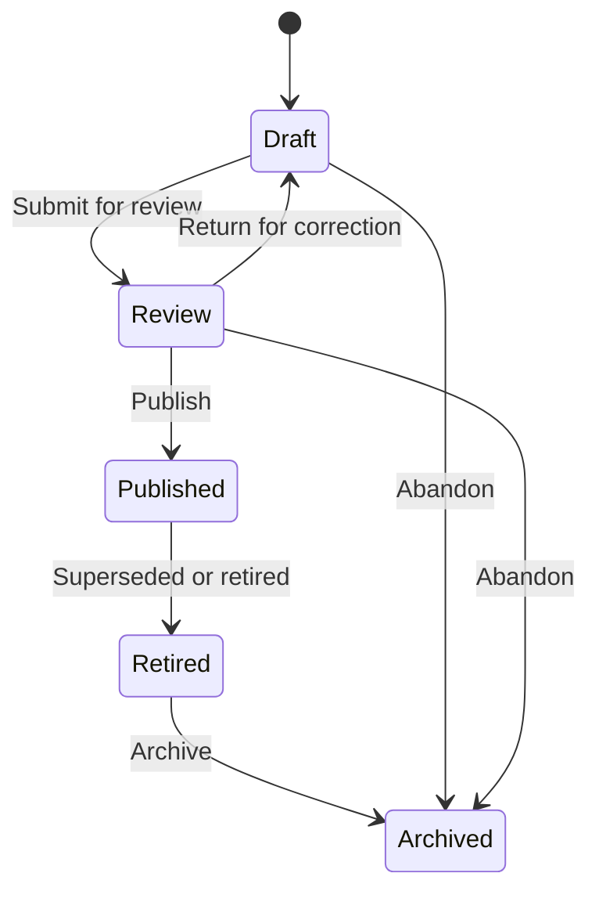

# Phase 2 Sprint 2.2 — Curriculum Domain Implementation Plan

**Platform:** Clasptek Prep Portal V2  
**Release:** `v1.2.0-curriculum-domain`  
**Bounded Context:** Curriculum  
**Domain Classification:** Core Supporting Domain  
**Upstream Domain:** Frozen Exam Product Domain V3  
**Migrations:** `00110_curriculum_core.sql` through `00121_curriculum_rls.sql`  
**Document Status:** Approved Architecture Baseline  
**Document Revision:** 2.0

> **Release numbering decision:** Sprint 2.1 was defined as `v1.1.0-exam-product-domain`. To preserve semantic-version ordering, this sprint uses `v1.2.0-curriculum-domain`. Use `v0.4.0-curriculum-domain` only if the repository has not actually released any `v1.x` version.

---

# 1. Executive Objective

The Curriculum Domain transforms the authoritative examination architecture into an executable teaching design.

It answers:

> How does Clasptek teach students to master the knowledge and skills defined by the Exam Product Domain?

The Curriculum Domain defines:

- What is taught
- In what sequence it is taught
- Which learning outcomes are expected
- Which skills, skill levels, learning paths, official exam components, and Assessment Blueprint items are supported
- Which instructional activities and assignments are recommended
- How much study time is expected
- Which prerequisites must be satisfied
- Which curriculum version is currently published

The Curriculum Domain does not redefine the examination, skill taxonomy, diagnostic policy, readiness policy, official structure, Assessment Blueprint, or Learning Path.

Those definitions remain authoritative in the frozen Exam Product Domain.

---

# 2. Strategic Domain Position

The platform flow is:

```text
Exam Product Domain
├── Official Exam Structure
├── Assessment Blueprint
├── Global Skill Framework
├── Diagnostic Framework
├── Learning Framework
├── Learning Paths
└── Readiness Framework
        │
        ▼
Curriculum Domain
├── Curricula
├── Curriculum Versions
├── Modules
├── Lessons
├── Learning Outcomes
├── Learning Activities
├── Instructional Assignments
├── Resource References
└── Authoritative Domain Mappings
        │
        ▼
Learning Resource Domain
        │
        ▼
Diagnostic Assessment / Practice / Mock / Results / Readiness / AI Coach
```

The Exam Product Domain defines the required destination.

The Curriculum Domain defines the teaching route.

---

# 3. Scope

## 3.1 Included

- Curriculum catalogue
- Curriculum versioning
- Curriculum dependency locking
- Curriculum publication lifecycle
- Learning modules
- Module ordering
- Module prerequisites
- Lessons
- Lesson ordering
- Lesson prerequisites
- Learning outcomes
- Outcome-to-skill mappings
- Outcome-to-official-component mappings
- Outcome-to-Assessment-Blueprint mappings
- Learning activities
- Instructional assignments
- Estimated study time
- Difficulty and cognitive-level references
- Evidence-type references
- Lesson resource references
- Curriculum-to-Exam-Product mappings
- Curriculum-to-Learning-Path mappings
- Curriculum-to-Learning-Path-Node mappings
- Curriculum-to-skill mappings
- Curriculum-to-official-component mappings
- Curriculum-to-Assessment-Blueprint mappings
- Version history
- Publication validation
- Administration interface
- REST APIs
- Domain events
- Automated tests
- Architecture fitness rules
- Multilingual curriculum definitions
- Reusable curriculum templates
- CQRS administration projections
- Prerequisite graph visualisation

## 3.2 Excluded

- Students
- Student enrolments
- Student progress
- Student lesson completion
- Student activity attempts
- Assignment submissions
- Assignment grading
- Diagnostic attempts
- Practice questions
- Question-bank ownership
- Mock examinations
- Assessment delivery
- Student responses
- Results
- AI grading
- AI-generated recommendations
- Learning analytics
- Readiness calculations
- Binary file storage
- Video processing
- Payment
- Certification

---

# 4. Critical Boundary Decisions

## 4.1 The Curriculum Domain Consumes Exam Product Definitions

The Curriculum Domain may reference:

- `exam_products`
- `exam_product_versions`
- `official_exam_structures`
- `official_exam_components`
- `assessment_blueprints`
- `assessment_blueprint_items`
- `assessment_item_types`
- `skill_frameworks`
- `skill_framework_versions`
- `skills`
- `skill_revisions`
- `skill_levels`
- `difficulty_taxonomies`
- `difficulty_levels`
- `cognitive_taxonomies`
- `cognitive_levels`
- `evidence_types`
- `skill_groups`
- `learning_frameworks`
- `learning_paths`
- `learning_path_nodes`

It must never insert, update, archive, publish, or delete rows in those tables.

## 4.2 No Duplicate Skill Definitions

The Curriculum Domain must not create tables such as:

- `curriculum_skills`
- `lesson_skills` containing copied skill definitions
- `curriculum_learning_paths`
- `curriculum_exam_sections`
- `curriculum_question_types`

Mappings contain foreign identifiers only.

Display names may be resolved through read ports or published projections.

## 4.3 Learning Resources Are Referenced, Not Owned

The Curriculum Domain may associate a lesson with a resource reference.

It must not own:

- File binaries
- Video transcoding
- Document lifecycle
- Media permissions
- CDN delivery
- Resource analytics

`resource_references` stores a stable reference to a resource managed by a future Learning Resource Domain or an approved external provider.

## 4.4 Assignments Are Instructional Definitions

Assignments in this domain are unexecuted instructional definitions.

They may define:

- Instructions
- Expected evidence type
- Estimated completion time
- Submission mode
- Intended outcomes
- Recommended rubric reference

They must not store:

- Student submissions
- Scores
- Feedback
- Grading decisions
- Due dates tied to a student or cohort

## 4.5 Published Dependencies Are Pinned

A published Curriculum Version must reference exact published upstream versions.

It must not point only to “current” Exam Product or Skill Framework records.

A published curriculum remains historically reproducible even after the upstream domains publish newer versions.

## 4.6 Localisation Is Version-Bound

The Curriculum Domain may publish approved translations of curriculum-owned instructional definitions.

Localisation must use language-specific relational translation tables rather than columns such as `localized_title_1`, `localized_title_2`, or a generic unvalidated translation JSON object.

Translations belong to an exact Curriculum Version and become immutable when that version is Published.

The upstream Exam Product Domain remains responsible for translating its own authoritative definitions.

## 4.7 Templates Are Authoring Scaffolds

Curriculum Templates accelerate authoring but are not executable curricula.

A template may define:

- Suggested module shells
- Suggested lesson shells
- Suggested sequencing
- Suggested Learning Path mappings
- Suggested outcome placeholders
- Suggested estimated study time

Creating a Curriculum from a template copies a validated snapshot into a new Draft Curriculum Version.

There is no live inheritance. Updating a template must never mutate an existing Curriculum.

## 4.8 Projections Are Read Models

Coverage dashboards, lesson trees, graph visualisations, time summaries, and publication-health screens must use dedicated read projections.

They must not hydrate or query write aggregates directly.

Projections are rebuildable, eventually consistent read models. The authoritative publication command must still validate current source tables transactionally and must never trust a stale projection as the final publication decision.

---

# 5. Dependency Architecture

The logical dependency direction is:

```text
Kernel
  ↓
Exam Product Contracts
  ↓
Curriculum Domain
  ↓
Curriculum Application
  ↓
Curriculum Infrastructure
  ↓
API and Administration UI
```

The physical package dependency must be:

```text
packages/kernel
packages/contracts/exam-product
packages/domain/curriculum
packages/application/curriculum
packages/infrastructure/curriculum
apps/web
```

The Curriculum Domain should depend on stable Exam Product identifiers and contract types, not on Supabase rows or Exam Product repository implementations.

## 5.1 Required Anti-Corruption Ports

Create application ports:

- `ExamProductReferenceReader`
- `SkillFrameworkReferenceReader`
- `LearningPathReferenceReader`
- `AssessmentBlueprintReferenceReader`
- `TaxonomyReferenceReader`
- `EvidenceTypeReferenceReader`

These ports validate upstream references without allowing Curriculum to mutate upstream domains.

## 5.2 Future Skill Framework Extraction

The frozen Exam Product V3 document treats the Global Skill Framework as a future independent bounded context.

Curriculum must therefore reference skills through stable contracts so that future extraction does not require Curriculum redesign.

---

# 6. Canonical Domain Model

```text
Curriculum
├── Curriculum Versions
│   ├── Upstream Dependency Locks
│   ├── Exam Product Mappings
│   ├── Learning Path Mappings
│   ├── Skill Coverage Mappings
│   ├── Official Component Mappings
│   ├── Assessment Blueprint Mappings
│   ├── Learning Modules
│   │   ├── Module Outcomes
│   │   ├── Module Sequence
│   │   ├── Module Prerequisites
│   │   └── Lessons
│   │       ├── Lesson Outcomes
│   │       ├── Lesson Sequence
│   │       ├── Lesson Prerequisites
│   │       ├── Learning Activities
│   │       ├── Instructional Assignments
│   │       └── Resource References
│   ├── Curriculum Metadata
│   └── Publication History
└── Version History
```

---

# 7. Aggregate Design

Loading an entire curriculum graph as one aggregate would be operationally unsafe and would create excessive transaction contention.

The bounded context therefore contains four aggregate roots.

## 7.1 Curriculum Aggregate Root

Controls:

- Stable curriculum identity
- Code
- Slug
- Ownership
- Lifecycle
- Current published version
- Version creation
- Archiving
- Product-level invariants

## 7.2 CurriculumVersion Aggregate Root

Controls:

- Version metadata
- Review state
- Publication state
- Dependency locks
- Top-level mappings
- Completeness state
- Publication readiness
- Effective dates
- Version immutability

It references modules by identity but does not load every lesson and activity into one in-memory aggregate.

## 7.3 LearningModule Aggregate Root

Controls:

- Module identity
- Module metadata
- Module position
- Module outcomes
- Module prerequisite references
- Lesson membership
- Module-level invariants

## 7.4 Lesson Aggregate Root

Controls:

- Lesson identity
- Lesson metadata
- Lesson position
- Estimated study time
- Lesson prerequisites
- Learning outcomes
- Learning activities
- Assignments
- Resource references
- Lesson-level invariants

## 7.5 Aggregate Boundary Protection

The four curriculum execution aggregates remain exactly as designed:

1. Curriculum
2. CurriculumVersion
3. LearningModule
4. Lesson

The implementation must never load the following as one aggregate graph:

```text
Curriculum
└── CurriculumVersion
    └── Module
        └── Lesson
            └── Activity
                └── Assignment
```

Each aggregate is loaded and changed through its own repository and concurrency token.

## 7.6 CurriculumTemplate Supporting Aggregate

`CurriculumTemplate` is a separate authoring-only aggregate.

It does not become a child of Curriculum and is not part of the executable curriculum graph.

It controls:

- Template identity
- Template versions
- Template lifecycle
- Validated template definition
- Template localisation
- Template publication
- Template usage history

Instantiating a template creates a new Draft Curriculum Version and records the source template version.

## 7.7 Projections Are Not Aggregates

Read projections contain no domain behaviour and are not sources of truth.

Projection handlers consume committed domain events or rebuild from authoritative tables.

## 7.8 Cross-Aggregate Publication

Publishing is an application-level orchestration.

`PublishCurriculumVersionHandler` must:

1. Lock the Curriculum and Curriculum Version.
2. Read the complete curriculum publication projection.
3. Validate all aggregate invariants.
4. Validate upstream references.
5. Verify dependency locks.
6. Verify resource references.
7. Verify prerequisite graphs.
8. Verify outcome and skill coverage.
9. Retire the previous published version.
10. Publish the new version.
11. Update the Curriculum current-version pointer.
12. Write publication history.
13. Persist domain events through the outbox.
14. Commit in one database transaction.

---

# 8. Curriculum Lifecycle



## 8.1 Lifecycle Rules

| Current State | Allowed Transitions            |
| ------------- | ------------------------------ |
| Draft         | Review, Archived               |
| Review        | Draft, Published, Archived     |
| Published     | Retired                        |
| Retired       | Archived                       |
| Archived      | None through standard workflow |

Rules:

1. Published Curriculum Versions are immutable.
2. A Published version cannot return to Draft.
3. A curriculum may have only one current Published version.
4. Updating a Published curriculum requires cloning it into a new Draft version.
5. Publication retires the previously Published version in the same transaction.
6. Archived versions remain available for authorised historical reads.
7. Soft deletion must not destroy publication history.

---

# 9. Curriculum Version Dependency Locking

A Curriculum Version must pin exact upstream dependencies.

Example:

```text
IELTS Academic Curriculum v2
├── Exam Product Version: IELTS Academic v4
├── Official Exam Structure: IELTS-AC-STRUCTURE v4
├── Assessment Blueprint: IELTS-AC-BLUEPRINT v3
├── Skill Framework Version: CLASPTEK-CORE-SKILLS v5
├── Learning Framework: IELTS-AC-LEARNING v2
└── Learning Paths:
    ├── IELTS Grammar Foundation v2
    ├── IELTS Academic Reading v3
    └── IELTS Writing Task 2 v4
```

This prevents a later upstream publication from silently changing the meaning of an already Published curriculum.

## 9.1 Dependency Compatibility Rules

- Every referenced Exam Product Version must be Published.
- Every referenced Official Exam Component must belong to a locked Exam Product Version.
- Every referenced Assessment Blueprint and Blueprint Item must belong to the locked product version.
- Every referenced Skill Revision must belong to a locked Skill Framework Version.
- Every referenced Skill Level, Difficulty Level, Cognitive Level, and Evidence Type must be active and compatible.
- Every Learning Path and Learning Path Node must belong to the locked Learning Framework.
- A Draft may refresh dependencies deliberately.
- A Published version may never refresh dependencies.

---

# 10. Database Migration Strategy

Do not place the complete Curriculum Domain in one migration.

Create the following ordered migrations:

```text
00110_curriculum_core.sql
00111_curriculum_mappings.sql
00112_curriculum_modules.sql
00113_curriculum_lessons.sql
00114_curriculum_outcomes.sql
00115_curriculum_activities.sql
00116_curriculum_resources.sql
00117_curriculum_localization.sql
00118_curriculum_templates.sql
00119_curriculum_projections.sql
00120_curriculum_seed_catalogues.sql
00121_curriculum_rls.sql
```

If the repository uses timestamp migrations, preserve the same dependency order using timestamps later than the frozen Exam Product migrations.

## 10.1 Migration Responsibilities

### `00110_curriculum_core.sql`

Creates:

- `curricula`
- `curriculum_versions`
- `curriculum_dependency_locks`
- `curriculum_publish_history`
- `curriculum_metadata`

### `00111_curriculum_mappings.sql`

Creates:

- `curriculum_exam_product_map`
- `curriculum_learning_path_map`
- `curriculum_learning_path_node_map`
- `curriculum_skill_map`
- `curriculum_exam_component_map`
- `curriculum_blueprint_map`
- `curriculum_blueprint_item_map`

### `00112_curriculum_modules.sql`

Creates:

- `learning_modules`
- `module_sequences`
- `module_prerequisites`
- `module_learning_outcomes`

### `00113_curriculum_lessons.sql`

Creates:

- `lessons`
- `lesson_sequences`
- `lesson_prerequisites`
- `lesson_learning_outcomes`

### `00114_curriculum_outcomes.sql`

Creates:

- `learning_outcomes`
- `learning_outcome_skill_map`
- `learning_outcome_exam_component_map`
- `learning_outcome_blueprint_item_map`

### `00115_curriculum_activities.sql`

Creates:

- `activity_types`
- `learning_activities`
- `learning_activity_outcomes`
- `learning_assignments`
- `learning_assignment_outcomes`

### `00116_curriculum_resources.sql`

Creates:

- `resource_references`
- `lesson_resources`
- `activity_resources`
- `assignment_resources`

### `00117_curriculum_localization.sql`

Creates:

- `curriculum_locales`
- `curriculum_version_translations`
- `learning_module_translations`
- `lesson_translations`
- `learning_outcome_translations`
- `learning_activity_translations`
- `learning_assignment_translations`

### `00118_curriculum_templates.sql`

Creates:

- `curriculum_templates`
- `curriculum_template_versions`
- `curriculum_template_translations`
- `curriculum_template_usage`

### `00119_curriculum_projections.sql`

Creates the rebuildable `curriculum_read` schema and:

- `curriculum_summary_projection`
- `curriculum_coverage_projection`
- `curriculum_publication_readiness_projection`
- `curriculum_graph_projection`
- `lesson_tree_projection`

### `00120_curriculum_seed_catalogues.sql`

Seeds:

- Activity types
- Curriculum template starter records where approved
- Default English locale configuration
- Projection schema version records

Seeds must be deterministic and idempotent.

### `00121_curriculum_rls.sql`

Enables RLS and creates:

- Public Published-read policies
- Administrative write policies
- Projection read policies
- Template-management policies
- Localisation-management policies
- Published-version immutability protections

## 10.2 Deployment Rules

Every migration must be:

- Transactional where PostgreSQL operations allow it
- Independently reviewable
- Covered by a migration test
- Accompanied by rollback or forward-fix guidance
- Safe to execute after all preceding migrations
- Unable to mutate frozen Exam Product tables
- Deterministic in development, CI, staging, and production

A failed migration must stop deployment before later migrations execute.

Schema rollback must never delete Published production curriculum history. Production corrections should normally use forward-fix migrations.

# 11. Common Database Columns

Every mutable Curriculum table shall include the appropriate form of:

```sql
id uuid primary key default gen_random_uuid(),

status text not null,

version_no integer not null default 1,
lock_version bigint not null default 0,

created_at timestamptz not null default now(),
created_by uuid null references auth.users(id),

updated_at timestamptz not null default now(),
updated_by uuid null references auth.users(id),

deleted_at timestamptz null,
deleted_by uuid null references auth.users(id)
```

## 11.1 Version Meanings

- `version_no`: business version where applicable
- `lock_version`: optimistic-concurrency counter
- `current_version_no`: current Published version number
- `current_version_id`: current Published version identifier
- `sequence_no`: deterministic default order
- `revision_no`: revision of a subordinate definition where needed

Every successful update increments `lock_version`.

---

# 12. Database Inventory

The baseline contains **44 writable source-of-truth tables** and **5 rebuildable read projections**.

## 12.1 Core Curriculum Tables

1. `curricula`
2. `curriculum_versions`
3. `curriculum_dependency_locks`
4. `curriculum_publish_history`
5. `curriculum_metadata`

## 12.2 Upstream Mapping Tables

6. `curriculum_exam_product_map`
7. `curriculum_learning_path_map`
8. `curriculum_learning_path_node_map`
9. `curriculum_skill_map`
10. `curriculum_exam_component_map`
11. `curriculum_blueprint_map`
12. `curriculum_blueprint_item_map`

## 12.3 Module Tables

13. `learning_modules`
14. `module_sequences`
15. `module_prerequisites`
16. `module_learning_outcomes`

## 12.4 Lesson Tables

17. `lessons`
18. `lesson_sequences`
19. `lesson_prerequisites`
20. `lesson_learning_outcomes`

## 12.5 Outcome Tables

21. `learning_outcomes`
22. `learning_outcome_skill_map`
23. `learning_outcome_exam_component_map`
24. `learning_outcome_blueprint_item_map`

## 12.6 Activity and Assignment Tables

25. `activity_types`
26. `learning_activities`
27. `learning_activity_outcomes`
28. `learning_assignments`
29. `learning_assignment_outcomes`

## 12.7 Resource Reference Tables

30. `resource_references`
31. `lesson_resources`
32. `activity_resources`
33. `assignment_resources`

## 12.8 Localisation Tables

34. `curriculum_locales`
35. `curriculum_version_translations`
36. `learning_module_translations`
37. `lesson_translations`
38. `learning_outcome_translations`
39. `learning_activity_translations`
40. `learning_assignment_translations`

## 12.9 Template Tables

41. `curriculum_templates`
42. `curriculum_template_versions`
43. `curriculum_template_translations`
44. `curriculum_template_usage`

## 12.10 Rebuildable Read Projections

The following relations live in a dedicated `curriculum_read` schema and are not sources of truth:

45. `curriculum_summary_projection`
46. `curriculum_coverage_projection`
47. `curriculum_publication_readiness_projection`
48. `curriculum_graph_projection`
49. `lesson_tree_projection`

# 13. Table Specifications

## 13.1 `curricula`

Stable curriculum identity.

```text
id
code
slug
name
description
curriculum_type
owner_organization_id
default_language_code
status
current_version_id
current_version_no
lock_version
audit columns
soft-delete columns
```

Recommended `curriculum_type` values:

- exam_preparation
- foundation
- remedial
- intensive
- revision
- bridge
- institutional
- custom

Constraints:

- Unique active code
- Unique active slug
- Current version number cannot be negative
- Stable code becomes immutable after first publication

---

## 13.2 `curriculum_versions`

Version-specific curriculum definition.

```text
id
curriculum_id
version_no
status
name
description
target_audience
delivery_strategy
default_language_code
localisation_policy
estimated_total_minutes
minimum_completion_minutes
maximum_completion_minutes
effective_from
effective_to
change_summary
reviewed_at
reviewed_by
published_at
published_by
retired_at
retired_by
content_schema_version
lock_version
audit columns
soft-delete columns
```

Constraints:

- Unique `(curriculum_id, version_no)`
- Positive study-time values
- Minimum time cannot exceed maximum time
- Effective end cannot precede effective start
- One Published version per curriculum
- Published row immutable

---

## 13.3 `curriculum_dependency_locks`

Pins exact upstream versions.

```text
id
curriculum_version_id
dependency_domain
dependency_type
aggregate_id
version_id
version_no
reference_code
reference_checksum
locked_at
locked_by
status
lock_version
audit columns
soft-delete columns
```

Supported dependency types:

- exam_product_version
- official_exam_structure
- assessment_blueprint
- skill_framework_version
- learning_framework
- learning_path
- taxonomy_version
- evidence_type_catalogue

Constraints:

- Unique active dependency tuple per Curriculum Version
- Published Curriculum Versions cannot change locks
- Version ID required for versioned upstream definitions

---

## 13.4 `curriculum_publish_history`

Append-only publication audit.

```text
id
curriculum_id
curriculum_version_id
action
from_status
to_status
publication_number
change_summary
validation_snapshot_json
dependency_snapshot_json
performed_at
performed_by
correlation_id
```

Supported actions:

- submitted_for_review
- returned_to_draft
- published
- retired
- archived

This table is append-only and must not use soft-delete behaviour.

---

## 13.5 `curriculum_metadata`

Controlled extension points.

```text
id
curriculum_version_id
metadata_namespace
metadata_key
metadata_value_json
metadata_schema_version
is_public
status
version_no
lock_version
audit columns
soft-delete columns
```

Business-critical data must remain relational.

---

# 14. Upstream Mapping Tables

## 14.1 `curriculum_exam_product_map`

Maps a Curriculum Version to one or more exact Exam Product Versions.

```text
id
curriculum_version_id
exam_product_id
exam_product_version_id
mapping_type
is_primary
coverage_percentage
status
version_no
lock_version
audit columns
soft-delete columns
```

Supported mapping types:

- primary
- shared
- foundation_for
- supplementary
- bridge

Constraints:

- Exam Product Version must be Published
- At least one primary product mapping for exam-preparation curricula
- Coverage percentage between 0 and 100

---

## 14.2 `curriculum_learning_path_map`

Maps a Curriculum Version to authoritative Learning Paths.

```text
id
curriculum_version_id
learning_framework_id
learning_path_id
mapping_type
is_primary
coverage_percentage
entry_policy
exit_policy
display_order
status
version_no
lock_version
audit columns
soft-delete columns
```

Supported mapping types:

- implements
- supports
- prerequisite_for
- remediation_for
- advancement_for

Constraints:

- Path belongs to a locked Learning Framework
- Duplicate active mappings prohibited
- Display order positive
- Coverage percentage between 0 and 100

---

## 14.3 `curriculum_learning_path_node_map`

Maps curriculum content to exact Learning Path Nodes.

```text
id
curriculum_version_id
learning_path_id
learning_path_node_id
learning_module_id
lesson_id
mapping_type
coverage_weight
is_required
status
version_no
lock_version
audit columns
soft-delete columns
```

Supported mapping types:

- teaches
- reinforces
- assesses_readiness_for
- remediates
- extends

At least one of `learning_module_id` or `lesson_id` must be supplied.

---

## 14.4 `curriculum_skill_map`

Defines top-level skill coverage.

```text
id
curriculum_version_id
skill_revision_id
skill_level_id
difficulty_level_id
mapping_type
coverage_weight
target_mastery_percentage
is_required
status
version_no
lock_version
audit columns
soft-delete columns
```

Supported mapping types:

- primary
- supporting
- prerequisite
- enrichment
- remediation

Constraints:

- Skill Revision belongs to locked Skill Framework Version
- Target mastery percentage between 0 and 100
- Duplicate active mapping tuple prohibited

---

## 14.5 `curriculum_exam_component_map`

Maps curriculum coverage to Official Exam Components.

```text
id
curriculum_version_id
official_exam_component_id
mapping_type
coverage_weight
is_required
status
version_no
lock_version
audit columns
soft-delete columns
```

Supported mapping types:

- prepares_for
- supports
- strategy_for
- prerequisite_for

---

## 14.6 `curriculum_blueprint_map`

Maps a Curriculum Version to an Assessment Blueprint.

```text
id
curriculum_version_id
assessment_blueprint_id
mapping_type
coverage_percentage
is_required
status
version_no
lock_version
audit columns
soft-delete columns
```

This mapping does not create questions.

---

## 14.7 `curriculum_blueprint_item_map`

Maps modules or lessons to exact Blueprint Items.

```text
id
curriculum_version_id
assessment_blueprint_item_id
learning_module_id
lesson_id
mapping_type
coverage_weight
is_required
status
version_no
lock_version
audit columns
soft-delete columns
```

Supported mapping types:

- teaches_format
- teaches_strategy
- builds_skill_for
- reinforces
- revision

At least one module or lesson reference is required.

---

# 15. Module Model

## 15.1 `learning_modules`

```text
id
curriculum_version_id
code
slug
name
description
module_type
default_sequence_no
estimated_study_minutes
minimum_study_minutes
maximum_study_minutes
is_required
completion_policy
status
version_no
lock_version
audit columns
soft-delete columns
```

Supported module types:

- foundation
- core
- advanced
- mastery
- remediation
- revision
- exam_strategy
- project
- orientation
- custom

Constraints:

- Unique active code per Curriculum Version
- Unique active slug per Curriculum Version
- Positive sequence number
- Valid time range
- Published-parent module immutable

## 15.2 `module_sequences`

Defines directed instructional flow.

```text
id
curriculum_version_id
source_module_id
target_module_id
relation_type
priority
is_mandatory
condition_json
status
version_no
lock_version
audit columns
soft-delete columns
```

Supported relation types:

- next
- recommended_next
- alternative
- remediation
- advancement
- branch

A mandatory `next` graph must be acyclic.

## 15.3 `module_prerequisites`

Defines gating dependencies.

```text
id
curriculum_version_id
module_id
prerequisite_module_id
prerequisite_type
minimum_completion_percentage
minimum_mastery_percentage
required_skill_revision_id
required_skill_level_id
is_mandatory
rationale
status
version_no
lock_version
audit columns
soft-delete columns
```

Supported prerequisite types:

- module_completion
- outcome_mastery
- skill_mastery
- diagnostic_clearance
- learning_path_entry
- custom

No self-reference or circular mandatory prerequisites.

## 15.4 `module_learning_outcomes`

```text
id
learning_module_id
learning_outcome_id
sequence_no
is_primary
status
version_no
lock_version
audit columns
soft-delete columns
```

---

# 16. Lesson Model

## 16.1 `lessons`

```text
id
learning_module_id
code
slug
title
summary
lesson_type
default_sequence_no
estimated_study_minutes
minimum_study_minutes
maximum_study_minutes
instructional_method
completion_policy
is_required
status
version_no
lock_version
audit columns
soft-delete columns
```

Supported lesson types:

- concept
- demonstration
- guided_practice
- workshop
- discussion
- project
- revision
- exam_strategy
- reflection
- custom

Constraints:

- Unique active code per module
- Unique active slug per module
- Positive sequence
- Valid time range
- Published-parent lesson immutable

## 16.2 `lesson_sequences`

Defines lesson flow.

```text
id
learning_module_id
source_lesson_id
target_lesson_id
relation_type
priority
is_mandatory
condition_json
status
version_no
lock_version
audit columns
soft-delete columns
```

Supported relation types:

- next
- recommended_next
- alternative
- remediation
- advancement
- branch

## 16.3 `lesson_prerequisites`

Defines gating rules.

```text
id
lesson_id
prerequisite_lesson_id
prerequisite_type
minimum_completion_percentage
minimum_mastery_percentage
required_skill_revision_id
required_skill_level_id
is_mandatory
rationale
status
version_no
lock_version
audit columns
soft-delete columns
```

Rules:

- Lesson cannot depend on itself.
- Mandatory prerequisite graph must be acyclic.
- A prerequisite lesson must belong to the same Curriculum Version.
- Entry and exit skill levels must progress logically.
- A higher-level lesson cannot bypass all lower-level prerequisite routes unless marked as an approved placement-entry lesson.

## 16.4 `lesson_learning_outcomes`

```text
id
lesson_id
learning_outcome_id
sequence_no
is_primary
status
version_no
lock_version
audit columns
soft-delete columns
```

---

# 17. Learning Outcomes

## 17.1 `learning_outcomes`

```text
id
curriculum_version_id
code
statement
description
outcome_type
cognitive_level_id
difficulty_level_id
evidence_type_id
minimum_mastery_percentage
estimated_evidence_minutes
is_measurable
status
version_no
lock_version
audit columns
soft-delete columns
```

Recommended outcome statement format:

> By the end of this lesson, the learner can identify the main idea of an IELTS Academic Reading paragraph and justify the choice using textual evidence.

Supported outcome types:

- knowledge
- skill
- strategy
- performance
- communication
- problem_solving
- creation
- reflection

Constraints:

- Unique active code per Curriculum Version
- Published outcomes immutable
- Measurable outcomes required for publication
- Minimum mastery percentage between 0 and 100
- Cognitive, difficulty, and evidence references must be valid upstream definitions

## 17.2 `learning_outcome_skill_map`

```text
id
learning_outcome_id
skill_revision_id
skill_level_id
mapping_type
importance_weight
target_mastery_percentage
is_primary
status
version_no
lock_version
audit columns
soft-delete columns
```

Supported mapping types:

- develops
- demonstrates
- reinforces
- integrates
- prerequisite

## 17.3 `learning_outcome_exam_component_map`

```text
id
learning_outcome_id
official_exam_component_id
mapping_type
importance_weight
status
version_no
lock_version
audit columns
soft-delete columns
```

## 17.4 `learning_outcome_blueprint_item_map`

```text
id
learning_outcome_id
assessment_blueprint_item_id
mapping_type
importance_weight
status
version_no
lock_version
audit columns
soft-delete columns
```

This supports outcomes such as mastering Matching Headings strategy without redefining the Blueprint Item.

---

# 18. Learning Activities

## 18.1 `activity_types`

Seeded catalogue.

```text
id
code
name
description
category
default_evidence_type_id
supports_interaction
supports_collaboration
supports_external_resource
status
version_no
lock_version
audit columns
soft-delete columns
```

Initial types:

- reading
- video
- audio
- demonstration
- guided_example
- worked_solution
- discussion
- reflection
- note_taking
- drill
- role_play
- speaking_rehearsal
- writing_workshop
- mathematical_practice
- project
- external_tool
- custom

The activity type catalogue is Curriculum-owned because it defines instructional activity, not exam question type.

## 18.2 `learning_activities`

```text
id
lesson_id
activity_type_id
code
title
instructions
sequence_no
estimated_minutes
delivery_mode
interaction_mode
evidence_type_id
difficulty_level_id
cognitive_level_id
is_required
completion_definition_json
status
version_no
lock_version
audit columns
soft-delete columns
```

Supported delivery modes:

- self_paced
- instructor_led
- live_online
- onsite
- blended
- collaborative

Supported interaction modes:

- individual
- pair
- group
- instructor
- peer_review
- independent

No student activity result is stored here.

## 18.3 `learning_activity_outcomes`

```text
id
learning_activity_id
learning_outcome_id
mapping_type
importance_weight
status
version_no
lock_version
audit columns
soft-delete columns
```

---

# 19. Instructional Assignments

## 19.1 `learning_assignments`

```text
id
lesson_id
code
title
description
instructions
assignment_type
submission_mode
evidence_type_id
difficulty_level_id
cognitive_level_id
estimated_completion_minutes
recommended_rubric_reference
is_required
allow_collaboration
status
version_no
lock_version
audit columns
soft-delete columns
```

Supported assignment types:

- written_task
- speaking_task
- listening_task
- reading_task
- worked_solution
- research
- presentation
- reflection
- project
- portfolio_item
- custom

Supported submission modes:

- text
- file
- audio
- video
- link
- in_person
- external_platform
- none

This table defines the assignment only.

Student submission records belong to a future Student Learning Execution or Assignment Submission Domain.

## 19.2 `learning_assignment_outcomes`

```text
id
learning_assignment_id
learning_outcome_id
mapping_type
importance_weight
status
version_no
lock_version
audit columns
soft-delete columns
```

---

# 20. Resource References

## 20.1 `resource_references`

```text
id
provider_type
provider_resource_id
resource_domain
resource_uri
resource_version_id
title_snapshot
mime_type_snapshot
checksum
availability_status
is_external
external_provider
external_url
license_code
status
version_no
lock_version
audit columns
soft-delete columns
```

Supported provider types:

- learning_resource_domain
- media_library
- document_library
- external_url
- external_platform
- embedded_reference

The Curriculum Domain stores references and publication snapshots only.

It must not store binary files in this table.

## 20.2 `lesson_resources`

```text
id
lesson_id
resource_reference_id
usage_type
sequence_no
is_required
availability_policy
status
version_no
lock_version
audit columns
soft-delete columns
```

Supported usage types:

- primary_content
- supplementary
- worksheet
- example
- template
- reference
- transcript
- slide_deck
- instructor_guide

## 20.3 `activity_resources`

Associates resources with activities.

## 20.4 `assignment_resources`

Associates resources with instructional assignments.

All resource mappings must verify that required resources are available before publication.

---

# 21. Localisation Architecture

## 21.1 Localisation Strategy

English may be the initial seeded language, but the schema must support additional languages without adding new columns.

Use BCP 47-compatible language codes such as:

- `en`
- `en-NG`
- `en-GB`
- `fr`
- `es`
- `ar`

Locale resolution order:

1. Requested locale
2. Closest supported parent locale
3. Curriculum Version default locale
4. Platform default locale
5. Canonical source-language text

The API must return `Content-Language` and may return available language codes.

## 21.2 `curriculum_locales`

Defines supported and required locales for a Curriculum Version.

```text
id
curriculum_version_id
language_code
is_default
is_required_for_publication
translation_status
display_order
status
version_no
lock_version
audit columns
soft-delete columns
```

Supported translation statuses:

- not_started
- draft
- machine_translated
- human_review_required
- reviewed
- approved

Constraints:

- Unique active `(curriculum_version_id, language_code)`
- Exactly one active default locale per Curriculum Version
- Required publication locales must be Approved before publication
- Language code must be valid

## 21.3 Translation Tables

Create specific translation tables to preserve foreign-key integrity:

- `curriculum_version_translations`
- `learning_module_translations`
- `lesson_translations`
- `learning_outcome_translations`
- `learning_activity_translations`
- `learning_assignment_translations`

Each translation table contains the applicable form of:

```text
id
parent_entity_id
language_code
localized_name_or_title
localized_summary
localized_description
localized_instructions
source_language_code
translation_method
translation_status
reviewed_at
reviewed_by
status
version_no
lock_version
audit columns
soft-delete columns
```

Supported translation methods:

- original
- human
- machine
- machine_then_human
- imported

Rules:

- Unique active parent-and-language tuple
- Translations belong to the same Curriculum Version as the parent
- Published-parent translations are immutable
- Required locales must satisfy field-completeness rules
- HTML or rich text must be sanitised
- Curriculum translation does not translate upstream Exam Product definitions

## 21.4 Localised Read Models

Projection handlers must produce locale-aware summary and lesson-tree views.

Projection keys include `language_code`.

A missing translation must follow the documented fallback strategy and must be visibly identified to administrators.

---

# 22. Curriculum Template Architecture

## 22.1 Purpose

Templates reduce repeated authoring for programmes with similar instructional structures.

Examples:

### IELTS Preparation Template

```text
Grammar Foundation
Vocabulary Development
Listening
Reading
Writing Task 1
Writing Task 2
Speaking Part 1
Speaking Part 2
Speaking Part 3
Exam Strategy
```

### Digital SAT Preparation Template

```text
Grammar Foundation
Vocabulary in Context
Reading and Writing
Algebra
Advanced Mathematics
Problem Solving and Data Analysis
Geometry and Trigonometry
Adaptive Test Strategy
```

## 22.2 Template Boundary

A Curriculum Template is an authoring scaffold, not a curriculum.

It must not:

- Be assigned to a student
- Be consumed by Practice or Mock engines
- Be treated as Published curriculum
- Maintain live inheritance after instantiation
- Duplicate upstream Skill or Learning Path definitions

## 22.3 `curriculum_templates`

```text
id
code
slug
name
description
template_category
target_product_family
status
current_version_id
current_version_no
lock_version
audit columns
soft-delete columns
```

## 22.4 `curriculum_template_versions`

```text
id
curriculum_template_id
version_no
status
name
description
template_schema_version
definition_json
parameter_schema_json
change_summary
published_at
published_by
lock_version
audit columns
soft-delete columns
```

`definition_json` is acceptable here because a template is a validated authoring payload rather than the executable relational Curriculum model.

It may contain:

- Module shells
- Lesson shells
- Suggested sequencing
- Suggested prerequisite edges
- Suggested outcome placeholders
- Suggested upstream reference selectors
- Suggested study-time values

It must be validated against a versioned JSON Schema before publication and instantiation.

## 22.5 `curriculum_template_translations`

Stores locale-specific template catalogue text.

## 22.6 `curriculum_template_usage`

Records template instantiation.

```text
id
curriculum_template_id
curriculum_template_version_id
curriculum_id
curriculum_version_id
parameter_snapshot_json
definition_checksum
instantiated_at
instantiated_by
```

This table is append-only.

## 22.7 Template Lifecycle

```text
Draft → Review → Published → Archived
```

Only Published template versions may create a Curriculum Draft.

## 22.8 Template Commands

- `CreateCurriculumTemplate`
- `CreateCurriculumTemplateVersion`
- `UpdateCurriculumTemplateDraft`
- `PublishCurriculumTemplate`
- `ArchiveCurriculumTemplate`
- `CreateCurriculumFromTemplate`

Template instantiation must run in one transaction and must produce normal relational modules, lessons, sequences, mappings, and placeholders.

---

# 23. Curriculum Projection Layer

## 23.1 Purpose

Administration dashboards must not query write aggregates directly.

Create dedicated CQRS read models:

- `CurriculumSummaryProjection`
- `CurriculumCoverageProjection`
- `PublicationReadinessProjection`
- `CurriculumGraphProjection`
- `LessonTreeProjection`

## 23.2 Projection Storage

Store projections in:

```text
curriculum_read
```

Projection relations are rebuildable and may be truncated and regenerated.

They do not require soft-delete or domain audit semantics, but they must contain:

```text
curriculum_id
curriculum_version_id
language_code where applicable
projection_schema_version
source_lock_version
generated_at
is_stale
payload or typed read columns
```

## 23.3 Projection Definitions

### `curriculum_summary_projection`

Contains:

- Curriculum identity
- Current version
- Status
- Primary Exam Product
- Module count
- Lesson count
- Outcome count
- Estimated total time
- Supported locales
- Publication health summary
- Last updated identity and time

### `curriculum_coverage_projection`

Contains:

- Skill coverage
- Learning Path coverage
- Learning Path Node coverage
- Official Component coverage
- Blueprint Item coverage
- Outcomes without mappings
- Required mappings without curriculum coverage
- Coverage percentages
- Coverage warnings

### `curriculum_publication_readiness_projection`

Contains:

- Blocking errors
- Non-blocking warnings
- Translation completeness by locale
- Projection freshness
- Module and lesson dependency graph
- Cycle and unreachable-node visualisation
- Dependency-lock status
- Translation completeness
- Resource availability
- Time reconciliation
- Graph validation
- Last validation timestamp
- Overall readiness state

### `curriculum_graph_projection`

Contains:

- Module nodes
- Lesson nodes
- Sequence edges
- Prerequisite edges
- Remediation edges
- Advancement edges
- Cycle findings
- Unreachable-node findings
- Skill-level progression warnings

### `lesson_tree_projection`

Contains:

- Ordered module tree
- Ordered lesson tree
- Localised titles
- Outcome summaries
- Activity and assignment counts
- Required-resource status
- Estimated time rollups

## 23.4 Projection Update Strategy

Projection handlers consume committed domain events through the Platform outbox.

Supported operations:

- Incremental event-driven update
- Full projection rebuild
- Single-Curriculum rebuild
- Single-version rebuild
- Locale-specific rebuild

Commands:

- `RebuildCurriculumProjection`
- `RebuildAllCurriculumProjections`
- `MarkCurriculumProjectionStale`

## 23.5 Consistency Rules

- Dashboard reads may be eventually consistent.
- The UI must show stale status where applicable.
- Publication may request synchronous projection refresh for user feedback.
- The final publication decision must execute authoritative transactional validation against source tables.
- Projection failure must not corrupt source data.
- Projection handlers must be idempotent.

## 23.6 Prerequisite Graph Visualisation

The Administration UI must provide a visual dependency graph using `CurriculumGraphProjection`.

The graph shall display:

- Modules
- Lessons
- Sequence direction
- Mandatory prerequisites
- Optional prerequisites
- Remediation branches
- Advancement branches
- Detected cycles
- Unreachable nodes
- Invalid level transitions

Accessibility requirements:

- Keyboard navigation
- Textual dependency list
- Screen-reader labels
- Non-colour error indicators
- Zoom and fit-to-view
- Table fallback

# 24. Entity Relationship Diagram

```mermaid
erDiagram
    CURRICULA ||--o{ CURRICULUM_VERSIONS : versions
    CURRICULUM_VERSIONS ||--o{ CURRICULUM_DEPENDENCY_LOCKS : pins
    CURRICULA ||--o{ CURRICULUM_PUBLISH_HISTORY : records
    CURRICULUM_VERSIONS ||--o{ CURRICULUM_METADATA : contains

    CURRICULUM_VERSIONS ||--o{ CURRICULUM_EXAM_PRODUCT_MAP : targets
    CURRICULUM_VERSIONS ||--o{ CURRICULUM_LEARNING_PATH_MAP : implements
    CURRICULUM_VERSIONS ||--o{ CURRICULUM_LEARNING_PATH_NODE_MAP : covers
    CURRICULUM_VERSIONS ||--o{ CURRICULUM_SKILL_MAP : develops
    CURRICULUM_VERSIONS ||--o{ CURRICULUM_EXAM_COMPONENT_MAP : prepares_for
    CURRICULUM_VERSIONS ||--o{ CURRICULUM_BLUEPRINT_MAP : aligns
    CURRICULUM_VERSIONS ||--o{ CURRICULUM_BLUEPRINT_ITEM_MAP : supports

    CURRICULUM_VERSIONS ||--o{ LEARNING_MODULES : contains
    LEARNING_MODULES ||--o{ MODULE_SEQUENCES : source
    LEARNING_MODULES ||--o{ MODULE_SEQUENCES : target
    LEARNING_MODULES ||--o{ MODULE_PREREQUISITES : requires
    LEARNING_MODULES ||--o{ MODULE_LEARNING_OUTCOMES : targets

    LEARNING_MODULES ||--o{ LESSONS : contains
    LESSONS ||--o{ LESSON_SEQUENCES : source
    LESSONS ||--o{ LESSON_SEQUENCES : target
    LESSONS ||--o{ LESSON_PREREQUISITES : requires
    LESSONS ||--o{ LESSON_LEARNING_OUTCOMES : targets

    CURRICULUM_VERSIONS ||--o{ LEARNING_OUTCOMES : defines
    LEARNING_OUTCOMES ||--o{ LEARNING_OUTCOME_SKILL_MAP : maps
    LEARNING_OUTCOMES ||--o{ LEARNING_OUTCOME_EXAM_COMPONENT_MAP : aligns
    LEARNING_OUTCOMES ||--o{ LEARNING_OUTCOME_BLUEPRINT_ITEM_MAP : supports

    LESSONS ||--o{ LEARNING_ACTIVITIES : contains
    ACTIVITY_TYPES ||--o{ LEARNING_ACTIVITIES : classifies
    LEARNING_ACTIVITIES ||--o{ LEARNING_ACTIVITY_OUTCOMES : achieves

    LESSONS ||--o{ LEARNING_ASSIGNMENTS : contains
    LEARNING_ASSIGNMENTS ||--o{ LEARNING_ASSIGNMENT_OUTCOMES : achieves

    RESOURCE_REFERENCES ||--o{ LESSON_RESOURCES : referenced_by
    RESOURCE_REFERENCES ||--o{ ACTIVITY_RESOURCES : referenced_by
    RESOURCE_REFERENCES ||--o{ ASSIGNMENT_RESOURCES : referenced_by

    CURRICULUM_VERSIONS ||--o{ CURRICULUM_LOCALES : supports
    CURRICULUM_VERSIONS ||--o{ CURRICULUM_VERSION_TRANSLATIONS : translated_as
    LEARNING_MODULES ||--o{ LEARNING_MODULE_TRANSLATIONS : translated_as
    LESSONS ||--o{ LESSON_TRANSLATIONS : translated_as
    LEARNING_OUTCOMES ||--o{ LEARNING_OUTCOME_TRANSLATIONS : translated_as
    LEARNING_ACTIVITIES ||--o{ LEARNING_ACTIVITY_TRANSLATIONS : translated_as
    LEARNING_ASSIGNMENTS ||--o{ LEARNING_ASSIGNMENT_TRANSLATIONS : translated_as

    CURRICULUM_TEMPLATES ||--o{ CURRICULUM_TEMPLATE_VERSIONS : versions
    CURRICULUM_TEMPLATES ||--o{ CURRICULUM_TEMPLATE_TRANSLATIONS : translated_as
    CURRICULUM_TEMPLATE_VERSIONS ||--o{ CURRICULUM_TEMPLATE_USAGE : instantiated_as
    CURRICULUM_VERSIONS ||--o{ CURRICULUM_TEMPLATE_USAGE : created_from
```



Upstream Exam Product tables are referenced by foreign keys but not reproduced in this ERD.

The five `curriculum_read` projections are deliberately excluded because they are rebuildable CQRS read models rather than authoritative entities.

---

# 25. Core Business Rules

## 25.1 Curriculum Rules

1. Curriculum code is unique.
2. Curriculum code becomes immutable after first publication.
3. A Curriculum Version must have at least one Exam Product or Learning Path mapping.
4. A Published Curriculum Version is immutable.
5. Only one current Published version may exist per Curriculum.
6. Changes to a Published version require a new Draft.
7. A Curriculum Version cannot be published against Draft or Retired upstream definitions unless an explicit historical-use policy allows a Retired immutable dependency.
8. Archiving a Curriculum does not delete historical versions.

## 25.2 Module Rules

1. Every module belongs to exactly one Curriculum Version.
2. Module codes are unique within a Curriculum Version.
3. Default sequence values are deterministic.
4. Mandatory module sequence and prerequisite graphs are acyclic.
5. Required modules must contain at least one lesson.
6. Required modules must have at least one measurable outcome directly or through lessons.
7. Module study time must be compatible with its lesson totals.

## 25.3 Lesson Rules

1. Every lesson belongs to exactly one module.
2. Lesson codes are unique within a module.
3. Required lessons must define estimated study time.
4. Required lessons must map to at least one measurable outcome.
5. Mandatory lesson prerequisite graph is acyclic.
6. A lesson cannot depend on a lesson from an incompatible Curriculum Version.
7. A lesson requiring Advanced or Mastery exit level must have a valid lower-level route or an approved placement-entry exception.
8. Published lessons are immutable.

## 25.4 Outcome Rules

1. Every Published required lesson has at least one measurable outcome.
2. Every skill-development outcome maps to an authoritative Skill Revision.
3. Every mapped Skill Revision belongs to the locked Skill Framework Version.
4. Outcome cognitive level and difficulty must be logically compatible.
5. Evidence type must be suitable for the outcome.
6. Speaking outcomes cannot rely exclusively on text-only evidence unless marked as knowledge-only.
7. Writing performance outcomes require a written or equivalent evidence type.
8. Mathematical worked-solution outcomes require worked-solution or structured-response evidence.

## 25.5 Activity Rules

1. Every required activity belongs to one lesson.
2. Activity order is unique within a lesson.
3. Activity duration is positive.
4. Required activities map to at least one lesson outcome.
5. Activity evidence type must be compatible with the outcome evidence requirements.
6. Activities define no student result.

## 25.6 Assignment Rules

1. Assignments are instructional definitions.
2. They contain no student submission.
3. Required assignments map to at least one outcome.
4. Submission mode must be compatible with evidence type.
5. Estimated time must be positive.
6. A Published assignment is immutable.

## 25.7 Resource Rules

1. Required resources must be resolvable before publication.
2. External URLs must use allowed protocols.
3. Resource checksums are required where the provider supplies them.
4. Binary data must not be stored in Curriculum tables.
5. A required resource becoming unavailable after publication generates an operational alert but does not rewrite historical curriculum data.

## 25.8 Localisation Rules

1. Every Curriculum Version has exactly one default locale.
2. Required publication locales must be Approved.
3. Translations are version-bound.
4. A Published translation is immutable with its parent version.
5. Locale fallback must be deterministic.
6. Missing optional translations generate warnings, not silent data loss.
7. Translation payloads must be sanitised.

## 25.9 Template Rules

1. Only Published template versions may be instantiated.
2. Template instantiation always creates a Draft Curriculum Version.
3. Template instantiation records the exact template version and checksum.
4. Existing curricula never inherit later template changes.
5. Template definitions cannot contain student data, question-bank data, or resource binaries.
6. Template reference selectors must resolve to authorised upstream definitions before instantiation.

## 25.10 Projection Rules

1. Projections are read-only to UI and public API handlers.
2. Projection handlers are idempotent.
3. Projections may be rebuilt at any time.
4. A stale projection cannot authorise publication.
5. Projection failures do not roll back already committed domain transactions.
6. Source-table validation remains authoritative.

---

# 26. Publication Specification

A Curriculum Version is publishable only when all required validations pass.

## 26.1 Identity and Lifecycle

- Curriculum exists.
- Version is in Review.
- Version number is unique.
- Effective dates are valid.
- No conflicting current Published version exists.

## 26.2 Upstream Dependencies

- Dependency locks exist.
- Referenced upstream versions are valid.
- References belong to compatible upstream versions.
- Checksums or version tokens match.
- No Draft upstream dependency is used.
- Learning Paths and Skill Revisions are compatible.

## 26.3 Structure

- At least one module exists.
- Every required module contains at least one lesson.
- Module order is valid.
- Lesson order is valid.
- No circular module dependencies.
- No circular lesson dependencies.
- No unreachable required module or lesson.
- No duplicate active sequence position.

## 26.4 Learning Outcomes

- Every required lesson has measurable outcomes.
- Required Learning Path Nodes have curriculum coverage.
- Required skills have outcome coverage.
- Outcome mastery percentages are valid.
- Cognitive, difficulty, and evidence references are valid.
- Composite coverage does not double-count required coverage.

## 26.5 Blueprint and Official Structure Alignment

- Required mapped Official Exam Components have curriculum coverage.
- Required Assessment Blueprint Items have strategy or skill coverage where policy requires it.
- Curriculum does not redefine item types or Blueprint allocations.

## 26.6 Time Validation

- Lesson times are positive.
- Module totals reconcile with lesson totals within configured tolerance.
- Curriculum total reconciles with module totals within configured tolerance.
- Minimum, estimated, and maximum values are logically ordered.

## 26.7 Activities, Assignments, and Resources

- Required activities map to outcomes.
- Required assignments map to outcomes.
- Evidence types are compatible.
- Required resource references resolve successfully.
- External resources satisfy approved-provider policy.

## 26.8 Localisation

- Exactly one default locale exists.
- Every required locale is Approved.
- Required translated fields are complete.
- Translation content passes sanitisation.
- Locale fallback configuration is valid.

## 26.9 Review and Security

- Review approval exists.
- Publisher has `curriculum.publish`.
- Validation report contains no blocking issue.
- Audit identity is available.

## 26.10 Projection Refresh

After publication commits:

- Summary projection is rebuilt.
- Coverage projection is rebuilt.
- Publication-readiness projection records the successful snapshot.
- Graph projection is rebuilt.
- Lesson-tree projections are rebuilt for supported locales.

Projection completion may occur asynchronously, but the publication response must identify whether projections are current or pending.

---

# 27. Domain Package

Create:

```text
packages/domain/curriculum/
├── src/
│   ├── aggregates/
│   │   ├── curriculum.aggregate.ts
│   │   ├── curriculum-version.aggregate.ts
│   │   ├── learning-module.aggregate.ts
│   │   └── lesson.aggregate.ts
│   ├── entities/
│   │   ├── learning-outcome.entity.ts
│   │   ├── learning-activity.entity.ts
│   │   ├── learning-assignment.entity.ts
│   │   ├── resource-reference.entity.ts
│   │   ├── module-prerequisite.entity.ts
│   │   ├── lesson-prerequisite.entity.ts
│   │   ├── dependency-lock.entity.ts
│   │   ├── curriculum-locale.entity.ts
│   │   ├── translation.entity.ts
│   │   └── curriculum-template-version.entity.ts
│   ├── value-objects/
│   │   ├── curriculum-id.vo.ts
│   │   ├── curriculum-version-id.vo.ts
│   │   ├── module-id.vo.ts
│   │   ├── lesson-id.vo.ts
│   │   ├── activity-id.vo.ts
│   │   ├── assignment-id.vo.ts
│   │   ├── outcome-id.vo.ts
│   │   ├── curriculum-code.vo.ts
│   │   ├── curriculum-status.vo.ts
│   │   ├── estimated-study-time.vo.ts
│   │   ├── mastery-percentage.vo.ts
│   │   ├── sequence-number.vo.ts
│   │   ├── learning-sequence.vo.ts
│   │   └── dependency-version.vo.ts
│   ├── specifications/
│   │   ├── no-circular-module-dependencies.specification.ts
│   │   ├── no-circular-lesson-dependencies.specification.ts
│   │   ├── module-sequence.specification.ts
│   │   ├── lesson-sequence.specification.ts
│   │   ├── outcome-coverage.specification.ts
│   │   ├── learning-path-coverage.specification.ts
│   │   ├── blueprint-alignment.specification.ts
│   │   ├── resource-availability.specification.ts
│   │   ├── curriculum-completeness.specification.ts
│   │   └── curriculum-publishing.specification.ts
│   ├── policies/
│   │   ├── curriculum-versioning.policy.ts
│   │   ├── curriculum-publication.policy.ts
│   │   ├── dependency-lock.policy.ts
│   │   ├── skill-level-progression.policy.ts
│   │   └── estimated-time-reconciliation.policy.ts
│   ├── repositories/
│   │   ├── curriculum.repository.ts
│   │   ├── curriculum-version.repository.ts
│   │   ├── learning-module.repository.ts
│   │   ├── lesson.repository.ts
│   │   ├── curriculum-publication-reader.ts
│   │   └── curriculum-template.repository.ts
│   ├── events/
│   ├── errors/
│   └── index.ts
└── package.json
```

## 27.1 Domain Import Restrictions

The Domain package must not import:

- Supabase
- PostgreSQL libraries
- React
- Next.js
- HTTP libraries
- Environment configuration
- Student packages
- Practice packages
- Mock packages
- Results packages
- Resource storage SDKs

It may import only:

- Kernel primitives
- Stable Exam Product contract identifiers
- Curriculum-owned domain modules

---

# 28. Domain Events

## Curriculum Events

- `CurriculumCreated`
- `CurriculumUpdated`
- `CurriculumVersionCreated`
- `CurriculumReviewSubmitted`
- `CurriculumPublished`
- `CurriculumRetired`
- `CurriculumArchived`

## Mapping Events

- `CurriculumMappedToExamProduct`
- `CurriculumMappedToLearningPath`
- `CurriculumMappedToSkill`
- `CurriculumMappedToOfficialComponent`
- `CurriculumMappedToAssessmentBlueprint`
- `CurriculumDependencyLocked`

## Module Events

- `ModuleCreated`
- `ModuleUpdated`
- `ModuleReordered`
- `ModulePrerequisiteAdded`

## Lesson Events

- `LessonCreated`
- `LessonUpdated`
- `LessonReordered`
- `LessonPrerequisiteAdded`

## Outcome and Activity Events

- `LearningOutcomeAdded`
- `LearningOutcomeMappedToSkill`
- `LearningActivityAdded`
- `LearningAssignmentAdded`
- `ResourceReferenceAttached`

## Localisation Events

- `CurriculumLocaleAdded`
- `CurriculumTranslationUpdated`
- `CurriculumTranslationApproved`

## Template Events

- `CurriculumTemplateCreated`
- `CurriculumTemplateVersionCreated`
- `CurriculumTemplatePublished`
- `CurriculumCreatedFromTemplate`

## Projection Events

- `CurriculumProjectionRebuildRequested`
- `CurriculumProjectionRebuilt`
- `CurriculumProjectionFailed`

Every event shall include:

```text
eventId
eventType
aggregateId
aggregateType
aggregateVersion
occurredAt
actorId
correlationId
causationId
payload
```

Events must be persisted atomically using the Platform Foundation outbox.

---

# 29. Application Package

Create:

```text
packages/application/curriculum/
├── src/
│   ├── commands/
│   ├── queries/
│   ├── handlers/
│   ├── dto/
│   ├── ports/
│   ├── mappers/
│   ├── validators/
│   ├── projections/
│   └── index.ts
└── package.json
```

## 29.1 Commands

### Curriculum

- `CreateCurriculum`
- `UpdateCurriculumDraft`
- `CreateCurriculumVersion`
- `CloneCurriculumVersion`
- `SubmitCurriculumForReview`
- `PublishCurriculum`
- `RetireCurriculumVersion`
- `ArchiveCurriculum`

### Dependency and Mappings

- `LockCurriculumDependencies`
- `RefreshDraftDependencies`
- `MapCurriculumToExamProduct`
- `MapCurriculumToLearningPath`
- `MapCurriculumToLearningPathNode`
- `MapCurriculumToSkill`
- `MapCurriculumToOfficialComponent`
- `MapCurriculumToAssessmentBlueprint`
- `MapCurriculumToBlueprintItem`

### Modules

- `CreateModule`
- `UpdateModule`
- `ReorderModules`
- `AddModuleSequence`
- `AddModulePrerequisite`
- `RemoveModulePrerequisite`

### Lessons

- `CreateLesson`
- `UpdateLesson`
- `MoveLesson`
- `ReorderLessons`
- `AddLessonSequence`
- `AddLessonPrerequisite`
- `RemoveLessonPrerequisite`

### Outcomes

- `AddLearningOutcome`
- `UpdateLearningOutcome`
- `MapOutcomeToSkill`
- `MapOutcomeToOfficialComponent`
- `MapOutcomeToBlueprintItem`
- `AttachOutcomeToModule`
- `AttachOutcomeToLesson`

### Activities and Assignments

- `AddLearningActivity`
- `UpdateLearningActivity`
- `ReorderLearningActivities`
- `AddLearningAssignment`
- `UpdateLearningAssignment`

### Resources

- `CreateResourceReference`
- `AttachResourceToLesson`
- `AttachResourceToActivity`
- `AttachResourceToAssignment`
- `RemoveResourceReference`

### Localisation

- `AddCurriculumLocale`
- `SetDefaultCurriculumLocale`
- `UpsertCurriculumVersionTranslation`
- `UpsertModuleTranslation`
- `UpsertLessonTranslation`
- `UpsertOutcomeTranslation`
- `UpsertActivityTranslation`
- `UpsertAssignmentTranslation`
- `ApproveCurriculumTranslation`

### Templates

- `CreateCurriculumTemplate`
- `CreateCurriculumTemplateVersion`
- `UpdateCurriculumTemplateDraft`
- `PublishCurriculumTemplate`
- `ArchiveCurriculumTemplate`
- `CreateCurriculumFromTemplate`

### Projections

- `RebuildCurriculumProjection`
- `RebuildAllCurriculumProjections`
- `MarkCurriculumProjectionStale`

## 29.2 Queries

- `SearchCurricula`
- `GetCurriculum`
- `GetCurriculumVersion`
- `GetCurriculumVersionHistory`
- `GetCurriculumDependencyLocks`
- `GetCurriculumPublicationReadiness`
- `GetCurriculumCoverage`
- `GetLearningPathCurriculum`
- `GetSkillCurriculumCoverage`
- `GetOfficialComponentCurriculumCoverage`
- `GetBlueprintCurriculumCoverage`
- `GetModule`
- `GetModuleGraph`
- `GetLesson`
- `GetLessonGraph`
- `GetLearningOutcomes`
- `GetLearningActivities`
- `GetLearningAssignments`
- `GetCurriculumResources`
- `GetCurriculumLocales`
- `GetCurriculumTranslationStatus`
- `SearchCurriculumTemplates`
- `GetCurriculumTemplate`
- `GetCurriculumSummaryProjection`
- `GetCurriculumCoverageProjection`
- `GetPublicationReadinessProjection`
- `GetCurriculumGraphProjection`
- `GetLessonTreeProjection`

## 29.3 CQRS Rules

- Commands mutate through aggregate repositories.
- Queries use dedicated read projections.
- API routes contain no business rules.
- Publication readiness uses a dedicated projection optimized for complete validation.
- Query DTOs must not expose persistence rows directly.
- Administration dashboards read from projections.
- Publication commands validate authoritative source tables.
- Projection rebuilds are idempotent and independently retryable.

---

# 30. Persistence

Create:

```text
packages/infrastructure/curriculum/
├── src/
│   ├── repositories/
│   ├── mappers/
│   ├── queries/
│   ├── transactions/
│   ├── reference-readers/
│   ├── outbox/
│   ├── projections/
│   ├── localization/
│   ├── templates/
│   └── index.ts
└── package.json
```

Implement:

- `PostgresCurriculumRepository`
- `PostgresCurriculumVersionRepository`
- `PostgresLearningModuleRepository`
- `PostgresLessonRepository`
- `PostgresCurriculumPublicationReader`
- Supabase read adapters
- Transaction manager
- Repository mappers
- Optimistic concurrency
- Outbox persistence
- Graph-cycle validation
- Resource-reference availability adapter
- Exam Product anti-corruption readers
- `PostgresCurriculumTemplateRepository`
- Translation repositories and mappers
- Projection stores
- Projection event handlers
- Projection rebuild service
- Locale-resolution reader

## 30.1 Optimistic Concurrency

Example:

```sql
update curriculum_versions
set
    name = $1,
    lock_version = lock_version + 1,
    updated_at = now(),
    updated_by = $2
where id = $3
  and lock_version = $4
  and status in ('draft', 'review')
  and deleted_at is null;
```

If no row is updated:

```text
409 CURRICULUM_CONCURRENCY_CONFLICT
```

Administrative updates must send an `If-Match` header or equivalent version token.

## 30.2 Transaction Boundaries

Transactions are mandatory for:

- Curriculum creation with first version
- Version cloning
- Module reordering
- Lesson moving and reordering
- Dependency locking
- Review submission
- Publication
- Retirement
- Archiving
- Mapping replacement
- Domain-event persistence

---

# 31. Cross-Domain Foreign Keys

Because Exam Product and Curriculum share the same PostgreSQL database in V2, relational foreign keys should be used for referential integrity.

However:

- Curriculum migrations must not alter upstream tables.
- Curriculum repositories must not write upstream tables.
- Domain packages must not import upstream persistence models.
- Cross-domain status compatibility is validated through application ports.
- Published Curriculum Versions store exact upstream version IDs.

If the Skill Framework later moves to another service or database, the anti-corruption ports become remote adapters while Curriculum identifiers remain unchanged.

---

# 32. REST API

## 32.1 Public Read API

```text
GET /api/v1/curricula
GET /api/v1/curricula/search
GET /api/v1/curricula/{curriculumId}
GET /api/v1/curricula/{curriculumId}/versions/current
GET /api/v1/curricula/{curriculumId}/modules
GET /api/v1/curricula/{curriculumId}/lessons
GET /api/v1/curricula/{curriculumId}/outcomes
GET /api/v1/learning-paths/{learningPathId}/curricula
GET /api/v1/curricula/{curriculumId}/locales
```

Public curriculum reads accept an optional:

```text
?locale=en-NG
```

Responses include `Content-Language` and may include fallback metadata.

Only current Published, non-deleted curricula are publicly visible.

## 32.2 Administrative API

```text
POST   /api/v1/admin/curricula
GET    /api/v1/admin/curricula
GET    /api/v1/admin/curricula/{curriculumId}
PATCH  /api/v1/admin/curricula/{curriculumId}

POST   /api/v1/admin/curricula/{curriculumId}/versions
POST   /api/v1/admin/curricula/{curriculumId}/versions/{versionId}/clone
GET    /api/v1/admin/curricula/{curriculumId}/versions
GET    /api/v1/admin/curricula/{curriculumId}/versions/{versionId}

POST   /api/v1/admin/curricula/{curriculumId}/versions/{versionId}/submit-review
POST   /api/v1/admin/curricula/{curriculumId}/versions/{versionId}/publish
POST   /api/v1/admin/curricula/{curriculumId}/versions/{versionId}/retire
POST   /api/v1/admin/curricula/{curriculumId}/archive

GET    /api/v1/admin/curricula/{curriculumId}/versions/{versionId}/readiness
GET    /api/v1/admin/curricula/{curriculumId}/versions/{versionId}/coverage
GET    /api/v1/admin/curricula/{curriculumId}/versions/{versionId}/dependencies
POST   /api/v1/admin/curricula/{curriculumId}/versions/{versionId}/dependencies/lock
POST   /api/v1/admin/curricula/{curriculumId}/versions/{versionId}/dependencies/refresh

POST   /api/v1/admin/curricula/{curriculumId}/versions/{versionId}/exam-products
POST   /api/v1/admin/curricula/{curriculumId}/versions/{versionId}/learning-paths
POST   /api/v1/admin/curricula/{curriculumId}/versions/{versionId}/skills
POST   /api/v1/admin/curricula/{curriculumId}/versions/{versionId}/official-components
POST   /api/v1/admin/curricula/{curriculumId}/versions/{versionId}/blueprints

POST   /api/v1/admin/curricula/{curriculumId}/versions/{versionId}/modules
PATCH  /api/v1/admin/modules/{moduleId}
POST   /api/v1/admin/modules/reorder
POST   /api/v1/admin/modules/{moduleId}/prerequisites

POST   /api/v1/admin/modules/{moduleId}/lessons
PATCH  /api/v1/admin/lessons/{lessonId}
POST   /api/v1/admin/lessons/{lessonId}/move
POST   /api/v1/admin/lessons/reorder
POST   /api/v1/admin/lessons/{lessonId}/prerequisites

POST   /api/v1/admin/curricula/{curriculumId}/versions/{versionId}/outcomes
PATCH  /api/v1/admin/outcomes/{outcomeId}

POST   /api/v1/admin/lessons/{lessonId}/activities
PATCH  /api/v1/admin/activities/{activityId}

POST   /api/v1/admin/lessons/{lessonId}/assignments
PATCH  /api/v1/admin/assignments/{assignmentId}

POST   /api/v1/admin/resource-references
POST   /api/v1/admin/lessons/{lessonId}/resources

GET    /api/v1/admin/curricula/{curriculumId}/versions/{versionId}/locales
POST   /api/v1/admin/curricula/{curriculumId}/versions/{versionId}/locales
PATCH  /api/v1/admin/curricula/{curriculumId}/versions/{versionId}/translations/{languageCode}
POST   /api/v1/admin/curricula/{curriculumId}/versions/{versionId}/translations/{languageCode}/approve

GET    /api/v1/admin/curriculum-templates
POST   /api/v1/admin/curriculum-templates
GET    /api/v1/admin/curriculum-templates/{templateId}
POST   /api/v1/admin/curriculum-templates/{templateId}/versions
POST   /api/v1/admin/curriculum-templates/{templateId}/versions/{versionId}/publish
POST   /api/v1/admin/curriculum-templates/{templateId}/instantiate

GET    /api/v1/admin/curricula/{curriculumId}/versions/{versionId}/projections/summary
GET    /api/v1/admin/curricula/{curriculumId}/versions/{versionId}/projections/coverage
GET    /api/v1/admin/curricula/{curriculumId}/versions/{versionId}/projections/readiness
GET    /api/v1/admin/curricula/{curriculumId}/versions/{versionId}/projections/graph
GET    /api/v1/admin/curricula/{curriculumId}/versions/{versionId}/projections/lesson-tree
POST   /api/v1/admin/curricula/{curriculumId}/versions/{versionId}/projections/rebuild
```

## 32.3 API Error Contract

Use RFC 9457-style problem details:

```json
{
  "type": "https://errors.clasptek.org/curriculum/publication-validation-failed",
  "title": "Curriculum publication validation failed",
  "status": 422,
  "code": "CURRICULUM_PUBLICATION_VALIDATION_FAILED",
  "detail": "The curriculum contains two circular lesson prerequisites.",
  "traceId": "trace-id",
  "errors": [
    {
      "path": "modules[2].lessons",
      "code": "CIRCULAR_LESSON_DEPENDENCY",
      "message": "Lesson A and Lesson C form a circular prerequisite."
    }
  ]
}
```

Required statuses:

- `200` Successful query or update
- `201` Created
- `204` Successful action without body
- `400` Invalid request
- `401` Unauthenticated
- `403` Unauthorised
- `404` Not found
- `409` State or concurrency conflict
- `422` Business-rule failure
- `500` Internal error

---

# 33. Security and RLS

Enable RLS on all Curriculum Domain tables.

## 33.1 Permissions

```text
curriculum.read
curriculum.create
curriculum.update
curriculum.review
curriculum.publish
curriculum.retire
curriculum.archive

curriculum.module.manage
curriculum.lesson.manage
curriculum.outcome.manage
curriculum.activity.manage
curriculum.assignment.manage
curriculum.resource_reference.manage
curriculum.mapping.manage
curriculum.dependency.manage
curriculum.localization.manage
curriculum.translation.approve
curriculum.template.manage
curriculum.projection.rebuild
```

## 33.2 Policy Rules

- Public users may read Published public curricula only.
- Students may read Published curricula available through their future enrolment context.
- Draft, Review, Retired, and Archived versions require authorised access.
- Administrative writes require server-side authorisation.
- Actor identity comes from the authenticated session.
- Service-role credentials are never exposed to the browser.
- Audit fields are not accepted from client payloads.
- Published versions are protected by RLS, repository rules, and database triggers where appropriate.
- Curriculum cannot write to Exam Product tables.
- Cross-organisation access is denied.
- Resource URLs are validated and sanitised.
- Metadata JSON is schema-validated.
- API payload size limits are enforced.
- Mutation and search endpoints are rate-limited.
- Publish and archive actions are fully audited.
- Projection relations are read-only to normal application roles.
- Projection writers use a restricted server-side role.
- Template instantiation is authorised and audited.
- Translators may edit translations without receiving curriculum publication permission.
- Translation approval is separate from translation editing.

---

# 34. Administration UI

Create:

```text
/admin/curriculum
/admin/curriculum/new
/admin/curriculum/[curriculumId]
/admin/curriculum/[curriculumId]/overview
/admin/curriculum/[curriculumId]/dependencies
/admin/curriculum/[curriculumId]/mappings
/admin/curriculum/[curriculumId]/modules
/admin/curriculum/[curriculumId]/outcomes
/admin/curriculum/[curriculumId]/resources
/admin/curriculum/[curriculumId]/coverage
/admin/curriculum/[curriculumId]/versions
/admin/curriculum/[curriculumId]/publishing
/admin/curriculum/[curriculumId]/localization
/admin/curriculum/[curriculumId]/graph

/admin/curriculum/templates
/admin/curriculum/templates/new
/admin/curriculum/templates/[templateId]

/admin/curriculum/modules/[moduleId]
/admin/curriculum/lessons/[lessonId]
```

## 34.1 Curriculum List

Display:

- Name
- Code
- Curriculum type
- Primary Exam Product
- Current version
- Status
- Total modules
- Total lessons
- Estimated duration
- Publication readiness
- Last updated
- Updated by

Capabilities:

- Search
- Filter
- Sort
- Pagination
- Create
- Clone
- Open
- Submit for review
- Publish
- Retire
- Archive
- View version history

## 34.2 Curriculum Builder

Workspace tabs:

1. Overview
2. Dependencies
3. Exam Product Mapping
4. Learning Path Mapping
5. Skill Coverage
6. Official Component Coverage
7. Assessment Blueprint Coverage
8. Modules and Lessons
9. Learning Outcomes
10. Activities and Assignments
11. Resource References
12. Coverage and Validation
13. Localisation
14. Dependency Graph
15. Versions
16. Publishing

## 34.3 Module Builder

Features:

- Create module
- Edit module metadata
- Estimated time
- Learning outcomes
- Lesson list
- Drag-and-drop ordering
- Sequence graph
- Prerequisites
- Required/optional setting
- Validation indicators

## 34.4 Lesson Builder

Features:

- Lesson metadata
- Lesson type
- Study time
- Instructional method
- Learning outcomes
- Skill mapping through outcomes
- Official component mapping
- Blueprint Item alignment
- Activities
- Assignments
- Resource references
- Prerequisites
- Previous/next flow
- Validation indicators

## 34.5 Coverage Dashboard

Display:

- Learning Path Node coverage
- Required Skill coverage
- Official Exam Component coverage
- Assessment Blueprint Item coverage
- Outcome coverage
- Modules without lessons
- Lessons without outcomes
- Outcomes without skills
- Missing required resources
- Time reconciliation
- Dependency-lock status
- Blocking publication errors
- Non-blocking warnings

## 34.6 Localisation Manager

Features:

- Add supported locale
- Set default locale
- Mark required publication locales
- Translate curriculum, module, lesson, outcome, activity, and assignment text
- Translation status workflow
- Machine-translation import marker
- Human review and approval
- Side-by-side source and translation view
- Missing-field indicators
- Locale preview

## 34.7 Curriculum Template Manager

Features:

- Template catalogue
- Create and version templates
- Define parameters
- Preview generated module and lesson shells
- Validate upstream selectors
- Publish and archive templates
- Instantiate a new Curriculum from a template
- View template usage history

## 34.8 Dependency Graph

Features:

- Module and lesson graph
- Sequence and prerequisite edge filters
- Cycle highlighting
- Unreachable-node highlighting
- Skill-level progression warnings
- Graph and table modes
- Keyboard navigation
- Exportable validation summary

## 34.9 Responsive Behaviour

Desktop:

- Hierarchical tree
- Split-panel editors
- Drag-and-drop builder
- Coverage matrices

Tablet:

- Collapsible navigation
- Stacked detail panels
- Touch-friendly ordering

Mobile:

- Card-based navigation
- Step-by-step editors
- Move-up/move-down ordering as a drag-and-drop fallback
- No horizontal overflow

---

# 35. Drag-and-Drop Ordering Rules

Drag-and-drop is an interface feature, not the source of truth.

The server must:

1. Receive the complete intended ordered identifier list.
2. Validate all identifiers belong to the same parent.
3. Validate the caller’s expected `lock_version`.
4. Reassign sequence values atomically.
5. Reject missing, duplicate, foreign, or stale identifiers.
6. Increment affected lock versions.
7. Emit reordering events.

Use gapless integer sequences after each committed reorder.

Do not rely on client-generated fractional positions as canonical storage.

---

# 36. Documentation Deliverables

Create:

```text
docs/domains/curriculum/
├── README.md
├── context-map.md
├── domain-model.md
├── aggregate-design.md
├── curriculum-versioning.md
├── dependency-locking.md
├── module-and-lesson-sequencing.md
├── prerequisite-graphs.md
├── learning-outcomes.md
├── activity-and-assignment-boundary.md
├── resource-reference-boundary.md
├── upstream-mappings.md
├── publication-workflow.md
├── business-rules.md
├── state-machine.md
├── erd.md
├── database-inventory.md
├── api-contracts.md
├── repository-design.md
├── security-and-rls.md
├── testing-strategy.md
└── release-notes.md
```

Architecture Decision Records:

```text
docs/adr/
├── ADR-022-curriculum-bounded-context.md
├── ADR-023-curriculum-aggregate-boundaries.md
├── ADR-024-curriculum-version-immutability.md
├── ADR-025-upstream-dependency-locking.md
├── ADR-026-learning-outcome-mapping.md
├── ADR-027-module-and-lesson-graph-model.md
├── ADR-028-instructional-assignment-boundary.md
├── ADR-029-resource-reference-not-ownership.md
├── ADR-030-curriculum-publication-orchestration.md
└── ADR-031-curriculum-read-models-and-cqrs.md
```

Engineering Decision Records:

```text
docs/edr/
├── EDR-020-curriculum-schema.md
├── EDR-021-curriculum-api.md
├── EDR-022-curriculum-rls.md
├── EDR-023-curriculum-builder-ui.md
└── EDR-024-curriculum-coverage-validation.md
```

---

# 37. Testing Strategy

## 37.1 Domain Tests — 100% Statement and Branch Coverage

Test:

- Curriculum creation
- Code uniqueness
- Version creation
- Version cloning
- Lifecycle transitions
- Published immutability
- Module creation
- Module ordering
- Module prerequisite cycles
- Lesson creation
- Lesson moving
- Lesson ordering
- Lesson prerequisite cycles
- Skill-level progression
- Outcome measurability
- Outcome skill mapping
- Evidence compatibility
- Activity validation
- Assignment validation
- Time reconciliation
- Dependency-lock invariants
- Publication specification
- Locale configuration
- Translation immutability
- Required-locale completeness
- Template lifecycle
- Template schema validation
- Template instantiation

## 37.2 Application Tests — Minimum 90% Coverage

Test:

- Every command handler
- Every query handler
- Authorisation
- Transaction rollback
- Dependency validation
- Publication orchestration
- Reordering
- Mapping replacement
- Resource verification
- Domain-event collection
- Error translation
- Projection rebuild handlers
- Projection idempotency
- Localised query fallback
- Translation approval
- Template instantiation transaction

## 37.3 Persistence Tests — Minimum 85% Coverage

Test:

- Aggregate hydration
- Aggregate persistence
- Mappers
- Foreign keys
- Soft-delete filters
- Optimistic concurrency
- Version retrieval
- Graph retrieval
- Cycle detection
- Dependency locking
- Publication transaction
- Previous-version retirement
- Outbox writes
- Read projections
- Projection rebuilds
- Projection stale-state handling
- Translation persistence
- Template repositories
- Template usage history

## 37.4 Migration Tests

Test:

- Clean migration
- Migration after Sprint 2.1
- Rollback guidance
- Table ownership
- Foreign keys to frozen upstream tables
- Check constraints
- Unique constraints
- Partial indexes
- RLS enabled
- Seed idempotency
- Published immutability protection
- Append-only publish history
- Ordered split-migration execution
- Independent migration failure handling
- Localisation constraints
- Template schema constraints
- Projection schema permissions
- RLS applied only after required relations exist

## 37.5 API Tests

Test:

- Public Published catalogue
- Draft access restriction
- Admin CRUD
- Version creation
- Version cloning
- Module and lesson CRUD
- Reordering
- Prerequisites
- Outcomes
- Activities
- Assignments
- Resources
- Mappings
- Dependency locking
- Review
- Publication
- Retirement
- Archiving
- Validation errors
- Concurrency conflicts
- Permission failures
- Locale negotiation and fallback
- Translation workflow
- Template CRUD and instantiation
- Projection reads and rebuilds

## 37.6 UI Tests

Test:

- Curriculum list
- Curriculum creation
- Dependency selection
- Mapping screens
- Module Builder
- Lesson Builder
- Outcome Manager
- Activity Manager
- Assignment Manager
- Resource references
- Drag-and-drop ordering
- Keyboard ordering alternative
- Coverage dashboard
- Publication readiness
- Version history
- Responsive layout
- Accessibility
- Empty, loading, success, and error states
- Localisation Manager
- Template Manager
- Dependency graph visualisation
- Graph keyboard and table fallback
- Projection freshness indicators

## 37.7 Architecture Fitness Tests

Enforce:

- Curriculum Domain has no Supabase import.
- Curriculum Domain has no React or Next.js import.
- Curriculum does not import Exam Product persistence.
- Curriculum writes no Exam Product table.
- API routes contain no domain logic.
- UI accesses no database directly.
- Resource binaries are not stored in Curriculum.
- Student records are absent from Curriculum schema.
- Practice, Mock, Results, and AI packages do not become dependencies of Curriculum.
- Published Curriculum rows cannot be updated.
- All cross-domain reads pass through declared ports or query adapters.
- Dependency direction remains valid.
- Projection handlers do not mutate authoritative source tables except their own projection schema.
- Public and administration dashboard queries do not hydrate aggregates.
- Templates do not create live inheritance relationships.
- Translation tables remain version-bound.

“Architecture Score 100%” means every declared architecture fitness rule passes. It is not a subjective claim.

---

# 38. Required Indexes

At minimum, create indexes for:

- Active curriculum code
- Active curriculum slug
- Curriculum status
- Current version lookup
- Curriculum version by curriculum and version number
- Module by Curriculum Version and sequence
- Lesson by module and sequence
- Outcome by Curriculum Version
- Activity by lesson and sequence
- Assignment by lesson
- Dependency lock by Curriculum Version and dependency type
- Learning Path mappings
- Skill mappings
- Official Component mappings
- Blueprint mappings
- Resource mappings
- Soft-delete filtering
- Publish-history chronology
- Locale by Curriculum Version and language code
- Translation parent-and-language uniqueness
- Template code and version
- Template usage by created Curriculum Version
- Projection lookup by Curriculum Version and locale
- Projection stale-state lookup
- Projection generated-at chronology

Use partial unique indexes where soft deletion applies.

---

# 39. Verification Command

Run:

```bash
pnpm run verify
```

The command must execute:

```text
format check
lint
type checking
domain tests
application tests
persistence tests
API tests
migration tests
architecture fitness tests
UI tests
accessibility tests
production build
dependency-boundary validation
security checks
```

Recommended root script:

```json
{
  "scripts": {
    "verify": "pnpm format:check && pnpm lint && pnpm typecheck && pnpm test && pnpm test:architecture && pnpm test:migrations && pnpm test:a11y && pnpm build"
  }
}
```

---

# 40. Smoke Test

1. Sign in as a Curriculum administrator.
2. Create and publish an IELTS Curriculum Template.
3. Instantiate a new Curriculum from the Published template.
4. Confirm template usage history records the exact template version and checksum.
5. Create Curriculum Version 1.
6. Select a Published Exam Product Version.
7. Lock the Official Exam Structure.
8. Lock the Assessment Blueprint.
9. Lock the Skill Framework Version.
10. Select one or more Learning Paths.
11. Map required Learning Path Nodes.
12. Map top-level skills.
13. Map Official Exam Components.
14. Map Assessment Blueprint Items.
15. Create and edit modules.
16. Define module order.
17. Add module prerequisites.
18. Create lessons.
19. Reorder lessons.
20. Add lesson prerequisites.
21. Open the dependency graph and confirm the expected graph.
22. Intentionally create a cycle and confirm it is rejected and visually identified.
23. Create measurable outcomes.
24. Map outcomes to Skill Revisions and levels.
25. Map outcomes to Official Components and Blueprint Items.
26. Add learning activities.
27. Add instructional assignments.
28. Attach resource references.
29. Add `en` as the default locale.
30. Add a second locale.
31. Translate module, lesson, outcome, activity, and assignment content.
32. Confirm locale fallback.
33. Approve required translations.
34. Rebuild all Curriculum projections.
35. Confirm Summary Projection.
36. Confirm Coverage Projection.
37. Confirm Publication Readiness Projection.
38. Confirm Curriculum Graph Projection.
39. Confirm localised Lesson Tree Projection.
40. Run authoritative curriculum publication validation.
41. Confirm no circular dependencies.
42. Submit the version for review.
43. Publish Curriculum Version 1.
44. Confirm public API visibility in the default locale.
45. Confirm public API visibility in the translated locale.
46. Confirm Published version is immutable.
47. Clone Version 1 into Version 2.
48. Change Version 2 without altering Version 1.
49. Publish Version 2.
50. Confirm Version 1 is Retired.
51. Confirm Version 2 is current.
52. Confirm publication history.
53. Confirm dependency snapshots.
54. Confirm audit and domain events.
55. Confirm a stale update returns `409`.
56. Confirm a stale projection cannot authorise publication.
57. Archive the curriculum and confirm public exclusion.

# 41. Acceptance Criteria

The sprint is complete only when:

- Curriculum bounded context is implemented.
- Frozen Exam Product definitions are consumed without duplication.
- Curriculum versioning is operational.
- Upstream dependency locking is operational.
- Modules are operational.
- Module sequencing is operational.
- Module prerequisites are operational.
- Lessons are operational.
- Lesson sequencing is operational.
- Lesson prerequisites are operational.
- Learning Outcomes are operational.
- Outcome-to-skill mapping is operational.
- Learning Path mapping is operational.
- Learning Path Node coverage is operational.
- Official Component mapping is operational.
- Assessment Blueprint mapping is operational.
- Learning Activities are operational.
- Instructional Assignments are operational.
- Resource references are operational.
- Multilingual curriculum support is operational.
- Required-locale publication validation is operational.
- Curriculum Templates are operational.
- Template instantiation is transactional and auditable.
- Curriculum Summary Projection is operational.
- Curriculum Coverage Projection is operational.
- Publication Readiness Projection is operational.
- Curriculum Graph Projection is operational.
- Lesson Tree Projection is operational.
- Prerequisite graph visualisation is operational and accessible.
- Estimated study-time validation is operational.
- Publication workflow is operational.
- Published versions are immutable.
- Version history is operational.
- REST APIs are operational.
- Administration UI is operational.
- Drag-and-drop and accessible ordering are operational.
- Split migrations execute successfully in order.
- Each migration has an independent migration test.
- RLS is validated.
- Optimistic concurrency is validated.
- Domain events are persisted.
- Documentation is complete.
- Domain coverage is 100%.
- Application coverage is at least 90%.
- Persistence coverage is at least 85%.
- Every declared architecture fitness rule passes.
- No unresolved critical or high security finding exists.
- `pnpm run verify` passes.
- Smoke test passes.

---

# 42. Implementation Sequence

## Workstream 1 — Contracts and Domain Boundary

- Create Curriculum package.
- Import stable Exam Product contract IDs.
- Define anti-corruption ports.
- Preserve the four execution aggregate boundaries.
- Define CurriculumTemplate as a separate authoring aggregate.
- Implement value objects and lifecycle.

## Workstream 2 — Split Database Foundation

- Create migrations `00110` through `00121`.
- Test each migration independently.
- Create tables, constraints, indexes, and cross-domain foreign keys.
- Create `curriculum_read` projection schema.
- Apply RLS only after all source and projection relations exist.

## Workstream 3 — Curriculum and Versioning

- Implement Curriculum aggregate.
- Implement CurriculumVersion aggregate.
- Implement cloning.
- Implement dependency locks.
- Implement lifecycle and publication history.

## Workstream 4 — Modules and Lessons

- Implement LearningModule aggregate.
- Implement Lesson aggregate.
- Implement ordering.
- Implement sequence graphs.
- Implement prerequisite graphs.
- Implement cycle and reachability validation.

## Workstream 5 — Outcomes and Mappings

- Implement outcomes.
- Implement skill mapping.
- Implement Learning Path and Path Node mapping.
- Implement Official Component and Blueprint alignment.
- Implement source coverage queries.

## Workstream 6 — Activities, Assignments, and Resources

- Implement activity catalogue and activities.
- Implement instructional assignments.
- Implement resource references.
- Enforce ownership boundaries.

## Workstream 7 — Localisation

- Implement Curriculum locales.
- Implement translation tables.
- Implement locale negotiation and fallback.
- Implement translation workflow and approval.
- Add localised read projections.

## Workstream 8 — Curriculum Templates

- Implement template aggregate and repository.
- Implement template JSON Schema validation.
- Implement template localisation.
- Implement transactional template instantiation.
- Implement template catalogue UI.

## Workstream 9 — Projection Layer

- Implement Summary Projection.
- Implement Coverage Projection.
- Implement Publication Readiness Projection.
- Implement Curriculum Graph Projection.
- Implement Lesson Tree Projection.
- Implement idempotent event handlers and rebuild tooling.

## Workstream 10 — Application and Persistence

- Implement commands, queries, and handlers.
- Implement repositories and mappers.
- Implement transactions.
- Implement optimistic concurrency.
- Implement outbox events.

## Workstream 11 — APIs

- Implement public APIs.
- Implement administrative APIs.
- Implement locale-aware responses.
- Implement template APIs.
- Implement projection APIs.
- Complete validation and authorisation.

## Workstream 12 — Administration UI

- Build Curriculum List.
- Build Curriculum Builder.
- Build Module Builder.
- Build Lesson Builder.
- Build Outcome Manager.
- Build Activity and Assignment Managers.
- Build Localisation Manager.
- Build Template Manager.
- Build Coverage Dashboard.
- Build dependency graph visualisation.
- Build Publishing Dashboard.
- Complete responsive and accessibility testing.

## Workstream 13 — Certification

- Run all split migrations in a clean environment.
- Run full verification.
- Run smoke test.
- Generate documentation.
- Generate architecture metrics.
- Produce engineering certification.
- Create release tag.

# 43. Release Deliverables

Create release:

```text
v1.2.0-curriculum-domain
```

Generate:

- Curriculum Domain Report
- Context Map
- Aggregate Diagram
- Entity Relationship Diagram
- Database Inventory
- API Inventory
- RLS Policy Inventory
- Upstream Dependency Inventory
- Curriculum Coverage Report
- Curriculum Projection Inventory
- Projection Freshness Report
- Localisation Coverage Report
- Curriculum Template Inventory
- Migration Execution Report
- Prerequisite Graph Validation Report
- Domain Event Inventory
- Architecture Fitness Report
- Test Coverage Report
- Security Test Summary
- Verification Results
- Smoke-Test Results
- Engineering Certification
- Release Notes

---

# 44. Engineering Certification Statement

> Phase 2 Sprint 2.2 establishes the Curriculum Domain as the canonical source of truth for Clasptek curricula, versioned teaching structures, modules, lessons, learning outcomes, instructional activities, instructional assignments, sequencing, prerequisites, study-time estimates, resource references, and mappings to frozen Exam Product definitions.
>
> The Curriculum Domain consumes authoritative Exam Product Versions, Official Exam Components, Assessment Blueprints, Skill Revisions, Skill Levels, Learning Frameworks, Learning Paths, and Learning Path Nodes without duplicating or redefining them.
>
> The domain stores no student progress, student submissions, practice questions, mock examinations, assessment results, AI grading, or learning analytics. Published curriculum versions are immutable and remain reproducible through exact upstream dependency locks.
>
> Multilingual instructional definitions are version-bound, reusable templates are authoring-only scaffolds, and administration dashboards are served by rebuildable CQRS projections. The four curriculum execution aggregates remain independently loaded and protected from aggregate overgrowth.

---

# 45. Definition of Done

The Curriculum Domain is complete when an authorised administrator can:

- Create a Curriculum
- Create and clone Curriculum Versions
- Lock exact upstream Exam Product dependencies
- Map the curriculum to Exam Products and Learning Paths
- Build modules and lessons
- Define ordering and prerequisites
- Define measurable Learning Outcomes
- Map outcomes to authoritative skills and exam structures
- Add instructional activities and assignments
- Attach managed resource references
- Configure and approve curriculum translations
- Create and instantiate reusable Curriculum Templates
- Inspect module and lesson prerequisite graphs
- Rebuild and inspect administration projections
- Review complete coverage
- Publish, version, retire, search, and archive the curriculum

Public and downstream consumers must retrieve only valid Published versions through secure APIs.

No downstream domain may independently redefine:

- Curriculum identity
- Curriculum versions
- Module and lesson structure
- Learning Outcomes
- Curriculum sequencing
- Curriculum prerequisite relationships
- Curriculum-to-skill mappings
- Curriculum-to-Learning-Path mappings
- Curriculum translation definitions
- Curriculum Template identity and versions
- Curriculum projection contracts

after this release.
