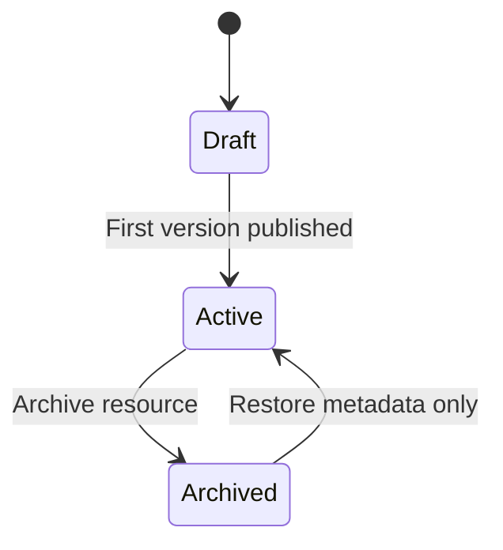
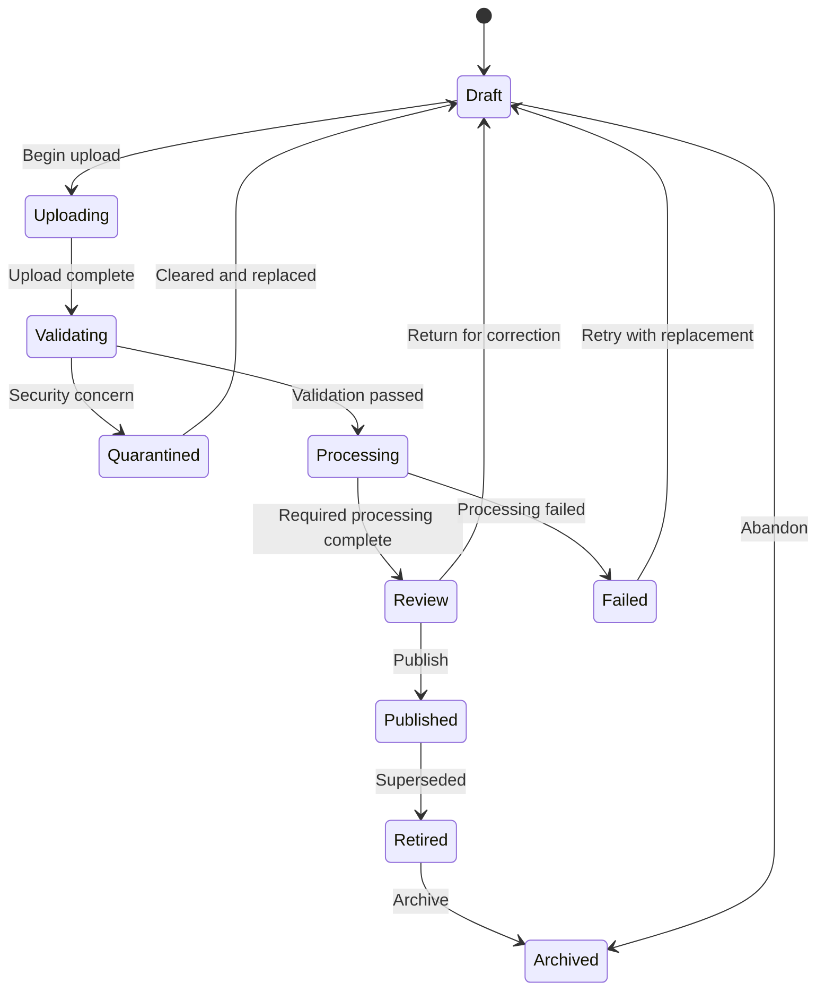

# Phase 2 Sprint 2.3 — Learning Resource Domain Implementation Plan

**Platform:** Clasptek Prep Portal V2  
**Release:** `v1.3.0-learning-resource-domain`  
**Bounded Context:** Learning Resource  
**Domain Classification:** Core Supporting Domain  
**Upstream Domains:** Platform Foundation, Exam Product, Curriculum  
**Migrations:** `00130_resource_core.sql` through `00139_resource_rls.sql`  
**Document Status:** Architecture Baseline Candidate  
**Document Revision:** 1.0

---

# 1. Executive Objective

The Learning Resource Domain establishes the enterprise Digital Learning Resource Management System responsible for governing every reusable educational asset used throughout Clasptek Prep Portal V2.

It answers:

> What learning resources exist, which immutable version is approved, where are the underlying files or external assets located, who may access them, and which authorised platform domains consume them?

The domain is the canonical source of truth for:

- Resource identity
- Resource variants
- Resource versions
- Educational classification
- Technical format
- Storage references
- Content integrity
- Security status
- Publication status
- Localisation
- Accessibility variants
- Collections
- Tags and categories
- Permissions
- Previews
- Operational usage references
- Resource relationships
- Storage quota enforcement
- Resource lifecycle history

The Curriculum Domain may reference Learning Resource versions but does not own files, storage policies, previews, checksums, or resource publication.

---

# 2. Strategic Domain Position

```text
Platform Foundation
        │
        ▼
Exam Product Domain
        │
        ▼
Curriculum Domain
        │
        ▼
Learning Resource Domain
        │
        ├── Resource Catalogue
        ├── Variants and Versions
        ├── Storage and Integrity
        ├── Metadata and Localisation
        ├── Access Policies
        ├── Collections
        ├── Preview Processing
        └── Usage Projections
        │
        ▼
Diagnostic / Learning Workspace / Practice / Mock / Results / AI Coach
```

The Learning Resource Domain owns reusable educational assets.

Consumer domains own the relationships that attach those assets to their own aggregates.

Examples:

- Curriculum owns lesson-to-resource references.
- Practice will own practice-session-to-resource references.
- Mock will own mock-to-resource references.
- Question Bank will own explanation-to-resource references.

The Learning Resource Domain validates those references and maintains reverse-usage projections through domain events, but it must not take ownership of consumer-domain relationships.

---

# 3. Scope

## 3.1 Included

- Learning Resources
- Resource Variants
- Resource Versioning
- Resource Technical Formats
- Educational Resource Types
- Categories
- Tags
- Collections
- Resource-to-resource relationships
- Resource metadata
- Localised catalogue metadata
- Localised file variants
- Accessibility variants
- Supabase Storage integration
- Upload sessions
- Storage objects
- File integrity
- Checksums
- MIME validation
- File-extension validation
- Resource validation
- Security scanning integration contract
- Quarantine workflow
- Preview generation
- Thumbnail generation
- External URL resources
- Resource publication workflow
- Resource permissions
- Secure signed access
- Operational storage quotas
- Duplicate detection
- Broken-link detection
- Reverse-usage projections
- Administration console
- REST APIs
- Domain events
- Automated tests
- Architecture fitness rules

## 3.2 Excluded

- Courses
- Modules
- Lessons
- Skills
- Learning Paths
- Assessment Blueprints
- Practice Questions
- Question Bank ownership
- Mock Examinations
- Student progress
- Student enrolment
- Student downloads history
- Student viewing history
- Student engagement analytics
- Assessment results
- AI evaluation
- AI grading
- Learning analytics
- Student submissions
- Digital rights payment processing

---

# 4. Critical Architecture Decisions

## 4.1 Resource Identity Is Separate from Physical Storage

A Learning Resource is a conceptual educational asset.

A Storage Object is a physical object stored through a provider.

These must not be treated as the same entity.

Example:

```text
Learning Resource
"IELTS Writing Task 2 Guide"
        │
        ├── English Standard Variant
        │       ├── Version 1 PDF
        │       └── Version 2 PDF
        │
        ├── French Translation Variant
        │       └── Version 1 PDF
        │
        └── Accessible Variant
                └── Tagged PDF Version 1
```

A Resource Version may use one or more Storage Objects:

- Primary file
- Thumbnail
- Captions
- Transcript
- Supplementary file
- Poster image
- Source file

## 4.2 Consumer Domains Own Their Links

Do not use a generic authoritative table such as:

```text
resource_relationships
target_type
target_id
```

to own links to Lessons, Activities, Practice Sessions, Mock Exams, or Questions.

Generic polymorphic links cannot provide reliable database foreign keys and would allow the Learning Resource Domain to control another aggregate’s relationship.

Instead:

- Curriculum owns `resource_references` and its lesson/activity/assignment mappings.
- Future domains own equivalent reference tables.
- The Resource Domain exposes reference-validation APIs.
- Consumer domains emit `ResourceReferenceAttached` and `ResourceReferenceRemoved`.
- The Resource Domain consumes those events into a rebuildable usage projection.

`resource_relationships` is reserved for resource-to-resource relationships only.

## 4.3 All Delivery Buckets Are Private by Default

Resource access must not depend on publicly readable Supabase buckets.

Even resources marked `public` in business metadata should normally be served through an authorised delivery endpoint, signed URL, or controlled CDN route.

This provides:

- Revocation
- Expiring access
- Usage-policy enforcement
- Consistent audit
- Restricted answer-key protection
- Future enrolment-aware access

## 4.4 Storage Buckets Follow Security and Lifecycle, Not File Extension

Do not create one canonical bucket for every MIME family.

Bucket-per-format designs duplicate policies and make movement between states difficult.

Use these production buckets:

```text
resource-ingest
resource-private
resource-restricted
resource-previews
resource-public-delivery
```

All buckets remain private unless an explicit infrastructure decision approves a public-delivery bucket.

Use object-path prefixes for formats:

```text
documents/
videos/
audio/
images/
worksheets/
presentations/
transcripts/
answer-keys/
sample-responses/
interactive/
archives/
```

This keeps security policy separate from resource format.

## 4.5 Published Resource Versions Are Immutable

A Published Resource Version may not be replaced in place.

Any content, file, metadata, checksum, localisation, permission, or primary-preview change requiring historical reproducibility creates a new Resource Version.

## 4.6 Usage Tracking Is Operational, Not Student Analytics

`Resource Usage` in this sprint means:

- Which domain references a Resource Version
- Whether a reference is active
- Whether the consumer still exists
- Whether a resource is unused
- Whether a reference is broken

It does not mean:

- Which student opened a resource
- Download counts by student
- Watch time
- Completion percentage
- Engagement analytics

## 4.7 Resource Formats and Educational Types Are Different

Technical formats:

- PDF
- MP4
- MP3
- PPTX
- DOCX
- XLSX
- CSV
- PNG
- JPEG
- ZIP
- HTML
- External URL

Educational types:

- Worksheet
- Grammar Note
- Vocabulary List
- Reading Passage
- Listening Audio
- Writing Sample
- Speaking Cue Card
- Formula Sheet
- Teacher Guide
- Student Guide
- Reference Article
- Transcript
- Answer Key
- Sample Response

A resource has both a technical format and an educational purpose.

## 4.8 Preview Processing Is Asynchronous but Publication-Safe

Preview generation may occur asynchronously.

However, resources requiring a preview cannot be Published until the required preview is successfully generated and validated.

## 4.9 Service-Role Storage Credentials Never Reach the Client

The browser may receive only:

- Short-lived signed upload instructions
- Short-lived signed access URLs
- Non-sensitive public metadata

All provider administration and policy enforcement occurs server-side.

---

# 5. Dependency Architecture

```text
packages/kernel
packages/contracts/exam-product
packages/contracts/curriculum
packages/contracts/learning-resource
packages/domain/learning-resource
packages/application/learning-resource
packages/infrastructure/learning-resource
apps/web
```

## 5.1 Allowed Dependencies

The Learning Resource Domain may depend on:

- Kernel value primitives
- Stable identity contracts
- Platform audit and event contracts
- Stable Curriculum reference contracts

## 5.2 Prohibited Dependencies

The domain package must not import:

- Supabase SDK
- PostgreSQL libraries
- React
- Next.js
- HTTP libraries
- Storage-provider SDKs
- Curriculum persistence models
- Practice packages
- Mock packages
- Student packages
- Results packages
- AI packages

## 5.3 Required Ports

Create application ports:

- `ObjectStoragePort`
- `SignedAccessPort`
- `MimeInspectionPort`
- `ChecksumPort`
- `SecurityScanPort`
- `PreviewGenerationPort`
- `ExternalLinkValidationPort`
- `ResourceReferenceValidationPort`
- `StorageQuotaPort`
- `ResourceUsageEventReader`
- `Clock`
- `TransactionManager`

---

# 6. Canonical Domain Model

```text
Learning Resource
├── Resource Variants
│   └── Resource Versions
│       ├── Version Storage Objects
│       ├── Checksums
│       ├── Metadata
│       ├── Localised Metadata
│       ├── Validation Results
│       ├── Security Scan Results
│       ├── Previews
│       ├── Permissions
│       └── Publication History
├── Categories
├── Tags
├── Resource Relationships
└── Current Published Version per Variant

Resource Collection
├── Collection Hierarchy
└── Ordered Resource Membership

Storage Asset
├── Upload Session
├── Storage Object
├── Integrity State
└── Processing Jobs

Resource Usage Projection
└── Reverse references from consumer domains
```

---

# 7. Aggregate Design

The bounded context contains four aggregate roots.

## 7.1 LearningResource Aggregate

Controls:

- Stable resource identity
- Code
- Slug
- Canonical title
- Educational type
- Category
- Sensitivity
- Lifecycle
- Resource variants
- Current default Published version
- Archive state

It must not load all binaries, previews, permission grants, and usage records into memory.

## 7.2 ResourceVersion Aggregate

Controls:

- Immutable version identity
- Variant identity
- Version number
- Draft metadata
- Technical format
- Storage-object roles
- Integrity requirements
- Validation state
- Review state
- Publication state
- Localisation metadata
- Required previews
- Version permissions
- Publication readiness

## 7.3 ResourceCollection Aggregate

Controls:

- Collection identity
- Collection hierarchy
- Membership ordering
- Collection lifecycle
- Collection localisation
- Collection-level permissions

## 7.4 StorageAsset Aggregate

Controls:

- Upload session
- Object reservation
- Object state
- Storage provider
- Bucket and path
- Size
- MIME result
- Checksum result
- Security-scan result
- Quarantine state
- Promotion into delivery storage

This aggregate prevents storage-ingestion operations from overloading ResourceVersion.

## 7.5 Aggregate Boundary Protection

Never load:

```text
Resource
└── Every Version
    └── Every Storage Object
        └── Every Preview
            └── Every Permission
                └── Every Usage Reference
```

as one aggregate.

Publication is an application-level orchestration across current authoritative projections and repositories.

---

# 8. Lifecycle State Machines

## 8.1 Learning Resource Lifecycle



Restoring an Archived Resource does not automatically republish any Retired or Archived version.

## 8.2 Resource Version Lifecycle



## 8.3 External URL Version Lifecycle

External URL resources bypass file upload but must pass:

- URL validation
- Allowed-protocol validation
- Redirect validation
- Reachability check
- Content-type inspection where available
- Security-provider policy
- Review

## 8.4 Storage Object Lifecycle

```text
Reserved
→ Uploading
→ Uploaded
→ Inspecting
→ Quarantined or Validated
→ Promoting
→ Available
→ Retained
→ DeletionPending
→ Deleted
```

No client may set these states directly.

---

# 9. Resource Versioning Rules

1. Version numbers are unique within a Resource Variant.
2. Published versions are immutable.
3. A new primary file requires a new Resource Version.
4. A changed checksum requires a new Resource Version.
5. A changed language or accessibility purpose creates a new Variant, not a new version of a different-language asset.
6. Correcting Draft metadata does not require a new version.
7. Correcting Published catalogue text that changes meaning requires a new version.
8. A Resource Variant may have only one current Published version.
9. Publishing a new version retires the previous Published version in the same transaction.
10. Historical consumer references remain pinned to exact version IDs unless the consumer deliberately upgrades them.
11. Storage Objects cannot be deleted while referenced by any non-deleted Resource Version.
12. Physical deduplication must not merge permission or lifecycle identities.

---

# 10. Database Migration Strategy

Create:

```text
00130_resource_core.sql
00131_resource_versions.sql
00132_resource_storage.sql
00133_resource_metadata.sql
00134_resource_tags_collections.sql
00135_resource_permissions.sql
00136_resource_localization.sql
00137_resource_processing_previews.sql
00138_resource_usage_projections.sql
00139_resource_rls.sql
```

If timestamp migrations are used, preserve this dependency order.

## 10.1 `00130_resource_core.sql`

Creates:

- `resource_types`
- `resource_formats`
- `resource_type_format_rules`
- `resource_categories`
- `learning_resources`
- `resource_variants`
- `resource_relationships`

## 10.2 `00131_resource_versions.sql`

Creates:

- `resource_versions`
- `resource_publish_history`
- `resource_version_dependencies`
- `resource_licenses`
- `external_resource_locations`

## 10.3 `00132_resource_storage.sql`

Creates:

- `upload_sessions`
- `storage_objects`
- `resource_version_objects`
- `resource_checksums`
- `storage_quota_policies`
- `storage_quota_reservations`
- `storage_usage_ledger`

## 10.4 `00133_resource_metadata.sql`

Creates:

- `resource_metadata_definitions`
- `resource_metadata`
- `resource_validation_results`

## 10.5 `00134_resource_tags_collections.sql`

Creates:

- `resource_tags`
- `resource_tag_map`
- `resource_collections`
- `resource_collection_translations`
- `collection_resources`

## 10.6 `00135_resource_permissions.sql`

Creates:

- `resource_access_policies`
- `resource_access_grants`
- `collection_access_policies`
- `collection_access_grants`

## 10.7 `00136_resource_localization.sql`

Creates:

- `resource_locales`
- `resource_localizations`
- `resource_variant_localizations`

## 10.8 `00137_resource_processing_previews.sql`

Creates:

- `resource_ingestion_jobs`
- `resource_processing_jobs`
- `resource_security_scan_results`
- `resource_previews`
- `resource_preview_objects`
- `external_link_checks`

## 10.9 `00138_resource_usage_projections.sql`

Creates the rebuildable `resource_read` schema and:

- `resource_summary_projection`
- `resource_search_projection`
- `resource_usage_projection`
- `resource_duplicate_projection`
- `resource_broken_link_projection`
- `resource_storage_health_projection`
- `resource_processing_queue_projection`
- `resource_collection_tree_projection`

## 10.10 `00139_resource_rls.sql`

Creates:

- RLS policies
- Published-read policies
- Authoring policies
- Storage-administration policies
- Restricted-resource policies
- Collection policies
- Projection read policies
- Published-version immutability protections

## 10.11 Migration Rules

Every migration must be:

- Independently reviewable
- Covered by migration tests
- Transactional where supported
- Safe after all preceding migrations
- Unable to alter frozen Curriculum or Exam Product tables
- Documented with rollback or forward-fix guidance
- Deterministic across CI, staging, and production

Production recovery should normally use forward-fix migrations rather than deleting Published resource history.

---

# 11. Common Database Columns

Every mutable source-of-truth table shall include the appropriate form of:

```sql
id uuid primary key default gen_random_uuid(),

status text not null,

version_no integer not null default 1,
lock_version bigint not null default 0,

created_at timestamptz not null default now(),
created_by uuid null references auth.users(id),

updated_at timestamptz not null default now(),
updated_by uuid null references auth.users(id),

deleted_at timestamptz null,
deleted_by uuid null references auth.users(id)
```

Append-only history, ledger, and event-derived projection tables may use a more specialised immutable structure.

---

# 12. Database Inventory

The baseline contains **42 source-of-truth tables** and **8 rebuildable read projections**.

## 12.1 Core and Version Tables

1. `resource_types`
2. `resource_formats`
3. `resource_type_format_rules`
4. `resource_categories`
5. `learning_resources`
6. `resource_variants`
7. `resource_relationships`
8. `resource_versions`
9. `resource_publish_history`
10. `resource_version_dependencies`
11. `resource_licenses`
12. `external_resource_locations`

## 12.2 Storage and Integrity Tables

13. `upload_sessions`
14. `storage_objects`
15. `resource_version_objects`
16. `resource_checksums`
17. `storage_quota_policies`
18. `storage_quota_reservations`
19. `storage_usage_ledger`

## 12.3 Metadata and Validation Tables

20. `resource_metadata_definitions`
21. `resource_metadata`
22. `resource_validation_results`

## 12.4 Tag and Collection Tables

23. `resource_tags`
24. `resource_tag_map`
25. `resource_collections`
26. `resource_collection_translations`
27. `collection_resources`

## 12.5 Permission Tables

28. `resource_access_policies`
29. `resource_access_grants`
30. `collection_access_policies`
31. `collection_access_grants`

## 12.6 Localisation Tables

32. `resource_locales`
33. `resource_localizations`
34. `resource_variant_localizations`

## 12.7 Processing and Preview Tables

35. `resource_ingestion_jobs`
36. `resource_processing_jobs`
37. `resource_security_scan_results`
38. `resource_previews`
39. `resource_preview_objects`
40. `external_link_checks`

## 12.8 Operational Tables

41. `resource_reference_events`
42. `resource_access_issuance_log`

## 12.9 Rebuildable Projections

43. `resource_summary_projection`
44. `resource_search_projection`
45. `resource_usage_projection`
46. `resource_duplicate_projection`
47. `resource_broken_link_projection`
48. `resource_storage_health_projection`
49. `resource_processing_queue_projection`
50. `resource_collection_tree_projection`

---

# 13. Resource Catalogue Tables

## 13.1 `resource_types`

Educational purpose catalogue.

```text
id
code
name
description
category
default_sensitivity
requires_preview
requires_download
status
version_no
lock_version
audit columns
soft-delete columns
```

Initial types:

- worksheet
- grammar_note
- vocabulary_list
- reading_passage
- listening_audio
- writing_sample
- speaking_cue_card
- math_formula_sheet
- teacher_guide
- student_guide
- reference_article
- transcript
- answer_key
- sample_response
- slide_deck
- interactive_activity
- source_document
- custom

## 13.2 `resource_formats`

Technical format catalogue.

```text
id
code
name
format_family
canonical_mime_type
allowed_extensions_json
supports_preview
supports_streaming
supports_download
maximum_size_bytes
security_profile
status
version_no
lock_version
audit columns
soft-delete columns
```

Initial formats:

- pdf
- video
- audio
- powerpoint
- word
- excel
- csv
- image
- zip
- html
- text
- external_url

## 13.3 `resource_type_format_rules`

Defines allowed educational-type and technical-format combinations.

```text
id
resource_type_id
resource_format_id
is_allowed
is_recommended
requires_preview
requires_security_scan
maximum_size_override_bytes
status
version_no
lock_version
audit columns
soft-delete columns
```

Example:

- `listening_audio` allows audio and video.
- `answer_key` allows PDF, Word, image, and text.
- `interactive_activity` allows approved HTML packages or external URLs.
- `reading_passage` allows PDF, Word, HTML, and text.

## 13.4 `resource_categories`

Hierarchical catalogue classification.

```text
id
parent_category_id
code
name
description
display_order
status
version_no
lock_version
audit columns
soft-delete columns
```

No circular category hierarchy.

## 13.5 `learning_resources`

Stable conceptual identity.

```text
id
code
slug
canonical_title
canonical_description
resource_type_id
primary_category_id
sensitivity
visibility
owner_organization_id
default_language_code
status
current_default_variant_id
lock_version
audit columns
soft-delete columns
```

Supported sensitivity values:

- normal
- internal
- instructor_only
- restricted
- confidential

Supported visibility values:

- private
- organization
- authenticated
- controlled_public

Constraints:

- Unique active code
- Unique active slug
- Code immutable after first publication
- Answer keys default to `instructor_only` or stricter
- Sample responses follow policy-defined sensitivity

## 13.6 `resource_variants`

Represents language, region, accessibility, or delivery variants.

```text
id
learning_resource_id
code
language_code
region_code
accessibility_profile
variant_purpose
is_default
status
current_published_version_id
current_version_no
lock_version
audit columns
soft-delete columns
```

Supported variant purposes:

- standard
- translation
- accessible
- low_bandwidth
- instructor
- student
- print
- screen
- custom

Constraints:

- Unique active variant code per Resource
- Exactly one default active variant
- One current Published version per variant

## 13.7 `resource_relationships`

Resource-to-resource relationships only.

```text
id
source_resource_id
target_resource_id
relationship_type
is_directional
rationale
status
version_no
lock_version
audit columns
soft-delete columns
```

Supported relationships:

- companion_to
- transcript_of
- answer_key_for
- sample_response_for
- teacher_guide_for
- student_version_of
- translation_family
- replaces
- derived_from
- prerequisite_resource
- supplementary_to

Rules:

- No self-reference
- No circular `replaces`
- Restricted child resources cannot weaken parent security policy

---

# 14. Resource Version Tables

## 14.1 `resource_versions`

```text
id
resource_variant_id
version_no
status
title
description
resource_format_id
version_label
change_summary
source_attribution
copyright_owner
copyright_year
license_id
estimated_study_minutes
requires_preview
allows_download
allows_streaming
effective_from
effective_to
reviewed_at
reviewed_by
published_at
published_by
retired_at
retired_by
lock_version
audit columns
soft-delete columns
```

Constraints:

- Unique `(resource_variant_id, version_no)`
- Published immutable
- Effective date range valid
- One Published version per variant
- External URL versions must have one active external location
- File-backed versions must have one primary available Storage Object

## 14.2 `resource_publish_history`

Append-only.

```text
id
learning_resource_id
resource_variant_id
resource_version_id
action
from_status
to_status
publication_number
validation_snapshot_json
security_snapshot_json
storage_snapshot_json
performed_at
performed_by
correlation_id
```

Actions:

- submitted_for_review
- returned_to_draft
- quarantined
- cleared
- published
- retired
- archived

## 14.3 `resource_version_dependencies`

Pins required dependent assets.

```text
id
resource_version_id
dependent_resource_version_id
dependency_type
is_required
minimum_status
status
version_no
lock_version
audit columns
soft-delete columns
```

Examples:

- Video requires captions.
- Listening audio requires transcript.
- Worksheet requires answer key for instructor use.
- Interactive HTML requires approved supporting package.

## 14.4 `resource_licenses`

```text
id
code
name
description
license_type
license_url
allows_distribution
allows_modification
requires_attribution
expires
status
version_no
lock_version
audit columns
soft-delete columns
```

## 14.5 `external_resource_locations`

```text
id
resource_version_id
canonical_url
display_url
provider_name
provider_resource_id
allowed_domains_policy
open_in_new_window
requires_authentication
last_validated_at
last_http_status
last_content_type
status
version_no
lock_version
audit columns
soft-delete columns
```

Allowed protocols:

- `https`
- approved custom provider schemes only

Block:

- `javascript:`
- `data:` unless explicitly approved
- local file schemes
- private-network targets
- unsafe redirect chains

---

# 15. Storage and Integrity Model

## 15.1 Object Path Convention

Use opaque identifiers:

```text
org/{organization_id}/resource/{resource_id}/variant/{variant_id}/version/{version_id}/object/{storage_object_id}/{role}
```

Do not use user-supplied filenames as authoritative object paths.

Store original filename only as metadata.

## 15.2 `upload_sessions`

```text
id
organization_id
resource_version_id
requested_format_id
original_filename
declared_mime_type
declared_size_bytes
reserved_bytes
target_bucket
target_object_path
signed_upload_expires_at
upload_status
completed_at
lock_version
audit columns
soft-delete columns
```

Upload statuses:

- requested
- authorised
- uploading
- uploaded
- expired
- cancelled
- failed

## 15.3 `storage_objects`

```text
id
storage_provider
bucket_name
object_path
provider_object_id
original_filename
detected_mime_type
detected_extension
size_bytes
etag
storage_class
integrity_status
security_status
availability_status
uploaded_at
validated_at
promoted_at
retention_until
lock_version
audit columns
soft-delete columns
```

Supported storage providers:

- supabase_storage
- s3_compatible
- external_managed
- future_provider

## 15.4 `resource_version_objects`

Maps Storage Objects to a Resource Version.

```text
id
resource_version_id
storage_object_id
object_role
display_order
is_required
status
version_no
lock_version
audit columns
soft-delete columns
```

Object roles:

- primary
- source
- supplementary
- captions
- transcript
- poster
- thumbnail
- attachment
- package_manifest

## 15.5 `resource_checksums`

```text
id
storage_object_id
algorithm
checksum_value
is_primary
verified_at
verification_source
status
```

Required algorithm:

- SHA-256

Optional future algorithms:

- perceptual image hash
- audio fingerprint
- video fingerprint
- canonical URL hash

## 15.6 Physical Deduplication

Exact byte duplicates may reuse one immutable Storage Object if:

- SHA-256 matches
- Size matches
- Detected MIME matches
- Security status is cleared
- Retention and legal policies are compatible

Resource identities and permissions remain separate.

Storage deletion is blocked until no active Resource Version references the object.

## 15.7 `storage_quota_policies`

```text
id
organization_id
policy_code
maximum_total_bytes
maximum_single_object_bytes
maximum_monthly_ingest_bytes
warning_threshold_percentage
hard_limit_enabled
status
version_no
lock_version
audit columns
soft-delete columns
```

## 15.8 `storage_quota_reservations`

Temporary upload reservations.

```text
id
organization_id
upload_session_id
reserved_bytes
expires_at
released_at
status
```

## 15.9 `storage_usage_ledger`

Append-only operational quota ledger.

```text
id
organization_id
storage_object_id
event_type
bytes_delta
occurred_at
correlation_id
```

This is storage accounting, not student analytics.

---

# 16. Metadata and Validation

## 16.1 `resource_metadata_definitions`

Defines validated metadata keys.

```text
id
namespace
metadata_key
name
description
value_type
validation_schema_json
applies_to_resource_type_id
is_required
is_searchable
is_public
status
version_no
lock_version
audit columns
soft-delete columns
```

Examples:

- `academic.reading_level`
- `audio.duration_seconds`
- `video.duration_seconds`
- `document.page_count`
- `accessibility.has_captions`
- `accessibility.screen_reader_ready`
- `curriculum.intended_level`
- `copyright.attribution_text`

## 16.2 `resource_metadata`

```text
id
resource_version_id
metadata_definition_id
metadata_value_json
status
version_no
lock_version
audit columns
soft-delete columns
```

Business-critical data must remain in relational columns.

## 16.3 `resource_validation_results`

Append-only validation results.

```text
id
resource_version_id
storage_object_id
validation_type
validator_name
validator_version
result_status
severity
code
message
details_json
validated_at
correlation_id
```

Validation types:

- mime
- extension
- size
- checksum
- archive_structure
- document_integrity
- media_integrity
- external_url
- accessibility
- preview_requirement
- metadata_completeness
- publication_readiness

Severities:

- info
- warning
- blocking
- security

---

# 17. Tags and Collections

## 17.1 `resource_tags`

```text
id
code
name
description
tag_group
status
version_no
lock_version
audit columns
soft-delete columns
```

## 17.2 `resource_tag_map`

```text
id
learning_resource_id
resource_tag_id
status
version_no
lock_version
audit columns
soft-delete columns
```

## 17.3 `resource_collections`

```text
id
parent_collection_id
code
slug
name
description
collection_type
visibility
owner_organization_id
display_order
status
lock_version
audit columns
soft-delete columns
```

Collection types:

- curated
- programme
- instructor
- departmental
- campaign
- archive
- custom

No circular collection hierarchy.

## 17.4 `resource_collection_translations`

Locale-specific collection title and description.

## 17.5 `collection_resources`

```text
id
resource_collection_id
learning_resource_id
resource_variant_id
resource_version_id
pinning_policy
display_order
is_featured
status
version_no
lock_version
audit columns
soft-delete columns
```

Pinning policies:

- exact_version
- current_published_variant
- current_default_published

Public or instructional consumers should prefer exact versions for reproducibility.

---

# 18. Permissions and Access Control

## 18.1 Access Model

Permissions combine:

- Resource sensitivity
- Resource visibility
- Resource policy
- Explicit grants
- Authenticated subject
- Organisation boundary
- Consumer-domain context
- Requested action
- Version lifecycle status

Supported actions:

- metadata_read
- preview
- stream
- download
- reference
- edit
- manage_permissions
- review
- publish
- archive
- delete_storage

## 18.2 `resource_access_policies`

```text
id
learning_resource_id
resource_variant_id
resource_version_id
policy_name
visibility
allow_preview
allow_stream
allow_download
requires_authentication
requires_enrolment_context
expires_at
condition_json
status
version_no
lock_version
audit columns
soft-delete columns
```

Policies may apply at Resource, Variant, or Version level.

More specific policies cannot weaken a higher sensitivity classification without authorised override.

## 18.3 `resource_access_grants`

```text
id
resource_access_policy_id
subject_type
subject_id
permission
effect
valid_from
valid_until
status
version_no
lock_version
audit columns
soft-delete columns
```

Subject types:

- user
- role
- organization
- platform_service
- future_cohort_contract
- future_enrolment_contract

Effects:

- allow
- deny

Explicit deny wins.

## 18.4 Collection Permissions

Collections use equivalent policy and grant tables.

Collection membership never automatically weakens a Resource’s own policy.

Effective access is the intersection of collection and Resource policies.

## 18.5 Signed Access

A signed access request must:

1. Authenticate the requester.
2. Load the exact Published Resource Version.
3. Evaluate policy.
4. Verify Storage Object availability.
5. Determine allowed action.
6. Issue a short-lived signed URL.
7. Record an operational issuance event.
8. Never persist the signed URL.

Recommended maximum TTLs:

- Preview: 5–15 minutes
- Stream: 5–15 minutes
- Download: policy-defined, normally 5–10 minutes
- Upload: 10–30 minutes

TTL values remain configurable.

`resource_access_issuance_log` is an operational security log, not student engagement history.

---

# 19. Localisation and Accessibility

## 19.1 `resource_locales`

```text
id
learning_resource_id
language_code
is_default
is_required
translation_status
status
version_no
lock_version
audit columns
soft-delete columns
```

## 19.2 `resource_localizations`

Localises catalogue metadata.

```text
id
learning_resource_id
language_code
localized_title
localized_description
localized_keywords_json
source_language_code
translation_method
translation_status
reviewed_at
reviewed_by
status
version_no
lock_version
audit columns
soft-delete columns
```

## 19.3 `resource_variant_localizations`

Localises Variant-level labels and usage notes.

Actual translated files are separate Resource Variants.

## 19.4 Accessibility Profiles

Supported profiles:

- standard
- captions
- transcript
- tagged_pdf
- screen_reader
- high_contrast
- large_text
- low_bandwidth
- audio_description
- sign_language
- custom

Accessibility metadata does not claim compliance unless validated.

## 19.5 Locale Fallback

1. Requested locale
2. Closest supported parent locale
3. Resource default locale
4. Platform default locale
5. Canonical source text

---

# 20. Ingestion, Processing, and Security

## 20.1 Upload Workflow

```text
Request Upload
→ Check permission
→ Check format rule
→ Reserve quota
→ Create Upload Session
→ Issue signed upload
→ Client uploads to resource-ingest
→ Confirm upload
→ Server inspects object
→ Compute checksum
→ Validate MIME and extension
→ Run security scan
→ Detect duplicate
→ Generate metadata
→ Generate preview
→ Promote to delivery bucket
→ Submit for review
```

## 20.2 Quarantine Rules

An object is quarantined when:

- Security scan is suspicious
- MIME does not match allowed format
- Archive contains unsafe file types
- Interactive HTML violates policy
- Object is encrypted when encryption is not allowed
- Object cannot be inspected
- Checksum changes unexpectedly
- External provider flags the object

Quarantined objects:

- Cannot be previewed
- Cannot be signed for access
- Cannot be Published
- Cannot be linked by consumer domains
- Require authorised review or replacement

## 20.3 `resource_ingestion_jobs`

Tracks ingestion orchestration.

```text
id
upload_session_id
resource_version_id
job_status
current_stage
attempt_count
last_error_code
last_error_message
started_at
completed_at
correlation_id
```

## 20.4 `resource_processing_jobs`

```text
id
resource_version_id
storage_object_id
job_type
job_status
priority
attempt_count
next_attempt_at
processor_name
processor_version
result_json
last_error_code
last_error_message
started_at
completed_at
correlation_id
```

Job types:

- mime_inspection
- checksum
- security_scan
- metadata_extraction
- thumbnail
- document_preview
- audio_waveform
- video_poster
- captions_validation
- transcript_validation
- archive_manifest
- external_link_check

## 20.5 `resource_security_scan_results`

Append-only.

```text
id
storage_object_id
scanner_name
scanner_version
signature_version
scan_status
threat_name
severity
details_json
scanned_at
correlation_id
```

A security scanning adapter must exist in this sprint even if the first deployment uses a controlled “not configured” provider.

Production publication policy must define whether an unavailable scanner blocks publication.

## 20.6 Archive and Interactive Content Rules

ZIP and interactive HTML are high-risk formats.

Requirements:

- Upload only to ingest bucket
- Extract and inspect in an isolated processor
- Reject executable files
- Reject path traversal
- Limit decompressed size
- Limit nested archive depth
- Validate manifest
- Sandbox interactive HTML
- Apply strict Content Security Policy
- Prevent arbitrary network access unless approved
- Never serve untrusted HTML from the main application origin

---

# 21. Preview Model

## 21.1 `resource_previews`

```text
id
resource_version_id
preview_type
preview_status
generator_name
generator_version
page_number
time_offset_seconds
width
height
duration_seconds
is_primary
generated_at
lock_version
audit columns
soft-delete columns
```

Preview types:

- thumbnail
- document_page
- image
- audio_waveform
- audio_sample
- video_poster
- video_sample
- text_excerpt
- slide_image
- archive_manifest
- external_link_card

## 21.2 `resource_preview_objects`

Maps preview definitions to Storage Objects.

## 21.3 Initial Preview Support

Sprint 2.3 should implement:

- Image thumbnail
- PDF first-page or configured-page preview
- PowerPoint slide image where supported
- Video poster image
- Audio waveform image
- Text excerpt
- External-link metadata card
- ZIP manifest summary

Advanced transcoding may remain a future processor.

---

# 22. Duplicate Detection

## 22.1 Exact Duplicates

Exact duplicate detection uses:

- SHA-256
- Object size
- Detected MIME
- Optional canonical document normalisation

## 22.2 Near Duplicates

The architecture reserves support for:

- Image perceptual hashes
- Audio fingerprints
- Video fingerprints
- Text similarity
- Canonical URL comparison

Near-duplicate detection may begin as a projection without blocking publication.

## 22.3 Duplicate Policies

A detected duplicate may result in:

- Reuse existing Storage Object
- Create separate Resource identity with shared object
- Link as replacement
- Reject upload
- Flag for administrator review

The policy must never silently overwrite an existing Published version.

---

# 23. Cross-Domain Reference Contract

## 23.1 Reference Payload

Consumer domains store:

```text
resource_id
resource_variant_id
resource_version_id
reference_purpose
is_required
```

Published consumer definitions should pin exact `resource_version_id`.

## 23.2 Reference Validation

Expose:

```text
ValidateResourceReference
```

Validation confirms:

- Resource exists
- Version exists
- Version is Published
- Version is not quarantined
- Storage is available
- Consumer service may reference it
- Sensitivity is compatible
- Required permission can be granted

## 23.3 Consumer-Owned Links

Examples:

```text
Curriculum:
lesson_resources
activity_resources
assignment_resources

Future Practice:
practice_resource_references

Future Mock:
mock_resource_references

Future Question Bank:
question_explanation_resources
```

## 23.4 Reverse Usage

Consumer domains emit:

- `ResourceReferenceAttached`
- `ResourceReferenceUpdated`
- `ResourceReferenceRemoved`
- `ResourceConsumerArchived`

The Resource Domain stores events in `resource_reference_events` and projects them into `resource_usage_projection`.

The projection supports:

- Find resources used by a Lesson
- Find resources used by a Curriculum
- Find unused resources
- Find broken references
- Prevent unsafe deletion
- Display usage reports

The projection is not the owner of the consumer relationship.

---

# 24. Read Projection Layer

Create a dedicated:

```text
resource_read
```

schema.

## 24.1 `resource_summary_projection`

Contains:

- Resource identity
- Default Variant
- Current Published Version
- Type
- Format
- Category
- Sensitivity
- Visibility
- Language
- Processing status
- Preview status
- Storage size
- Usage count
- Last update

## 24.2 `resource_search_projection`

Contains normalised searchable fields:

- Titles
- Descriptions
- Tags
- Categories
- Metadata
- Language
- Type
- Format
- Status
- Collection membership
- Search vector

## 24.3 `resource_usage_projection`

Contains reverse references by:

- Consumer domain
- Consumer aggregate type
- Consumer aggregate ID
- Consumer version ID
- Reference purpose
- Required flag
- Active state
- Last verified time

## 24.4 `resource_duplicate_projection`

Contains:

- Exact duplicate groups
- Near-duplicate candidates
- Shared Storage Objects
- Recommended resolution

## 24.5 `resource_broken_link_projection`

Contains:

- Missing Storage Objects
- Failed external URLs
- Removed consumer targets
- Missing required dependency resources
- Invalid preview references

## 24.6 `resource_storage_health_projection`

Contains:

- Total stored bytes
- Quota usage
- Orphaned objects
- Quarantined objects
- Retention state
- Deletion-pending objects
- Bucket health

## 24.7 `resource_processing_queue_projection`

Contains:

- Pending jobs
- Failed jobs
- Retry state
- Processing duration
- Blocked publication count

## 24.8 `resource_collection_tree_projection`

Contains:

- Collection hierarchy
- Ordered membership
- Localised labels
- Resource availability
- Permission summary

## 24.9 Projection Rules

- Projections are rebuildable.
- Projection handlers are idempotent.
- UI dashboards query projections.
- Commands never trust projections as authoritative.
- Publication validates source tables transactionally.
- Projection failure must not corrupt source data.
- Stale projections are visibly marked.

---

# 25. Core Business Rules

## 25.1 Resource Rules

1. Resource code is unique.
2. Resource code becomes immutable after first publication.
3. Every Resource has at least one Variant before publication.
4. Every file-backed Published Version has a primary available Storage Object.
5. Every external Published Version has a validated External Location.
6. Published Versions are immutable.
7. Archived Resources cannot accept new versions until restored.
8. Restricted resources cannot be downgraded by collection membership.
9. Resource deletion is soft by default.
10. Storage deletion requires zero active references and completed retention policy.

## 25.2 Variant Rules

1. Every Variant belongs to one Resource.
2. Variant code is unique within a Resource.
3. Exactly one default Variant is active.
4. Translations use separate Variants.
5. Accessibility alternatives use separate Variants where the underlying asset differs.
6. One current Published Version exists per Variant.

## 25.3 Storage Rules

1. Client-declared MIME is never trusted.
2. Detected MIME must match an allowed format rule.
3. Size must remain within format, policy, and quota limits.
4. SHA-256 is required before publication.
5. Quarantined objects are inaccessible.
6. Storage paths use opaque IDs.
7. No signed URL is persisted.
8. Orphaned uploaded objects are cleaned according to retention policy.
9. Shared Storage Objects cannot be removed while referenced.
10. Restricted assets use the restricted delivery bucket.

## 25.4 Preview Rules

1. Required previews must succeed before publication.
2. Preview inherits or strengthens parent security.
3. Preview cannot expose restricted full content.
4. Answer-key thumbnails must remain restricted.
5. Previews use independent Storage Objects.
6. Preview generation is version-specific.

## 25.5 Permission Rules

1. Explicit deny wins.
2. Exact-version policy overrides broader Resource policy only when it is stricter or specifically authorised.
3. Collection permissions cannot weaken Resource permissions.
4. Signed access requires current authorisation.
5. Direct bucket listing is prohibited for ordinary users.
6. Service-to-service reference validation uses scoped credentials.
7. Public metadata does not imply public file access.

## 25.6 Localisation Rules

1. Resource catalogue metadata has one default locale.
2. Actual translated assets are separate Variants.
3. Published localisation records are immutable with the Published version where meaning is version-specific.
4. Locale fallback is deterministic.
5. Missing optional translations generate warnings.
6. Accessibility claims require validation evidence.

## 25.7 Collection Rules

1. Collection hierarchy is acyclic.
2. Resource membership ordering is deterministic.
3. Exact-version pinning is preferred for Published instructional contexts.
4. Removing a resource from a collection does not archive the resource.
5. Archiving a collection does not archive its members.

## 25.8 Cross-Domain Rules

1. Consumer domains own their references.
2. Resource Domain never writes Curriculum, Practice, Mock, or Question Bank tables.
3. Usage projection is derived from events.
4. Resource deletion checks active reverse usage.
5. Broken consumer links generate operational findings.
6. Reverse-usage projection does not become the source of truth.

---

# 26. Resource Publication Specification

A Resource Version is publishable only when all blocking validations pass.

## 26.1 Identity

- Resource exists.
- Variant exists.
- Version is in Review.
- Version number is unique.
- Resource type and format are compatible.
- Effective dates are valid.

## 26.2 Storage

For file-backed versions:

- Primary Storage Object exists.
- Object is available.
- Object is in an approved delivery bucket.
- Size is valid.
- Detected MIME is valid.
- Extension is valid.
- SHA-256 is verified.
- Security status is cleared.
- Quota ledger is committed.
- No blocking integrity issue exists.

For external versions:

- HTTPS URL is valid.
- Redirect chain is safe.
- Latest link check passed.
- Provider policy is approved.

## 26.3 Processing

- Required metadata extraction completed.
- Required preview completed.
- Required captions or transcript completed.
- Required archive or interactive inspection completed.
- No failed blocking job exists.

## 26.4 Metadata

- Required metadata exists.
- Copyright and licence policy is satisfied.
- Attribution exists where required.
- Language is valid.
- Sensitivity is assigned.
- Visibility is assigned.
- Accessibility claims are supported.

## 26.5 Relationships

- Required dependent resources are Published.
- No invalid replacement cycle exists.
- Answer-key relationships preserve restricted access.
- Required transcript or captions relationships are valid.

## 26.6 Permissions

- Access policy exists.
- Restricted content has no public grant.
- Download policy is valid.
- Stream policy is valid.
- Organisation boundary is valid.

## 26.7 Review

- Reviewer approval exists.
- Publisher has `learning_resource.publish`.
- Validation report has no blocking finding.
- Security report has no unresolved concern.
- Audit identity exists.

## 26.8 Publication Transaction

Publishing must:

1. Lock Resource and Variant.
2. Revalidate source tables.
3. Retire previous Published Variant Version.
4. Publish the new Version.
5. Update current-version pointers.
6. Append publish history.
7. Emit domain events through the outbox.
8. Commit atomically.
9. Request projection rebuilds.

---

# 27. Domain Package

Create:

```text
packages/domain/learning-resource/
├── src/
│   ├── aggregates/
│   │   ├── learning-resource.aggregate.ts
│   │   ├── resource-version.aggregate.ts
│   │   ├── resource-collection.aggregate.ts
│   │   └── storage-asset.aggregate.ts
│   ├── entities/
│   │   ├── resource-variant.entity.ts
│   │   ├── resource-metadata.entity.ts
│   │   ├── resource-localization.entity.ts
│   │   ├── resource-relationship.entity.ts
│   │   ├── resource-preview.entity.ts
│   │   ├── storage-object.entity.ts
│   │   ├── access-policy.entity.ts
│   │   └── validation-result.entity.ts
│   ├── value-objects/
│   │   ├── resource-id.vo.ts
│   │   ├── resource-variant-id.vo.ts
│   │   ├── resource-version-id.vo.ts
│   │   ├── collection-id.vo.ts
│   │   ├── storage-object-id.vo.ts
│   │   ├── upload-session-id.vo.ts
│   │   ├── checksum.vo.ts
│   │   ├── mime-type.vo.ts
│   │   ├── language-code.vo.ts
│   │   ├── resource-code.vo.ts
│   │   ├── resource-status.vo.ts
│   │   ├── resource-version-status.vo.ts
│   │   ├── resource-visibility.vo.ts
│   │   ├── resource-sensitivity.vo.ts
│   │   ├── storage-provider.vo.ts
│   │   ├── object-path.vo.ts
│   │   └── file-size.vo.ts
│   ├── specifications/
│   │   ├── valid-mime-type.specification.ts
│   │   ├── resource-type-format.specification.ts
│   │   ├── resource-publishing.specification.ts
│   │   ├── storage-integrity.specification.ts
│   │   ├── duplicate-resource.specification.ts
│   │   ├── resource-localization.specification.ts
│   │   ├── resource-visibility.specification.ts
│   │   ├── no-circular-resource-relations.specification.ts
│   │   └── storage-deletion.specification.ts
│   ├── policies/
│   │   ├── resource-versioning.policy.ts
│   │   ├── access-evaluation.policy.ts
│   │   ├── storage-promotion.policy.ts
│   │   ├── duplicate-resolution.policy.ts
│   │   ├── quota-enforcement.policy.ts
│   │   └── preview-requirement.policy.ts
│   ├── repositories/
│   │   ├── learning-resource.repository.ts
│   │   ├── resource-version.repository.ts
│   │   ├── resource-collection.repository.ts
│   │   ├── storage-asset.repository.ts
│   │   └── resource-publication-reader.ts
│   ├── events/
│   ├── errors/
│   └── index.ts
└── package.json
```

---

# 28. Domain Events

## Resource Events

- `LearningResourceCreated`
- `LearningResourceUpdated`
- `LearningResourceArchived`
- `ResourceVariantCreated`
- `ResourceVersionCreated`
- `ResourceReviewSubmitted`
- `ResourcePublished`
- `ResourceRetired`
- `ResourceDeleted`

## Storage Events

- `ResourceUploadRequested`
- `ResourceUploaded`
- `StorageObjectInspected`
- `StorageObjectQuarantined`
- `StorageObjectCleared`
- `StorageObjectPromoted`
- `StorageObjectDeletionRequested`
- `StorageObjectDeleted`
- `StorageQuotaExceeded`

## Processing Events

- `ResourceValidationCompleted`
- `ResourceSecurityScanCompleted`
- `PreviewGenerationRequested`
- `PreviewGenerated`
- `PreviewGenerationFailed`
- `ExternalLinkValidated`
- `DuplicateResourceDetected`

## Organisation Events

- `ResourceTagged`
- `ResourceAddedToCollection`
- `ResourceRemovedFromCollection`
- `ResourceRelationshipCreated`
- `ResourceLocalizationAdded`
- `ResourcePermissionChanged`

## Consumer Reference Events

Consumed:

- `ResourceReferenceAttached`
- `ResourceReferenceUpdated`
- `ResourceReferenceRemoved`
- `ResourceConsumerArchived`

Emitted:

- `ResourceVersionUnavailable`
- `ResourceVersionRetired`
- `ResourceVersionSecurityRestricted`
- `ResourceReferenceValidationFailed`

Every event includes:

```text
eventId
eventType
aggregateId
aggregateType
aggregateVersion
occurredAt
actorId
organizationId
correlationId
causationId
payload
```

---

# 29. Application Package

Create:

```text
packages/application/learning-resource/
├── src/
│   ├── commands/
│   ├── queries/
│   ├── handlers/
│   ├── dto/
│   ├── ports/
│   ├── mappers/
│   ├── validators/
│   ├── projections/
│   └── index.ts
└── package.json
```

## 29.1 Commands

### Resource Catalogue

- `CreateLearningResource`
- `UpdateLearningResourceDraft`
- `ArchiveLearningResource`
- `RestoreLearningResource`
- `CreateResourceVariant`
- `CreateResourceVersion`
- `CloneResourceVersion`
- `SubmitResourceForReview`
- `PublishResourceVersion`
- `RetireResourceVersion`

### Upload and Storage

- `RequestResourceUpload`
- `ConfirmResourceUpload`
- `CancelResourceUpload`
- `InspectStorageObject`
- `PromoteStorageObject`
- `RequestStorageObjectDeletion`
- `ReconcileStorageObject`
- `ReleaseExpiredUploadReservation`

### Metadata and Localisation

- `SetResourceMetadata`
- `AddResourceLocale`
- `UpsertResourceLocalization`
- `CreateLocalizedResourceVariant`
- `SetResourceLicence`

### Tags and Collections

- `CreateResourceTag`
- `AssignResourceTag`
- `CreateResourceCollection`
- `AddResourceToCollection`
- `ReorderCollectionResources`
- `MoveResourceCollection`

### Permissions

- `CreateResourceAccessPolicy`
- `GrantResourceAccess`
- `DenyResourceAccess`
- `RevokeResourceAccess`
- `CreateCollectionAccessPolicy`

### Processing

- `RequestResourceValidation`
- `RequestSecurityScan`
- `RequestPreviewGeneration`
- `RetryResourceProcessing`
- `ValidateExternalResource`
- `ResolveDuplicateResource`

### Relationships and References

- `CreateResourceRelationship`
- `RemoveResourceRelationship`
- `ValidateResourceReference`
- `RebuildResourceUsageProjection`

### Bulk Operations

- `BulkCreateUploadSessions`
- `BulkPublishResourceVersions`
- `BulkArchiveResources`
- `BulkAssignTags`
- `BulkAddToCollection`

## 29.2 Queries

- `GetResource`
- `GetResourceVersion`
- `GetResourceVersions`
- `SearchResources`
- `GetResourceVariants`
- `GetResourcePreview`
- `GetResourceAccessDecision`
- `GetSignedResourceAccess`
- `GetResourceCollections`
- `GetCollection`
- `GetResourceTypes`
- `GetResourceFormats`
- `GetResourceCategories`
- `GetResourceTags`
- `FindResourcesByConsumer`
- `FindResourcesByLesson`
- `FindResourcesBySkill`
- `GetResourceUsage`
- `GetUnusedResources`
- `GetBrokenResources`
- `GetDuplicateCandidates`
- `GetStorageStatistics`
- `GetProcessingQueue`
- `GetResourcePublicationReadiness`

## 29.3 CQRS Rules

- Commands use repositories and domain policies.
- Dashboard queries use read projections.
- Signed access queries perform authoritative permission checks.
- Publication validates source tables transactionally.
- Query DTOs do not expose storage-provider rows.
- Projection handlers are idempotent.
- Projections may be rebuilt without changing source state.

---

# 30. Persistence and Supabase Storage

Create:

```text
packages/infrastructure/learning-resource/
├── src/
│   ├── repositories/
│   ├── mappers/
│   ├── queries/
│   ├── transactions/
│   ├── storage/
│   ├── processing/
│   ├── security/
│   ├── previews/
│   ├── external-links/
│   ├── projections/
│   ├── outbox/
│   └── index.ts
└── package.json
```

Implement:

- `PostgresLearningResourceRepository`
- `PostgresResourceVersionRepository`
- `PostgresResourceCollectionRepository`
- `PostgresStorageAssetRepository`
- `PostgresResourcePublicationReader`
- `SupabaseObjectStorageAdapter`
- `SupabaseSignedAccessAdapter`
- `PostgresStorageQuotaAdapter`
- MIME inspection adapter
- SHA-256 adapter
- Security scan adapter
- Preview generation adapters
- External link checker
- Projection stores and handlers
- Transaction manager
- Outbox persistence
- Optimistic concurrency

## 30.1 Supabase Storage Operations

Support:

- Signed upload
- Server-side object inspection
- Copy
- Promote
- Move
- Delete
- Signed read
- Metadata retrieval
- Object existence
- Bucket health
- Private object policies

Do not use direct public URLs for restricted assets.

## 30.2 Optimistic Concurrency

Example:

```sql
update resource_versions
set
    title = $1,
    lock_version = lock_version + 1,
    updated_at = now(),
    updated_by = $2
where id = $3
  and lock_version = $4
  and status in ('draft', 'review')
  and deleted_at is null;
```

No updated row returns:

```text
409 RESOURCE_CONCURRENCY_CONFLICT
```

## 30.3 Required Transactions

- Resource creation with default Variant
- Version creation
- Upload reservation
- Upload confirmation
- Storage promotion
- Publication
- Retirement
- Archive
- Collection reorder
- Permission replacement
- Duplicate-object reuse
- Storage deletion
- Domain event persistence

---

# 31. Storage Bucket Configuration

Create private buckets:

```text
resource-ingest
resource-private
resource-restricted
resource-previews
resource-public-delivery
```

## 31.1 Bucket Purposes

### `resource-ingest`

- Temporary uploads
- No learner access
- Short retention
- Validation and scan only

### `resource-private`

- Standard Published resources
- Signed access
- Organisation or authenticated access

### `resource-restricted`

- Answer keys
- Instructor guides
- Confidential samples
- Sensitive internal resources
- Stronger policy and audit

### `resource-previews`

- Generated previews
- Parent-policy inheritance
- No unrestricted list access

### `resource-public-delivery`

- Optional controlled-public resources
- Private by default
- Accessed through application route or signed URL unless separately approved

## 31.2 Storage Policies

- Deny anonymous object listing.
- Deny direct client writes except signed upload session paths.
- Restrict reads to signed access or approved service role.
- Enforce organisation path boundary.
- Block overwrite of available immutable objects.
- Allow deletion only through authorised server operation.
- Restrict ingest object lifetime.
- Restrict answer-key access.
- Log administrative deletion.

## 31.3 Lifecycle Rules

- Expired incomplete uploads: delete after configured grace period.
- Failed validation objects: quarantine and retain for configured review period.
- Abandoned Draft objects: clean after configured retention.
- Retired Published objects: retain while referenced or under retention policy.
- Archived resources: retain according to legal and historical policy.
- Orphan previews: remove after parent deletion is authorised.

---

# 32. REST API

## 32.1 Public and Authenticated Read API

```text
GET  /api/v1/resources
GET  /api/v1/resources/search
GET  /api/v1/resources/{resourceId}
GET  /api/v1/resources/{resourceId}/variants
GET  /api/v1/resources/{resourceId}/versions/current
GET  /api/v1/resources/{resourceId}/preview
POST /api/v1/resources/{resourceId}/access
GET  /api/v1/resource-types
GET  /api/v1/resource-formats
GET  /api/v1/resource-categories
GET  /api/v1/resource-collections
GET  /api/v1/resource-collections/{collectionId}
```

`POST /access` returns a short-lived authorised access response, not a permanent URL.

## 32.2 Administrative API

```text
POST   /api/v1/admin/resources
GET    /api/v1/admin/resources
GET    /api/v1/admin/resources/{resourceId}
PATCH  /api/v1/admin/resources/{resourceId}
POST   /api/v1/admin/resources/{resourceId}/archive
POST   /api/v1/admin/resources/{resourceId}/restore

POST   /api/v1/admin/resources/{resourceId}/variants
POST   /api/v1/admin/resources/{resourceId}/variants/{variantId}/versions
GET    /api/v1/admin/resources/{resourceId}/versions
GET    /api/v1/admin/resource-versions/{versionId}
PATCH  /api/v1/admin/resource-versions/{versionId}
POST   /api/v1/admin/resource-versions/{versionId}/submit-review
POST   /api/v1/admin/resource-versions/{versionId}/publish
POST   /api/v1/admin/resource-versions/{versionId}/retire

POST   /api/v1/admin/resource-uploads
POST   /api/v1/admin/resource-uploads/{uploadSessionId}/confirm
POST   /api/v1/admin/resource-uploads/{uploadSessionId}/cancel

POST   /api/v1/admin/resource-versions/{versionId}/validate
POST   /api/v1/admin/resource-versions/{versionId}/scan
POST   /api/v1/admin/resource-versions/{versionId}/previews
POST   /api/v1/admin/resource-versions/{versionId}/processing/retry

POST   /api/v1/admin/resource-versions/{versionId}/metadata
POST   /api/v1/admin/resources/{resourceId}/locales
PATCH  /api/v1/admin/resources/{resourceId}/localizations/{languageCode}

GET    /api/v1/admin/resource-tags
POST   /api/v1/admin/resource-tags
POST   /api/v1/admin/resources/{resourceId}/tags

GET    /api/v1/admin/resource-collections
POST   /api/v1/admin/resource-collections
PATCH  /api/v1/admin/resource-collections/{collectionId}
POST   /api/v1/admin/resource-collections/{collectionId}/resources
POST   /api/v1/admin/resource-collections/{collectionId}/reorder

POST   /api/v1/admin/resources/{resourceId}/access-policies
POST   /api/v1/admin/resource-access-policies/{policyId}/grants

POST   /api/v1/admin/resources/{resourceId}/relationships
POST   /api/v1/admin/resource-references/validate

GET    /api/v1/admin/resource-reports/usage
GET    /api/v1/admin/resource-reports/unused
GET    /api/v1/admin/resource-reports/broken
GET    /api/v1/admin/resource-reports/duplicates
GET    /api/v1/admin/resource-reports/storage
GET    /api/v1/admin/resource-reports/processing

POST   /api/v1/admin/resources/bulk/uploads
POST   /api/v1/admin/resources/bulk/publish
POST   /api/v1/admin/resources/bulk/archive
POST   /api/v1/admin/resources/bulk/tags
POST   /api/v1/admin/resources/bulk/collections
```

## 32.3 Error Contract

Use problem details:

```json
{
  "type": "https://errors.clasptek.org/learning-resource/security-scan-failed",
  "title": "Resource security validation failed",
  "status": 422,
  "code": "RESOURCE_SECURITY_VALIDATION_FAILED",
  "detail": "The uploaded object cannot be published.",
  "traceId": "trace-id",
  "errors": [
    {
      "path": "storageObject",
      "code": "OBJECT_QUARANTINED",
      "message": "The object is quarantined pending security review."
    }
  ]
}
```

Statuses:

- `200` Success
- `201` Created
- `202` Processing accepted
- `204` Successful action without body
- `400` Invalid request
- `401` Unauthenticated
- `403` Unauthorised
- `404` Not found
- `409` State, duplicate, quota, or concurrency conflict
- `413` Payload too large
- `415` Unsupported media type
- `422` Business or validation failure
- `429` Rate or quota limit
- `500` Internal error
- `503` Required processing provider unavailable

---

# 33. Security and RLS

Enable RLS on every source table and projection relation.

## 33.1 Permissions

```text
learning_resource.read
learning_resource.create
learning_resource.update
learning_resource.review
learning_resource.publish
learning_resource.retire
learning_resource.archive

learning_resource.upload
learning_resource.storage.manage
learning_resource.storage.delete
learning_resource.preview.generate
learning_resource.security.review

learning_resource.metadata.manage
learning_resource.localization.manage
learning_resource.collection.manage
learning_resource.tag.manage

learning_resource.permission.manage
learning_resource.restricted.read
learning_resource.answer_key.read

learning_resource.usage.read
learning_resource.report.read
learning_resource.projection.rebuild
```

## 33.2 Security Rules

- Browser never receives service-role credentials.
- Ordinary users cannot list bucket contents.
- Direct object paths are not treated as authorisation.
- Signed URLs are short-lived.
- Signed URLs are never persisted.
- Resource policy is evaluated before every access issuance.
- Quarantined and Draft assets cannot be accessed by learners.
- Restricted resources require explicit permission.
- Answer keys are denied to learners by default.
- File names are sanitised for display.
- MIME is server-detected.
- Upload size is enforced before and after upload.
- ZIP and HTML are processed in isolation.
- External URLs are checked against SSRF protections.
- Metadata rich text is sanitised.
- Object deletion is audited.
- RLS prevents cross-organisation access.
- Projection writers use a restricted service role.
- Public metadata does not expose storage paths.

## 33.3 Security Finding Severity

- Critical: active malware, arbitrary script execution, cross-tenant exposure
- High: restricted asset publicly accessible, unsigned private URL exposure
- Medium: missing preview protection, stale external link
- Low: incomplete optional metadata

No Critical or High finding may remain at release certification.

---

# 34. Administration UI

Create:

```text
/admin/resources
/admin/resources/upload
/admin/resources/[resourceId]
/admin/resources/[resourceId]/overview
/admin/resources/[resourceId]/variants
/admin/resources/[resourceId]/versions
/admin/resources/[resourceId]/metadata
/admin/resources/[resourceId]/localization
/admin/resources/[resourceId]/previews
/admin/resources/[resourceId]/permissions
/admin/resources/[resourceId]/relationships
/admin/resources/[resourceId]/usage
/admin/resources/[resourceId]/publishing

/admin/resources/collections
/admin/resources/categories
/admin/resources/tags
/admin/resources/processing
/admin/resources/duplicates
/admin/resources/broken-links
/admin/resources/unused
/admin/resources/storage
```

## 34.1 Resource Library

Display:

- Thumbnail
- Title
- Code
- Type
- Format
- Language
- Sensitivity
- Visibility
- Version
- Status
- Processing health
- Usage count
- Storage size
- Last updated

Capabilities:

- Search
- Filter
- Sort
- Pagination
- Saved views
- Bulk select
- Upload
- Create external resource
- Clone metadata
- Publish
- Archive
- Tag
- Add to collection

## 34.2 Upload Manager

Features:

- Drag-and-drop files
- Multi-file upload
- Format validation
- Resource-type selection
- Category and tag assignment
- Language selection
- Sensitivity selection
- Quota display
- Per-file progress
- Resume or retry
- Duplicate warning
- Processing state
- Validation details
- Failed-upload cleanup

## 34.3 Resource Workspace

Tabs:

1. Overview
2. Variants
3. Versions
4. Files and Storage
5. Metadata
6. Localisation
7. Preview
8. Permissions
9. Relationships
10. Usage
11. Validation
12. Publishing
13. History

## 34.4 Collections

Features:

- Hierarchical collection tree
- Drag-and-drop membership
- Deterministic ordering
- Locale-specific labels
- Permission summary
- Exact-version pinning
- Featured-resource controls

## 34.5 Version History

Display:

- Version number
- Variant
- Format
- Checksum
- File size
- Reviewer
- Publisher
- Status
- Effective dates
- Change summary
- Usage references

## 34.6 Preview

Support:

- PDF page preview
- Image preview
- PowerPoint slide preview
- Video poster
- Audio waveform
- Text excerpt
- External link card
- ZIP manifest

Preview must respect Resource permissions.

## 34.7 Permissions

Features:

- Visibility
- Sensitivity
- Allowed actions
- Role grants
- Organisation grants
- Explicit denies
- Expiration
- Effective-policy preview
- Restricted-content warning

## 34.8 Usage Report

Display:

- Curricula
- Modules
- Lessons
- Activities
- Assignments
- Future Practice consumers
- Future Mock consumers
- Future Question Bank consumers
- Active or broken state
- Exact pinned version
- Last verified time

## 34.9 Operational Dashboards

### Broken Links

- Missing objects
- Failed external URLs
- Missing consumer targets
- Missing dependencies
- Invalid previews

### Duplicate Detection

- Exact checksum duplicates
- Near-duplicate candidates
- Shared object count
- Recommended resolution

### Unused Resources

- Never referenced
- No active consumer
- Draft older than retention threshold
- Retired but still referenced

### Storage Statistics

- Total bytes
- Bucket distribution
- Quota usage
- Quarantined bytes
- Orphaned objects
- Retention state
- Pending deletions

### Processing

- Pending
- Running
- Failed
- Retrying
- Quarantined
- Blocked publication

## 34.10 Responsive and Accessible Behaviour

- Desktop split-panel library
- Tablet collapsible inspector
- Mobile card-based library
- Keyboard-accessible upload and collection ordering
- Screen-reader labels
- Non-colour status indicators
- Accessible media controls
- Caption and transcript visibility
- No horizontal overflow

---

# 35. Bulk Operation Rules

Bulk operations must:

1. Validate permission per Resource.
2. Use bounded batch sizes.
3. Return per-item results.
4. Use idempotency keys.
5. Avoid one giant transaction for unrelated Resources.
6. Preserve optimistic concurrency.
7. Queue expensive processing.
8. Never partially overwrite a Published Version.
9. Produce an exportable error report.
10. Be safely retryable.

Bulk delete means soft archive by default.

Physical storage deletion requires a separate privileged workflow.

---

# 36. Required Indexes

At minimum:

- Active Resource code
- Active Resource slug
- Resource status
- Resource type
- Primary category
- Sensitivity
- Visibility
- Variant by Resource and code
- Current Published Variant Version
- Resource Version by Variant and number
- Version status
- Storage Object provider, bucket, and path
- Storage Object checksum
- Upload Session expiry
- Processing job status and retry time
- Security scan status
- Preview by Version and type
- Tag name and code
- Resource-tag mapping
- Collection hierarchy
- Collection membership order
- Permission subject
- Localisation language
- External link validation status
- Usage projection consumer identifiers
- Broken-link severity
- Duplicate checksum group
- Search vector
- Soft-delete partial indexes
- Publication-history chronology

---

# 37. Documentation Deliverables

Create:

```text
docs/domains/learning-resource/
├── README.md
├── context-map.md
├── domain-model.md
├── aggregate-design.md
├── resource-versioning.md
├── storage-architecture.md
├── storage-bucket-policies.md
├── upload-and-ingestion.md
├── validation-and-quarantine.md
├── preview-processing.md
├── resource-localization.md
├── permissions-and-signed-access.md
├── cross-domain-reference-contract.md
├── usage-projection.md
├── duplicate-detection.md
├── collections-and-taxonomy.md
├── metadata-model.md
├── publication-workflow.md
├── business-rules.md
├── state-machines.md
├── erd.md
├── database-inventory.md
├── api-contracts.md
├── repository-design.md
├── security-and-rls.md
├── testing-strategy.md
└── release-notes.md
```

Architecture Decision Records:

```text
docs/adr/
├── ADR-036-learning-resource-bounded-context.md
├── ADR-037-resource-versus-storage-object.md
├── ADR-038-consumer-owned-resource-links.md
├── ADR-039-resource-variant-and-version-model.md
├── ADR-040-private-storage-and-signed-delivery.md
├── ADR-041-security-lifecycle-buckets.md
├── ADR-042-resource-processing-and-quarantine.md
├── ADR-043-resource-localization-variants.md
├── ADR-044-rebuildable-resource-projections.md
├── ADR-045-exact-checksum-deduplication.md
└── ADR-046-restricted-answer-key-policy.md
```

Engineering Decision Records:

```text
docs/edr/
├── EDR-025-resource-schema.md
├── EDR-026-supabase-storage-adapter.md
├── EDR-027-resource-api.md
├── EDR-028-resource-rls.md
├── EDR-029-preview-processors.md
└── EDR-030-resource-admin-ui.md
```

---

# 38. Testing Strategy

## 38.1 Domain Tests — 100% Statement and Branch Coverage

Test:

- Resource creation
- Variant creation
- Version creation
- Published immutability
- Lifecycle transitions
- Type-format compatibility
- Resource relationships
- Replacement-cycle prevention
- Permission evaluation
- Sensitivity inheritance
- Localisation rules
- Preview requirements
- Storage integrity
- Duplicate policy
- Quota policy
- Publication specification
- Storage deletion specification

## 38.2 Application Tests — Minimum 90%

Test:

- Every command handler
- Every query handler
- Upload orchestration
- Publication orchestration
- Permission checks
- Signed access
- Duplicate handling
- Bulk operations
- Projection rebuilds
- Reference validation
- External URL validation
- Error translation
- Transaction rollback

## 38.3 Persistence Tests — Minimum 85%

Test:

- Aggregate hydration
- Aggregate persistence
- Mappers
- Foreign keys
- Soft-delete filters
- Optimistic concurrency
- Version retrieval
- Storage-object references
- Shared-object deletion blocking
- Publish transaction
- Outbox writes
- Quota ledger
- Projection stores
- Collection ordering
- Permission queries

## 38.4 Storage Tests

Test against isolated Supabase Storage or an approved emulator:

- Signed upload
- Upload expiry
- Object inspection
- Private read denial
- Signed read
- Copy
- Promote
- Move
- Delete
- Object existence
- Bucket policy
- Restricted bucket
- Quota reservation
- Orphan cleanup
- No overwrite of immutable object

## 38.5 Security Processing Tests

- MIME spoofing
- Extension mismatch
- Oversized files
- Archive path traversal
- Archive expansion limit
- Unsafe HTML
- Unsafe redirects
- Private-network URL blocking
- Quarantine enforcement
- Restricted preview protection
- Answer-key access denial
- Scanner unavailable policy

## 38.6 Migration Tests

- Clean migration sequence
- Execution after Sprint 2.2
- Each migration independently tested
- Foreign keys
- Check constraints
- Partial indexes
- Append-only history
- Projection schema permissions
- RLS enabled
- Storage policy compatibility
- No upstream table mutation
- Rollback or forward-fix guidance

## 38.7 API Tests

- Public metadata reads
- Restricted reads
- Signed access
- Resource CRUD
- Variant and version workflows
- Upload workflow
- Publication
- Archive
- Search
- Collections
- Tags
- Metadata
- Localisation
- Permissions
- Usage reports
- Duplicate reports
- Broken-link reports
- Bulk operations
- Concurrency conflicts
- Quota failures
- Unsupported media
- Processing failures

## 38.8 UI Tests

- Resource Library
- Upload Manager
- Version History
- Preview
- Metadata Editor
- Localisation
- Permissions
- Collections
- Tags
- Usage
- Broken Links
- Duplicates
- Unused Resources
- Storage Statistics
- Processing Queue
- Bulk operations
- Responsive layout
- Keyboard accessibility
- Screen-reader behaviour
- Empty, loading, success, warning, and error states

## 38.9 Architecture Fitness Tests

Enforce:

- Domain package has no Supabase import.
- Domain package has no React or Next.js import.
- Resource Domain does not own Curriculum links.
- Resource Domain writes no Curriculum or Exam Product table.
- Consumer relationships are owned downstream.
- Usage projection is event-derived.
- UI does not access Storage directly.
- API routes contain no domain rules.
- Signed URLs are not persisted.
- Storage paths are not exposed in public DTOs.
- Resource files are not stored as database blobs.
- Published Versions cannot be updated.
- Quarantined objects cannot be accessed.
- Projections are not sources of truth.
- Student analytics tables do not exist in this domain.
- Dependency direction remains valid.

“Architecture Score 100%” means every declared fitness rule passes.

---

# 39. Verification Command

Run:

```bash
pnpm run verify
```

It must execute:

```text
format check
lint
type checking
domain tests
application tests
persistence tests
storage tests
security-processing tests
API tests
migration tests
architecture fitness tests
UI tests
accessibility tests
production build
dependency-boundary validation
security checks
```

Recommended root script:

```json
{
  "scripts": {
    "verify": "pnpm format:check && pnpm lint && pnpm typecheck && pnpm test && pnpm test:storage && pnpm test:security && pnpm test:architecture && pnpm test:migrations && pnpm test:a11y && pnpm build"
  }
}
```

---

# 40. Smoke Test

1. Sign in as a Resource administrator.
2. Create a Resource Type and verify seeded types exist.
3. Create a Resource.
4. Create the default English Variant.
5. Create Resource Version 1.
6. Request an upload session.
7. Confirm quota reservation.
8. Upload a PDF to `resource-ingest`.
9. Confirm the upload.
10. Detect server-side MIME.
11. Compute SHA-256.
12. Run security scan.
13. Generate PDF preview.
14. Promote the object to `resource-private`.
15. Add required metadata.
16. Add category and tags.
17. Create an access policy.
18. Submit Version 1 for review.
19. Publish Version 1.
20. Confirm the ingest object is not learner-accessible.
21. Request a signed preview.
22. Request a signed download.
23. Confirm signed URLs expire.
24. Confirm the signed URL is not stored.
25. Create a Curriculum lesson reference to the exact Version.
26. Emit `ResourceReferenceAttached`.
27. Confirm Resource Usage Projection displays the Lesson.
28. Search by title, tag, category, type, format, and language.
29. Add the Resource to a Collection.
30. Reorder collection membership.
31. Create a French translation Variant.
32. Publish the French Variant.
33. Confirm locale resolution.
34. Create Version 2 of the English Variant.
35. Publish Version 2.
36. Confirm Version 1 is Retired but remains accessible to authorised pinned consumers.
37. Upload the same file again.
38. Confirm exact duplicate detection.
39. Reuse or reject the duplicate according to policy.
40. Upload a MIME-spoofed file and confirm rejection.
41. Upload a suspicious ZIP and confirm quarantine.
42. Confirm quarantined access is denied.
43. Create an external URL Resource.
44. Validate the URL.
45. Break the URL and confirm Broken Link Projection.
46. Create a restricted Answer Key Resource.
47. Confirm learner access is denied.
48. Confirm authorised instructor access succeeds.
49. Remove the Curriculum reference.
50. Confirm usage projection updates.
51. Confirm unused-resource reporting.
52. Attempt stale metadata update and receive `409`.
53. Archive the Resource.
54. Confirm it is absent from public search.
55. Confirm storage object remains retained while a historical reference exists.
56. Confirm audit, publish history, and domain events.
57. Run all projection rebuilds.
58. Confirm storage statistics and processing dashboards.
59. Run `pnpm run verify`.
60. Confirm all architecture fitness rules pass.

---

# 41. Acceptance Criteria

The sprint is complete only when:

- Learning Resource bounded context is implemented.
- Resource identity is separate from Storage Object identity.
- Resource Variants are operational.
- Resource Versioning is operational.
- Published Versions are immutable.
- Resource Types and Formats are separate and operational.
- Type-format validation is operational.
- Categories and Tags are operational.
- Collections are operational.
- Resource-to-resource relationships are operational.
- Supabase Storage integration is operational.
- Security-and-lifecycle bucket architecture is operational.
- Upload sessions are operational.
- Quota reservation and accounting are operational.
- Server-side MIME validation is operational.
- SHA-256 validation is operational.
- Exact duplicate detection is operational.
- Security scan integration contract is operational.
- Quarantine workflow is operational.
- Preview generation is operational.
- External URL resources are operational.
- Localised metadata is operational.
- Localised and accessible Variants are operational.
- Permissions and explicit denies are operational.
- Signed access is operational.
- Restricted Answer Key access is validated.
- Consumer-owned reference contract is operational.
- Reverse Usage Projection is operational.
- Broken Link Projection is operational.
- Duplicate Projection is operational.
- Storage Health Projection is operational.
- Processing Queue Projection is operational.
- Search Projection is operational.
- Public and administrative APIs are operational.
- Administration UI is operational.
- Bulk operations are operational.
- RLS is validated.
- Optimistic concurrency is validated.
- Domain events are persisted.
- All ten migrations execute successfully in order.
- Every migration has automated tests.
- Documentation is complete.
- Domain coverage is 100%.
- Application coverage is at least 90%.
- Persistence coverage is at least 85%.
- Storage tests pass.
- Security-processing tests pass.
- Every architecture fitness rule passes.
- No unresolved Critical or High security finding exists.
- `pnpm run verify` passes.
- Smoke test passes.

---

# 42. Implementation Sequence

## Workstream 1 — Contracts and Boundaries

- Create Learning Resource contracts.
- Create Domain and Application packages.
- Define consumer reference contract.
- Define Storage and processing ports.
- Implement value objects and lifecycle states.

## Workstream 2 — Split Migrations

- Implement migrations `00130` through `00139`.
- Test each migration independently.
- Create RLS after all relations.
- Validate no upstream table mutation.

## Workstream 3 — Resource Catalogue and Versions

- Implement LearningResource aggregate.
- Implement ResourceVariant.
- Implement ResourceVersion aggregate.
- Implement lifecycle and publication.

## Workstream 4 — Storage Ingestion

- Implement upload sessions.
- Implement quota reservations.
- Implement Supabase Storage adapter.
- Implement StorageAsset aggregate.
- Implement inspect, checksum, promote, and deletion workflows.

## Workstream 5 — Validation and Security

- Implement MIME and extension validation.
- Implement size validation.
- Implement security-scan adapter.
- Implement quarantine.
- Implement archive and HTML safety.
- Implement duplicate detection.

## Workstream 6 — Metadata, Localisation, and Accessibility

- Implement metadata definitions.
- Implement metadata values.
- Implement catalogue localisations.
- Implement translated and accessible Variants.
- Implement locale fallback.

## Workstream 7 — Collections and Permissions

- Implement categories and tags.
- Implement collection hierarchy.
- Implement membership ordering.
- Implement access policies and grants.
- Implement signed access.

## Workstream 8 — Processing and Previews

- Implement processing jobs.
- Implement initial preview processors.
- Implement external link checking.
- Implement retry and failure handling.

## Workstream 9 — Cross-Domain Usage

- Implement reference validation.
- Consume consumer-reference events.
- Implement Usage Projection.
- Implement broken-reference checking.
- Implement safe deletion checks.

## Workstream 10 — CQRS Projections

- Implement Summary Projection.
- Implement Search Projection.
- Implement Duplicate Projection.
- Implement Broken Link Projection.
- Implement Storage Health Projection.
- Implement Processing Queue Projection.
- Implement Collection Tree Projection.
- Add rebuild tooling.

## Workstream 11 — APIs

- Implement read APIs.
- Implement administration APIs.
- Implement upload APIs.
- Implement signed access endpoint.
- Implement bulk operations.
- Implement error contracts.

## Workstream 12 — Administration UI

- Build Resource Library.
- Build Upload Manager.
- Build Resource Workspace.
- Build Collections.
- Build Preview.
- Build Permission editor.
- Build Usage and operational dashboards.
- Complete responsive and accessibility testing.

## Workstream 13 — Certification

- Run migrations in a clean environment.
- Run storage policy verification.
- Run full automated verification.
- Run smoke test.
- Generate architecture metrics.
- Produce engineering certification.
- Create release tag.

---

# 43. Release Deliverables

Create:

```text
v1.3.0-learning-resource-domain
```

Generate:

- Learning Resource Domain Report
- Context Map
- Aggregate Diagram
- Entity Relationship Diagram
- Database Inventory
- Storage Bucket Inventory
- Storage Policy Inventory
- Resource Type and Format Inventory
- Permission Inventory
- API Inventory
- RLS Policy Inventory
- Processing Job Inventory
- Preview Capability Matrix
- Consumer Reference Contract
- Resource Usage Projection Report
- Duplicate Detection Report
- Broken Link Report
- Storage Quota Report
- Architecture Fitness Report
- Test Coverage Report
- Security Test Summary
- Migration Execution Report
- Verification Results
- Smoke-Test Results
- Engineering Certification
- Release Notes

---

# 44. Engineering Certification Statement

> Phase 2 Sprint 2.3 establishes the Learning Resource Domain as the canonical source of truth for reusable Clasptek educational assets, language and accessibility variants, immutable resource versions, storage-object references, technical formats, educational types, metadata, localisation, collections, permissions, previews, integrity checks, publication state, and operational usage references.
>
> The domain integrates with Supabase Storage through private security-and-lifecycle buckets, short-lived signed access, server-side inspection, checksum verification, quota enforcement, quarantine, and controlled delivery.
>
> Curriculum and future consumer domains retain ownership of their resource-reference relationships. The Learning Resource Domain validates exact Published Resource Versions and maintains rebuildable reverse-usage projections without redefining consumer aggregates.
>
> The domain stores no student progress, download history, engagement analytics, practice questions, mock exams, assessment results, or AI grading data.

---

# 45. Definition of Done

The Learning Resource Domain is complete when an authorised administrator can:

- Create a reusable Learning Resource
- Create language and accessibility Variants
- Create immutable Resource Versions
- Upload files securely
- Validate format, MIME, size, checksum, and security state
- Detect duplicates
- Generate previews
- Configure metadata
- Configure localisation
- Configure permissions
- Organise Resources into categories, tags, and collections
- Publish, version, retire, search, and archive Resources
- Issue secure signed access
- Validate consumer references
- Inspect usage, broken links, duplicates, unused Resources, processing state, and storage health
- Perform authorised bulk operations
- Verify complete audit and publication history

Public and downstream consumers must retrieve only valid, authorised Published Resource Versions through secure APIs.

No downstream domain may independently redefine:

- Learning Resource identity
- Resource Variant identity
- Resource Version identity
- Storage Object ownership
- Resource publication status
- Resource access policy
- Resource checksum
- Resource preview identity
- Resource catalogue metadata
- Resource localisation definitions

after this release.
