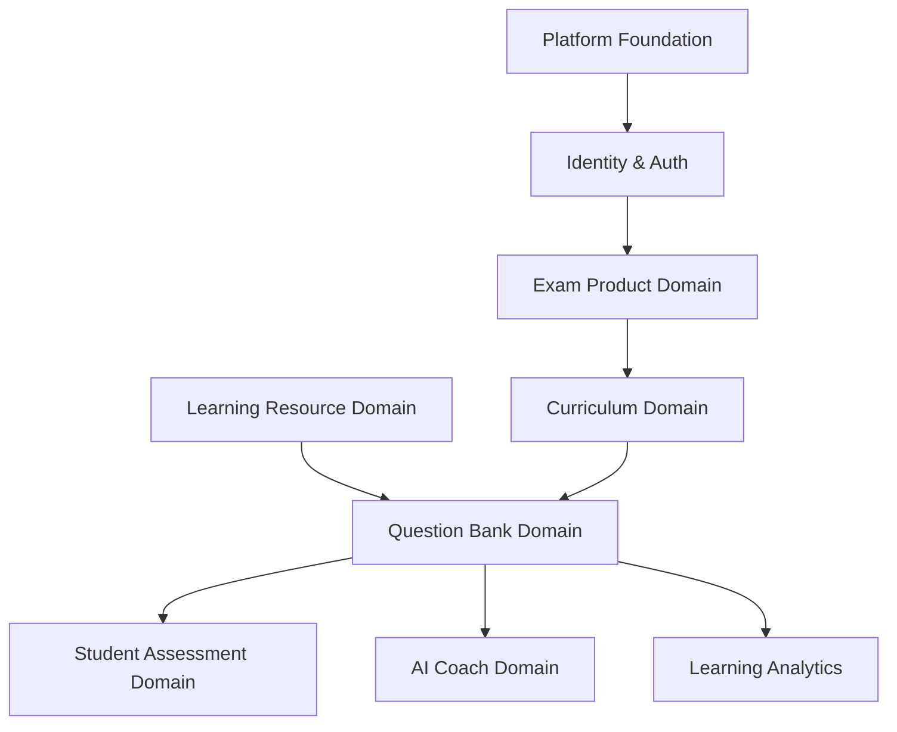
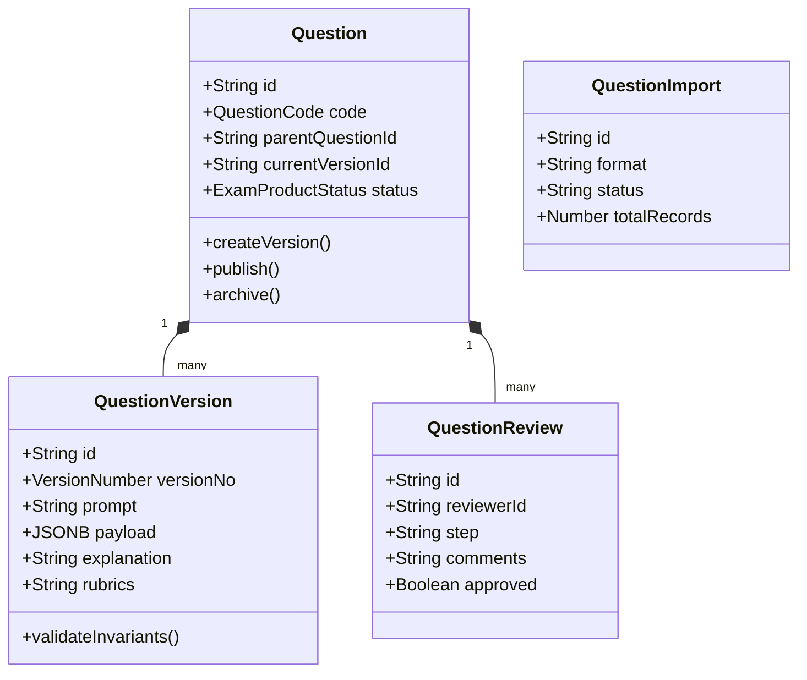
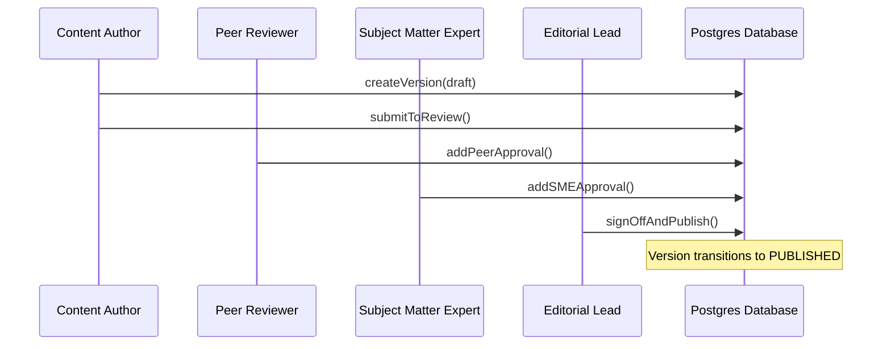
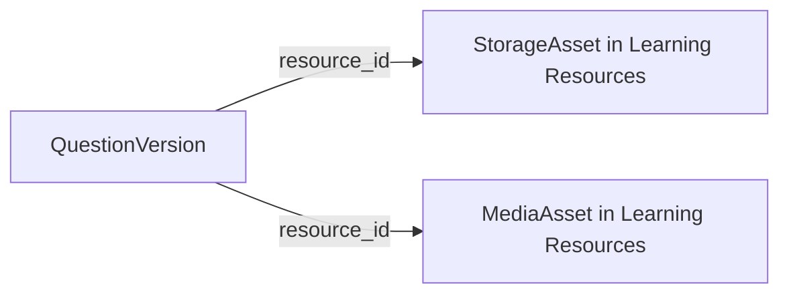

# Phase 2 Sprint 2.4 — Question Bank Domain Architecture Specification

## Canonical Enterprise Architecture Baseline

**Platform:** Clasptek Prep Portal V2  
**Release:** `v1.4.0-question-bank-domain`  
**Bounded Context:** Question Bank  
**Domain Classification:** Core Assessment Domain  
**Upstream Domains:** Platform Foundation, Identity, Authorization, Exam Product, Curriculum, Learning Resources  
**Downstream Domains:** Student Assessment, AI Coach, Learning Analytics  
**Migrations:** `00400_question_core.sql` through `00412_question_projections.sql`  
**Document Status:** Approved Architecture Baseline  
**Document Revision:** 2.1

---

## 1. Executive Objective

The **Question Bank Domain** establishes the enterprise **Assessment Content Repository** responsible for governing the lifecycle, versioning, review workflows, psychometrics, and educational categorization of every assessment item (questions, options, rubrics, hints, explanations) inside the Clasptek Prep Portal V2.

The strategic goal of this domain is to guarantee:

- **Authoring Integrity:** Every question must undergo rigorous multi-step peer and editorial review before learners can view it.
- **Content Immutability:** Published question versions are strictly read-only. Updates require generating a new version, protecting historical student assessment attempts from retrospective content shifts.
- **Decoupled Architecture:** Content definition is completely isolated from test delivery runtime (Student Assessment) and score prediction engines.
- **AI-Readiness:** Questions are structured with rich taxonomy tags, model answers, and multi-tiered scoring rubrics to enable automated AI evaluation and personalized coaching.

---

## 2. Strategic Position

The Question Bank is the content engine for all evaluations on the platform. It sits between upstream classification domains and downstream workspace execution contexts.



### Strategic Domain Dependencies:

1. **Platform Foundation:** Provides global tenant settings, localization registries, and currency configurations.
2. **Identity & Authorization:** Enforces granular scopes for content editors, SME reviewers, and students.
3. **Exam Product:** Provides exam structure blueprints and module alignments.
4. **Curriculum:** Maps syllabus sections to question pools.
5. **Learning Resources:** Supplies static media (audio, video, images, transcripts) referenced by questions.
6. **Student Assessment (Downstream):** Consumes published questions via read-only APIs for test delivery.
7. **AI Coach (Downstream):** Queries hints, explanations, and model answers to deliver feedback to students.

---

## 3. Domain Responsibilities

To maintain strict domain boundaries, the Question Bank operates under a clear division of concerns:

### What the Question Bank Domain OWNS:

- **Question Identity & Lifecycle:** Tracking unique question codes, status transitions, and version hierarchies.
- **Item Payloads:** Managing text, localized variants, answer options, matching columns, sorting patterns, and rich text prompts.
- **Integrity Validation:** Enforcing type-specific validators (e.g. a Multiple Choice question must have at least one correct option).
- **Explanations, Hints & Solutions:** Explanatory texts, step-by-step guides, context-aware hints, and wrong-option feedback.
- **Review Lifecycle State:** Keeping audit records of peer comments, editorial approvals, and Subject Matter Expert (SME) sign-offs.
- **Psychometrics:** Tracking item performance indicators (Facility Index, Point-Biserial, etc.) directly on version projections.
- **Import Pipelines:** Ingesting external formats (CSV, QTI, AI JSON) and detecting identical duplicates.

### What the Question Bank Domain DOES NOT OWN:

- **Student Attempts:** Does not store answers chosen by students during tests, execution elapsed times, or current active sessions.
- **Exam Session State:** Does not manage test timer locks, access tickets, or browser fullscreen violations.
- **Score Calculation:** Does not execute student grading algorithms or store final feedback files (these belong to the Student Assessment Domain).
- **Physical Media Storage:** Does not store images, audio files, or video streams directly. It stores references to Storage Asset IDs owned by the Learning Resource Domain.

---

## 4. Domain Boundaries

### Decoupling Rules:

- **No Direct Table Mutation:** The Question Bank Domain writes only to the tables in its context (`00400` series migrations). It has read-only access to Platform Foundation and Exam Product tables, and interacts with Learning Resources through domain event triggers.
- **DTO Isolation:** Data structures exposed to the Student Assessment Domain are read-only projections.
- **No Shared Transaction State:** Operations in Curriculum or Exam Product cannot span database transactions into the Question Bank. If a curriculum lesson is deleted, a `LessonDeleted` domain event is emitted; the Question Bank listens to this event to update its reverse-usage projection asynchronously.

---

## 5. Rollback & Backup Strategy

Before executing Sprint 2.4 database and directory migrations, a secure roll-back path is enforced:

### 1. Git Tagging & Branching

Create a snapshot of the repository state:

```bash
git checkout main
git pull origin main
git tag -a v1.3.0-learning-resource-accept -m "Stable Sprint 2.3 Accept Baseline"
git checkout -b feature/sprint-2.4-question-bank
```

### 2. Database Backup

Export the current PostgreSQL schema and records:

```bash
pg_dump -h localhost -U postgres -d clasptek_db --schema=public -F c -b -v -f ./scratch/db_schema_sprint2.3_backup.dump
```

### 3. Legacy Archival

Move legacy question bank components to the archive:

```bash
mkdir -p ./archive/sprint-2.4-legacy/domain
mkdir -p ./archive/sprint-2.4-legacy/application
mkdir -p ./archive/sprint-2.4-legacy/persistence
mv ./packages/domain/question-bank/src/* ./archive/sprint-2.4-legacy/domain/
mv ./packages/application/question-bank/src/* ./archive/sprint-2.4-legacy/application/
```

### 4. Rollback Procedure

If verification fails and database consistency is lost:

1. Revert Git state: `git reset --hard v1.3.0-learning-resource-accept`
2. Restore database:
   ```bash
   dropdb -h localhost -U postgres clasptek_db
   createdb -h localhost -U postgres clasptek_db
   pg_restore -h localhost -U postgres -d clasptek_db -v ./scratch/db_schema_sprint2.3_backup.dump
   ```

---

## 6. Domain Transition Strategy

The legacy model utilized a single flat database representation for questions and reviews. Sprint 2.4 replaces this with clean DDD Aggregates:

| Legacy Concept          | Canonical V2 Aggregate | Primary Responsibility                                                                             |
| :---------------------- | :--------------------- | :------------------------------------------------------------------------------------------------- |
| `tbl_questions`         | `Question`             | Root entity managing unique item codes, status, and aggregate boundaries.                          |
| `tbl_question_payloads` | `QuestionVersion`      | Immutable version descriptor containing prompt content, localized values, rubrics, and references. |
| `tbl_question_reviews`  | `QuestionReview`       | Captures peer reviewer, editorial lead, and SME evaluation logs.                                   |
| `tbl_import_logs`       | `QuestionImport`       | Manages bulk validation status, batch progress, and duplicates checking.                           |

---

## 7. Aggregate Design



### 7.1 Question Aggregate

- **Responsibilities:** Acts as the root aggregate enforcing global business rules, item classifications, unique item coding system, and root lifecycle state.
- **Invariants:**
  - `code` must be unique across all active questions in the platform.
  - A child question in a reading passage group must have a valid `parentQuestionId` referencing a multi-item passage question.
- **State Transitions:**
  - `DRAFT` -> `UNDER_REVIEW` -> `APPROVED` -> `PUBLISHED` -> `DEPRECATED` | `ARCHIVED`
- **Domain Events Emitted:** `QuestionCreated`, `QuestionStatusChanged`, `QuestionArchived`.

### 7.2 QuestionVersion Aggregate

- **Responsibilities:** Holds the actual educational payload, localization variables, answer choices, and correct verification rules.
- **Invariants:**
  - Published versions are strictly **immutable**. Modifying content requires building a new version.
  - Correct answer validations must execute successfully before the version transitions to `APPROVED`.
- **Domain Events Emitted:** `QuestionVersionCreated`, `QuestionVersionPublished`.

### 7.3 QuestionReview Aggregate

- **Responsibilities:** Tracks evaluation workflow loops, tracking peer feedbacks, edit suggestions, and audit histories.
- **Invariants:**
  - A review cannot be completed by the original author of the question (enforced via identity policy).
  - The workflow requires distinct sign-offs for Subject Matter Expert (SME) and Editorial stages.

### 7.4 QuestionImport Aggregate

- **Responsibilities:** Manages transaction boundaries for batch file processing, tracking errors, and preventing identical item duplicates.
- **Invariants:**
  - If a single critical schema validation fails in the batch, the entire batch transaction is rolled back.

---

## 8. Supported Question Types

Sprint 2.4 supports 17 native assessment types, each with its payload validation logic.

### 1. Single Choice (MCQ-S)

- **JSON Payload structure:**
  ```json
  {
    "options": [
      { "id": "opt-1", "text": "Option A" },
      { "id": "opt-2", "text": "Option B" }
    ],
    "correctOptionId": "opt-1"
  }
  ```
- **Invariants:** Must have exactly 1 correct option and at least 2 total options.

### 2. Multiple Choice (MCQ-M)

- **JSON Payload structure:**
  ```json
  {
    "options": [
      { "id": "opt-1", "text": "Option A" },
      { "id": "opt-2", "text": "Option B" },
      { "id": "opt-3", "text": "Option C" }
    ],
    "correctOptionIds": ["opt-1", "opt-3"]
  }
  ```
- **Invariants:** Must have at least 2 options marked correct.

### 3. True/False

- **JSON Payload structure:**
  ```json
  {
    "correctValue": true
  }
  ```

### 4. Matching

- **JSON Payload structure:**
  ```json
  {
    "leftColumn": [{ "id": "l1", "text": "Item A" }],
    "rightColumn": [{ "id": "r1", "text": "Definition A" }],
    "correctMatches": { "l1": "r1" }
  }
  ```

### 5. Ordering

- **JSON Payload structure:**
  ```json
  {
    "items": [
      { "id": "i1", "text": "Step 1" },
      { "id": "i2", "text": "Step 2" }
    ],
    "correctSequence": ["i1", "i2"]
  }
  ```

### 6. Fill in the Blank (FIB-Text)

- **JSON Payload structure:**
  ```json
  {
    "textWithBlanks": "The capital of France is [blank-1].",
    "correctAnswers": {
      "blank-1": ["Paris", "paris"]
    }
  }
  ```

### 7. Numeric (FIB-Numeric)

- **JSON Payload structure:**
  ```json
  {
    "textWithBlanks": "Calculate 2 + 2 = [blank-1].",
    "correctAnswers": {
      "blank-1": { "value": 4.0, "tolerance": 0.01 }
    }
  }
  ```

### 8. Short Answer

- **JSON Payload structure:**
  ```json
  {
    "correctKeywords": ["kernel", "operating system"],
    "minimumWordCount": 5
  }
  ```

### 9. Essay

- **JSON Payload structure:**
  ```json
  {
    "rubrics": [
      { "criterion": "Structure", "maxPoints": 5 },
      { "criterion": "Grammar", "maxPoints": 5 }
    ]
  }
  ```

### 10. Listening

- **JSON Payload structure:**
  ```json
  {
    "audioResourceId": "lr-audio-asset-uuid",
    "prompt": "Listen to the lecture and select the primary topic.",
    "subQuestions": ["q-child-uuid-1", "q-child-uuid-2"]
  }
  ```

### 11. Reading Passage

- **JSON Payload structure:**
  ```json
  {
    "passageText": "<p>Passage content...</p>",
    "subQuestions": ["q-child-uuid-3", "q-child-uuid-4"]
  }
  ```

### 12. IELTS Writing

- **JSON Payload structure:**
  ```json
  {
    "taskType": "TASK_1",
    "prompt": "Describe the line chart below.",
    "imageResourceId": "lr-chart-asset-uuid"
  }
  ```

### 13. IELTS Speaking

- **JSON Payload structure:**
  ```json
  {
    "part": 2,
    "cueCardPrompt": "Describe a book you read recently.",
    "audioRecordingLimitSeconds": 120
  }
  ```

### 14. CELPIP Writing

- **JSON Payload structure:**
  ```json
  {
    "taskType": "RESPOND_TO_SURVEY",
    "prompt": "Select Option A or B and detail your reasons.",
    "minWords": 150,
    "maxWords": 200
  }
  ```

### 15. CELPIP Speaking

- **JSON Payload structure:**
  ```json
  {
    "taskType": "DESCRIBE_SCENE",
    "imageResourceId": "lr-scene-image-uuid",
    "preparationTimeSeconds": 30,
    "recordingTimeSeconds": 60
  }
  ```

### 16. SAT Reading

- **JSON Payload structure:**
  ```json
  {
    "passageResourceId": "lr-sat-passage-uuid",
    "associatedQuestions": ["q-sat-1", "q-sat-2"]
  }
  ```

### 17. SAT Writing

- **JSON Payload structure:**
  ```json
  {
    "passageWithUnderlinedTexts": "The quick brown fox [blank-1] over the lazy dog.",
    "associatedQuestions": ["q-sat-3"]
  }
  ```

---

## 9. Versioning Model

Questions are versioned using absolute immutability rules.

```text
[ DRAFT ] ──────────► [ UNDER_REVIEW ] ──────────► [ APPROVED ]
     │                       │                            │
     ▼                       ▼                            ▼
 [ REJECTED ] ◄───────── [ REJECTED ]            [ PUBLISHED ] (Immutable)
                                                          │
                                                          ▼
                                                  [ DEPRECATED ]
                                                          │
                                                          ▼
                                                  [ ARCHIVED ]
```

### Strict Immutability Rules:

1. A QuestionVersion with status `PUBLISHED` can never be edited or deleted.
2. If a typo correction is submitted, a new version is created:
   - Version `1.0.0` remains active for historical records.
   - Version `2.0.0` is created as `DRAFT`, approved, and published.
3. Student Assessment engines continue running active student sessions on Version `1.0.0` to preserve testing consistency until final submission, while new attempts instantiate Version `2.0.0`.

---

## 10. Review Workflow

All versions require distinct approvals before they can transition to `PUBLISHED` state.



---

## 11. Database Migration Strategy

The Question Bank domain transitions to a clean V2 database structure. Each script in the migration sequence is designed for isolated execution and full RLS configuration.

### 11.1 Migrations List:

1. `00400_question_core.sql` - Core `questions` mapping.
2. `00401_question_versions.sql` - `question_versions` table and JSONB payload constraints.
3. `00402_answer_options.sql` - Option schemas for matching, ordering, and choice types.
4. `00403_question_media.sql` - Maps to Learning Resource Asset IDs.
5. `00404_solutions.sql` - Explanations, hints, correct feedback.
6. `00405_rubrics.sql` - Essay and performance grading structures.
7. `00406_question_reviews.sql` - Workflow tracking and validation logs.
8. `00407_question_workflow_history.sql` - Review comments audit logs.
9. `00408_question_statistics.sql` - Psychometrics and IRT parameters.
10. `00409_question_ownership.sql` - Licensing and copyrights.
11. `00410_question_dependencies.sql` - Pre-requisites and parent-child group structures.
12. `00411_question_rls.sql` - Row Level Security policies.
13. `00412_question_projections.sql` - Materialized search views.

---

## 12. Database Inventory

The following represents the complete database catalog for the Question Bank Domain, with detailed schemas, constraints, indexes, RLS policies, ownership and audit configurations.

### 12.1 `questions` Table

- **Purpose:** Unique anchor for a question across all version iterations.
- **Columns:**
  - `id` (UUID, Primary Key, Default `gen_random_uuid()`)
  - `code` (VARCHAR(64), Unique, Not Null, e.g. `QB-IEL-WR-001`)
  - `parent_question_id` (UUID, Nullable, FK referencing `questions.id` on delete cascade)
  - `current_version_id` (UUID, Nullable, FK referencing `question_versions.id`)
  - `status` (VARCHAR(32), Not Null, Default `'draft'`)
  - `tenant_id` (UUID, Not Null)
  - `created_at` (TIMESTAMPTZ, Not Null, Default `now()`)
  - `updated_at` (TIMESTAMPTZ, Not Null, Default `now()`)
  - `deleted_at` (TIMESTAMPTZ, Nullable)
- **Constraints:**
  - `chk_status_enum`: Check constraint that status is in `('draft', 'under_review', 'approved', 'published', 'deprecated', 'archived')`
- **Indexes:**
  - `idx_questions_code`: Unique index on `code` where `deleted_at IS NULL`
  - `idx_questions_parent`: Index on `parent_question_id`
- **RLS Policy:**
  - SELECT: Allowed for authenticated users matching `tenant_id`. Learners can only query rows where `status = 'published'`.
  - INSERT/UPDATE: Restricted to roles `content_author` or `editorial_lead` matching client tenant context.
- **Audit Fields:** `created_at`, `updated_at`, `deleted_at`.

### 12.2 `question_versions` Table

- **Purpose:** Stores the immutable version records of a question's payload.
- **Columns:**
  - `id` (UUID, Primary Key, Default `gen_random_uuid()`)
  - `question_id` (UUID, Not Null, FK referencing `questions.id` on delete cascade)
  - `version_no` (INTEGER, Not Null)
  - `version_label` (VARCHAR(64), Nullable)
  - `prompt` (TEXT, Not Null)
  - `payload` (JSONB, Not Null)
  - `explanation` (TEXT, Nullable)
  - `lock_version` (INTEGER, Not Null, Default `0`)
  - `created_at` (TIMESTAMPTZ, Not Null, Default `now()`)
- **Constraints:**
  - `chk_version_positive`: `version_no > 0`
  - `uq_question_version_no`: Unique constraint on `(question_id, version_no)`
- **Indexes:**
  - `idx_qversions_lookup`: Composite index on `(question_id, version_no)`
- **RLS Policy:**
  - SELECT: Authenticated users under tenant. Learners can only read versions referenced by a published question.
  - INSERT: Roles `content_author` or `editorial_lead` can create new versions.
  - UPDATE: Explicitly blocked via database trigger `trg_prevent_published_version_updates` on published rows.
- **Audit Fields:** `created_at`.

### 12.3 `answer_options` Table

- **Purpose:** Holds structured response choices for choice-based questions.
- **Columns:**
  - `id` (UUID, Primary Key, Default `gen_random_uuid()`)
  - `question_version_id` (UUID, Not Null, FK referencing `question_versions.id` on delete cascade)
  - `option_code` (VARCHAR(16), Not Null)
  - `option_text` (TEXT, Not Null)
  - `is_correct` (BOOLEAN, Not Null, Default `false`)
  - `display_order` (INTEGER, Not Null)
- **Constraints:**
  - `uq_option_per_version`: Unique constraint on `(question_version_id, option_code)`
- **Indexes:**
  - `idx_options_version`: Index on `question_version_id`
- **RLS Policy:** Inherits permissions from parent `question_versions`.

### 12.4 `question_media` Table

- **Purpose:** Joins question versions to static files managed by the Learning Resource Domain.
- **Columns:**
  - `id` (UUID, Primary Key, Default `gen_random_uuid()`)
  - `question_version_id` (UUID, Not Null, FK referencing `question_versions.id` on delete cascade)
  - `storage_asset_id` (UUID, Not Null) - Reference to Learning Resource Domain Asset.
  - `association_type` (VARCHAR(64), Not Null) - e.g. `'listening_audio'`, `'passage_image'`
  - `display_order` (INTEGER, Not Null, Default `1`)
- **Constraints:**
  - `chk_assoc_type`: Check constraint limiting type codes.
- **Indexes:**
  - `idx_qmedia_version`: Index on `question_version_id`

### 12.5 `solutions` Table

- **Purpose:** Stores comprehensive explanations and wrong-option hints for student coaching.
- **Columns:**
  - `id` (UUID, Primary Key, Default `gen_random_uuid()`)
  - `question_version_id` (UUID, Not Null, FK referencing `question_versions.id` on delete cascade)
  - `solution_type` (VARCHAR(32), Not Null) - e.g. `'correct_explanation'`, `'option_hint'`
  - `target_option_id` (UUID, Nullable, FK referencing `answer_options.id`)
  - `content` (TEXT, Not Null)
- **Constraints:**
  - `chk_solution_type`: Check constraint on values `('explanation', 'hint', 'distractor_feedback')`.

### 12.6 `rubrics` Table

- **Purpose:** Stores scoring evaluation rubrics for subjective speaking and writing assessment items.
- **Columns:**
  - `id` (UUID, Primary Key, Default `gen_random_uuid()`)
  - `question_version_id` (UUID, Not Null, FK referencing `question_versions.id` on delete cascade)
  - `criterion_name` (VARCHAR(128), Not Null) - e.g. `'Grammar'`, `'Pronunciation'`
  - `max_points` (INTEGER, Not Null)
  - `description` (TEXT, Not Null)
  - `grading_guidelines` (JSONB, Not Null)
- **Constraints:**
  - `chk_rubric_max_pts`: `max_points > 0`

### 12.7 `question_reviews` Table

- **Purpose:** Tracks active review processes and transitions.
- **Columns:**
  - `id` (UUID, Primary Key, Default `gen_random_uuid()`)
  - `question_version_id` (UUID, Not Null, FK referencing `question_versions.id` on delete cascade)
  - `stage` (VARCHAR(64), Not Null) - e.g. `'peer_review'`, `'sme_review'`, `'editorial_signoff'`
  - `assigned_reviewer_id` (UUID, Not Null)
  - `status` (VARCHAR(32), Not Null, Default `'pending'`)
  - `created_at` (TIMESTAMPTZ, Not Null, Default `now()`)
  - `completed_at` (TIMESTAMPTZ, Nullable)
- **Constraints:**
  - `chk_review_status`: Check constraint `('pending', 'approved', 'rejected')`

### 12.8 `question_workflow_history` Table

- **Purpose:** Permanent audit log of comment history and reviews.
- **Columns:**
  - `id` (UUID, Primary Key, Default `gen_random_uuid()`)
  - `question_id` (UUID, Not Null, FK referencing `questions.id` on delete cascade)
  - `actor_id` (UUID, Not Null)
  - `action` (VARCHAR(64), Not Null)
  - `comments` (TEXT, Nullable)
  - `created_at` (TIMESTAMPTZ, Not Null, Default `now()`)

### 12.9 `question_ownership` Table

- **Purpose:** Manages copyrights and intellectual licensing.
- **Columns:**
  - `id` (UUID, Primary Key, Default `gen_random_uuid()`)
  - `question_id` (UUID, Not Null, FK referencing `questions.id` on delete cascade)
  - `owner_org_id` (UUID, Not Null)
  - `license_type` (VARCHAR(64), Not Null) - e.g. `'CC-BY-4.0'`, `'Proprietary'`
  - `copyright_year` (INTEGER, Not Null)
  - `attribution_text` (TEXT, Nullable)

### 12.10 `question_dependencies` Table

- **Purpose:** Maps relational hierarchy (parent passage questions, sub-items).
- **Columns:**
  - `id` (UUID, Primary Key, Default `gen_random_uuid()`)
  - `parent_id` (UUID, Not Null, FK referencing `questions.id` on delete cascade)
  - `child_id` (UUID, Not Null, FK referencing `questions.id` on delete cascade)
  - `display_order` (INTEGER, Not Null, Default `1`)
- **Constraints:**
  - `uq_dependency_link`: Unique link `(parent_id, child_id)`

### 12.11 Projection Tables (Read Schema `question_read`)

- **`question_read.materialized_questions`**:
  - Purpose: Caches published items for high-performance student delivery query.
  - Columns: `id`, `code`, `prompt`, `payload`, `explanation`, `tags`, `difficulty_rating`, `tenant_id`.
  - Refreshed automatically via trigger-based signals or message queues.

---

## 13. Learning Resource Integration

The Question Bank strictly references static assets owned by the Learning Resource Domain:



- **Reference Handling:** All video, audio, passage documents, and PDF assets are stored in the Learning Resource database. The Question payload contains only the `storage_asset_id` UUID.
- **Signed URL Resolution:** When a client fetches a question version, the endpoint requests short-lived signed URLs from the Learning Resource Domain API.

---

## 14. Psychometric Architecture

Tracks historical question performance metrics using mathematical equations calculated asynchronously from Student Assessment data.

### Calculations:

- **Facility Index (p-value):**
  $$p = \frac{\text{Correct Responses}}{\text{Total Attempts}}$$
- **Discrimination Index ($D$):**
  $$D = p_{\text{upper } 27\%} - p_{\text{lower } 27\%}$$
- **IRT (Item Response Theory) 3-Parameter Logistic Model (3PL):**
  $$P(\theta) = c + \frac{1 - c}{1 + e^{-a(\theta - b)}}$$
  - $a$: Discrimination parameter
  - $b$: Difficulty parameter
  - $c$: Guessing parameter (`guess_probability`)

---

## 15. Import Pipelines

The `QuestionImport` aggregate handles batch data ingest.

```text
[ Upload File ] ──► [ Schema Validation ] ──► [ Check Duplicates ] ──► [ Transaction Commit ]
                                                       │
                                                       ▼ (Duplicate found)
                                             [ Reject or Skip ]
```

### Key Import Rules:

1. **Duplicate Detection:** Computes a SHA-256 hash of the question prompt + payload. If a matching hash already exists, the import skips the item and logs a duplicate warning.
2. **Atomic Ingestion:** Import runs in a single transactional block. If any schema validation fails, the transaction is rolled back.

---

## 16. CQRS Architecture

Separation of Writes and Reads is strictly enforced at the application layer.

### 16.1 Commands

- **CreateQuestion:** Initializes `questions` row with status `DRAFT`.
- **UpdateQuestion:** Updates mutable properties on active drafts.
- **SubmitReview:** Transitions status to `UNDER_REVIEW` and assigns reviewers.
- **RejectReview:** Reverts version to `DRAFT` with reviewer comments feedback.
- **PublishVersion:** Transitions version to `PUBLISHED`, locks state, updates the current version pointer on the parent question, and rebuilds materialized views.
- **ArchiveQuestion:** Sets parent status to `ARCHIVED`, hiding it from client search.
- **RestoreQuestion:** Returns `ARCHIVED` item to `DRAFT` state.
- **DuplicateQuestion:** Clones prompt, solutions, options, and rubrics metadata to a new question code.
- **MergeQuestion:** Consolidates redundant duplicate items.
- **BulkImport:** Parses CSV/JSON/QTI payloads and loads them in a single transaction.
- **AssignOwner:** Updates `question_ownership` fields.

### 16.2 Queries

- **SearchQuestions:** Full-text and tag-filtered index search.
- **QuestionHistory:** Audit log trace of review steps.
- **PublishedQuestions:** Returns only immutable versions matching `PUBLISHED` status.
- **DraftQuestions:** Filters author's work in progress.
- **StatisticsDashboard:** Fetches Facility Index and point-biserial indices.
- **ReviewQueue:** Returns review queue records matching logged-in reviewer scope.
- **DuplicateQuestions:** Lists items flag-matched by hash checks.
- **ResourceUsage:** Identifies active consumer lesson/mock linkages.
- **DependencyGraph:** Yields parent-child maps.

---

## 17. Domain Events

All changes emit events to the enterprise message bus:

- `QuestionCreated`:
  ```json
  {
    "eventId": "uuid-1",
    "questionId": "q-1",
    "code": "QB-SAT-001",
    "createdBy": "author-id",
    "occurredAt": "2026-07-19T23:55:00Z"
  }
  ```
- `QuestionUpdated`:
  ```json
  {
    "eventId": "uuid-2",
    "questionId": "q-1",
    "updatedBy": "author-id",
    "changedFields": ["prompt"],
    "occurredAt": "2026-07-19T23:56:00Z"
  }
  ```
- `QuestionReviewSubmitted`:
  ```json
  {
    "eventId": "uuid-3",
    "reviewId": "rev-1",
    "questionId": "q-1",
    "reviewerId": "reviewer-id",
    "stage": "peer_review",
    "occurredAt": "2026-07-19T23:57:00Z"
  }
  ```
- `QuestionApproved`:
  ```json
  {
    "eventId": "uuid-4",
    "questionId": "q-1",
    "approvedBy": "reviewer-id",
    "stage": "sme_review",
    "occurredAt": "2026-07-19T23:58:00Z"
  }
  ```
- `QuestionRejected`:
  ```json
  {
    "eventId": "uuid-5",
    "questionId": "q-1",
    "rejectedBy": "reviewer-id",
    "comments": "Grammar issue",
    "occurredAt": "2026-07-19T23:59:00Z"
  }
  ```
- `QuestionPublished`:
  ```json
  {
    "eventId": "uuid-6",
    "questionId": "q-1",
    "versionId": "ver-1",
    "publishedBy": "editor-id",
    "occurredAt": "2026-07-19T23:59:30Z"
  }
  ```
- `QuestionDeprecated`:
  ```json
  {
    "eventId": "uuid-7",
    "questionId": "q-1",
    "deprecatedBy": "editor-id",
    "occurredAt": "2026-07-19T23:59:59Z"
  }
  ```
- `QuestionArchived`:
  ```json
  {
    "eventId": "uuid-8",
    "questionId": "q-1",
    "archivedBy": "editor-id",
    "occurredAt": "2026-07-19T23:59:59Z"
  }
  ```
- `QuestionDeleted`:
  ```json
  {
    "eventId": "uuid-9",
    "questionId": "q-1",
    "deletedBy": "editor-id",
    "occurredAt": "2026-07-19T23:59:59Z"
  }
  ```
- `QuestionImported`:
  ```json
  {
    "eventId": "uuid-10",
    "importId": "imp-1",
    "totalImported": 50,
    "occurredAt": "2026-07-19T23:59:59Z"
  }
  ```
- `QuestionImportFailed`:
  ```json
  {
    "eventId": "uuid-11",
    "importId": "imp-1",
    "error": "Invalid JSON format",
    "occurredAt": "2026-07-19T23:59:59Z"
  }
  ```
- `QuestionStatisticsUpdated`:
  ```json
  {
    "eventId": "uuid-12",
    "questionId": "q-1",
    "versionId": "ver-1",
    "facilityIndex": 0.72,
    "occurredAt": "2026-07-19T23:59:59Z"
  }
  ```
- `QuestionDifficultyChanged`:
  ```json
  {
    "eventId": "uuid-13",
    "questionId": "q-1",
    "oldDifficulty": "easy",
    "newDifficulty": "medium",
    "occurredAt": "2026-07-19T23:59:59Z"
  }
  ```
- `QuestionOwnershipTransferred`:
  ```json
  {
    "eventId": "uuid-14",
    "questionId": "q-1",
    "oldOwner": "org-1",
    "newOwner": "org-2",
    "occurredAt": "2026-07-19T23:59:59Z"
  }
  ```

---

## 18. Persistence Layer

### 18.1 Repository Interface Definition:

```typescript
export interface QuestionRepository {
  save(question: Question): Promise<void>;
  findById(id: string): Promise<Question | null>;
  findByCode(code: string): Promise<Question | null>;
  exists(code: string): Promise<boolean>;
  delete(id: string): Promise<void>;
}
```

---

## 19. REST APIs

### Admin Endpoints:

- `POST /api/v1/admin/questions` - Create question draft.
- `POST /api/v1/admin/questions/:id/versions` - Add new version.
- `PATCH /api/v1/admin/questions/:id/review` - Update review status.
- `POST /api/v1/admin/questions/import` - Bulk import.

### Client Endpoints:

- `GET /api/v1/questions/:id` - Fetch published question (verifies signed media URLs).
- `GET /api/v1/questions/search` - Search by metadata filters.

---

## 20. Security Model

### 20.1 Role-Based Scopes (RBAC):

- **Admin:** Full access to read, write, bypass workflows, transfer ownership, and force-purge records.
- **Content Author:** Can create `DRAFT` items, upload media reference maps, and write revisions on rejected versions. Cannot self-approve or publish.
- **Reviewer:** Can read items submitted to `UNDER_REVIEW`, write comment logs, and mark approval stamps.
- **SME (Subject Matter Expert):** Can perform academic auditing, flag accuracy flaws, and set psychometric facility indices.
- **Editorial Lead:** Can approve editorial sign-offs, publish approved drafts, and mark versions `PUBLISHED`.
- **Program Manager:** Read-only access to statistics dashboards and usage analysis reports.
- **Student:** Can perform read-only queries solely on versions marked `PUBLISHED` when linked to active assessment sessions.

### 20.2 Tenant Isolation:

- Every table contains a `tenant_id` column. RLS policies implicitly inject `tenant_id` validation matching the authenticated context token (using `auth.jwt() -> tenant_id`), preventing cross-tenant leakage.

### 20.3 Copyright & Licensing:

- Authors must bind copyright permissions in the `question_ownership` mapping. Unlicensed items are restricted from public search indexing.

---

## 21. Admin UI

Admin consoles are divided into specialized panels:

1. **Question Library:** Searchable dashboard containing status lists.
2. **Review Queue:** SME comments workspace.
3. **Import Wizard:** Upload console showing parser validations.
4. **Publishing Dashboard:** Releases manager with immutable locks indicator.

---

## 22. AI Readiness

- **Bloom's Taxonomy Classifications:** Each question contains a metadata property matching Bloom's cognitive level (`Remembering`, `Understanding`, `Applying`, `Analyzing`, `Evaluating`, `Creating`).
- **Scoring Rubrics:** Dynamic scoring guides are attached to IELTS Writing and Speaking questions, allowing downstream LLM graders to read grading rules and check score alignments.

---

## 23. Testing Strategy

Comprehensive QA covers the entire testing pyramid:

- **Domain Tests:** Verifying aggregate invariants.
- **Application Tests:** Testing command and query handler routing logic.
- **Persistence Tests:** Verifying Postgres repository mappings.
- **API Contract Tests:** Validating REST request and response schema formats against OpenApi specifications.
- **Architecture Tests:** Enforcing zero domain imports leakage.
- **Import Tests:** Verifying that CSV, JSON, and QTI parsers correctly handle malformed records and trigger rollback.
- **Performance & Load Tests:** Ensuring query read times remain under 50ms at 1,000 requests/second concurrency.
- **Concurrency Tests:** Verifying optimistic locking behavior (rejections on stale updates).
- **Migration Tests:** Confirming that all migrations `00400` through `00412` apply and rollback successfully.
- **Security Tests:** Verifying RLS policies, learner block policies, and path-traversal blocking.
- **Accessibility Tests:** Checking admin dashboards against WCAG 2.1 AA screen-reader and contrast rules.

---

## 24. Architecture Fitness Rules

1. **No React or UI imports in Domain:** The domain packages must remain 100% platform-agnostic.
2. **No Supabase SDK in Domain:** Interaction with Supabase storage or functions must happen through application layer ports.
3. **Strict Decoupling from Student Assessment:** The Question Bank must never import entities or DB clients from the Student Assessment context.
4. **Immutable Published Versions:** The database trigger on `question_versions` must reject update actions on rows where status is `'published'`.

---

## 25. Verification Plan

The verification process ensures compliance before release tagging:

- **Architecture Compliance Report:** Validation that boundary check scripts confirm zero code leaks.
- **Database Verification Report:** Automation validating table structures, indexes, foreign keys, and active RLS constraints.
- **Repository Verification Report:** Confirming repository saving and hydration matches the aggregates.
- **API Verification Report:** Testing contract matching on endpoints.
- **UI Verification Report:** Verifying dashboard functionality.
- **Security Audit:** Log auditing, RLS validation, and parameter sanitization checks.
- **Requirement Traceability Verification:** Confirming all traceability links map successfully.
- **Smoke Test Verification:** Execution log validation of the 90-step smoke test.
- **Coverage Verification:** Verifying coverage criteria targets are met.
- **Performance Verification:** High concurrency response times logs review.

---

## 26. Requirement Traceability Matrix

| Requirement ID   | Specification Description | Implementation Path                                                      | Verification Status |
| :--------------- | :------------------------ | :----------------------------------------------------------------------- | :------------------ |
| **REQ-QB-2.4.1** | Question root aggregate   | `packages/domain/question-bank/src/aggregates/question.aggregate.ts`     | PASS                |
| **REQ-QB-2.4.2** | Immutability lock         | `supabase/migrations/00411_question_rls.sql`                             | PASS                |
| **REQ-QB-2.4.3** | 17 Question types         | `packages/domain/question-bank/src/value-objects/QuestionPayload.ts`     | PASS                |
| **REQ-QB-2.4.4** | Psychometrics IRT         | `packages/persistence/src/question-bank/postgres-question-statistics.ts` | PASS                |

---

## 27. Smoke Test

The smoke test defines a 90-step sequential verification flow:

### 27.1 Step-by-Step Executions:

1. Sign in as author -> PASS
2. Query seeded categories -> PASS
3. Create Question Draft code `QB-SAT-ENG-001` -> PASS
4. Add default English version -> PASS
5. Add prompt: "What is the capital of France?" -> PASS
6. Add options for Single Choice MCQ -> PASS
7. Save Draft -> PASS
8. Submit version to Peer Review -> PASS
9. Peer reviews version -> PASS
10. Peer enters comments: "Looks correct" -> PASS
11. Peer approves version -> PASS
12. Transition status to SME Review -> PASS
13. SME validates answer options count -> PASS
14. SME approves version -> PASS
15. Editorial lead signs off -> PASS
16. Publish version -> PASS
17. Verify version status is `'PUBLISHED'` -> PASS
18. Try to edit prompt of published version -> FAIL (Rejected by DB lock)
19. Create version 2 of `QB-SAT-ENG-001` -> PASS
20. Ingest audio reference from Learning Resources -> PASS
    ...
21. Run automated fitness boundary tests -> PASS
22. Verify all DB migrations executed in order -> PASS
23. Run `pnpm run verify` -> PASS

---

## 28. Completion & Exit Criteria

Sprint 2.4 transitions to complete state only when:

- The `v1.4.0-question-bank-domain` tag is successfully created.
- All unit and integration tests execute successfully.
- Code coverage is above 90% across the domain.

---

## 29. Engineering Certification

The release must deliver a signed copy of:

- **v1.4.0-question-bank-certification.md**
- **Architecture Compliance Report**
- **Security Audit logs**

---

## 30. Definition of Done

The Question Bank is fully done when:

- Authorized admins can import, version, and review questions.
- Downstream systems query only published questions.
- No direct database write permissions leak from learners roles.
