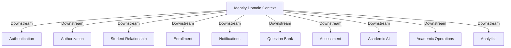

# Identity Domain Context Map

This document establishes the architectural boundary, downstream integrations, and transaction interfaces of the **Identity Domain** context slice.

---

## 1. Upstream Dependencies

- **None**. The Identity Bounded Context is the fundamental platform root domain. All other contexts depend on it to identify entities.

---

## 2. Downstream Consumers

| Downstream Context       | Relation Type     | Integration Channel     | Purpose                                       |
| ------------------------ | ----------------- | ----------------------- | --------------------------------------------- |
| **Authentication**       | Customer-Supplier | Events / DB Shared Read | Maps active logins and verify states.         |
| **Authorization**        | Customer-Supplier | Events                  | Grants system permissions to user accounts.   |
| **Student Relationship** | Customer-Supplier | Events                  | Creates student cards when profiles complete. |
| **Enrollment**           | Customer-Supplier | Events                  | Links courses, modules, and track metrics.    |
| **Notifications**        | Conformist        | Events                  | Sends welcome emails and alert triggers.      |
| **Question Bank**        | Conformist        | Shared User ID          | Links item ownership and creations.           |
| **Assessment**           | Conformist        | Shared User ID          | Collects logs of tests scores.                |
| **Academic AI**          | Conformist        | Shared User ID          | Personalizes test recommendations.            |
| **Academic Operations**  | Customer-Supplier | Shared User ID          | Performs profile audits and audits schedules. |
| **Analytics**            | Conformist        | Events                  | Tracks platform registrations.                |

---

## 3. Domain Events Boundary

The Identity Domain publishes the following notification structures:

### `UserCreated`

- **Trigger**: A new user record aggregate is initialized.
- **Consumer**: Central logging ledgers, Analytics.

### `IdentityCreated`

- **Trigger**: A provider login credential is linked to a user.
- **Consumer**: Authentication.

### `IdentityArchived`

- **Trigger**: User account is set to Archived status.
- **Consumer**: Authentication (locks sessions), Authorization (deactivates roles).

### `IdentityRestored`

- **Trigger**: User account is restored to Active status.
- **Consumer**: Authentication (reactivates login status).

### `ProfileCreated`

- **Trigger**: User display profile records are initialized.
- **Consumer**: Student Relationship.

### `ProfileUpdated`

- **Trigger**: Profile fields (names, avatar, locale) are updated.
- **Consumer**: Student Relationship, Presentation cache.

---

## 4. Consumed Events

- **None**. The Identity Bounded Context operates independently of other business processes.
