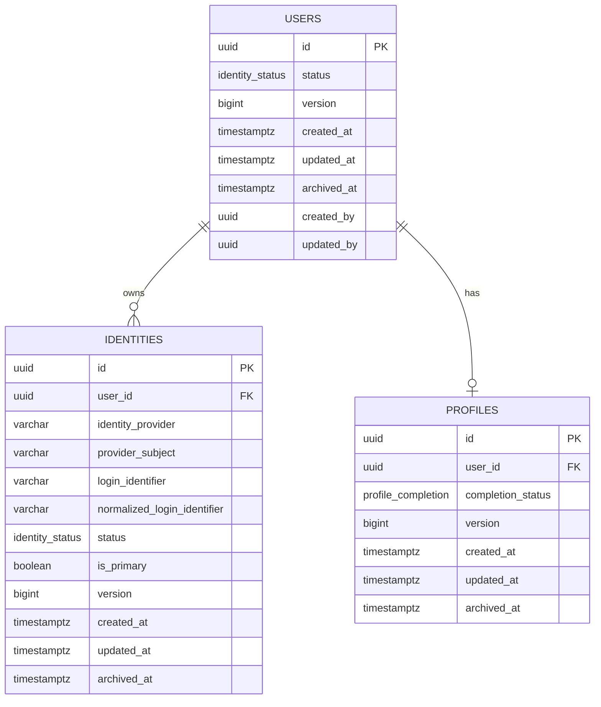
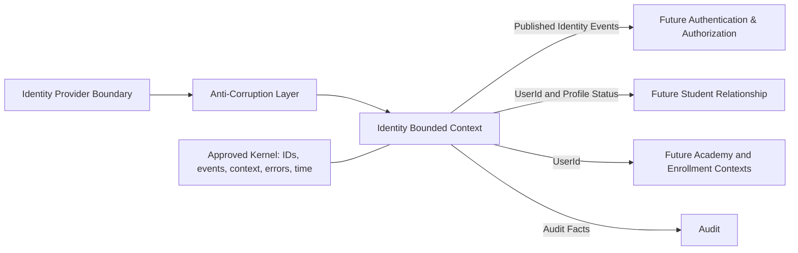
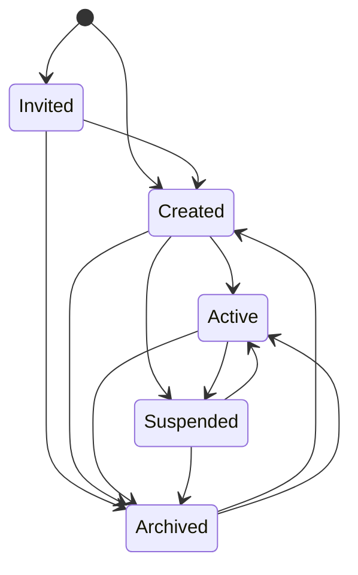

# CLASPTEK PREP PORTAL VERSION 2

## v0.2.0 — Identity Domain Baseline

**Permanent location:** `docs/releases/v0.2.0-identity-domain-baseline.md`
**Release date:** 13 July 2026
**Status:** **APPROVED — IMMUTABLE**
**Previous baseline:** `v0.1.0-platform-foundation`

> This document records the approved Sprint 1.3 Identity Domain. It does not redesign architecture, add authentication, introduce roles or permissions, or create academic functionality. The release tag, migrations, package manifests, lockfile, test reports, architecture fitness report and CI evidence are authoritative for exact symbols and versions.

---

# 1. Release Summary

| Item                  | Record                                                                                                                                                                                                              |
| --------------------- | ------------------------------------------------------------------------------------------------------------------------------------------------------------------------------------------------------------------- |
| Release Name          | Identity Domain Baseline                                                                                                                                                                                            |
| Release Version       | `v0.2.0-identity-domain-baseline`                                                                                                                                                                                   |
| Release Date          | 13 July 2026                                                                                                                                                                                                        |
| Release Status        | Approved and immutable                                                                                                                                                                                              |
| Prepared By           | CTO; Chief Enterprise Architect; Principal DDD Architect; Engineering Governance Lead; Release Manager; Principal Database Architect; Principal API Architect; Principal QA Architect; Technical Documentation Lead |
| Approved By           | CTO and Architecture Governance Authority                                                                                                                                                                           |
| Architecture Version  | Approved Phase 0, Phase 0 Addendum and Phase 0.5                                                                                                                                                                    |
| Engineering Version   | Platform Foundation 0.1.0 plus Identity Domain 0.2.0                                                                                                                                                                |
| Baseline Version      | Identity Domain Baseline 0.2.0                                                                                                                                                                                      |
| Repository Version    | Git tag `v0.2.0-identity-domain-baseline`                                                                                                                                                                           |
| Purpose               | Record the first completed business domain and establish the canonical bounded-context pattern                                                                                                                      |
| Scope                 | Identity domain model, persistence, contracts, application layer, events, lifecycle, tests and documentation                                                                                                        |
| Operational API Scope | No operational REST endpoint approved in Sprint 1.3                                                                                                                                                                 |
| Authentication Scope  | Excluded                                                                                                                                                                                                            |
| Authorization Scope   | Excluded                                                                                                                                                                                                            |

Sprint 1.3 introduces one business domain, three business tables, a provider-neutral identity model, a controlled lifecycle and versioned events. It preserves the existing 11-package architecture, two applications and zero operational business endpoints.

---

# 2. Identity Domain Overview

## Purpose

The Identity Domain maintains the platform’s stable representation of a user independently of authentication technology, academy membership, student status, staff role or academic activity.

## Responsibilities

It owns:

- Stable User identity.
- Identity-provider associations.
- Login-identifier representation.
- User Profile ownership.
- Profile-completion state.
- Identity lifecycle.
- Identity invariants.
- Repository contracts.
- Identity events.
- Identity persistence mappings.

It does not own credentials, passwords, sessions, login, email verification, MFA, roles, permissions, academy membership or academic records.

## Bounded Context

- **Name:** Identity
- **Aggregate root:** User
- **Owned entities:** Identity and Profile
- **Persistence namespace:** `identity`
- **Published language:** versioned identity DTOs and domain events
- **Integration boundary:** provider-neutral identity adapters

## Ubiquitous Language

| Term               | Definition                                                                                     |
| ------------------ | ---------------------------------------------------------------------------------------------- |
| User               | Stable aggregate root representing a platform-recognized person or account subject             |
| Identity           | Provider-specific or platform-recognized association belonging to one User                     |
| Profile            | User-owned record containing approved profile information and completion state                 |
| Identity Provider  | Source that asserts or manages an identity association; authentication is not implemented here |
| Login Identifier   | Normalized provider-recognized identifier; not a password or credential                        |
| Profile Completion | Approved determination that required profile information is present                            |
| Identity Status    | Invited, Created, Active, Suspended or Archived                                                |
| Provider Subject   | Stable provider-side identifier                                                                |
| Aggregate Version  | Optimistic-concurrency value                                                                   |
| Archive            | Reversible removal from normal use without deleting history                                    |
| Restore            | Approved return of an archived identity to a permitted operational state                       |

Other domains may reference `UserId` but may not redefine User, Identity, Profile or Identity Status.

---

# 3. Identity ERD



## Keys, Relationships and Constraints

- `users.id`, `identities.id` and `profiles.id` are immutable primary keys.
- `identities.user_id` references `users.id`.
- `profiles.user_id` references `users.id` and is unique.
- One User may own many Identity records.
- One User may own zero or one Profile.
- Provider subject is unique within an Identity Provider.
- Normalized Login Identifier is unique within its approved provider scope.
- At most one active primary Identity is permitted per User.
- Status values are restricted to the approved lifecycle set.
- Authentication secrets are prohibited from these tables.

## Required Indexes

- `users(status)`
- `identities(user_id)`
- `identities(identity_provider, provider_subject)`
- `identities(normalized_login_identifier)`
- `identities(user_id, is_primary)`
- `profiles(user_id)`
- Approved active/archive filtering indexes

## Versioning and Concurrency

Each mutable aggregate record carries a version. State-changing persistence uses expected-version comparison, increments the version after acceptance and returns a conflict for stale updates.

## Soft Delete

Business deletion uses archive semantics:

- `status = archived`
- `archived_at` records the transition
- historical references remain valid
- restore requires an approved command and transition
- physical deletion is outside ordinary domain behavior

## Audit

Auditability uses timestamps, actor context where available, correlation and causation identifiers, domain events, transactional outbox records and append-only audit records where required.

## Future Provider Support

The model supports future providers because provider code, provider subject and Login Identifier are separate from User ID; one User may own multiple Identity records; provider payloads do not enter the domain; and no credential technology is embedded in the model.

The release-tagged migration is authoritative for exact SQL names and types.

---

# 4. Context Map



## Upstream Contexts

No operational business bounded context is upstream at this baseline. Future provider inputs must pass through an anti-corruption layer.

## Downstream Contexts

Future consumers may include Authentication and Authorization, Student Relationship, Academy, Enrollment, Communication and Audit.

## Published Language

- Typed identifiers
- Identity status
- Profile completion
- Versioned DTOs
- Versioned domain-event envelopes
- Correlation and causation context

## Consumed Language

Only approved kernel and platform primitives are consumed. Raw provider SDK objects are not accepted.

## Shared Kernel

The Shared Kernel is limited to identifiers, event envelope, execution context, time abstraction, result/error primitives and aggregate version. It contains no Identity business rules.

## Events

Published: `UserCreated`, `IdentityCreated`, `ProfileCreated`, `ProfileUpdated`, `IdentityArchived`, `IdentityRestored`.

Consumed external business events: none in Sprint 1.3.

---

# 5. Domain Model

## Aggregate Root

### User

User protects invariants across Identity and Profile changes, lifecycle transitions, archive consistency, versioning and event production.

## Entities

### Identity

Exists because one User may have multiple provider associations with independent provider subjects and Login Identifiers.

### Profile

Exists because profile information has its own identity, completion behavior and audit history while remaining owned by User.

## Value Objects

- `UserId`
- `IdentityId`
- `ProfileId`
- `IdentityProvider`
- `ProviderSubject`
- `LoginIdentifier`
- `IdentityStatus`
- `ProfileCompletion`
- `AggregateVersion`
- `ExecutionContext`

## Specifications

- Provider subject availability
- Login Identifier availability
- Profile ownership uniqueness
- Primary Identity eligibility
- Allowed lifecycle transition
- Restore eligibility
- Profile-completion eligibility

## Policies

- Identity uniqueness
- Primary Identity
- Lifecycle transition
- Archive
- Restore
- Profile completion
- Optimistic concurrency

## Repository

`IdentityRepository` loads and saves User aggregates, checks approved uniqueness rules and persists state plus outbox events through the application transaction boundary.

## Domain Services

Domain services are restricted to cross-entity rules such as uniqueness coordination and provider-neutral association validation.

## Factories

Factories may establish a valid User, Identity or Profile while enforcing creation invariants. They do not perform persistence or provider calls.

---

# 6. State Machine



| State     | Meaning                                                         |
| --------- | --------------------------------------------------------------- |
| Invited   | Reserved or invited but not established for normal use          |
| Created   | Aggregate exists but is not active                              |
| Active    | Available for approved platform use                             |
| Suspended | Temporarily blocked while history remains                       |
| Archived  | Removed from normal use and retained for history or restoration |

Allowed transitions are exactly those shown above. Restoration from Archived must satisfy the restore policy and cannot bypass activation requirements.

Forbidden transitions include Active to Invited, Suspended to Invited, Archived to Invited, Archived to Suspended without restoration, stale-version changes and mutations that bypass User.

State invariants:

- `archived_at` exists only while Archived.
- User ID never changes.
- Profile ownership remains one-to-one.
- Identity uniqueness remains valid.
- version increases after each accepted mutation.
- authentication state is not part of this lifecycle.

---

# 7. Domain Events

All events include:

- `event_id`
- `event_name`
- `event_version`
- `occurred_at`
- `aggregate_id`
- `aggregate_version`
- `correlation_id`
- `causation_id`
- `actor_id` where available
- redacted `execution_context`
- event-specific payload

| Event              | Purpose                             | Payload Summary                                                              | Current Consumers | Future Subscribers                                  |
| ------------------ | ----------------------------------- | ---------------------------------------------------------------------------- | ----------------- | --------------------------------------------------- |
| `UserCreated`      | Announce a new User aggregate       | User ID, initial status, completion state, version                           | Outbox and audit  | Authentication, Student Relationship, Communication |
| `IdentityCreated`  | Announce a new provider association | User ID, Identity ID, provider, subject reference, primary flag, status      | Outbox and audit  | Authentication adapters, security monitoring        |
| `ProfileCreated`   | Announce Profile creation           | User ID, Profile ID, completion state, version                               | Outbox and audit  | Onboarding and Student Relationship                 |
| `ProfileUpdated`   | Announce approved Profile change    | User ID, Profile ID, changed-field classification, completion state, version | Outbox and audit  | Onboarding and Communication                        |
| `IdentityArchived` | Announce archive transition         | User ID, previous status, archive time, reason code, version                 | Outbox and audit  | Authentication, sessions, support                   |
| `IdentityRestored` | Announce restoration                | User ID, restored status, restoration time, reason code, version             | Outbox and audit  | Authentication, sessions, support                   |

Events are committed atomically through the outbox, are versioned, describe completed facts and contain no passwords, tokens or raw provider payloads.

---

# 8. Application Layer

## Commands

- `CreateUser`
- `CreateIdentity`
- `CreateProfile`
- `UpdateProfile`
- `ActivateIdentity`
- `SuspendIdentity`
- `ArchiveIdentity`
- `RestoreIdentity`

## Queries

- `GetUserById`
- `GetIdentityById`
- `ListUserIdentities`
- `GetProfileByUserId`
- `GetProfileCompletion`
- `GetIdentityStatus`

## Handler Responsibilities

Command handlers validate application input, establish execution context, load the aggregate, evaluate specifications, invoke domain behavior, persist with expected version and commit state plus outbox events atomically.

Query handlers read through approved repository/projection interfaces, return DTOs, do not mutate state and expose no provider secret.

## DTOs

- User DTO
- Identity DTO
- Profile DTO
- Profile Completion DTO
- Identity Status DTO
- Command result DTO
- Domain-event DTO
- Safe error DTO

Domain entities and persistence rows are not returned directly.

## Validation

Validation occurs at contract, value-object, specification, aggregate and database-constraint layers.

## Transaction Boundary

Each state-changing command uses one transaction for aggregate state, related entity persistence, version increment, outbox insertion and required audit metadata.

The release-tagged implementation is authoritative for exact command and DTO symbol names.

---

# 9. API Contracts

## Endpoint Inventory

**Operational REST endpoints implemented: 0**

Sprint 1.3 was approved as a domain reference implementation. No URI, HTTP method, public request body, public response body or HTTP status contract is asserted by this release.

Application and event contracts exist for later presentation adapters, but they are not deployed REST APIs.

Future approved APIs must be versioned, consume application commands and queries, enforce authentication and authorization outside the Identity aggregate, preserve correlation context, avoid direct database access and never redefine User.

---

# 10. Package Inventory

The physical package count remains **11**. No new standalone package is asserted.

| Area          | Classification                        | Identity Responsibility                                                                   |
| ------------- | ------------------------------------- | ----------------------------------------------------------------------------------------- |
| Domain        | `packages/domain`                     | Aggregate, entities, value objects, policies, specifications, events and repository ports |
| Application   | `packages/application`                | Commands, queries, handlers, services and transactions                                    |
| Persistence   | Logical area in `packages/database`   | Repository adapter, mappings, migrations and concurrency                                  |
| Contracts     | `packages/contracts`                  | DTOs, command/query schemas and event schemas                                             |
| Validation    | `packages/validation`                 | Contract and primitive validation                                                         |
| Kernel        | Logical foundation                    | IDs, event envelope, context, time, errors and version                                    |
| Shared        | Logical grouping only                 | Governed cross-cutting primitives; no catch-all business logic                            |
| Events        | Logical area in contracts/application | Event schemas and outbox contracts                                                        |
| Configuration | `packages/configuration`              | Non-secret module configuration                                                           |
| Security      | Cross-cutting capability              | Redaction, secret protection and security boundaries                                      |
| Observability | `packages/observability`              | Correlation, tracing, logging and metrics                                                 |
| Authorization | `packages/authorization`              | Future policy boundary; no operational authorization in Sprint 1.3                        |
| Testing       | Repository capability                 | Domain, application, persistence, migration and architecture tests                        |
| UI            | `packages/ui`                         | No Identity UI in Sprint 1.3                                                              |
| Integrations  | `packages/integrations`               | Future provider anti-corruption adapters                                                  |
| Feature Flags | `packages/feature-flags`              | No Identity invariant controlled solely by a flag                                         |

Dependency direction remains:

```text
Presentation → Application → Domain
Persistence adapters → Application ports
Domain → approved kernel primitives only
```

---

# 11. Architecture Metrics

| Metric                    |                   v0.1.0 |                               v0.2.0 |
| ------------------------- | -----------------------: | -----------------------------------: |
| Architecture Score        |                     100% |                             **100%** |
| DDD Violations            |                        0 |                                **0** |
| Circular Dependencies     |                        0 |                                **0** |
| Layer Violations          |                        0 |                                **0** |
| Cross-Domain Imports      |                        0 |                                **0** |
| Forbidden Dependencies    |                        0 |                                **0** |
| Package Count             |                       11 |                               **11** |
| Application Count         |                        2 |                                **2** |
| Business Domains          |                        0 |                                **1** |
| Business Tables           |                        0 |                                **3** |
| Operational API Endpoints |                        0 |                                **0** |
| Security Findings         |                        0 |                                **0** |
| Warnings                  |                        0 |                                **0** |
| Coverage                  | Not numerically asserted | Release-CI evidence is authoritative |
| CI Status                 |                     Pass |                             **Pass** |

---

# 12. Engineering Baseline

## Repository Structure

```text
apps/
  web/
  worker/
packages/
  domain/identity/
  application/identity/
  contracts/identity/
  database/identity/
  authorization/
  integrations/
  observability/
  validation/
  ui/
  configuration/
  feature-flags/
database/
  migrations/
  policies/
  functions/
  views/
  tests/
docs/
  architecture/
  engineering-governance/
  engineering/
  releases/
```

Exact folders are governed by the release tag.

## Package and Dependency Baseline

Identity is added within existing packages. No duplicate domain infrastructure package is created. Web and worker may consume the application layer; persistence implements application ports; contracts use validation; execution paths use configuration and observability.

## Toolchain and Technology

The approved toolchain remains the release-tagged Node.js, pnpm, TypeScript, Next.js, Turborepo, Vitest, Playwright, Supabase/PostgreSQL, Zod, ESLint, Prettier and OpenTelemetry-compatible foundation.

Exact versions are controlled by package manifests, runtime files and lockfile.

## Migration Baseline

Sprint 1.3 introduces the first business migration set and three Identity-owned tables. Release-tagged migration filenames and checksums are authoritative.

## Changes Since v0.1.0

- First bounded context.
- User aggregate.
- Identity and Profile entities.
- Three business tables.
- Identity repository and persistence adapter.
- Commands, queries and events.
- Lifecycle state machine.
- Domain, persistence and architecture tests.
- No new physical package.
- No operational REST endpoint.
- Architecture score remains 100%.

---

# 13. Architecture Compliance

| Area                   | Result          |
| ---------------------- | --------------- |
| Phase 0 Alignment      | **PASS**        |
| Phase 0.5 Alignment    | **PASS**        |
| Engineering Governance | **PASS**        |
| Clean Architecture     | **PASS**        |
| DDD Compliance         | **PASS**        |
| SOLID Compliance       | **PASS**        |
| Architecture Fitness   | **PASS — 100%** |
| Dependency Rules       | **PASS**        |
| Package Boundaries     | **PASS**        |
| Persistence Ownership  | **PASS**        |
| API Boundary           | **PASS**        |
| Security Boundary      | **PASS**        |

Identity remains independent of HTTP, UI, database SDK and provider SDK details. No credential, session, role or permission concept is introduced.

---

# 14. Reference Implementation

The Identity Domain is the canonical bounded-context implementation for future domains.

Future domains must provide, where applicable:

1. Owned database objects, constraints, migrations and tests.
2. Aggregate boundaries, entities, value objects and invariants.
3. Commands, queries, handlers and transaction boundaries.
4. Repository ports and infrastructure adapters.
5. Approved presentation adapters.
6. Policies and specifications.
7. Versioned domain events and outbox handling.
8. Explicit state machine.
9. Domain, application, persistence, migration, contract and architecture tests.
10. ERD, context map, event catalogue, API inventory, metrics and limitations.
11. Architecture review and fitness evidence.

Future domains must copy the pattern, not Identity-specific concepts. They must not depend directly on Identity tables or treat Identity events as authorization.

---

# 15. Known Limitations

Intentionally not implemented:

- Authentication
- Authorization
- Sessions
- Registration workflow
- Login and logout
- Password storage and reset
- Email verification
- MFA
- Roles and permissions
- Policy engine
- RLS integration
- Academy membership
- Runtime Identity Provider integration
- Identity UI
- Student Relationship
- Enrollment
- Courses
- Preparation Journey
- Learning Workspace
- Question Bank
- Practice
- Assessment
- Simulation
- Grading
- Academic Evidence
- Mastery
- Exam Readiness
- Recommendations
- AI Academic Intelligence
- Student Success
- Academic Operations
- Analytics

These are scope boundaries, not defects.

---

# 16. Changelog

## Since `v0.1.0-platform-foundation`

### New Packages

None. Identity uses existing packages.

### New Tables

- `identity.users`
- `identity.identities`
- `identity.profiles`

### New APIs

None operational. Application and event contracts were added.

### New Documentation

- Identity overview
- ERD
- Context map
- Domain model
- Lifecycle
- Event catalogue
- Application inventory
- Package mapping
- Compliance report
- Release baseline

### New Domain

Identity.

### Updated Metrics

Domains: 0 → 1
Tables: 0 → 3
Endpoints: 0 → 0
Packages: 11 → 11
Applications: 2 → 2
Architecture Score: 100% → 100%

### Architecture Improvements

No architecture change. Sprint 1.3 proves the frozen architecture through the first compliant domain implementation.

---

# 17. Next Approved Sprint

## Sprint 1.4 — Authentication & Authorization

Approved objectives:

- Registration
- Login
- Logout
- Sessions
- Email verification
- Password reset
- MFA foundation
- Roles
- Permissions
- Policy engine
- RLS integration

Governing constraints:

- Authentication consumes Identity and must not redefine it.
- Authorization references `UserId` and must not create another User model.
- Credentials and sessions remain outside the Identity aggregate.
- Roles and permissions remain outside Profile.
- Provider SDK types remain behind anti-corruption layers.
- RLS reinforces application authorization and does not replace it.
- New endpoints require explicit contracts and security tests.

The Identity Domain is frozen. Any modification requires impact analysis, architecture review, an approved ADR or EDR as applicable, migration compatibility review, updated tests, an updated fitness report and updated release documentation.

---

# 18. Formal CTO Approval

## Architecture Approval

Identity is approved as the first business bounded context and the canonical domain pattern. It complies with the modular monolith, Clean Architecture, DDD, relational-first persistence, provider-neutral boundaries, event-driven integration and optimistic concurrency.

**Decision: APPROVED**

## Engineering Approval

Identity uses the approved packages, application boundaries, migration framework, contracts, validation, observability and test foundation. No unapproved package or application was introduced.

**Decision: APPROVED**

## Security Approval

No password, provider token or session secret is stored in the Identity Domain. Authentication, authorization, roles, permissions and RLS remain outside this release. Security findings are zero.

**Decision: APPROVED FOR IDENTITY SCOPE**

## Quality Approval

Architecture score is 100%; DDD, circular, layer, cross-domain and forbidden-dependency violations are zero; warnings and security findings are zero; CI passes.

**Decision: APPROVED**

## Operational Readiness

The domain is ready for consumption by later approved security and application capabilities. It is not a complete authentication service and does not itself make the product available to users.

**Decision: APPROVED AS DOMAIN BASELINE**

## Recommendation and Authorization

Preserve the immutable tag:

`v0.2.0-identity-domain-baseline`

Use Identity as the mandatory reference for future domain implementation and authorize progression to:

**Sprint 1.4 — Authentication & Authorization**

---

## Release Sign-Off

| Approval Area           | Authority                         | Decision                    | Date         |
| ----------------------- | --------------------------------- | --------------------------- | ------------ |
| Enterprise Architecture | Chief Enterprise Architect        | Approved                    | 13 July 2026 |
| Domain Architecture     | Principal DDD Architect           | Approved                    | 13 July 2026 |
| Database Architecture   | Principal Database Architect      | Approved                    | 13 July 2026 |
| API Architecture        | Principal API Architect           | Approved                    | 13 July 2026 |
| Engineering Governance  | Engineering Governance Lead       | Approved                    | 13 July 2026 |
| Quality Assurance       | Principal QA Architect            | Approved                    | 13 July 2026 |
| Security Scope          | CTO / Security Approval Authority | Approved for Identity scope | 13 July 2026 |
| Final Release           | CTO                               | Approved                    | 13 July 2026 |

**Release Tag:** `v0.2.0-identity-domain-baseline`
**Baseline Status:** Immutable
**Canonical Domain Reference:** Identity
**Next Approved Sprint:** Sprint 1.4 — Authentication & Authorization
