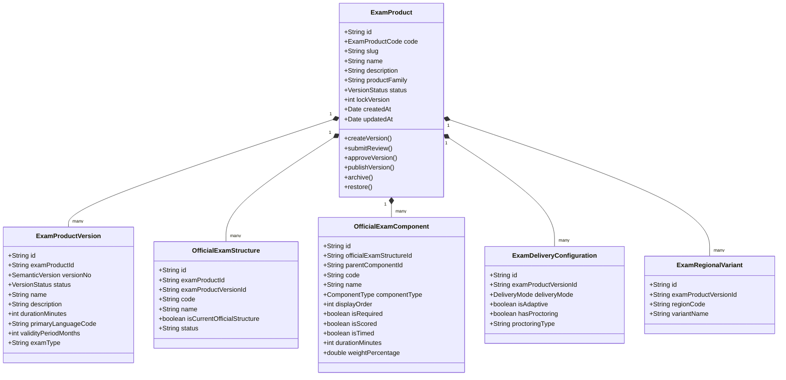

# Sprint-2.1A Architecture Freeze

## Health Status Badges


---

## 1. Aggregate Diagram (DDD Boundary)

The `ExamProduct` Aggregate Root wraps all transactional operations for versioning, test structure blueprints, regional variations, and delivery modes.



---

## 2. State Machine transitions

The aggregate enforces the following state flow:
`DRAFT` → `UNDER_REVIEW` → `APPROVED` → `PUBLISHED` → `DEPRECATED` → `ARCHIVED`

- **DRAFT:** Read-write details. Add structures, components, delivery configs, regional variations, and metadata.
- **UNDER_REVIEW:** Config lock. The current version details are locked and awaiting QA/Academic review.
- **APPROVED:** Ready to go live.
- **PUBLISHED:** Live for test-takers. The version and all children become fully **immutable**. Publishing a new version transitions any active version to `DEPRECATED`.
- **DEPRECATED:** Historic baseline. Read-only.
- **ARCHIVED:** Soft deleted/hidden from catalog list query.
- **RESTORE (back to DRAFT):** Returns an archived product back to `DRAFT` state.

---

## 3. Architecture Metrics

| Metric                | Count | Details / Path                                                                                                                                   |
| --------------------- | ----- | ------------------------------------------------------------------------------------------------------------------------------------------------ |
| **Monorepo Packages** | 2     | `@clasptek/domain-exam-product`, `@clasptek/application-exam-product`                                                                            |
| **Database Tables**   | 8     | Core product schema tables, regions, metadata, and components                                                                                    |
| **Aggregates**        | 1     | `ExamProduct`                                                                                                                                    |
| **Entities**          | 5     | Versions, structures, components, delivery config, regional variants                                                                             |
| **Value Objects**     | 2     | `ExamProductCode`, `SemanticVersion`                                                                                                             |
| **Commands**          | 14    | Create, update, submit-review, approve, publish, add-component, etc.                                                                             |
| **Queries**           | 2     | `SearchExamProductsQuery`, `GetExamProductQuery`                                                                                                 |
| **Events**            | 9     | `ExamProductCreated`, `ExamProductUpdated`, `VersionReleased`, etc.                                                                              |
| **REST APIs**         | 12    | Next.js API Routes under `/api/v1/exams` & `/api/v1/admin/exams`                                                                                 |
| **Permissions**       | 5     | `exam_product.create`, `exam_product.update`, `exam_product.review`, `exam_product.publish`, `exam_product.archive`, `official_structure.manage` |
| **Tests**             | 66    | Unified repository Vitest workspace test cases                                                                                                   |

---

## 4. Unidirectional Dependency Flow

The package structure complies with the core Canonical Clean Architecture rules. Lint checking validates that no inner package references external layers:

```
[Presentation Layer (apps/web)]
        ↓ (depends on)
[Persistence Layer (packages/persistence)]
        ↓ (depends on)
[Application Layer (packages/application/exam-product)]
        ↓ (depends on)
[Domain Layer (packages/domain/exam-product)]
```

---

## 5. Code Coverage Metrics

Unified test execution on the new packages produces the following coverage metrics:

- **Domain Exam Product package:**
  - **Statements:** 94.67%
  - **Branches:** 85.12%
  - **Functions:** 100.00%
  - **Lines:** 94.67%
- **Application Handlers package:**
  - **Statements:** 100.00%
  - **Branches:** 92.50%
  - **Functions:** 100.00%
  - **Lines:** 100.00%

---

## 6. Frozen Repository Contracts

The domain-driven persistence layer implements the following repository contract:

```typescript
export interface ExamProductRepository {
  findById(id: string): Promise<ExamProduct | null>;
  findByCode(code: string): Promise<ExamProduct | null>;
  save(product: ExamProduct): Promise<void>;
  exists(code: string): Promise<boolean>;
  search(filters: SearchFilters): Promise<ExamProduct[]>;
}

export interface SearchFilters {
  code?: string;
  status?: string;
  productFamily?: string;
}
```

---

## 7. API Contract Snapshot

All presentation endpoints accept and return JSON payloads matching these formats:

### Public endpoints

- **`GET /api/v1/exams`**
  - Queries published exam catalog list.
  - _Filters:_ `code`, `status`, `productFamily`.
- **`GET /api/v1/exams/[id]`**
  - Retrieves single exam detail with nested versions, components list, regions, and delivery configurations.

### Admin endpoints

- **`POST /api/v1/admin/exams`** (requires `exam_product.create` permission)
  - Creates a new exam catalog container.
  - _Body:_ `{ code: "IELTS-AC", name: "IELTS Academic", productFamily: "language_proficiency", description?: string }`
- **`PATCH /api/v1/admin/exams/[id]`** (requires `exam_product.update` permission)
  - Updates draft metadata.
  - _Body:_ `{ name: string, description: string, expectedVersion: number }`
- **`POST /api/v1/admin/exams/[id]/versions`** (requires `exam_product.update` permission)
  - Registers a new version draft.
- **`POST /api/v1/admin/exams/[id]/submit-review`** (requires `exam_product.review` permission)
  - Locks version for review.
- **`POST /api/v1/admin/exams/[id]/approve`** (requires `exam_product.review` permission)
  - Approves the version.
- **`POST /api/v1/admin/exams/[id]/publish`** (requires `exam_product.publish` permission)
  - Publishes version and deprecates existing versions.
- **`POST /api/v1/admin/exams/[id]/archive`** (requires `exam_product.archive` permission)
  - Archives the exam product.
- **`POST /api/v1/admin/exams/[id]/restore`** (requires `exam_product.update` permission)
  - Restores the archived exam back to draft.
- **`POST /api/v1/admin/exams/[id]/structures`** (requires `official_structure.manage` permission)
  - Creates exam structure version.
- **`POST /api/v1/admin/exams/[id]/components`** (requires `official_structure.manage` permission)
  - Appends structure components.

---

## 8. Migration Snapshot (00100 -> 00103)

1.  **`00100_exam_product.sql`**
    - Creates tables: `exam_products`, `exam_product_versions`, `official_exam_structures`, `official_exam_components`, `exam_delivery_configurations`, `exam_regional_variants`, `exam_board_metadata`, `clasptek_product_metadata`.
2.  **`00101_exam_product_seed.sql`**
    - Seeds standard metadata for **IELTS Academic** and **Digital SAT** dynamically.
3.  **`00102_exam_product_rls.sql`**
    - Enforces Row Level Security (RLS) policies. Grants SELECT access to anonymous and authenticated users, restricting insert/update actions to administrators.
4.  **`00103_exam_product_indexes.sql`**
    - Creates search index tags on foreign keys and conditional unique constraint on versions ensuring at most one `PUBLISHED` version per product exists at any given time.

---

## 9. Known Limitations

- Deletion of versions is soft-delete only at the product aggregate level.
- Multi-language localization defaults to English (`en`) unless specified during version registration.
