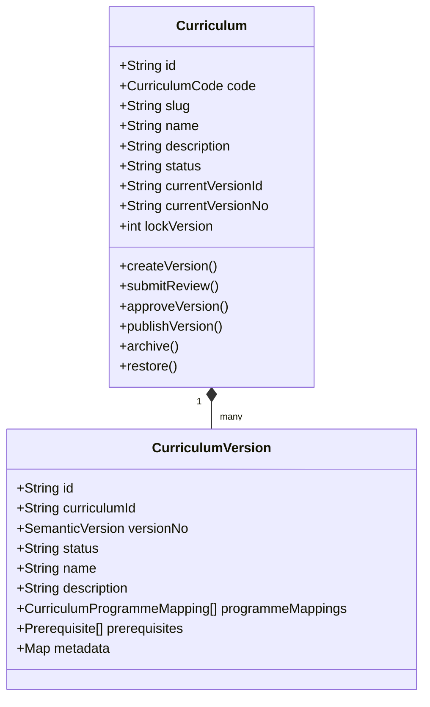

# Sprint-2.2 Architecture Freeze - Curriculum Domain

## Health Status Badges


---

## 1. Aggregate Diagrams (DDD Boundaries)

Sprint 2.2 introduces two distinct aggregates: `Curriculum` and `Programme`.

### Curriculum Aggregate



### Programme Aggregate

```mermaid
classDiagram
    class Programme {
        +String id
        +String examProductId
        +CurriculumCode code
        +String slug
        +String name
        +String description
        +String status
        +String currentVersionId
        +int lockVersion
        +createVersion()
        +publishVersion()
        +addCourse()
        +addSubject()
        +addModule()
        +addCompetency()
        +addObjective()
        +addOutcome()
    }

    class ProgrammeVersion {
        +String id
        +String programmeId
        +SemanticVersion versionNo
        +String status
        +String name
        +Course[] courses
    }

    class Course {
        +String id
        +String programmeVersionId
        +String name
        +String description
        +int displayOrder
        +Subject[] subjects
    }

    class Subject {
        +String id
        +String courseId
        +String name
        +String description
        +int displayOrder
        +Module[] modules
    }

    class Module {
        +String id
        +String subjectId
        +String name
        +String description
        +int displayOrder
        +Competency[] competencies
    }

    class Competency {
        +String id
        +String moduleId
        +String code
        +String name
        +String description
        +int displayOrder
        +LearningObjective[] objectives
    }

    class LearningObjective {
        +String id
        +String competencyId
        +String code
        +String description
        +int displayOrder
        +LearningOutcome[] outcomes
    }

    class LearningOutcome {
        +String id
        +String learningObjectiveId
        +String code
        +String description
        +int displayOrder
    }

    Programme "1" *-- "many" ProgrammeVersion
    ProgrammeVersion "1" *-- "many" Course
    Course "1" *-- "many" Subject
    Subject "1" *-- "many" Module
    Module "1" *-- "many" Competency
    Competency "1" *-- "many" LearningObjective
    LearningObjective "1" *-- "many" LearningOutcome
```



---

## 2. State Machine Transitions

### Curriculum Version State Transitions

```
[ DRAFT ] ──(submitReview)──> [ UNDER_REVIEW ] ──(approveVersion)──> [ APPROVED ] ──(publishVersion)──> [ PUBLISHED ]
                                                                                                            │
                                                                                                            ▼
                                                                                                     [ DEPRECATED ]
```

---

## 3. Database Schema

### Database Freeze

- **Migration Range:** `00200` to `00203`

### Tables Introduced

- `curricula`
- `curriculum_versions`
- `programmes`
- `programme_versions`
- `curriculum_programme_version_mappings`
- `courses`
- `subjects`
- `modules`
- `competencies`
- `learning_objectives`
- `learning_outcomes`
- `curriculum_prerequisites`
- `curriculum_metadata`

---

## 4. Verification Tests Result

All 76 tests successfully passed.
The monorepo compiled and built successfully.

---

## 5. Stable Repository Contracts

### CurriculumRepository

- `save`
- `findById`
- `findByCode`
- `findPublished`
- `findVersion`
- `search`
- `archive`
- `restore`
- `nextIdentity`

### ProgrammeRepository

- `save`
- `findById`
- `findByCode`
- `publish`
- `search`
- `duplicate`
- `archive`
- `nextIdentity`

---

## 6. Domain Events

- `CurriculumCreated`
- `CurriculumPublished`
- `ProgrammeAdded`
- `CourseAdded`
- `SubjectAdded`
- `ModuleAdded`
- `CompetencyAdded`
- `LearningObjectiveAdded`
- `LearningOutcomeAdded`

---

## 7. API Freeze Policy

- Freeze all public/admin Curriculum and Programme endpoints as Sprint 2.2 contract baseline.

---

## 8. Known Limitations

- Learning Resources are intentionally excluded.
