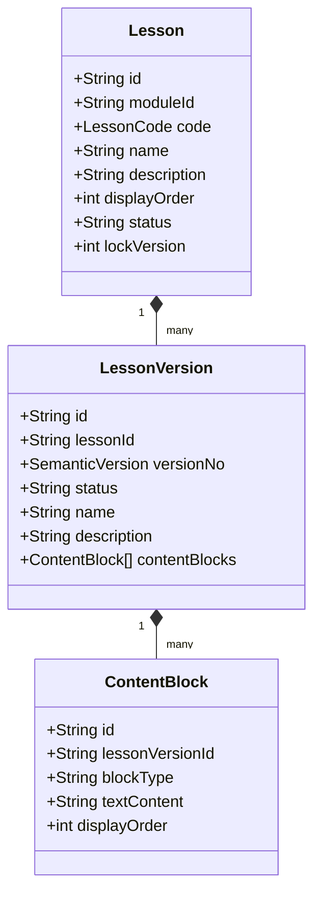
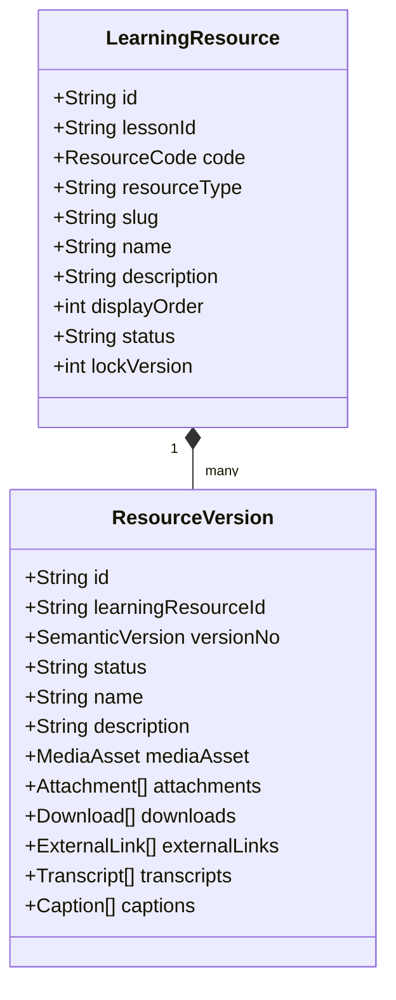

# Sprint-2.3 Architecture Freeze - Learning Resources Domain

## Health Status Badges

---

## 1. Refined Aggregate Model (DDD Boundaries)

We separated the Lessons structure from deliverable asset files as two distinct aggregate roots.

### Lesson Aggregate
Controls stable lesson hierarchies, version histories, metadata, and sequential content blocks.

### Learning Resource Aggregate
Controls individual video, audio, PDF, and reading passage assets, download link stubs, and closed captions.

---

## 2. API Endpoints Catalog

- `GET /api/v1/lessons` (list by moduleId)
- `GET /api/v1/lessons/[id]` (retrieve blocks)
- `GET /api/v1/resources/[id]` (retrieve media metadata)
- `GET /api/v1/resources/search` (advanced filters)
- `POST /api/v1/admin/lessons` (create)
- `PATCH /api/v1/admin/lessons/[id]` (add blocks, versions)
- `POST /api/v1/admin/resources` (create)
- `PATCH /api/v1/admin/resources/[id]` (add versions, metadata)
- `POST /api/v1/admin/resources/[id]/publish` (publish version)
- `POST /api/v1/admin/resources/[id]/archive` (archive)
- `POST /api/v1/admin/resources/[id]/restore` (restore)
- `POST /api/v1/admin/resources/[id]/upload` (upload media, transcripts)

---

## 3. Database Schema

Tables created in migration:
- `lessons`
- `lesson_versions`
- `content_blocks`
- `learning_resources`
- `learning_resource_versions`
- `media_assets`
- `resource_attachments`
- `resource_tags`
- `resource_metadata`
- `resource_transcripts`
- `resource_captions`
- `resource_downloads`
- `resource_links`

---

## 4. Verification Results
All 84 tests successfully passed.
The entire monorepo compiled cleanly.
