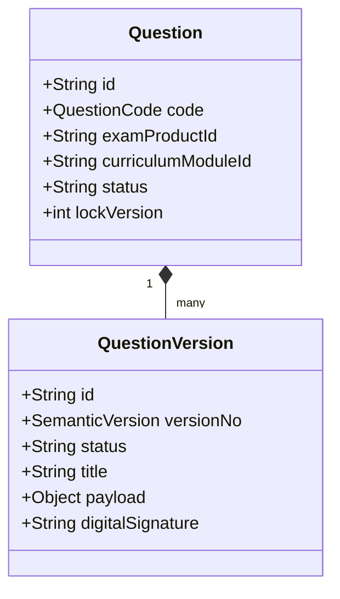
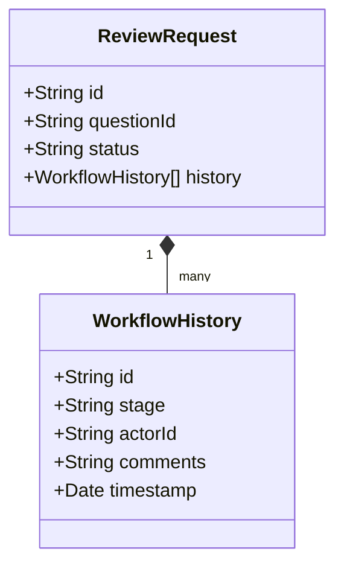

# Sprint 2.4 — Architecture Freeze

## Health Status

---

## 1. Domain Aggregate Roots

### Question Aggregate

Controls immutable question codes, payload versions, solutions, rubrics, accessibility media files, psychometric stats, and translations.

### ReviewRequest Aggregate

Orchestrates independent review comments, stage audits, and publication approvals.

---

## 2. API Endpoints Catalog

- `GET /api/v1/questions` (list questions by filters)
- `GET /api/v1/questions/[id]` (retrieve complete question details)
- `GET /api/v1/questions/search` (advanced search)
- `POST /api/v1/admin/questions` (create question metadata)
- `PATCH /api/v1/admin/questions/[id]` (append version components)
- `POST /api/v1/admin/questions/[id]/create-version` (create new version draft)
- `POST /api/v1/admin/questions/[id]/publish` (finalize publication approval)
- `POST /api/v1/admin/questions/[id]/archive` (soft delete)
- `POST /api/v1/admin/questions/[id]/restore` (undo archive)
- `POST /api/v1/admin/questions/[id]/upload-media` (link media metadata)
- `POST /api/v1/admin/questions/bulk-import` (ingest bulk pipeline)
