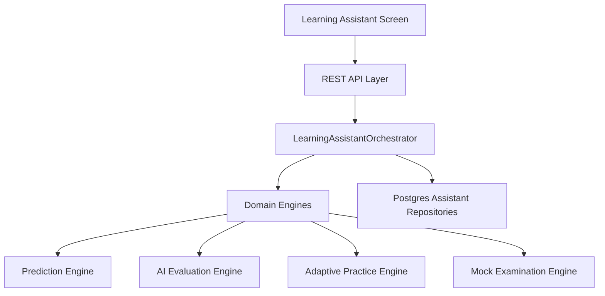

# Learning Assistant Architecture — Sprint 2.10

## Architecture Overview

The Intelligent Learning Assistant operates as an orchestration bounded context in the CLASPTEK Prep Portal platform.

## Bounded Context Layers

- **Domain Layer (`@clasptek/domain-learning-assistant`)**: Contains core entities (`LearningTask`, `DailyStudyPlan`, `WeeklyStudyPlan`, `SkillProgress`), value objects (`StudyDuration`, `ReadinessGain`, `LearningProgress`), aggregate roots (`LearningPlan`, `RevisionRecommendation`), and 6 pure deterministic domain engines.
- **Application Layer (`@clasptek/application-learning-assistant`)**: Exposes command and query handlers along with the `LearningAssistantOrchestrator` facade.
- **Persistence Layer (`@clasptek/persistence`)**: Implements PostgreSQL storage for plans, tasks, and revision recommendations.
- **API & UI Layer (`apps/web`)**: Delivers Next.js REST endpoints and an interactive React dashboard with dark-mode glassmorphism aesthetics.
