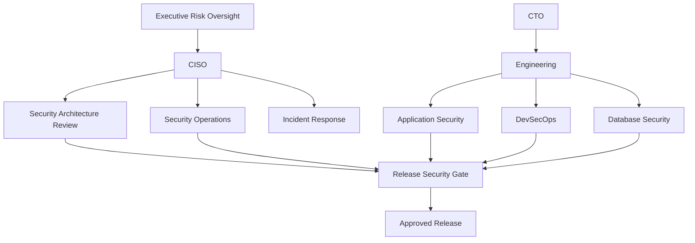
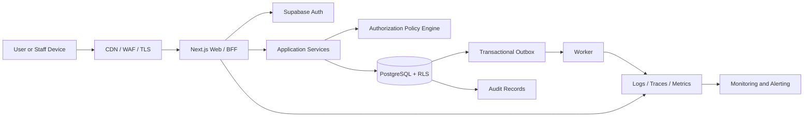
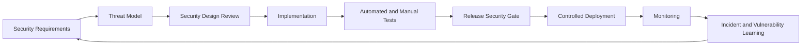

# Clasptek Prep Portal V2 — Security Operations Manual

**Document owner:** Chief Information Security Officer  
**Operational owners:** Platform Security, DevSecOps, Cloud Operations, Database Security and Application Security  
**Permanent location:** `docs/security/SECURITY_OPERATIONS_MANUAL.md`  
**Classification:** Internal — Security Governance  
**Status:** Authoritative after Sprint 1.4  
**Review cycle:** At least annually and after material security, identity, provider or regulatory change

## Purpose

This manual defines how security is governed and operated across Clasptek Prep Portal V2. It is the primary operational reference for security reviews, incident response, penetration testing, release approval, audit evidence, developer onboarding and long-term control ownership.

## Scope

Included:

- Identity, authentication, authorization and RLS operations.
- Application, API, database, cloud and DevSecOps security.
- Secrets, configuration, logging, monitoring and audit.
- Security reviews, release controls, vulnerability handling and incidents.
- Supabase responsibility boundaries.
- Security evidence and change control.

Excluded:

- Detailed business-domain implementation.
- Legal interpretation of a specific jurisdiction.
- Certification claims.
- Provider commitments not recorded in approved contracts.

## Architecture Alignment

This document is governed by the approved Clasptek Prep Portal V2 architecture and does not create new business domains or implementation behavior. It aligns with:

- Phase 0 — Enterprise Product and Solution Architecture.
- Phase 0 Addendum — Preparation Journey Architecture.
- Phase 0.5 — Canonical Domain, Business Rules and Logical Data Design.
- Engineering Implementation Governance.
- `v0.1.0-platform-foundation`.
- `v0.2.0-identity-domain-baseline`.
- Sprint 1.4 — Authentication, Authorization and Security.

The release-tagged repository, migrations, policies, package manifests, CI evidence and security fitness reports are authoritative for exact code symbols, route names, permission codes, claim names and policy identifiers. This documentation governs meaning, responsibility, control objectives and operational practice; it does not silently modify the implementation.

## Definitions

| Term               | Definition                                                                          |
| ------------------ | ----------------------------------------------------------------------------------- |
| Principal          | Authenticated or system identity requesting an action                               |
| Authentication     | Verification of the principal’s identity                                            |
| Authorization      | Decision whether a principal may perform an action on a resource                    |
| Role               | Named bundle of capabilities assigned within a defined scope                        |
| Permission         | Atomic authorization capability                                                     |
| Policy             | Rule combining permission, scope, relationship, state and context                   |
| RLS                | PostgreSQL Row Level Security policy applied automatically to table operations      |
| AAL                | Authentication Assurance Level represented in the authenticated session             |
| Session            | Authenticated continuity represented by an access token and refresh-token lifecycle |
| Service Identity   | Non-human principal used by a narrowly scoped trusted process                       |
| Break-glass Access | Exceptional, time-limited, audited privileged access                                |
| Security Event     | Structured record of a security-relevant fact                                       |
| Incident           | Confirmed or suspected event requiring coordinated response                         |
| Release Tag        | Immutable Git reference identifying the approved implementation                     |

## Security Standards Alignment

| Reference            | Baseline use                                                                              |
| -------------------- | ----------------------------------------------------------------------------------------- |
| OWASP ASVS 5.0.0     | Primary application-security verification catalogue                                       |
| OWASP Top 10:2025    | Risk-awareness and review coverage                                                        |
| Zero Trust           | Authenticate and authorize explicitly; assume no implicit trust based on network location |
| Defense in Depth     | Independent controls at client, edge, application, API, database and operational layers   |
| Least Privilege      | Minimum permission, scope, duration and data visibility                                   |
| Separation of Duties | Distinct creation, approval, administration, override and audit responsibilities          |
| Secure by Default    | Deny access unless an explicit policy grants it                                           |
| Secure by Design     | Security requirements are part of architecture, domain rules, migrations, APIs and tests  |

Alignment supports ISO 27001 preparation, SOC 2 readiness and penetration-testing evidence. It does not constitute certification.

## Security Principles

1. Deny by default.
2. Authenticate explicitly.
3. Authorize every consequential action.
4. Combine role, permission, scope, relationship, resource state and command context.
5. Treat RLS as independent defense in depth.
6. Keep credentials and service secrets out of browsers.
7. Use least privilege and time-bound access.
8. Separate author, approver, administrator, override and auditor duties.
9. Make security-relevant actions attributable and auditable.
10. Preserve evidence without logging secrets or unnecessary personal data.
11. Treat external input, browser state, JWT claims and callbacks as untrusted until verified.
12. Fail closed when identity, policy, tenant or scope context is missing.

## Security Governance

### Governance forums

| Forum                        | Purpose                                                     | Minimum participants                                                   |
| ---------------------------- | ----------------------------------------------------------- | ---------------------------------------------------------------------- |
| Security Architecture Review | Approve material security design and trust-boundary changes | CISO, CTO, Security Architect, Enterprise Architect, affected owner    |
| Release Security Review      | Verify release evidence and unresolved risks                | Release Manager, AppSec, DevSecOps, QA, service owner                  |
| Incident Review              | Coordinate and learn from security incidents                | Incident Commander, Security, Operations, Legal/Privacy where required |
| Access Review                | Recertify privileged and scoped access                      | Security, system owner, academy owner where applicable                 |
| Vendor Security Review       | Assess Supabase and other security-sensitive providers      | Security, Legal/Procurement, Cloud Engineering                         |

## Security Domains

| Domain                  | Responsibility                                                            |
| ----------------------- | ------------------------------------------------------------------------- |
| Identity Security       | Canonical principal mapping, lifecycle and synchronization                |
| Authentication Security | Registration, verification, login, MFA, session and recovery              |
| Authorization Security  | Roles, permissions, scope, policy and separation of duties                |
| Database Security       | RLS, grants, functions, migrations, encryption and audit                  |
| Application Security    | Secure design, validation, output handling and command controls           |
| API Security            | Authentication, object authorization, abuse controls and safe errors      |
| Cloud Security          | Project isolation, provider configuration, backups and service identities |
| DevSecOps               | CI security gates, dependencies, secrets, provenance and deployment       |
| Security Operations     | Monitoring, investigation, incident response and evidence                 |
| Privacy and Compliance  | Minimization, retention, access review and audit support                  |

## Security Ownership

### CISO

- Owns security policy and risk acceptance.
- Approves critical residual risk.
- Directs severe incident governance.
- Reports material risk to executive oversight.

### CTO

- Ensures engineering compliance with approved architecture.
- Co-approves material security and release decisions.
- Ensures remediation is resourced.

### Principal Security Architect

- Owns the security model, threat model and trust boundaries.
- Reviews security-impacting ADRs and EDRs.
- Maintains security fitness requirements.

### Enterprise Identity Architect

- Owns principal mapping, authentication assurance and Identity synchronization.
- Ensures Authentication consumes Identity instead of redefining it.
- Governs MFA, sessions and provider integrations.

### DevSecOps Lead

- Owns security scans, protected environments, artifact integrity and deployment controls.
- Protects CI/CD credentials.
- Produces reproducible release evidence.

### Database Security Architect

- Owns RLS, grants, privileged functions, policy testing and performance review.
- Reviews every business migration for access-control impact.
- Ensures bypass credentials remain exceptional and server-only.

### API and Application Security

- Review contracts, authorization points, validation, error handling and abuse controls.
- Maintain ASVS evidence.
- Support threat modeling and remediation.

### Domain Owners

- Own domain data classification and business authorization rules.
- Maintain security tests and documentation.
- Escalate control failures.

## Architecture Overview

## Approved Technologies

- Next.js, React and TypeScript.
- Supabase Auth.
- Managed PostgreSQL with RLS.
- Supabase SSR-compatible session integration.
- SQL-first migrations.
- Approved schema validation.
- OpenTelemetry-compatible logging, tracing and metrics interfaces.
- CI/CD security gates.
- Private object storage with signed access where implemented.

Exact versions are fixed by the release-tagged manifests and lockfile.

## Supabase Responsibilities

Subject to the provider agreement, Supabase operates:

- Managed Auth credential verification.
- JWT issuance and signing keys.
- Refresh-token lifecycle and Auth session storage.
- Managed PostgreSQL.
- Supported provider backup and availability controls.
- Provider security patching.
- Auth audit information made available by the service.

## Platform Responsibilities

Clasptek owns:

- Auth configuration and redirect allowlists.
- Cookie and server/client integration.
- Identity synchronization and lifecycle consistency.
- Roles, permissions, scope and authorization policies.
- JWT verification and claim interpretation.
- RLS, grants, helper functions and negative testing.
- Secret storage and rotation.
- Application and API authorization.
- Data classification, audit, retention and monitoring.
- Secure provider usage.
- Incident response and user communication.

## Security Lifecycle

## Incident Response Overview

| Severity | Description                                                    | Response                                  |
| -------- | -------------------------------------------------------------- | ----------------------------------------- |
| SEV-1    | Major compromise, widespread exposure or platform takeover     | Immediate paging and executive escalation |
| SEV-2    | Significant unauthorized access or exploitable control failure | Urgent security and owner response        |
| SEV-3    | Limited-scope incident with compensating controls              | Prioritized remediation                   |
| SEV-4    | Low-risk weakness or hardening issue                           | Planned remediation                       |

Response phases:

1. Detect and record.
2. Triage and classify.
3. Contain.
4. Preserve evidence.
5. Eradicate.
6. Recover.
7. Notify where required.
8. Complete post-incident review.
9. Update controls, tests and threat model.

Service-secret exposure is treated as SEV-1 until disproved.

## Audit Strategy

Audit records preserve actor, scope, action, target, outcome, reason, before/after summary where lawful, correlation, causation, request, session, trace and timestamp.

Audit records never store passwords, access or refresh tokens, recovery secrets, MFA secrets, answer keys, raw private submissions or unnecessary personal data.

## Logging Strategy

- Structured JSON-compatible logs.
- Correlation IDs across web, worker and database operations.
- Redaction before export.
- Separate operational logs from immutable audit records.
- Stable security event names and severity.
- Non-enumerating authentication failures.
- No production stack traces returned to clients.
- Role-scoped log access.

## Monitoring Strategy

Monitor:

- authentication failures and suspicious patterns.
- MFA enrollment and challenge failures.
- password-reset and verification abuse.
- session revocation and refresh anomalies.
- privilege and role changes.
- break-glass use.
- RLS denials and policy errors.
- service credential use.
- suspicious API rates and object-access denials.
- migration and configuration changes.
- dependency, build and deployment security failures.

## Change Management

Security-impacting changes require:

1. Owner and change record.
2. Threat-model review.
3. ADR or EDR where required.
4. Migration and rollback plan.
5. Security and privacy review.
6. Automated negative tests.
7. Staging validation.
8. Release Security Checklist.
9. Approved deployment.
10. Post-deployment monitoring.

## Security Review Process

Mandatory for:

- authentication or session changes.
- role, permission or policy changes.
- RLS policies or privileged functions.
- new providers, hooks or webhooks.
- storage-access changes.
- public or anonymous access.
- security controls for minors or sponsor relationships.
- cryptographic and secret changes.
- administrator or impersonation capability.

## Architecture Review Process

Material changes to trust boundaries, tenancy, identity, providers, data ownership or access models require an ADR. Material engineering control changes require an EDR.

## Penetration Testing Policy

Required:

- before initial production launch.
- at least annually.
- after material authentication, authorization, RLS or tenancy changes.
- after a significant incident where exploitation is plausible.
- before high-impact examination or payment workflows.

Rules:

- Written scope and authorization.
- Synthetic accounts and data.
- Separate approval for destructive, denial-of-service or social-engineering tests.
- Critical findings block release unless formally accepted by the CISO.
- Independent retest where practical.

## Release Security Checklist

- [ ] Threat model reviewed.
- [ ] Architecture fitness passes.
- [ ] Authentication and authorization negative tests pass.
- [ ] RLS is enabled on every exposed business table.
- [ ] Anonymous access is explicitly reviewed.
- [ ] Service-secret use is server-only and justified.
- [ ] Client bundles and logs contain no secret.
- [ ] Dependency and secret scans pass.
- [ ] Security headers and cookies pass.
- [ ] Abuse controls pass.
- [ ] Privileged MFA is verified.
- [ ] Audit and security events are emitted.
- [ ] Migration and rollback are reviewed.
- [ ] Penetration-test blockers are closed or accepted.
- [ ] Security documentation is current.
- [ ] Incident and rollback contacts are confirmed.

## Disaster Recovery References

- Database backup and point-in-time recovery runbook.
- Storage recovery runbook.
- Auth configuration restoration record.
- Secret-rotation runbook.
- Session-revocation runbook.
- RLS rollback and emergency-deny procedure.
- Incident communication plan.
- Quarterly restoration-test evidence.

## Operational Guidance

- Use named accounts; prohibit shared administrator accounts.
- Require MFA for privileged staff.
- Keep break-glass credentials in a controlled vault.
- Recertify privileged access quarterly.
- Review service identities and secrets quarterly.
- Use synthetic data outside production.
- Never disable RLS to troubleshoot production.
- Audit security-log exports.

## Future Security Roadmap

Governed extension points, not commitments:

- Enterprise SSO and passkeys.
- Risk-based authentication.
- Privileged-access management.
- Central SIEM and automated response.
- CSP reporting and WAF tuning.
- Device posture.
- Data-loss prevention.
- Continuous control monitoring.
- AI-specific security controls when AI domains are approved.

## Related ADRs and EDRs

### Architecture decisions

- Phase 0 ADR-023 — Shared PostgreSQL.
- Phase 0 ADR-025 — RBAC and ABAC.
- Phase 0 ADR-026 — Private Storage.
- Phase 0 ADR-027 — Transactional Outbox.
- Phase 0 ADR-029 — Sponsor Access.
- Phase 0 ADR-032 — Phase 0.5 Gate.
- Phase 0.5 ADR-014 — Shared-schema multi-academy tenancy with RLS.
- Phase 0.5 ADR-015 — Combined RBAC and ABAC.

### Engineering decisions

The release-tagged EDR Register is authoritative. Relevant decision areas include:

- Supabase SSR and session integration.
- Environment and secret separation.
- Security headers and cookie handling.
- Authorization policy evaluation.
- RLS policy conventions and testing.
- Structured logging and sensitive-data redaction.
- Observability and security-event publication.
- CI security gates and dependency scanning.
- Migration review and rollback.
