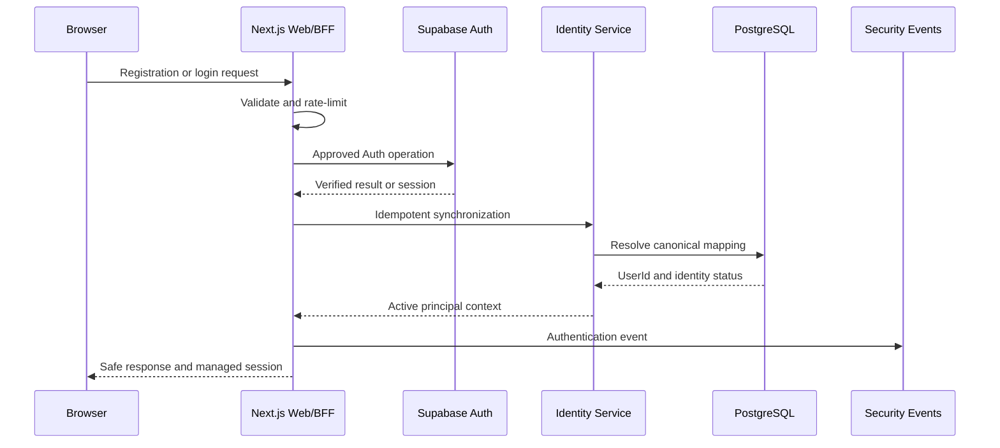
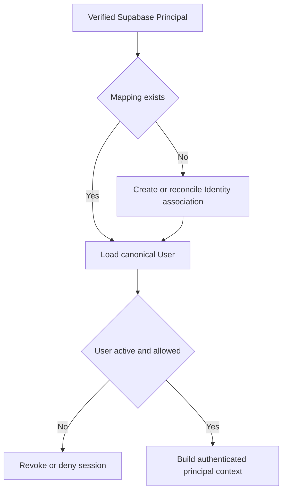
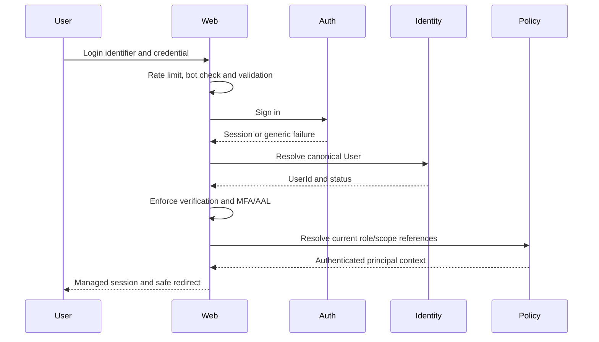

# Clasptek Prep Portal V2 — Authentication Flow

**Permanent location:** `docs/security/authentication-flow.md`  
**Owner:** Enterprise Identity Architect  
**Status:** Authoritative after Sprint 1.4

## Purpose

Define authentication architecture and operational flows using Supabase Auth while preserving the canonical Identity Domain.

## Scope

Registration, login, logout, verification, recovery, sessions, JWT validation, MFA, cookies, refresh and Identity synchronization.

## Architecture Alignment

This document is governed by the approved Clasptek Prep Portal V2 architecture and does not create new business domains or implementation behavior. It aligns with:

- Phase 0 — Enterprise Product and Solution Architecture.
- Phase 0 Addendum — Preparation Journey Architecture.
- Phase 0.5 — Canonical Domain, Business Rules and Logical Data Design.
- Engineering Implementation Governance.
- `v0.1.0-platform-foundation`.
- `v0.2.0-identity-domain-baseline`.
- Sprint 1.4 — Authentication, Authorization and Security.

The release-tagged repository, migrations, policies, package manifests, CI evidence and security fitness reports are authoritative for exact code symbols, route names, permission codes, claim names and policy identifiers. This documentation governs meaning, responsibility, control objectives and operational practice; it does not silently modify the implementation.

## Definitions

| Term               | Definition                                                                          |
| ------------------ | ----------------------------------------------------------------------------------- |
| Principal          | Authenticated or system identity requesting an action                               |
| Authentication     | Verification of the principal’s identity                                            |
| Authorization      | Decision whether a principal may perform an action on a resource                    |
| Role               | Named bundle of capabilities assigned within a defined scope                        |
| Permission         | Atomic authorization capability                                                     |
| Policy             | Rule combining permission, scope, relationship, state and context                   |
| RLS                | PostgreSQL Row Level Security policy applied automatically to table operations      |
| AAL                | Authentication Assurance Level represented in the authenticated session             |
| Session            | Authenticated continuity represented by an access token and refresh-token lifecycle |
| Service Identity   | Non-human principal used by a narrowly scoped trusted process                       |
| Break-glass Access | Exceptional, time-limited, audited privileged access                                |
| Security Event     | Structured record of a security-relevant fact                                       |
| Incident           | Confirmed or suspected event requiring coordinated response                         |
| Release Tag        | Immutable Git reference identifying the approved implementation                     |

## Security Standards Alignment

| Reference            | Baseline use                                                                              |
| -------------------- | ----------------------------------------------------------------------------------------- |
| OWASP ASVS 5.0.0     | Primary application-security verification catalogue                                       |
| OWASP Top 10:2025    | Risk-awareness and review coverage                                                        |
| Zero Trust           | Authenticate and authorize explicitly; assume no implicit trust based on network location |
| Defense in Depth     | Independent controls at client, edge, application, API, database and operational layers   |
| Least Privilege      | Minimum permission, scope, duration and data visibility                                   |
| Separation of Duties | Distinct creation, approval, administration, override and audit responsibilities          |
| Secure by Default    | Deny access unless an explicit policy grants it                                           |
| Secure by Design     | Security requirements are part of architecture, domain rules, migrations, APIs and tests  |

Alignment supports ISO 27001 preparation, SOC 2 readiness and penetration-testing evidence. It does not constitute certification.

## Core Rule

> Authentication consumes the Identity Domain; it does not redefine User, Identity or Profile.

## Supabase Auth Integration

Supabase Auth provides credential verification, token issuance, refresh rotation, Auth sessions and approved MFA capabilities. The platform provides abuse controls, redirect allowlists, Identity synchronization, account-state enforcement, cookie integration, security events and monitoring.

## Architecture

## Identity Synchronization

Rules:

- Idempotent.
- One provider subject maps to one approved Identity.
- Do not assume provider `sub` equals canonical `UserId` unless enforced by migration.
- Duplicate or conflicting mapping fails closed.
- Suspended/archived identity prevents normal access.
- Provider metadata is minimized and validated.

## Registration Flow

1. Receive approved registration DTO.
2. Validate format, password policy, consent and rate limits.
3. Return a non-enumerating response.
4. Call Supabase Auth registration.
5. Synchronize canonical User and Identity idempotently.
6. Create Profile through the Identity application service.
7. Record verification state.
8. Send verification using the approved provider.
9. Publish security events.
10. Do not grant business role or academy access merely from registration.

## Login Flow

Controls:

- Generic failures.
- rate and bot controls.
- active identity.
- verification policy.
- MFA for privileged staff.
- allowlisted return URL.
- success/failure security events.
- no role accepted from browser input.

## Logout Flow

Supports current-session logout, approved all-session revocation and privileged administrative revocation.

The platform calls the approved provider operation, clears managed cookies, invalidates cached principal context, emits a revocation event and redirects only to an allowlisted location.

Short-lived access tokens may remain cryptographically valid until expiry; high-risk actions may verify `session_id` against current session state.

## Email Verification

- Allowlisted redirects.
- one-time, time-limited token.
- no automatic business role.
- rate-limited resend.
- security event on completion.
- no token or full link in logs.

## Password Reset

1. Non-enumerating request response.
2. Rate and bot controls.
3. Approved provider reset message.
4. Validate redirect and recovery context.
5. Enforce password policy.
6. Revoke sessions according to policy.
7. Emit password and session events.
8. Send independent security notice where appropriate.

Support staff cannot view or set passwords.

## Session Creation

A sign-in creates a short-lived JWT access token, a rotated refresh-token lifecycle, a unique session identifier, AAL and an application principal context.

## Session Validation

1. Retrieve session through the approved SSR adapter.
2. Verify token signature.
3. Validate issuer, audience, expiry, not-before and subject.
4. Validate `session_id` and AAL where required.
5. Resolve canonical User.
6. confirm active identity.
7. resolve current authorization state for consequential access.
8. deny incomplete or inconsistent context.

Unverified client session payload is not trusted server-side.

## Session Revocation

Triggers:

- logout.
- password/recovery change.
- identity suspension/archive.
- administrative action.
- suspected token theft.
- unsafe role/scope change.
- security-policy change.

## MFA

- Mandatory for privileged staff.
- Privileged operations normally require AAL2.
- Enrollment/removal requires recent authentication.
- Secrets and recovery data are never logged.
- Failure is rate-limited and monitored.
- Lost-factor recovery is separately governed.

## Trusted Devices

Where implemented, trusted device is a revocable, expiring risk signal. It grants no role or permission and does not permanently bypass MFA. Sensitive operations may require fresh MFA.

If the release-tagged implementation has no trusted-device capability, this is an extension point, not a deployment claim.

## JWT Validation

Evaluate, where applicable:

- `iss`
- `aud`
- `exp`
- `iat`
- `nbf`
- `sub`
- `role` as database/API role
- `aal`
- `session_id`
- `is_anonymous`
- approved `app_metadata`

Rules:

- Do not use `user_metadata` for consequential authorization.
- Keep claims minimal.
- Resolve revocable authority from current database state or a versioned reference.
- Reject unknown key/algorithm.
- Bound clock skew.

## Cookie Strategy

- Approved Supabase SSR cookie adapter.
- `Secure` in production.
- approved `SameSite`, normally `Lax` for standard web flows.
- host-only unless cross-subdomain use is reviewed.
- path restricted as required.
- no token in URL.
- no cookie headers in logs.
- CSRF protection for state-changing requests.
- `HttpOnly` must match the approved SSR/client refresh design.
- exact names and lifetimes are configuration-authoritative.

## Refresh Strategy

- Use the approved Auth SDK.
- Do not duplicate refresh logic.
- Keep rotation and reuse detection enabled.
- Serialize concurrent refresh where necessary.
- Clear session and require reauthentication on unsafe failure.
- Never log refresh tokens.

## Failure Scenarios

| Scenario                      | Required behavior                                  |
| ----------------------------- | -------------------------------------------------- |
| Invalid credentials           | Generic failure and rate tracking                  |
| Unverified email              | Deny restricted access; provide verification path  |
| Suspended/archived User       | Reject/revoke and emit event                       |
| MFA required                  | Step-up; no privileged access                      |
| Expired access token          | Approved refresh                                   |
| Suspected refresh-token theft | Terminate session and alert                        |
| Mapping conflict              | Fail closed and investigate                        |
| Provider unavailable          | Safe outage response; no local credential fallback |
| Cookie corruption             | Clear and reauthenticate                           |
| JWT verification failure      | Reject and record safe event                       |
| Unsafe redirect               | Reject and use safe default                        |

## Security Events

RegistrationRequested, RegistrationCompleted, EmailVerificationRequested, EmailVerified, LoginSucceeded, LoginFailed, SessionStarted, SessionRevoked, PasswordResetRequested, PasswordChanged, MFAEnrolled, MFAChallengeSucceeded, MFAChallengeFailed, MFAFactorRemoved, IdentitySynchronizationFailed and SuspiciousAuthenticationDetected.

Exact names and versions are release-tag authoritative.

## Responsibilities

| Owner            | Responsibility                                         |
| ---------------- | ------------------------------------------------------ |
| Supabase Auth    | Credentials, token issuance, refresh and Auth sessions |
| Identity Service | Canonical User mapping and lifecycle                   |
| Web/BFF          | Flow orchestration, cookies and safe redirects         |
| Security Policy  | Assurance requirements                                 |
| Operations       | Monitoring and incidents                               |
| QA/AppSec        | Abuse, negative, replay and recovery testing           |

## Operational Guidance

- Test expired, revoked, malformed and cross-environment tokens.
- Keep redirect allowlists minimal.
- Verify MFA for privileged roles.
- Revoke sessions after sensitive recovery.
- Monitor synchronization failure.
- Never print session/cookie contents.

## Future Extension Points

Passkeys, enterprise SSO, risk-based step-up, device posture, passwordless flows and user session-management UI.

## Related ADRs and EDRs

### Architecture decisions

- Phase 0 ADR-023 — Shared PostgreSQL.
- Phase 0 ADR-025 — RBAC and ABAC.
- Phase 0 ADR-026 — Private Storage.
- Phase 0 ADR-027 — Transactional Outbox.
- Phase 0 ADR-029 — Sponsor Access.
- Phase 0 ADR-032 — Phase 0.5 Gate.
- Phase 0.5 ADR-014 — Shared-schema multi-academy tenancy with RLS.
- Phase 0.5 ADR-015 — Combined RBAC and ABAC.

### Engineering decisions

The release-tagged EDR Register is authoritative. Relevant decision areas include:

- Supabase SSR and session integration.
- Environment and secret separation.
- Security headers and cookie handling.
- Authorization policy evaluation.
- RLS policy conventions and testing.
- Structured logging and sensitive-data redaction.
- Observability and security-event publication.
- CI security gates and dependency scanning.
- Migration review and rollback.
