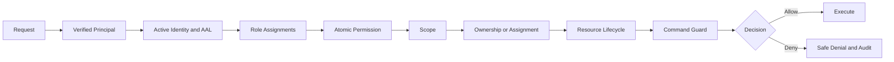
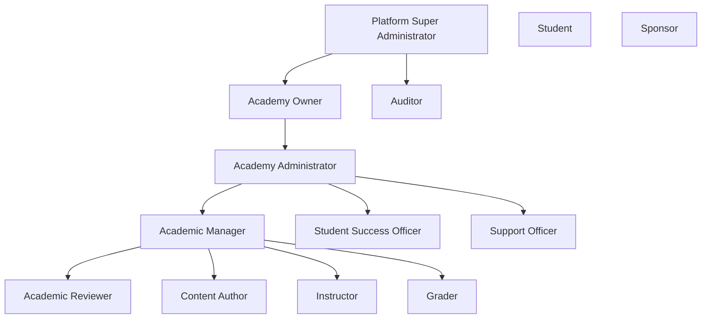

# Clasptek Prep Portal V2 — Authorization Model

**Permanent location:** `docs/security/authorization-model.md`  
**Owner:** Principal API Security Architect  
**Status:** Authoritative after Sprint 1.4

## Purpose

Define combined RBAC and ABAC, scoped roles, permissions, capability evaluation and enforcement at route, API and service layers.

## Scope

Human and system roles, permission groups, policy decisions, administrative override and future domain extensions.

## Architecture Alignment

This document is governed by the approved Clasptek Prep Portal V2 architecture and does not create new business domains or implementation behavior. It aligns with:

- Phase 0 — Enterprise Product and Solution Architecture.
- Phase 0 Addendum — Preparation Journey Architecture.
- Phase 0.5 — Canonical Domain, Business Rules and Logical Data Design.
- Engineering Implementation Governance.
- `v0.1.0-platform-foundation`.
- `v0.2.0-identity-domain-baseline`.
- Sprint 1.4 — Authentication, Authorization and Security.

The release-tagged repository, migrations, policies, package manifests, CI evidence and security fitness reports are authoritative for exact code symbols, route names, permission codes, claim names and policy identifiers. This documentation governs meaning, responsibility, control objectives and operational practice; it does not silently modify the implementation.

## Definitions

| Term               | Definition                                                                          |
| ------------------ | ----------------------------------------------------------------------------------- |
| Principal          | Authenticated or system identity requesting an action                               |
| Authentication     | Verification of the principal’s identity                                            |
| Authorization      | Decision whether a principal may perform an action on a resource                    |
| Role               | Named bundle of capabilities assigned within a defined scope                        |
| Permission         | Atomic authorization capability                                                     |
| Policy             | Rule combining permission, scope, relationship, state and context                   |
| RLS                | PostgreSQL Row Level Security policy applied automatically to table operations      |
| AAL                | Authentication Assurance Level represented in the authenticated session             |
| Session            | Authenticated continuity represented by an access token and refresh-token lifecycle |
| Service Identity   | Non-human principal used by a narrowly scoped trusted process                       |
| Break-glass Access | Exceptional, time-limited, audited privileged access                                |
| Security Event     | Structured record of a security-relevant fact                                       |
| Incident           | Confirmed or suspected event requiring coordinated response                         |
| Release Tag        | Immutable Git reference identifying the approved implementation                     |

## Security Standards Alignment

| Reference            | Baseline use                                                                              |
| -------------------- | ----------------------------------------------------------------------------------------- |
| OWASP ASVS 5.0.0     | Primary application-security verification catalogue                                       |
| OWASP Top 10:2025    | Risk-awareness and review coverage                                                        |
| Zero Trust           | Authenticate and authorize explicitly; assume no implicit trust based on network location |
| Defense in Depth     | Independent controls at client, edge, application, API, database and operational layers   |
| Least Privilege      | Minimum permission, scope, duration and data visibility                                   |
| Separation of Duties | Distinct creation, approval, administration, override and audit responsibilities          |
| Secure by Default    | Deny access unless an explicit policy grants it                                           |
| Secure by Design     | Security requirements are part of architecture, domain rules, migrations, APIs and tests  |

Alignment supports ISO 27001 preparation, SOC 2 readiness and penetration-testing evidence. It does not constitute certification.

## Architecture



## RBAC

Roles are bundles of permissions assigned within scope. Assignments are effective-dated, revocable, auditable and independent from Profile. A role is insufficient without resource and state checks.

## Permission Groups

| Group                   | Capabilities                                    |
| ----------------------- | ----------------------------------------------- |
| Identity Self-Service   | Approved own profile and session operations     |
| Identity Administration | Suspend/archive/restore and governed recovery   |
| Academy Administration  | Academy membership and safe settings            |
| Academic Authoring      | Draft content creation/editing                  |
| Academic Review         | Review, approval and publication                |
| Instruction             | Assigned learner/course operations              |
| Grading                 | Assigned submission review                      |
| Student Success         | Assigned interventions and summaries            |
| Support                 | Limited troubleshooting                         |
| Audit and Compliance    | Approved evidence access/export                 |
| Platform Administration | Global platform operations                      |
| Security Administration | Security policy, incident and privileged access |

Exact permission codes are release-tag authoritative.

## Canonical Roles

- Platform Super Administrator.
- Academy Owner.
- Academy Administrator.
- Academic Manager.
- Content Author.
- Academic Reviewer.
- Instructor.
- Grader.
- Student Success Officer.
- Support Officer.
- Auditor.
- Student.
- Sponsor.

## Role Hierarchy



This shows scope, not automatic inheritance. Only explicit permission mappings grant capability.

## Capability Model

```text
role assignment
+ permission
+ active interval
+ resource scope
+ relationship
+ resource state
+ authentication assurance
+ consent/field policy
+ command rule
= allowed capability
```

## Authorization Policies

Policies are named, versioned, deterministic, testable, deny-by-default, independent of UI and traceable to domain rules.

Inputs may include UserId, academy scope, assignment, ownership, Enrollment, resource state, consent, request time, AAL and command.

## Evaluation Order

```text
authenticated principal
→ active identity
→ required AAL
→ active membership/relationship
→ active role assignment
→ atomic permission
→ resource academy/scope
→ ownership or assignment
→ lifecycle state
→ consent/field policy
→ command guard
→ RLS defense in depth
```

## Decisions

| Outcome         | Meaning                               |
| --------------- | ------------------------------------- |
| Allow           | All rules pass                        |
| Deny            | Rule failed; no action                |
| Step-up         | Stronger authentication needed        |
| Not found       | Resource existence is not disclosed   |
| Conflict        | State or concurrency prevents action  |
| Review required | Governed workflow, never silent allow |

Use stable reason codes and correlation IDs.

## API Authorization

- Authenticate before sensitive loading.
- Resolve objects through scoped services.
- Authorize query and command separately.
- Never accept role or academy authority from request body.
- Check every object identifier.
- Use DTO allowlists.
- Audit privileged/override actions.
- Rate-limit sensitive operations.

## Route Authorization

| Route class    | Rule                                       |
| -------------- | ------------------------------------------ |
| Public         | Explicit allowlist and minimal data        |
| Authentication | Anonymous-accessible with abuse controls   |
| Self-service   | Verified principal and active identity     |
| Staff          | Scoped role and MFA policy                 |
| Administrative | Explicit permission and stronger assurance |
| Break-glass    | Separate command, time-limited and audited |

UI hiding is not authorization.

## Service Authorization

Services receive a verified principal, evaluate policy, load within scope, invoke domains after authorization and persist audit context. Workers use narrow service identities.

## ABAC

Approved attributes include academy, resource, ownership, assignment, Enrollment, lifecycle, consent, time and AAL. Future risk/device attributes require review and cannot rely on mutable client claims.

## Administrative Permissions

Separate membership, role assignment, security administration, academic administration, configuration, audit export, override and any future impersonation.

## Student Permissions

Student may manage approved own profile/session operations and future academic access through Enrollment and domain policy. Student cannot assign roles, inspect others, view answer keys, bypass state or alter audit.

## Instructor Permissions

Instructor access requires active assignment and scope. It does not grant payment, configuration, unrestricted Question Bank or cross-academy access.

## System Roles

| Role                      | Purpose                           | Rule                                                |
| ------------------------- | --------------------------------- | --------------------------------------------------- |
| `anon`                    | Unauthenticated database/API role | No business access except explicit public policy    |
| `authenticated`           | Verified provider role            | Still requires application policy and RLS           |
| Auth administration       | Provider-managed Auth operations  | Restricted to approved integration/hooks            |
| Migration role            | Controlled schema change          | CI/operations only                                  |
| Worker identity           | Background commands               | Narrow and auditable                                |
| Secret/service credential | Trusted server administration     | Bypasses RLS; exceptional and never browser-exposed |

## Super Administrator

- Platform-scoped.
- MFA mandatory.
- not used for routine work.
- cannot bypass audit.
- explicit permissions only.
- reason required for high-impact action.
- quarterly review.
- step-up or dual approval where required.
- no automatic unrestricted student-data access.

## Separation of Duties

- Author and final approver differ for high-risk content.
- Role administrator and auditor differ.
- Override differs from ordinary update.
- Academy Administrator remains academy-scoped.
- Support is narrower than security administration.
- Break-glass approval/use are attributable.

## Security Controls

Deny by default, MFA, scoped/effective-dated roles, permission matrix, RLS, negative tests, audit, no global role in Profile, no authorization from `user_metadata`, and explicit revocation.

## Responsibilities

| Owner                 | Responsibility               |
| --------------------- | ---------------------------- |
| Security Architecture | Policy model                 |
| Identity/Auth Team    | Principal and role lifecycle |
| Domain Owner          | Resource-specific rules      |
| API/AppSec            | Enforcement points           |
| Database Security     | RLS reflection               |
| QA                    | Permission matrix tests      |
| Operations            | Access reviews and incidents |

## Operational Guidance

- Quarterly role recertification.
- Automatic expiry/revocation.
- Test owner, other user, same academy, other academy and wrong state.
- Avoid wildcard permissions.
- Separate export, override and impersonation.
- Reauthenticate for sensitive changes.

## Future Extension Points

Delegated administration, sponsor consent, safe policy caching, policy explanation, privileged-access management and risk-based step-up.

## Related ADRs and EDRs

### Architecture decisions

- Phase 0 ADR-023 — Shared PostgreSQL.
- Phase 0 ADR-025 — RBAC and ABAC.
- Phase 0 ADR-026 — Private Storage.
- Phase 0 ADR-027 — Transactional Outbox.
- Phase 0 ADR-029 — Sponsor Access.
- Phase 0 ADR-032 — Phase 0.5 Gate.
- Phase 0.5 ADR-014 — Shared-schema multi-academy tenancy with RLS.
- Phase 0.5 ADR-015 — Combined RBAC and ABAC.

### Engineering decisions

The release-tagged EDR Register is authoritative. Relevant decision areas include:

- Supabase SSR and session integration.
- Environment and secret separation.
- Security headers and cookie handling.
- Authorization policy evaluation.
- RLS policy conventions and testing.
- Structured logging and sensitive-data redaction.
- Observability and security-event publication.
- CI security gates and dependency scanning.
- Migration review and rollback.
