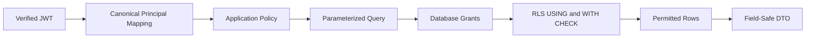

# Clasptek Prep Portal V2 — Row Level Security Strategy

**Permanent location:** `docs/security/rls-strategy.md`  
**Owner:** Principal Database Security Architect  
**Status:** Authoritative after Sprint 1.4

## Purpose

Define PostgreSQL Row Level Security as independent defense in depth for platform data.

## Scope

Principal mapping, JWT claims, database roles, owner/admin access, policy design, naming, versioning, testing, performance and future domain policy patterns.

## Architecture Alignment

This document is governed by the approved Clasptek Prep Portal V2 architecture and does not create new business domains or implementation behavior. It aligns with:

- Phase 0 — Enterprise Product and Solution Architecture.
- Phase 0 Addendum — Preparation Journey Architecture.
- Phase 0.5 — Canonical Domain, Business Rules and Logical Data Design.
- Engineering Implementation Governance.
- `v0.1.0-platform-foundation`.
- `v0.2.0-identity-domain-baseline`.
- Sprint 1.4 — Authentication, Authorization and Security.

The release-tagged repository, migrations, policies, package manifests, CI evidence and security fitness reports are authoritative for exact code symbols, route names, permission codes, claim names and policy identifiers. This documentation governs meaning, responsibility, control objectives and operational practice; it does not silently modify the implementation.

## Definitions

| Term               | Definition                                                                          |
| ------------------ | ----------------------------------------------------------------------------------- |
| Principal          | Authenticated or system identity requesting an action                               |
| Authentication     | Verification of the principal’s identity                                            |
| Authorization      | Decision whether a principal may perform an action on a resource                    |
| Role               | Named bundle of capabilities assigned within a defined scope                        |
| Permission         | Atomic authorization capability                                                     |
| Policy             | Rule combining permission, scope, relationship, state and context                   |
| RLS                | PostgreSQL Row Level Security policy applied automatically to table operations      |
| AAL                | Authentication Assurance Level represented in the authenticated session             |
| Session            | Authenticated continuity represented by an access token and refresh-token lifecycle |
| Service Identity   | Non-human principal used by a narrowly scoped trusted process                       |
| Break-glass Access | Exceptional, time-limited, audited privileged access                                |
| Security Event     | Structured record of a security-relevant fact                                       |
| Incident           | Confirmed or suspected event requiring coordinated response                         |
| Release Tag        | Immutable Git reference identifying the approved implementation                     |

## Security Standards Alignment

| Reference            | Baseline use                                                                              |
| -------------------- | ----------------------------------------------------------------------------------------- |
| OWASP ASVS 5.0.0     | Primary application-security verification catalogue                                       |
| OWASP Top 10:2025    | Risk-awareness and review coverage                                                        |
| Zero Trust           | Authenticate and authorize explicitly; assume no implicit trust based on network location |
| Defense in Depth     | Independent controls at client, edge, application, API, database and operational layers   |
| Least Privilege      | Minimum permission, scope, duration and data visibility                                   |
| Separation of Duties | Distinct creation, approval, administration, override and audit responsibilities          |
| Secure by Default    | Deny access unless an explicit policy grants it                                           |
| Secure by Design     | Security requirements are part of architecture, domain rules, migrations, APIs and tests  |

Alignment supports ISO 27001 preparation, SOC 2 readiness and penetration-testing evidence. It does not constitute certification.

## Why RLS Exists

RLS protects data when accessed through application services, Data APIs or third-party tooling. It does not replace application authorization, domain invariants, API object checks, constraints, field control or audit.

## Architecture



## Identity Mapping

- JWT subject maps to canonical User through approved synchronization.
- Do not assume `auth.uid()` equals canonical `UserId` unless migration-enforced.
- Mapping must be unique and active.
- Suspended/archived identity fails closed.
- Mapping conflict emits a security event.
- Helper functions expose no unnecessary personal data.

## JWT Claims

Relevant claims may include `sub`, `role`, `aal`, `session_id`, `is_anonymous` and approved `app_metadata`.

- `role` is database/API role, not business role.
- `user_metadata` is not trusted for authorization.
- Claims may be stale until refresh.
- Revocable authority resolves from database state or a versioned reference.
- Claims are minimized.

## Authenticated Users

The `authenticated` role receives only explicit grants and RLS policies. Authentication alone grants no cross-user, academy, staff, administrative or academic entitlement.

## Anonymous Users

The `anon` role has no private business-table access. Public data uses explicit views/policies and abuse controls. Privileged functions are unavailable.

## Service Role

Secret/service credentials bypass RLS and therefore are:

- server-only.
- excluded from browser bundles.
- stored in the approved secret store.
- exceptional, not normal request credentials.
- monitored and attributable where possible.
- rotated immediately after exposure.
- replaced by narrow service identities or RPCs where practical.

## Owner Access

Logical owner policy:

```text
authenticated principal
AND active canonical identity
AND row.owner_user_id = canonical UserId
AND row state permits operation
```

`WITH CHECK` prevents ownership or academy-scope tampering.

## Administrator Access

Requires active role assignment, atomic permission, correct scope, required AAL, compatible state and audit. Broad `is_admin` booleans are prohibited.

## Policy Design

1. Enable RLS before exposed grants.
2. Deny by default.
3. Separate policies by action.
4. Use `USING` and `WITH CHECK`.
5. Scope by canonical identity and resource ownership.
6. Keep predicates deterministic and indexable.
7. Avoid mutable client claims.
8. Avoid broad OR conditions.
9. Minimize privileged helper functions.
10. Test positive and negative paths.
11. Use explicit public views for public data.
12. Never disable RLS in production troubleshooting.

## Policy Naming

Preferred governance pattern:

```text
rls_<schema>_<table>_<action>_<subject>_v<version>
```

Subjects may include owner, academy_admin, assigned_instructor, platform_admin, service_worker and public_catalogue.

An existing release-tagged equivalent remains authoritative; this document does not require destructive renaming.

## Policy Versioning

- Migration-only change.
- No manual production edit.
- Record reason, roles and tests.
- Replace atomically.
- retain migration history.
- update matrix and threat model.
- review query plans.
- roll back to a safe deny state.

## Identity Policies

| Object                      | Access objective                                             |
| --------------------------- | ------------------------------------------------------------ |
| User                        | Subject and narrowly scoped identity/security administration |
| Identity association        | Subject-safe read; privileged Identity service mutation      |
| Profile                     | Subject read/update of approved fields                       |
| Role assignment             | Subject-safe summary; authorized administration mutation     |
| Session/security projection | Subject own; security administration under policy            |
| Audit/security record       | Subject notices only; detailed security/audit access         |

Exact objects and policies are migration-authoritative.

## Future Academic Policies

- Enrollment is the entitlement source.
- Journey does not independently grant course access.
- Instructor requires assignment.
- Sponsor requires delegated relationship and consent.
- Draft/review differs from published access.
- Attempt/response/grade access is owner and assignment scoped.
- Answer keys remain isolated.

## Student Isolation

Only own identity/profile and future entitled academic data. Negative tests cover another user in same academy and another academy.

## Instructor Isolation

Requires active academy membership, instructor role, assignment, resource state, field policy and command permission.

## Assessment Isolation

Future rules:

- student sees own eligible delivery, attempt and released result.
- responses are writable only in allowed state.
- submitted response is immutable except controlled correction.
- grader sees assigned work.
- answer key never appears in student policies.
- simulation and assessment remain distinct.

## Question Bank Isolation

Distinguish author, reviewer, approver, delivered published use, retired content, answer-key isolation and exposure controls. Students never query unrestricted Question Bank tables.

## Administrative Override

Requires dedicated permission, AAL, reason, narrow scope and audit. No ordinary administrator receives blanket bypass. Break-glass is time-limited and reviewed.

## Testing Strategy

Every policy tests:

- owner allow.
- non-owner deny.
- same-academy unauthorized deny.
- cross-academy deny.
- anonymous deny.
- wrong-role deny.
- expired-role deny.
- wrong-state deny.
- insert ownership tamper.
- update scope tamper.
- delete/archive rule.
- service identity.
- stale claim.
- helper privilege.
- query plan and index.

Tests run in CI against real migrations.

## Performance

- Index policy predicates.
- Use bounded stable helpers.
- Avoid per-row expensive functions.
- Use optimizer-friendly stable JWT helper evaluation.
- avoid deeply nested joins.
- test representative volume.
- inspect `EXPLAIN`.
- monitor slow policy queries.
- never weaken security to solve performance.
- use approved projections or authorization mappings when needed.

## Security Controls

Default deny, explicit grants, RLS, fixed search path, no public helper execution, no mutable claim as sole authority, migration-only changes, negative tests, audited override and server-only bypass credentials.

## Responsibilities

| Owner               | Responsibility                        |
| ------------------- | ------------------------------------- |
| Database Security   | Policy design, grants and performance |
| Domain Owner        | Access semantics                      |
| Identity/Auth       | Principal mapping and claims          |
| AppSec/API Security | Application/RLS consistency           |
| QA                  | SQL and integration negative tests    |
| DevSecOps           | Migration and CI enforcement          |
| Operations          | Monitoring and emergency response     |

## Operational Guidance

- Missing rows may be correct denial.
- Use controlled test principals.
- Never disable RLS to diagnose.
- Treat unexpectedly broad results as a security incident.
- Maintain emergency deny/revoke migrations.
- Re-run matrix after role, claim or relationship change.

## Future Extension Points

Academy, Enrollment, Course, sponsor consent, assessment, answer isolation, vector/RAG permissions, storage policies, residency and safe authorization caching.

## Related ADRs and EDRs

### Architecture decisions

- Phase 0 ADR-023 — Shared PostgreSQL.
- Phase 0 ADR-025 — RBAC and ABAC.
- Phase 0 ADR-026 — Private Storage.
- Phase 0 ADR-027 — Transactional Outbox.
- Phase 0 ADR-029 — Sponsor Access.
- Phase 0 ADR-032 — Phase 0.5 Gate.
- Phase 0.5 ADR-014 — Shared-schema multi-academy tenancy with RLS.
- Phase 0.5 ADR-015 — Combined RBAC and ABAC.

### Engineering decisions

The release-tagged EDR Register is authoritative. Relevant decision areas include:

- Supabase SSR and session integration.
- Environment and secret separation.
- Security headers and cookie handling.
- Authorization policy evaluation.
- RLS policy conventions and testing.
- Structured logging and sensitive-data redaction.
- Observability and security-event publication.
- CI security gates and dependency scanning.
- Migration review and rollback.
