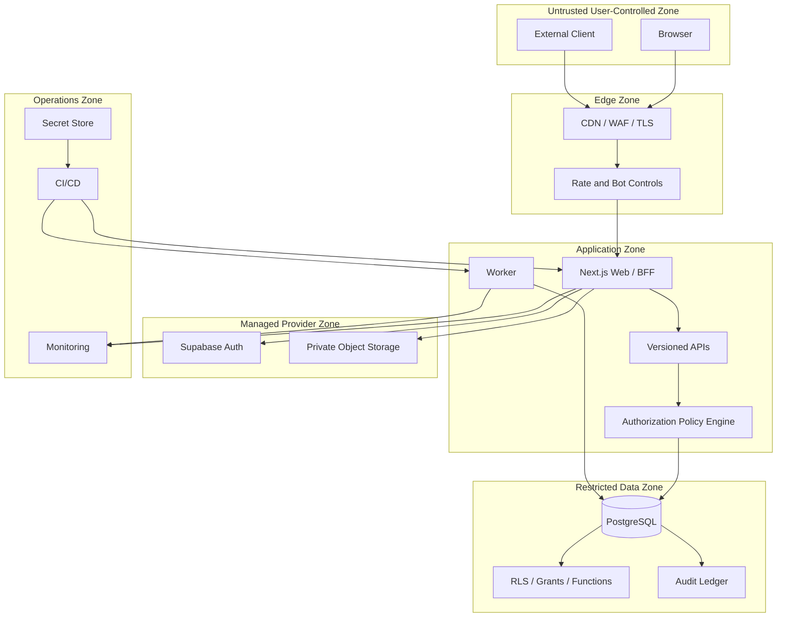
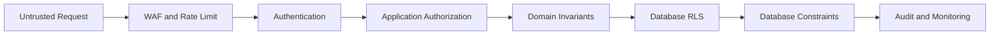

# Clasptek Prep Portal V2 — Security Model

**Permanent location:** `docs/security/security-model.md`  
**Owner:** Principal Security Architect  
**Status:** Authoritative after Sprint 1.4

## Purpose

This document defines the approved end-to-end security architecture, trust boundaries, control layers and responsibility model.

## Scope

Identity, authentication, authorization, application, API, database, infrastructure, secrets, environments, observability and security operations.

## Architecture Alignment

This document is governed by the approved Clasptek Prep Portal V2 architecture and does not create new business domains or implementation behavior. It aligns with:

- Phase 0 — Enterprise Product and Solution Architecture.
- Phase 0 Addendum — Preparation Journey Architecture.
- Phase 0.5 — Canonical Domain, Business Rules and Logical Data Design.
- Engineering Implementation Governance.
- `v0.1.0-platform-foundation`.
- `v0.2.0-identity-domain-baseline`.
- Sprint 1.4 — Authentication, Authorization and Security.

The release-tagged repository, migrations, policies, package manifests, CI evidence and security fitness reports are authoritative for exact code symbols, route names, permission codes, claim names and policy identifiers. This documentation governs meaning, responsibility, control objectives and operational practice; it does not silently modify the implementation.

## Definitions

| Term               | Definition                                                                          |
| ------------------ | ----------------------------------------------------------------------------------- |
| Principal          | Authenticated or system identity requesting an action                               |
| Authentication     | Verification of the principal’s identity                                            |
| Authorization      | Decision whether a principal may perform an action on a resource                    |
| Role               | Named bundle of capabilities assigned within a defined scope                        |
| Permission         | Atomic authorization capability                                                     |
| Policy             | Rule combining permission, scope, relationship, state and context                   |
| RLS                | PostgreSQL Row Level Security policy applied automatically to table operations      |
| AAL                | Authentication Assurance Level represented in the authenticated session             |
| Session            | Authenticated continuity represented by an access token and refresh-token lifecycle |
| Service Identity   | Non-human principal used by a narrowly scoped trusted process                       |
| Break-glass Access | Exceptional, time-limited, audited privileged access                                |
| Security Event     | Structured record of a security-relevant fact                                       |
| Incident           | Confirmed or suspected event requiring coordinated response                         |
| Release Tag        | Immutable Git reference identifying the approved implementation                     |

## Security Standards Alignment

| Reference            | Baseline use                                                                              |
| -------------------- | ----------------------------------------------------------------------------------------- |
| OWASP ASVS 5.0.0     | Primary application-security verification catalogue                                       |
| OWASP Top 10:2025    | Risk-awareness and review coverage                                                        |
| Zero Trust           | Authenticate and authorize explicitly; assume no implicit trust based on network location |
| Defense in Depth     | Independent controls at client, edge, application, API, database and operational layers   |
| Least Privilege      | Minimum permission, scope, duration and data visibility                                   |
| Separation of Duties | Distinct creation, approval, administration, override and audit responsibilities          |
| Secure by Default    | Deny access unless an explicit policy grants it                                           |
| Secure by Design     | Security requirements are part of architecture, domain rules, migrations, APIs and tests  |

Alignment supports ISO 27001 preparation, SOC 2 readiness and penetration-testing evidence. It does not constitute certification.

## Security Architecture



## Security Layers

| Layer          | Controls                                                                                |
| -------------- | --------------------------------------------------------------------------------------- |
| Client         | No trusted authorization state, safe rendering, CSRF/XSS controls, no privileged secret |
| Edge           | TLS, WAF, rate limits, bot and request-size controls                                    |
| Authentication | Supabase Auth, verification, MFA, signed JWTs and session lifecycle                     |
| Application    | Contract validation, policy evaluation, object authorization and safe errors            |
| API            | Versioned contracts, authorization, idempotency and abuse controls                      |
| Data           | RLS, grants, constraints, restricted functions, encryption and audit                    |
| Worker         | Narrow service identity, job authorization and idempotency                              |
| CI/CD          | Protected branches, scanning, approvals and artifact integrity                          |
| Operations     | Monitoring, incident response, access review and evidence retention                     |

## Identity

- Identity owns User, Identity and Profile.
- Supabase Auth authenticates; it does not own the business User aggregate.
- Provider principal `sub` is synchronized to canonical User.
- Raw provider SDK types remain behind an anti-corruption layer.
- Suspended or archived identity prevents normal access.

## Authentication

- Credential verification and token issuance are delegated to Supabase Auth.
- Registration and login are orchestrated by the platform.
- Verification and MFA assurance are enforced before privileged access.
- Sessions use short-lived access tokens and controlled refresh rotation.
- Passwords, tokens, MFA secrets and recovery secrets are never logged.

## Authorization

Effective permission is:

```text
verified principal
∩ active identity
∩ required authentication assurance
∩ active role assignment
∩ atomic permission
∩ academy/resource scope
∩ ownership or assignment relationship
∩ lifecycle state
∩ consent and field policy
∩ command-specific guard
```

A role alone never grants unrestricted access.

## Access Control

- RBAC defines named capability bundles.
- ABAC applies scope, ownership, assignment, relationship, consent, state and time.
- Application policy controls business commands.
- RLS independently controls rows.
- DTOs and views enforce field minimization.
- Overrides require explicit permission, reason, MFA and audit.

## Application Layer Security

- Validate every external contract.
- Enforce domain and command invariants.
- Authorize queries and commands separately.
- Use optimistic concurrency and transactions.
- Return stable, safe error codes.
- Apply CSRF protection to cookie-authenticated state changes.
- Never expose service secrets or provider payloads.

## API Security

- Authenticate before sensitive resource resolution.
- Authorize by object, action and scope.
- Prevent mass assignment through allowlisted DTOs.
- Apply per-principal and per-IP abuse controls.
- Use idempotency for externally repeatable commands.
- Validate content type, size and file type.
- Restrict CORS to approved origins.
- Verify webhook signatures and replay windows.
- Restrict outbound URLs to prevent SSRF.

## Infrastructure Security

- Separate local, test, staging and production.
- Isolate secrets and service identities.
- Protect CI environments and deployment approvals.
- Restrict administrative consoles.
- Monitor provider configuration drift.
- Maintain backup and restoration evidence.

## Database Security

- Enable RLS on exposed business tables.
- Use minimal grants.
- Keep service/secret keys server-only because they bypass RLS.
- Review security-definer functions as exceptional privileged code.
- Keep constraints as final integrity boundaries.
- Index and performance-test policy predicates.
- Change policy only through migrations.

## Secrets Management

- No secret in source, client bundles, logs or screenshots.
- Use environment-specific secret storage.
- Audit secret access.
- Rotate after exposure, role change or provider change.
- Prefer short-lived credentials or workload identity.
- Never include secret values in traces or errors.

## Environment Security

| Environment | Data                         | Access                                 |
| ----------- | ---------------------------- | -------------------------------------- |
| Local       | Synthetic                    | Developer-owned, no production secrets |
| Test        | Synthetic fixtures           | CI and test identities                 |
| Staging     | Synthetic or approved masked | Restricted engineering and QA          |
| Production  | Real                         | Approved operations, MFA and audit     |

## Logging Security

- Structured and redacted.
- Authentication failures do not reveal account existence.
- Tokens, cookies, credentials, raw submissions and sensitive payloads are prohibited.
- Security and audit logs are access-controlled.
- Export is privileged and audited.

## Observability

Carries request, trace, correlation, causation, principal/session references, service, environment, release, event type and safe outcome. Observability is never an authorization source.

## Security Events

- Registration and verification.
- Login success/failure.
- Logout and session revocation.
- Password and recovery changes.
- MFA lifecycle.
- Role, permission and scope changes.
- Policy and RLS changes.
- Break-glass use.
- suspicious access.
- secret/configuration changes.
- deployment and migration security events.

## Trust Boundaries

| Boundary                      | Treatment                                             |
| ----------------------------- | ----------------------------------------------------- |
| Browser to Edge               | Treat all input and headers as untrusted              |
| Edge to Web                   | Revalidate request and principal                      |
| Web to Auth                   | Approved SDK and redirect allowlist                   |
| Web/API to Application        | Verified principal and execution context              |
| Application to Database       | Least-privileged connection and RLS context           |
| Worker to Database            | Narrow service identity                               |
| Provider callback to Platform | Signature, issuer, state, nonce and replay validation |
| CI/CD to Environment          | Protected approvals and isolated secrets              |

## Attack Surface

- Public forms.
- Authentication and recovery.
- Session cookies and refresh.
- APIs.
- file uploads and signed URLs.
- callbacks and webhooks.
- Data API and RLS.
- administration.
- CI/CD and dependencies.
- logs, support tools and backups.

## Zero Trust

- Network location grants no trust.
- Every request is authenticated or explicitly anonymous.
- Authorization is evaluated at service and database layers.
- Trusted device is a signal, not permanent bypass.
- Privileged actions require stronger assurance.
- Service-to-service calls use explicit identities.

## Defense in Depth



## Least Privilege

- Minimum role, permission, scope and duration.
- Separate read, write, approve, override and export.
- Minimal service identity.
- Explicit break-glass.
- Quarterly privileged access review.

## Secure by Default

- New tables are inaccessible until policy approval.
- New routes require authentication unless explicitly public.
- New permissions are unassigned.
- New providers are disabled until reviewed.
- Missing context denies access.

## Secure by Design

Security is included in ADRs, EDRs, domain ownership, APIs, migrations, state machines, events, tests, observability and release gates.

## Responsibilities

| Owner                 | Responsibility                       |
| --------------------- | ------------------------------------ |
| Security Architecture | Model and controls                   |
| Identity Team         | Principal mapping and lifecycle      |
| Auth/Security Team    | Authentication, roles and policies   |
| Domain Teams          | Resource rules and classification    |
| Database Security     | RLS, grants and functions            |
| DevSecOps             | CI, secrets, deployment and scans    |
| Operations            | Monitoring and incidents             |
| QA/AppSec             | Negative, abuse and regression tests |

## Operational Guidance

- Verify current session and policy state for high-risk actions.
- Never use client-supplied role names.
- Keep JWT claims small and stable.
- Use database state for revocable authority.
- Deny when Identity synchronization is incomplete.
- Maintain emergency deny procedures.
- Include release version in security events.

## Future Extension Points

- Enterprise SSO and passkeys.
- Risk-based authentication.
- Device posture.
- Central policy decision service.
- SIEM/SOAR.
- sponsor and consent policy.
- AI security layer when AI is approved.

## Related ADRs and EDRs

### Architecture decisions

- Phase 0 ADR-023 — Shared PostgreSQL.
- Phase 0 ADR-025 — RBAC and ABAC.
- Phase 0 ADR-026 — Private Storage.
- Phase 0 ADR-027 — Transactional Outbox.
- Phase 0 ADR-029 — Sponsor Access.
- Phase 0 ADR-032 — Phase 0.5 Gate.
- Phase 0.5 ADR-014 — Shared-schema multi-academy tenancy with RLS.
- Phase 0.5 ADR-015 — Combined RBAC and ABAC.

### Engineering decisions

The release-tagged EDR Register is authoritative. Relevant decision areas include:

- Supabase SSR and session integration.
- Environment and secret separation.
- Security headers and cookie handling.
- Authorization policy evaluation.
- RLS policy conventions and testing.
- Structured logging and sensitive-data redaction.
- Observability and security-event publication.
- CI security gates and dependency scanning.
- Migration review and rollback.
