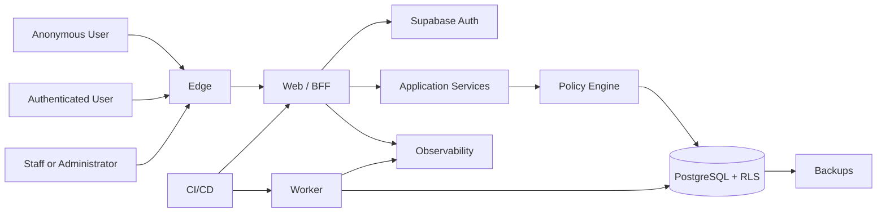

# Clasptek Prep Portal V2 — Threat Model

**Permanent location:** `docs/security/threat-model.md`  
**Owner:** Principal Security Architect  
**Method:** STRIDE with likelihood/impact assessment  
**Status:** Authoritative baseline after Sprint 1.4

## Purpose

Identify assets, actors, trust zones, attack surfaces, threats, mitigations and residual risks.

## Scope

Identity, Authentication, Authorization, Security, web, worker, Supabase Auth, PostgreSQL/RLS, CI/CD, configuration, observability and administration.

## Architecture Alignment

This document is governed by the approved Clasptek Prep Portal V2 architecture and does not create new business domains or implementation behavior. It aligns with:

- Phase 0 — Enterprise Product and Solution Architecture.
- Phase 0 Addendum — Preparation Journey Architecture.
- Phase 0.5 — Canonical Domain, Business Rules and Logical Data Design.
- Engineering Implementation Governance.
- `v0.1.0-platform-foundation`.
- `v0.2.0-identity-domain-baseline`.
- Sprint 1.4 — Authentication, Authorization and Security.

The release-tagged repository, migrations, policies, package manifests, CI evidence and security fitness reports are authoritative for exact code symbols, route names, permission codes, claim names and policy identifiers. This documentation governs meaning, responsibility, control objectives and operational practice; it does not silently modify the implementation.

## Definitions

| Term               | Definition                                                                          |
| ------------------ | ----------------------------------------------------------------------------------- |
| Principal          | Authenticated or system identity requesting an action                               |
| Authentication     | Verification of the principal’s identity                                            |
| Authorization      | Decision whether a principal may perform an action on a resource                    |
| Role               | Named bundle of capabilities assigned within a defined scope                        |
| Permission         | Atomic authorization capability                                                     |
| Policy             | Rule combining permission, scope, relationship, state and context                   |
| RLS                | PostgreSQL Row Level Security policy applied automatically to table operations      |
| AAL                | Authentication Assurance Level represented in the authenticated session             |
| Session            | Authenticated continuity represented by an access token and refresh-token lifecycle |
| Service Identity   | Non-human principal used by a narrowly scoped trusted process                       |
| Break-glass Access | Exceptional, time-limited, audited privileged access                                |
| Security Event     | Structured record of a security-relevant fact                                       |
| Incident           | Confirmed or suspected event requiring coordinated response                         |
| Release Tag        | Immutable Git reference identifying the approved implementation                     |

## Security Standards Alignment

| Reference            | Baseline use                                                                              |
| -------------------- | ----------------------------------------------------------------------------------------- |
| OWASP ASVS 5.0.0     | Primary application-security verification catalogue                                       |
| OWASP Top 10:2025    | Risk-awareness and review coverage                                                        |
| Zero Trust           | Authenticate and authorize explicitly; assume no implicit trust based on network location |
| Defense in Depth     | Independent controls at client, edge, application, API, database and operational layers   |
| Least Privilege      | Minimum permission, scope, duration and data visibility                                   |
| Separation of Duties | Distinct creation, approval, administration, override and audit responsibilities          |
| Secure by Default    | Deny access unless an explicit policy grants it                                           |
| Secure by Design     | Security requirements are part of architecture, domain rules, migrations, APIs and tests  |

Alignment supports ISO 27001 preparation, SOC 2 readiness and penetration-testing evidence. It does not constitute certification.

## System Diagram

## Assets

| Asset                     | Objectives                                      |
| ------------------------- | ----------------------------------------------- |
| User/Profile data         | Confidentiality, integrity and lawful retention |
| Credentials               | Confidentiality and compromise resistance       |
| Access/refresh tokens     | Confidentiality, integrity and revocation       |
| MFA and recovery material | Confidentiality and controlled lifecycle        |
| Roles and policies        | Integrity and least privilege                   |
| RLS policies and grants   | Integrity and complete isolation                |
| Audit/security events     | Integrity, availability and non-repudiation     |
| Database and backups      | Confidentiality, integrity and recoverability   |
| Source and artifacts      | Integrity and provenance                        |
| CI/CD secrets             | Confidentiality and controlled use              |
| Service identities        | Scope and accountability                        |

## Actors

Anonymous visitor, Student, Instructor, Academy Administrator, Platform Administrator, Support, Auditor, Worker identity, identity provider, accidental insider, malicious insider, external attacker, compromised dependency/provider and authorized security tester.

## Trust Zones

| Zone                     | Trust                      |
| ------------------------ | -------------------------- |
| User device and internet | Untrusted                  |
| CDN/WAF                  | Controlled edge            |
| Web/BFF                  | Trusted application        |
| Worker                   | Trusted service            |
| Supabase Auth            | Managed provider           |
| PostgreSQL/RLS           | Restricted data            |
| CI/CD                    | Privileged engineering     |
| Monitoring/Audit         | Restricted operations      |
| Backups                  | Highly restricted recovery |

## Entry Points

Registration, verification, login, logout, refresh, password recovery, MFA, APIs, route handlers, callbacks, uploads, Data API, administration, CI/CD, support and audit tools.

## STRIDE Analysis

### Spoofing

Threats: credential stuffing, session theft, forged JWT, callback impersonation, service-identity misuse and account enumeration.

Controls: rate limits, bot controls, verification, MFA, signature/issuer/audience/expiry checks, secure cookie handling, callback state/nonce validation, named service identities and monitoring.

Residual: compromised user device or email account.

### Tampering

Threats: unauthorized Profile/role change, JWT manipulation, RLS/migration tampering, CI artifact modification, audit alteration and replay.

Controls: signed JWTs, command validation, concurrency, protected branches, RLS, constraints, immutable artifacts, idempotency and append-only audit.

Residual: privileged insider or compromised CI.

### Repudiation

Threats: disputed administrator change, unattributed service action and incomplete evidence.

Controls: actor, reason, correlation, causation, session and trace IDs; immutable audit; time synchronization; deployment provenance.

Residual: provider logs may have different retention.

### Information Disclosure

Threats: cross-user/academy access, secrets in logs/client bundles, verbose errors, exposed backups/URLs, excessive JWT claims and support leakage.

Controls: application authorization, RLS, minimal grants, redaction, safe errors, private storage, minimal claims and restricted operations.

Residual: configuration or policy defect.

### Denial of Service

Threats: authentication floods, expensive RLS, oversized payloads, queue exhaustion, provider outage and connection exhaustion.

Controls: rate and size limits, indexed predicates, timeouts, queues, pooling, health monitoring and provider runbooks.

Residual: distributed attacks and regional provider outage.

### Elevation of Privilege

Threats: client-supplied role, stale JWT, secret-key exposure, unsafe privileged function, academy-to-platform escalation and grant-based RLS bypass.

Controls: database role assignments, policy engine, stronger assurance, current-state checks, server-only secret, fixed-search-path functions, scope tests and break-glass controls.

Residual: Platform Super Administrator or service-secret compromise.

## Supply Chain Risks

- Compromised dependency or CI action.
- Typosquatting.
- unreviewed transitive update.
- registry credential compromise.
- untraceable artifact.

Controls: lockfile, scanning, protected updates, minimal dependencies, pinned actions where practical, provenance, release tags and secret scanning.

## Cloud Risks

Provider/project misconfiguration, public exposure, weak console access, outage, backup failure, unsafe redirect and cross-environment secret reuse.

Controls: separate projects, MFA, configuration review, redirect allowlists, restore tests, provider monitoring and least-privileged access.

## Database Risks

Missing/permissive RLS, unindexed policy, privileged function abuse, unsafe SQL, cross-academy joins and destructive migration.

Controls: default deny, SQL tests, parameterized access, policy matrix, plan review, restricted functions and reversible migrations.

## API Risks

Broken object/function authorization, mass assignment, excessive data exposure, resource exhaustion, replay, unsafe webhooks and SSRF.

Controls: scoped services, command policy, DTO allowlists, response minimization, rate/size limits, idempotency, signature verification and outbound allowlists.

## Client Risks

XSS, CSRF, clickjacking, malicious extensions, device compromise, token caching and client role manipulation.

Controls: CSP, encoding, SameSite/CSRF controls, frame protection, no client secret, server authorization and minimal persistence.

## Risk Matrix

| Likelihood     | Value | Impact   | Value |
| -------------- | ----: | -------- | ----: |
| Rare           |     1 | Minor    |     1 |
| Unlikely       |     2 | Moderate |     2 |
| Possible       |     3 | Major    |     3 |
| Likely         |     4 | Severe   |     4 |
| Almost certain |     5 | Critical |     5 |

Risk score = likelihood × impact.

| Score | Rating   |
| ----: | -------- |
|   1–4 | Low      |
|   5–9 | Medium   |
| 10–16 | High     |
| 17–25 | Critical |

## Threat Register

| ID    | Threat                        |    Inherent | Key controls                                                      | Residual |
| ----- | ----------------------------- | ----------: | ----------------------------------------------------------------- | -------- |
| TM-01 | Credential stuffing           |     16 High | Rate limits, bot controls, MFA                                    | 8 Medium |
| TM-02 | Session/token theft           | 20 Critical | Secure cookies, redaction, short token lifetime, session controls | 10 High  |
| TM-03 | Broken object authorization   | 20 Critical | Policy engine, scoped repositories, RLS, negative tests           | 6 Medium |
| TM-04 | Cross-academy RLS failure     | 25 Critical | Default deny, scope, SQL tests and review                         | 8 Medium |
| TM-05 | Service-secret exposure       | 25 Critical | Server-only storage, scanning and rotation                        | 10 High  |
| TM-06 | Privileged account compromise | 25 Critical | MFA, least privilege, access review                               | 10 High  |
| TM-07 | Supply-chain compromise       | 20 Critical | Lockfile, scanning, protected updates, provenance                 | 10 High  |
| TM-08 | Provider outage               |     12 High | Health checks and incident runbook                                | 8 Medium |
| TM-09 | Audit evidence loss           |     12 High | Append-only retention and backup                                  | 4 Low    |
| TM-10 | Expensive RLS query           |     12 High | Indexes, plan tests and limits                                    | 6 Medium |
| TM-11 | Malicious insider             | 20 Critical | Separation of duties, audit and scoped access                     | 10 High  |
| TM-12 | Recovery-flow takeover        | 20 Critical | Redirect controls, rate limits and session revocation             | 8 Medium |

## Security Assumptions

- TLS is enforced.
- Provider signing keys are operated according to contract.
- Production secrets are absent from browsers and lower environments.
- Time synchronization is reliable.
- Every exposed business table has approved RLS.
- Consequential authorization does not rely solely on mutable client claims.
- Privileged staff use MFA.
- Identity synchronization is idempotent.
- Release artifacts and migrations are traceable.

A failed assumption triggers immediate review.

## Responsibilities

| Owner               | Responsibility                                 |
| ------------------- | ---------------------------------------------- |
| Security Architect  | Maintain threat register                       |
| Domain Owner        | Add domain-specific assets and threats         |
| AppSec/API Security | Verify application and API mitigations         |
| Database Security   | Verify RLS and database mitigations            |
| DevSecOps           | Verify supply-chain and deployment mitigations |
| Operations          | Monitor residual risk and incidents            |
| QA                  | Automate negative and abuse tests              |

## Operational Guidance

- Review during sprint planning and release gates.
- Map penetration-test findings to threat IDs.
- Preserve closed finding evidence.
- Reassess after incidents, providers or major dependencies.
- Do not publish detailed exploit instructions in general documentation.

## Future Extension Points

Academic answer-key security, examination integrity, AI threats, sponsor/minor consent, payments, proctoring, media and mobile threats.

## Related ADRs and EDRs

### Architecture decisions

- Phase 0 ADR-023 — Shared PostgreSQL.
- Phase 0 ADR-025 — RBAC and ABAC.
- Phase 0 ADR-026 — Private Storage.
- Phase 0 ADR-027 — Transactional Outbox.
- Phase 0 ADR-029 — Sponsor Access.
- Phase 0 ADR-032 — Phase 0.5 Gate.
- Phase 0.5 ADR-014 — Shared-schema multi-academy tenancy with RLS.
- Phase 0.5 ADR-015 — Combined RBAC and ABAC.

### Engineering decisions

The release-tagged EDR Register is authoritative. Relevant decision areas include:

- Supabase SSR and session integration.
- Environment and secret separation.
- Security headers and cookie handling.
- Authorization policy evaluation.
- RLS policy conventions and testing.
- Structured logging and sensitive-data redaction.
- Observability and security-event publication.
- CI security gates and dependency scanning.
- Migration review and rollback.
